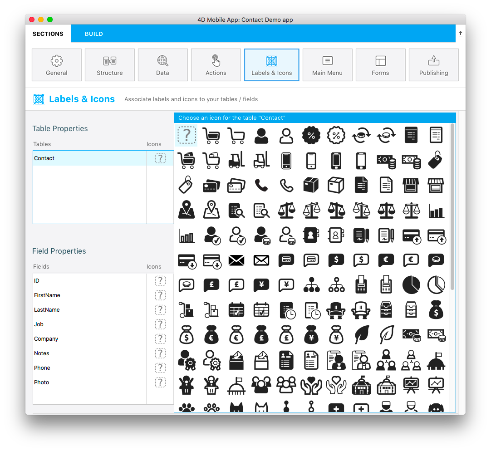

このページではモバイルアプリ内でのテーブル、フィールドおよびリレーションの表示プロパティを定義することができます。


初期状態ではデフォルトのプロパティが設定されています。 プロパティを変更するためには、変更する要素を選択し、適切なカラム内に新しい値を入力してください。

テーブル、フィールド、リレーションに対して同じプロパティを設定することができます。 また、それに加えて、フィールド/リレーションに対してフォーマットを定義することもできます。

これらの要素は生成されたアプリ内のテンプレートによって、詳細フォームおよびリストフォーム内で表示されます。


## アイコン

テンプレートにアイコンが必要になった時にモバイルアプリでフィールド/要素に対して適用されるアイコンを設定します。

:::info

リレーションフィールドに対しては、アイコンは**リレーション** ボタンの左に表示され、このボタンを押すとリレートされたテーブルを開くことができます。

:::

4Dモバイルエディターでは、あらゆる用途に応えるため、大量のアイコンのライブラリーを提供しています。 このライブラリーには、ビジネス、金融、教育、健康、産業、不動産、サービスなどの用途のアイコンが用意されています。 アイコンを選択するためには、**icon** ボタンをクリックし、表示されたリストからアイコンを選んでください:



:::info

統一性を持たせるため、フィールドに対して少なくとも1つのアイコンが定義されている場合、空のフィールドに対して**デフォルトアイコン** が生成されます。

:::

アプリケーション内でアイコンを表示したくない場合には、アイコンエリアを空にしたままにして下さい。


### Adding custom icons

You can add your own icons to the library, so that you can select them in your project. You can use any icon format (SVG or PNG is recommended to preserve transparency) and size. It's highly recommended having colored versions of your custom icons to better visualize them in the project editor.

For example, here are a set of custom icons that you can use:

<div className="center-button">
<a
  className="button button--primary"
  href="https://github.com/4d-go-mobile/tutorial-CustomIcons/releases/latest/download/tutorial-CustomIcons.zip">
  Download custom icons
</a>
</div>

To include custom icons in your project:

1. Create an `icons` folder at the following location:

```
<my4DProjetFolder>/Resources/Mobile/medias
```

:::note

You may have to create the `medias` folder.

:::

2. Drag and drop your customized icons in the `icons` folder.


Your icons can now be selected for your project, they are listed after the standard icons.


## Short and long labels

You can define custom labels for published tables, fields, and relations. These labels will be automatically used according to the available space in the template to optimize space and avoid overcrowding the tab bar.

:::info

For relation fields, labels will be displayed in the **Relation** button that allows to open a related table.

:::

- Short labels should have 10 characters or less
- Long labels can have up to 25 characters
- You can use characters that are not allowed in structure names, such as "/","@", the space character, etc.

By default, the mobile editor uses the table and field names as defined in the structure as labels in the app, and the same string is used for short and long labels.


## Formats

This property allows you to format the data to display in the app. When you click on a field row, a format menu is displayed.


Available built-in formats depend on the field type:

| Field type         | Formats                                                                                                                |
| ------------------ | ---------------------------------------------------------------------------------------------------------------------- |
| **テキスト**           | テキスト                                                                                                                   |
| **日付**             | Date, Short date, Long date, Full date                                                                                 |
| **時間**             | Time, Short time, Duration, Integer number                                                                             |
| **Image**          | Image                                                                                                                  |
| **ブール**            | "No" or "Yes", "False" or "True"                                                                                       |
| **Integer number** | Integer number, Decimal number, Real number, Percentage, Ordinal number, Currency $, Currency €, Currency ¥, Spell Out |


### Adding custom formats

The mobile editor allows you to add customized formats (called "formatters") in your projects. For example, you can define custom formats for emails, invoice numbers, etc.

To add custom formats to your mobile project, you can:

- Download and install customized formats from the [**go-mobile formatters github repository**](https://4d-go-mobile.github.io/gallery//#/type/formatter).

- Create your own formats.

:::tip tutorial

Visit [**this tutorial**](../tutorials/data-formatter/create-data-formatter) to know how to define a custom format

:::

To install a custom formatter, you just need to drop the formatter folder into the `/Resources/Mobile/formatters` of the 4D project folder. Once installed, a custom format can be selected from the Formats menu, just like a built-in formats.


## Title

This property is only available for Relation fields. The defined title will be displayed on top of the destination view when using a relation.

Use a pair of `%` characters to include the value of the related field in the title. For example, if you want that the title of the `Employee.employer` related field displays the name of the related `employee` field, you can write:

```
%Name%'s employer
```

:::tip tutorial

A [**tutorial**](../tutorials/relations/one-to-many-title-definition) is available to guide you through the Title definition process.

:::
