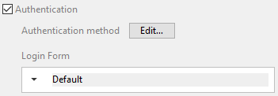

このページでは、アプリの公開設定および特殊なモバイル機能にアクセスできます:


## プロダクションURL

本番環境においてモバイルアプリが接続し、データの読み書きをおこなう Webサーバーの URL です。 任意の有効なアドレスが入力できます。例:

```
https://my.wesbsite.com
http://my.website.com:9200
www.website.com/mobile
```

開発フェーズではこのエリアを空にし、[データソース](data.md) を **カレントデータファイル** に設定することができます。

:::tip

ユーザーは、モバイルデバイスから [サーバーの URL を変更する](#リモートURLを変更する) ことが可能です。

:::


## Webサーバー設定

**編集...** ボタンをクリックすると 4Dストラクチャー設定の **Web** ページが開きます。 このページでは、モバイルアプリに埋め込む以下の設定を定義します:

- **HTTPを有効化** オプションおよび **HTTPポート**
- **HTTPSを有効化** オプションおよび **HTTPSポート**

:::note

HTTP と HTTPS の両方が有効化されていた場合、HTTP が使用されます。

:::

HTTPSポートを有効化するには、有効な [TLS 証明書](https://developer.4d.com/docs/ja/Admin/tls/) をインストールする必要があります。 4D でテスト用証明書を作成することもできます。

これらの設定は、[プロダクションURL](#プロダクションURL) が定義されている場合にのみ使用されます。 それ以外の場合には、ローカルIDアドレスが使用されます。

:::note

シミュレーターは必ずローカルに動作します (127.0.0.1 または localhost)。

:::

## デバイスでの見た目

### 設定画面

設定画面はタブバーから利用可能です。 また、アプリ内にテーブルが 5つ以上ある場合には、"..." からアクセスできます。

設定画面では、次のことができます:

* リモートURL とその状態を確認する
* ログアウトする (認証ユーザーとしてログインしていた場合)


### リモートURLを変更する

リモートURL は iPhone の設定から簡単に更新できます:

* iPhone の設定を開きます
* リモートURL を更新したいアプリを選択します
* "サーバーアドレスをリセット" オプションをタッチします


* その後、アプリを再起動してサーバーアドレスをリセットします
* 最後に新しいリモートURL 定義します


## Authentication

モバイルアプリは、ユーザー認証を要求できます。

- 認証が有効化されていない場合、モバイルユーザーはゲストモードでアプリを使用します。
- Once authentication is enabled, mobile users are asked to **login** before connecting to the application.

:::info

いずれの場合も、モバイルユーザーがサーバーに接続すると、[ユーザーセッション](session-management.md) が作成されます。

:::

### Authentication option

To enable authentication, check the **Authentication** option:



When this option is selected, a Login form will be displayed to the user at startup. A Default login form is automatically selected in the Login Form menu (see below).


### Authentication メソッド


The **Create...**/**Edit...** button opens the [`On Mobile App Authentication`](../4d/on-mobile-app-authentication.md) database method in the 4D method editor. A default template code is provided, allowing all users to log as guests:

```4d
#DECLARE($request : Object)->$response : Object

/*
        $request = モバイルアプリから提供される情報
        $response = モバイルアプリに返される情報
*/

$response:=New object

// ユーザーのメールをチェックします
If ($request.email=Null)
    // メールなしの場合はゲストモードで接続を許可します
    $response.success:=True
Else 
    // 認証モードでは、メールやデバイスに応じて接続を許可/拒否します
    $response.success:=True
End if 

// モバイルアプリに表示する任意のメッセージ
If ($response.success)
    $response.statusText:="認証に成功しました"
Else 
    $response.statusText:="このアプリを使用する権限がありません"
End if 

```

This method handles all incoming requests from the mobile apps and accepts or denies the connection. See the [On Mobile App Authentication](../4d/on-mobile-app-authentication) database method page for a full description of the method.

モバイルユーザーを認証する最も一般的な方法は、メール認証を使用することです。 For a detailed example of email-based double authentication, please refer to [this tutorial](../tutorials/login-forms/email.md).

### Login Form

The Login Form menu proposes all login forms available in the project, so that you can select the form to use.  **Default** is a basic login form provided by the mobile editor. Its uses the user email as identifier.

You can also create or download [custom login forms](../tutorials/login-forms/custom-login-form). Once installed, custom login forms are listed in the Login Form pop up. You can either create or download custom login forms. Custom login forms can be downloaded from the [**Login form Github gallery**](https://4d-go-mobile.github.io/gallery//#/type/form-login).

A custom login form is associated to a `manifest.json` file and (optionally) Swift or Kotlin source code. The custom login form files must be stored into a subfolder at the following location:

```
myProject/Resources/Mobile/Form/Login/
```

The `manifest.json` file contains the following attributes:

| プロパティ                       | タイプ                 | 詳細                                               |
| --------------------------- | ------------------- | ------------------------------------------------ |
| "**name**"                  | テキスト                | login form name                                  |
| "**type**"                  | テキスト                | set to "login"                                   |
| Optional "**capabilities**" | object              | to add information or options according to needs |
| "**target**"                | text または collection | platform(s) supported by your login form         |


## Push notifications

This feature is documented in the [Push notifications](../special-features/push-notification.md) section.


## ディープリンク

This feature is documented in the [Deep linking](../special-features/deep-linking) section. 


