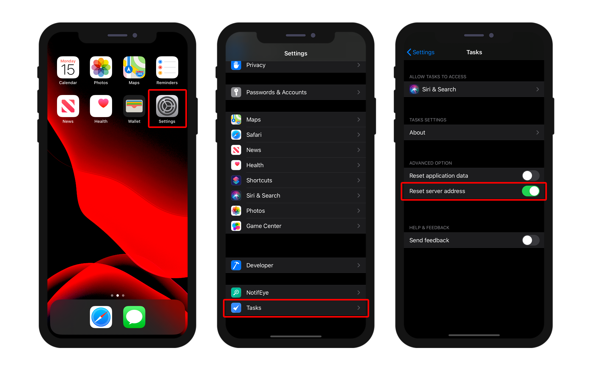

このページでは、アプリの公開設定および特殊なモバイル機能にアクセスすることができます:


## プロダクションURL

製品コンテキストにおいて、モバイルアプリがデータの読み書きを行うWebサーバーのURLです。 有効な任意のアドレスを入力することができます。例:

```
https://my.wesbsite.com
http://my.website.com:9200
www.website.com/mobile
```

開発フェーズにおいては、ここのエリアを空のままにし、[データソース](data.md) を**カレントデータファイル** に設定する事ができます。

:::ヒント

ユーザーはモバイルデバイスから[サーバーURL を変更する](#modify-remote-url) 事が可能です。

:::


## Webサーバー設定

**編集...** ボタンをクリックすると4D データベース設定の**Web** ページが開きます。 このページを使用して、モバイルアプリに埋め込む以下の設定を定義することができます:

- **HTTPを有効化** オプションおよび**HTTP ポート**
- **HTTPSを有効化** オプションおよび**HTTP ポート**

:::note

HTTP とHTTPS の両方が有効化されていた場合、HTTP が使用されます。

:::

Activating the HTTPS port requires that you installed a valid [TLS certificate](https://developer.4d.com/docs/en/Admin/tls.html). You can create test certificates with 4D.

These settings are taken into account only if the [production URL](#production-url) is defined. Otherwise, the local IP address is used.

:::note

The Simulator always works locally (127.0.0.1 or localhost).

:::

## How it looks on a device

### Settings screen

A Settings screen is available from the tab bar. You can also find it from the More tab if necessary (*i.e.*, your app has more than four tables).

The Settings screen allows you to:

* Consult your remote URL and its current state
* Log out (if connected as an Authorized User)


### Modify remote url

You can easily update your remote url from iPhone Settings :

* Open your iPhone Settings
* Select the app you want the remote url to be updated
* Switch on the "Reset server address" option



* Then restart your app to reset the server address
* And finally define the new remote url


## Features

This area allows you to select and configure several mobile app's special features. These features are documented in dedicated sections:

- [Authentication](../special-features/authentication.md)
- [Push notifications](../special-features/push-notification.md)
- [Deep linking](../special-features/deep-linking)


