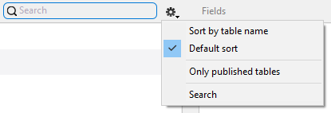
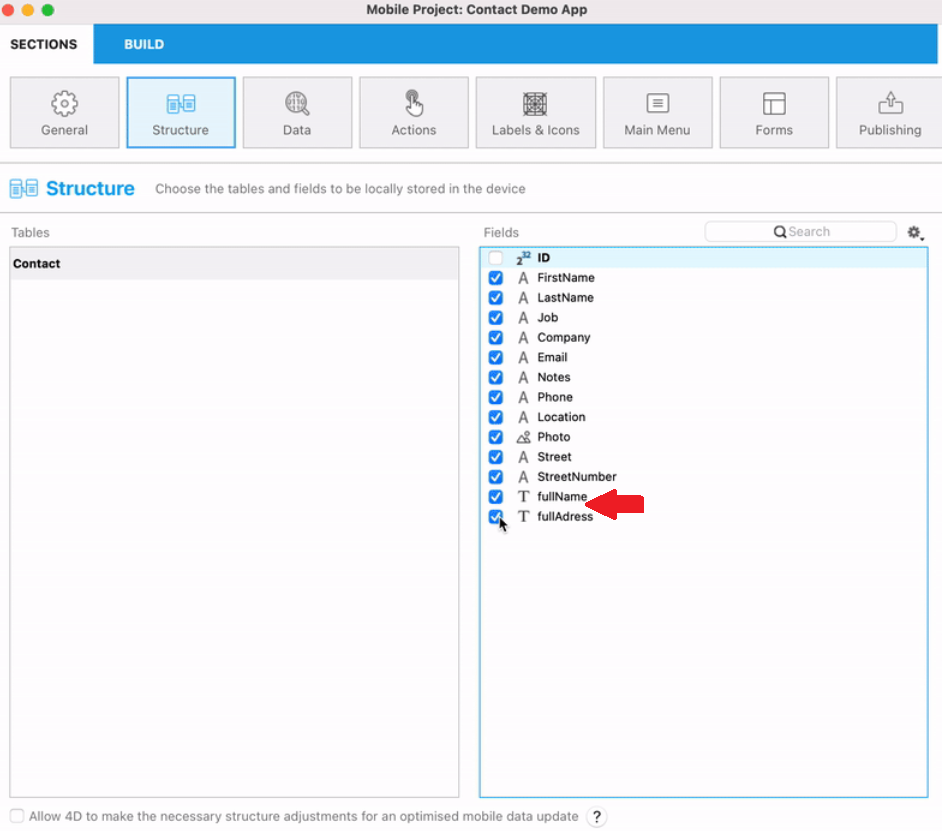
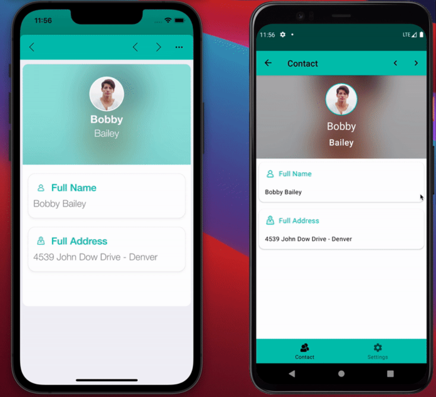
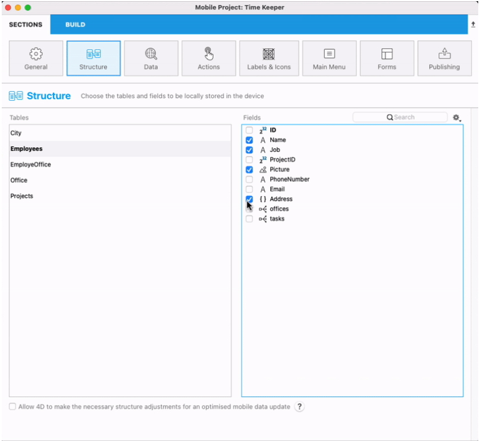

4Dデータベース内で RESTリソースとして公開されているすべてのテーブルとフィールドがこのページに表示されます。これには (N対1 および 1対N リレーションに基づいた) リレーション属性も含まれます。 実際の表示は、[ORDA のデータストア](https://developer.4d.com/docs/ja/ORDA/overview.html) にとても近いものが表示されます。


このページでは、公開するテーブルおよびフィールドを選択することにより、モバイルデバイス用に複製するストラクチャーのサブセットを定義することができます。

- 公開テーブルはアプリのタブとして自動的に追加されます。
- 公開されたスカラーフィールドは[リストフォームおよび詳細フォーム](https://developer.4d.com/go-mobile/docs/project-definition/forms/) を定義する際に利用できます。
- 公開されたリレーションフィールド (N対1 および 1対N リレーション) も、[リストフォームおよび詳細フォーム](https://developer.4d.com/go-mobile/docs/project-definition/forms/) を定義する際に利用でき、リレーションボタンといった追加のナビゲーション機能もついてきます。


:::note

以下のテーブルとフィールドはこのページには表示されません:

- [ORDA ルール](https://developer.4d.com/docs/ja/ORDA/dsmapping.html#%E3%82%B9%E3%83%88%E3%83%A9%E3%82%AF%E3%83%81%E3%83%A3%E3%83%BC%E3%83%9E%E3%83%83%E3%83%94%E3%83%B3%E3%82%B0) に則っていないテーブルやフィールド。
- "`__`" (ダブルアンダースコア) で始まる名前を持つテーブルやフィールド。

:::

:::note

時間によって値が変化していく計算属性(同じデータクラスの他の属性にのみ依存している計算属性) のみがモバイルアプリ側で更新されます。

:::

## 公開するテーブルとフィールドを選択する

テーブルに属するフィールドが 1つ以上公開されると、そのテーブルも公開されます。 公開されたテーブルは **太字** で表示されます。

公開するフィールドを選択するには、テーブル名をクリックし、右のリストでフィールドをクリックします。 または:

- **スペースバー** を押すと、フィールドを選択/選択解除できます。
- **Ctrl+クリック** でフィールドを全選択できます。
- フィールドリストの **公開** および **全て公開** ローカルメニューを使用できます。


### リストのフィルタリング

リストにフォーカスがある場合、検索エリアとローカルメニューを使用して、内容を絞り込むことができます。



- **検索** エリア: テーブル名またはフィールド名を検索する文字列を入力します。
- **テーブル名でソート**/**フィールド名でソート**: 名前順でリストをソートします。 デフォルトでは、リストは作成日順にソートされています。
- **公開テーブルのみ**/**公開フィールドのみ**: 選択されている (公開された) テーブルまたはフィールドのみを表示します。


## サポートされるフィールド型

モバイルエディターは、モバイルアプリに使用できるフィールドの一覧を、その種類に応じて自動的に表示します:


- 全ての[スカラー型の4D フィールド](https://developer.4d.com/docs/ja/Concepts/data-types.html) がサポートされます(ただし [BLOB](https://developer.4d.com/docs/en/Concepts/blob.html) 型を除く)
- [オブジェクトフィールド](https://doc4d.github.io/go-mobile/docs/next/project-definition/structure/#object-attributes)
- [計算属性](#computed-attributes)
- **スカラー値** を返す [エイリアス属性](#エイリアス属性) (*イタリック* で表示されます)。
- リレーション属性 (N対1 および 1対N) はサポートされており、フィールドと同様に選択することができます。 リレーション属性は専用のアイコンを持ちます:
    - Ｎ対１リレーションアイコン:  
    - １対Ｎリレーションアイコン: 

:::info

リレーション属性の名前は 4Dストラクチャーエディターにおけるリレーション名に基づいています。[ORDA ストラクチャーマッピング](http://developer.4d.com/docs/ja/ORDA/dsmapping.html#%E3%82%B9%E3%83%88%E3%83%A9%E3%82%AF%E3%83%81%E3%83%A3%E3%83%BC%E3%83%9E%E3%83%83%E3%83%94%E3%83%B3%E3%82%B0) のページを参照ください。

:::


## リレーションの使用

### 1対Nリレーション

**1対Nリレーション** をプロジェクトに含めると、アプリの新しいページにリレートフィールドのリストを表示できます。

そのためには:

* ターゲットテーブル (N側のテーブル) のフィールドを 1つ以上公開します
* ソーステーブル (1側のテーブル) のリレーション属性を公開します


公開されたリレートフィールドは、他のフィールドと同様に使用できます。 つまり、次のことが可能です:

* [ラベル＆アイコン](labels-and-icons.md) ページにおいてリレーションプロパティを定義できます。
* [フォーム](forms.md) ページで、詳細フォームに 1対Nリレーションをドロップし、詳細フォームとリレートテーブル間にリンクを作成できます。 すると、リレートビューに直接行くためのリレーションボタンが、詳細フォームに自動的に作成されます。

:::tip Tutorial

モバイルプロジェクトに 1対Nリレーションを統合する詳細な例については、[**1対Nリレーションのチュートリアル**](../tutorials/relations/one-to-many-relations) を参照ください。

:::


### N対1リレーション

**N対1リレーション** は、アプリ作成プロセスにおいて他のフィールドと同様に使用することができます。 フィールドリストで N対1リレーションを選択すると、アプリで公開するフィールドをリレートテーブルから選択できます:


リレーション名をクリックし、フィールドを選択するだけです:


デフォルトで、リレートテーブルのすべての利用可能フィールドが公開されます。

:::tip Tutorial

モバイルプロジェクトに N対1リレーションを統合する詳細な例については、[**N対1リレーションのチュートリアル**](../tutorials/relations/many-to-one-relations) を参照ください。

:::


### N対Nリレーション

ストラクチャーページを使用して、親の N対1リレーションを介して、子の N対1リレーションおよび 1対Nリレーションを公開することができます。 つまり、アプリ内で N対Nリレーションを表示したり、リストフォームから別のリストフォームに直接移動したりすることができます。


:::tip Tutorial

モバイルプロジェクトに N対Nリレーションを統合する詳細な例については、[**リレーション操作**](../tutorials/relations/relation-interactions) を参照ください。

:::

## 計算属性

Android でも iOS でも、プロジェクトエディターから設定をすれば、生成されたアプリ内で [**計算属性**](http://developer.4d.com/docs/ja/ORDA/ordaClasses.html#%E8%A8%88%E7%AE%97%E5%B1%9E%E6%80%A7-1) を表示できます。 計算属性とは、複数のフィールドを一つに複合した結果です。 この計算属性は、モバイルアプリ作成時に他のフィールドと同様に使用できます。つまり、ストラクチャーセクションで確認し、公開できるということです。

たとえば、住所における通りの番号と通りの名称、あるいは氏名における名字と名前のように 2つに分かれた属性を使う代わりに、これらを 1つの属性に纏めて "fullAddress" や "fullName" などと名づけることができます。

やり方は、とても簡単です。

### 4D側の準備

[*Class extends*](https://developer.4d.com/docs/ja/Concepts/classes.html#class-extends-classname) および [exposed Function](https://developer.4d.com/docs/ja/ORDA/ordaClasses.html#%E5%85%AC%E9%96%8Bvs%E9%9D%9E%E5%85%AC%E9%96%8B%E9%96%A2%E6%95%B0) のシンタックスを使って、使用する属性と取得する計算属性を以下のようにコード内で指定します:

```4d 
Class extends Entity

exposed Function get fullName->$fullName : Text
    $fullName:=This.FirstName+" "+This.LastName

exposed Function set fullName($fullName : Text)
$splitName:=Split string($fullName; "/")
If ($splitName.length=2)
    This.FirstName:=$splitName[0]
    This.LastName:=$splitName[1]
Else 
    // ERROR    
End if

exposed Function get fullAddress->$fullAddress : Text
    $fullAddress:=This.StreetNumber+" "+This.Street+" - "+This.Location

exposed Function set fullAddress($fullAddress : Text)
$splitAddress:=Split string($fullAddress; "/")
If ($splitAddress.length=3)
    This.StreetNumber:=$splitAddress[0]
    This.Street:=$splitAddress[1]
    This.Location:=$splitAddress[2]
Else 
    // ERROR    
End if
```

### プロジェクトエディター側の設定

4D側でコードが書かれると、プロジェクトエディターでは計算属性が利用可能になり、他のフィールドと同様に公開して使用できるようになります:


**ストラクチャー** セクションにおいて:

`exposed` の付いた計算属性は、データクラスの属性リストに表示されます。



**ラベル & アイコン** セクションにおいて (アイコン / 短いラベル / 長いラベル / フォーマット):


**フォーム** セクションにおいて:

データモデルの計算属性は、通常のフィールドと同様に、フォームセクション (リストフォームと詳細フォーム) のフィールドリストで利用可能です。 これらはデータストアのストレージ属性と同じように動作します。


**データ** セクションでは、フィルタークエリボックスの "フィールド" ボタンにリンクされているリストに計算属性が表示されます。

:::note 4D for iOS

- 計算属性は、ソートアクションで使用することができます。
- セッターのない計算属性 (読み取り専用) は、追加または編集アクションで使用できません。
- プリセットの追加または編集アクションが作成された場合 (セッターが利用可能で、4D がそれを許可している場合)、フィールドにリンクされている計算属性のパラメーターは利用可能です。

:::note 4D for iOS

### モバイルアプリ側

生成されたモバイルアプリケーション (iOS または Android) では、単一属性と計算属性の両方が表示されます。




## エイリアス属性

Android でも iOS でも、**スカラー** な [**エイリアス属性**](http://developer.4d.com/docs/ja/ORDA/ordaClasses.html#%E3%82%A8%E3%82%A4%E3%83%AA%E3%82%A2%E3%82%B9%E5%B1%9E%E6%80%A7-1) をモバイルアプリで使用することができます。 エイリアス属性は、*ターゲット* 属性と呼ばれる、データモデルの別の属性を元に定義されます。 ターゲット属性には、リレートデータクラス (リレートレベルは無制限) または同じデータクラスのものを使用できます。 エイリアス属性はデータではなく、ターゲット属性へのパスを格納します。

エディターで利用するには、エイリアス属性は **公開** されている必要があります。 これらは *イタリック* で表示されます。

モバイルプロジェクトでは、 **スカラー** のエイリアス属性のみがサポートされています。つまり、ターゲット属性へのパスの最終要素の [kind](https://developer.4d.com/docs/en/API/DataClassAttributeClass.html#kind) は "storage" である必要があります。 それ以外には対応していません。


スカラーのエイリアス属性は:

- ストラクチャーエディターの標準フィールドのように [選択および公開](#公開するテーブルとフィールドを選択する) できます。
- [データをフィルター](../project-definition/data#フィルタークエリ) するのに使用できます。
- プリセットの **追加** および **編集** アクションの [引数](../project-definition/actions#アクションに引数を追加) としてフィールドにリンクできます。
- [ラベル & アイコンセクション](../project-definition/labels-and-icons) にて、他のフィールドと同様に使用できます。
- [フォーム](../project-definition/forms) にドロップして表示できます

:::caution

スカラーのエイリアス属性は、[ソートアクションの引数](../project-definition/actions#ソートアクション) として **使用できません**。

:::


## オブジェクト属性

**ストラクチャー** セクションでは、全ての[型](https://developer.4d.com/go-mobile/docs/project-definition/structure/#supported-field-types) の属性(テキスト、日付、時間、整数)をモバイルプロジェクト内で選択、使用、表示することができます。これには**[オブジェクト属性](https://developer.4d.com/docs/ja/Concepts/object.html)** (JSON フォーマット) も含まれます。 フィールドリストの中では、オブジェクト属性は**{}** アイコンで表示されます。



オブジェクト属性は、プロジェクトエディターの他のセクション(データ、ラベル& アイコン、フォーム、など。ただしアクションセクションは除く) での他のフィールドと同様に使用することができます。

**ラベル&アイコン** セクションでは、オブジェクト属性を表示するのに2つのフォーマットが利用できます:

- **人間が読める形式** (YAML): デフォルトのフォーマットで、モバイルアプリ内では人間が読める形式(Human readable) の構造化されたデータとして表示されます。
- **JSON 整形フォーマット**: モバイルアプリではインデント付けされたJSON 形式として表示するフォーマットです。


生成されたアプリ内での表示結果は以下のようになります:


### フィルタークエリ

オブジェクト属性の[フィルタークエリ](https://developer.4d.com/go-mobile/docs/project-definition/data#filter-queries) を使用することで、フィルターされたデータを返して表示させることができます。 これをするためには、**[データ](https://developer.4d.com/go-mobile/docs/project-definition/data)** セクションのフィルタークエリに属性とプロパティを挿入します。

例えば、顧客用のテーブル内に、以下のようなキー/値の複数のオブジェクトを格納したオブジェクト型属性のアドレスを考えます:


```4d
{
    $Obj:=New object
    $Obj.name:="4D SAS"
    $Obj.address1:="66 rue de Sartrouville"
    $Obj.address2:="Parc les Erables, bâtiment 4"
    $Obj.zipCode:="78230"
    $Obj.city:="Le Pecq"
    $Obj.country:="France"
    $Obj.phoneNumber:={
        "OfficePhone":"+33 1 30 53 92 00"
        "HomePhone":"+33 1 30 53 92 00"
    }
    $Obj.email:=[
        "john@test.com"
        "john@4d.com"
    ]
    $Obj.website:="fr.4d.com"
}
```


#### シンプルなオブジェクト値でフィルターする

オブジェクトを使用して、例えば「フランスにいるクライアントのみを表示」のように表示されるデータをフィルターしたい場合、国名でクエリをフィルターし、`France` の値を持つレコードだけを取得するようにする必要があります。 そのためには、フィルタークエリフィールドに以下のシンタックスを挿入します:

```4d

Address.country = "France"

```
#### コレクションの値でフィルターする

コレクションの要素、例えばクライアントのコレクションに格納された特定のEメールなどを使用してフィルターされたデータのみを表示したい場合、Eメールでクエリをフィルターし、`john@4d.com` の値をコレクション内に持つレコードだけを取得するようにする必要があります。 そのためには、フィルタークエリフィールドに以下のシンタックスを挿入します:

```4d

Address.email[] = "john@4d.com"

```


## インクリメンタルリロード (増分更新)

### ストラクチャー編集を許可する

最高のユーザーエクスペリエンスのため、4D for iOS と 4D for Androidは、データの増分更新用の自動機能を実装しています。 つまり、新規・変更・削除されたデータベースのデータのみがアプリにて更新されます。 この最適化は、読み込み時間を大幅に短縮します。

この最適化を可能にするため、4D for iOS と 4D for Android は以下の構造的な要素を必要とします:

* 削除されたレコードを保存するための `__DeletedRecords` テーブル
* モバイルアプリケーションの各公開テーブルの変更スタンプを保存する `__GlobalStamp` フィールド

これらの必要な要素の追加は、4Dモバイルエディターに任せることができます。これには、**4Dが最適化されたモバイルデータ更新のために必要なストラクチャー編集を行うことを許可する** オプションを選択します。

:::note

これらの最適化は、ローカルおよびサーバーデータベースの両方で必要です。

:::

### 下にプルすることで更新する

モバイルアプリ側では、アプリを起動する度、またアプリが前面に来る度にデータが更新され、常に最新のデータを取得することができます。

通常の使用では、任意のリストフォームを下にスワイプするだけでデータを更新できます。

iPhoneの設定から、アプリのデータをリセットし、アプリに関する情報を探すことができます。

:::note

データベース側で重要なメンテナンス作業 (レコードヘッダーによる修復 / 復元 / 圧縮) をおこなった場合には、モバイルアプリ側でフルリロードが必要です。 この場合は、モバイルアプリの利用者に管理者が通知するものとします。

::: 


