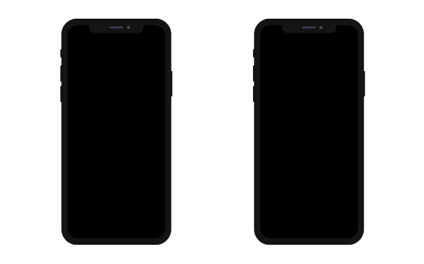

**ディープリンク** 機能を使って、現在閲覧しているコンテンツを同僚と共有することができます。 ディープリンクの例をアニメーションで表しました:



モバイルアプリでディープリンクを実装するには 2つの手法があります: **URLスキーム** と **ユニバーサルリンク**。 ディープリンクの方法として URLスキームがよく知られていますが、ユニバーサルリンクは、Webページとアプリを同じリンクで簡単につなげるための Apple が導入した新しい方法です。


## ディープリンク手法の比較

プロジェクトエディターで利用可能な 2つのディープリンク手法を比較してみましょう:

### URLスキーム

| 長所          | 短所                     |
| ----------- | ---------------------- |
| 実装が簡単       | 許可が常に必要                |
| 追加のバックエンド不要 | アプリがインストールされていないと動作しない |

### ユニバーサルリンク

| 長所                            | 短所               |
| ----------------------------- | ---------------- |
| 許可を必要としない                     | SSL の静的バックエンドが必要 |
| ブラウザーを開かない                    | 実装が複雑            |
| アプリがインストールされていない場合のフォールバックURL |                  |

## カスタムの URLスキーム

最も単純なレベルでは、URLスキームは、ユーザーがアプリを他のアプリから開くことを可能にします。 しかし、URLスキームの真の威力は、アプリを開いたときに特定のアクションを実行できることにあります。


### プロジェクトエディターとカスタムURLスキーム

モバイルアプリに URLスキームを組み込むのはとても簡単です。 例を見てみましょう:

1. [**アクション** ページ](../project-definition/actions.md) で **共有** プリセットアクションを選択し、スコープを選択します:
    *   カレントエンティティ: 詳細フォームのコンテンツを共有します
    *   テーブル: リストフォームを共有します
2. プロジェクトエディターの **公開** セクションにある **ディープリンク** 機能にチェックを入れます。
3. URLスキームの情報には、[**一般** ページ](../project-definition/general.md) で事前に定義したアプリ名が自動入力されます。 ただし、これを編集することもできます:


4. **On Mobile App Action** データベースメソッドに、たとえば次のように書きます:

```4d

// On Mobile App Action データベースメソッド

var $1 : Object  // モバイルアプリより提供される情報
var $0 : Object  // モバイルアプリに返される情報

var $action : Object
$action:=MobileAppServer.Action.new($1)

Case of 

    : ($1.action="shareContact")

        $0:=$action.shareContext()

    Else 

        $0:=New object("success"; False;"statusText"; "不明なアクションがサーバーに送信されました")

End case 

```

5. アプリをビルドします。


### モバイルアプリで URLスキームを使用する

1. **...** ボタンをクリックすると、現在利用可能なアクションがすべて表示されます。
2. プロジェクトエディターで定義した **共有** アクションを選択します。
3. 新しいビューが表示され、コンテンツの共有を開始することができます。
4. 共有方法を選択します。
5. リンクを送信します。

## ユニバーサルリンク

ユニバーサルリンクには、カスタムURLスキームでは提供できない重要な利点がいくつかあります。 具体的には:

* **ユニーク**: カスタムURLスキームとは異なり、ユニバーサルリンクは自身の Webサイトへの標準的な HTTP または HTTPSリンクを使用するため、他のアプリと競合することはありません。

* **セキュア**: ユーザーがアプリをインストールする際、iOS または Android は、そのアプリが URL を開くことを Webサイトが許可しているかどうかを確認します。 この権限を付与するファイルを作成し、Webサーバーにアップロードできるのはあなただけです。つまり、Webサイトとアプリの関連付けはセキュアです。

* **フレキシブル**: アプリがインストールされていない状態でも、ユニバーサルリンクは機能します。 この場合、Webサイトへのリンクをタップすると、そのコンテンツがブラウザーで開かれます。

* **シンプル**: 同一の URL が、Webサイトとアプリの両方で動作します。

* **プライベート**: 他のアプリはあなたのアプリと通信するにあたって、あなたのアプリがインストールされているかどうかを知る必要はありません。

### プロジェクトエディターとユニバーサルリンク

アプリでユニバーサルリンクを使うには、URLスキームとよく似た手順でおこないます:

1. [**アクション** ページ](../project-definition/actions.md) で **共有** プリセットアクションを選択し、スコープを選択します:
    *   カレントエンティティ: 詳細フォームのコンテンツを共有します
    *   テーブル: リストフォームを共有します
2. プロジェクトエディターの **公開** セクションにある **ディープリンク** 機能にチェックを入れます。
3. **ユニバーサルリンク** の欄に Webサイトの URL を入力します。
4. **On Mobile App Action** データベースメソッドに、たとえば次のように書きます:

```4d

// On Mobile App Action データベースメソッド

var $1 : Object  // モバイルアプリより提供される情報
var $0 : Object  // モバイルアプリに返される情報

var $action : Object
$action:=MobileAppServer.Action.new($1)

Case of 

    : ($1.action="shareContact")

        $0:=$action.shareContext()

    Else 

        $0:=New object("success"; False;"statusText"; "不明なアクションがサーバーに送信されました")

End case 

```

5. アプリをビルドします。
6. **On Web Connection** データベースメソッドからユニバーサルリンクをトリガーします。例:

```4d
// On Web Connection データベースメソッド

var $1; $2; $3; $4; $5; $6 : Text
var $handler : Object

$handler:=MobileAppServer.WebHandler.new()
Case of
    : ($handler.handle($1; $2; $3; $4; $5; $6))
        // デフォルトのモバイルコード
    Else
        // Web コード
End case

```

:::note

ユニバーサルリンクを作成するには、標準的なポート (80 または 443) を使用している必要があります。

:::

## ディープリンクとプッシュ通知

ディープリンクの素晴らしい点は、[プッシュ通知](push-notification.md) と互換性があることです。 つまり、ユーザーに通知でディープリンクを送り、適切なページに直接誘導することができます。

このように、この機能によって可能性は大きく広がります。 特に、ユーザーがコンテンツをより速く消費するようになった現在、ディープリンクはアプリに欠かせない機能となっています。 この機能により、ユーザーは直接目的へと移動することができます。 そのため、モバイルアプリでの利用を強く推奨します。

:::tip

プッシュ通知とディープリンクを組み合わせる方法については、[**4D Mobile App Server** コンポーネントのドキュメント](https://github.com/4d/4D-Mobile-App-Server/blob/main/Documentation/Classes/PushNotification.md) を参照ください。

:::


