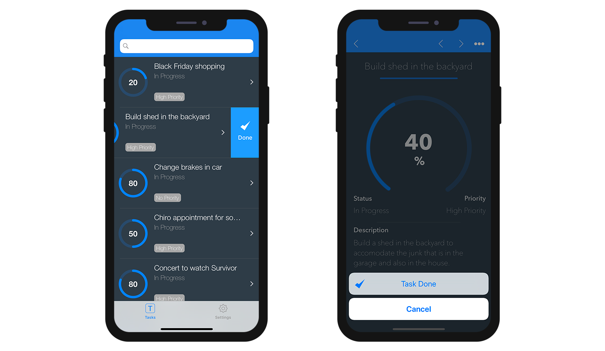
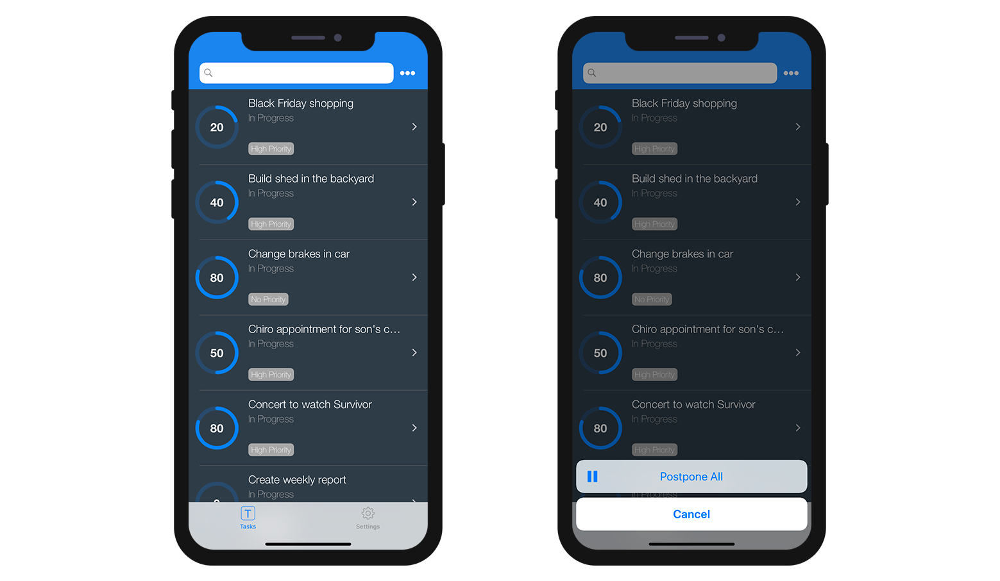

In this tutorial, we are going to work on a **Tasks iOS app** and see how to deal with actions in this app.

Basically what we want to do in a **Task app** is changing the **status** and the **percentage of completion** of a task individually.

More globally, we want to **change all tasks status** to postponed or in Progress for example.

Download the **Starter project** and go right to the **Actions section**.

<div className="center-button">
<a className="button button--primary"
href="https://github.com/4d-go-mobile/tutorial-Actions/archive/cf16581214a8a6e4e4067bcff43ac1265ec43ff7.zip">Download</a>
</div>

You can define actions for two levels:

* エンティティに対するアクション
* テーブルに対するアクション

まずはエンティティに対するアクションから始めましょう！


## エンティティに対するアクション

### ⒈ 「アクション」セクションで設定すること

In this Actions section, you will be able to define all your actions **names**, **icons**, **labels**, the **table** you want the action to be available in and the **scope** you want actions to be applied on.

The action section is quite empty when you open it for the first time, so click on the **Plus button** at the bottom left to add your first action!


Let's define first an action that will **change a task status** to "Complete" and put the **percentage of completion** to 100%.

下記のステップで実現することができます。

* Enter **taskDone** in **Names field**
* Select the **Done icon** from the icon library
* Enter **Done** in **Short Labels**
* Enter **Task Done** in **Long Labels**
* Select the **Tasks** table from **Tables** list
* Select **Current record** from **Scope** list


### ⒉ データベースメソッドの作成と編集

Now that your action is defined in the Project Editor, you have to create the **[On Mobile App Action](https://livedoc.4d.com/4D-Language-Reference-17-R5/Database-Methods/On-Mobile-App-Action-database-method.301-4286697.en.html)** database Method.

Do to so, click on **Create button** at the bottom right of the action table and enter the following code in the **On Mobile App Action** database method:

```4d
C_OBJECT($0)
C_OBJECT($1)

C_OBJECT($o;$context;$request;$result)

$request:=$1  // モバイルアプリから送られた情報

$context:=$request.context

Case of

    : ($request.action="taskDone")

        $o:=New object(\
        "dataClass";$context.dataClass;\
        "ID";$context.entity.primaryKey;\
        "CompletePercentage";100)

        $result:=modifyStatus ($o)

    Else

          // Unknown request
        $result:=New object("success";False)

End case

$0:=$result  // モバイルアプリに返される情報

```

### ⒊ "modifyStatus" メソッドの作成

Once your database method has been edited, you have to create a **modifyStatus** Method that will make the job :

```4d
C_OBJECT($0)
C_OBJECT($1)

C_OBJECT($dataClass;$entity;$in;$out;$status;$selection)

$in:=$1

$selection:=ds[$in.dataClass].query("ID = :1";String($in.ID))

If ($selection.length=1)

    $entity:=$selection[0]

    $entity.CompletePercentage:=$in.CompletePercentage

    $entity.Status:=3

    $status:=$entity.save()

    $out:=New object

    If ($status.success)

        $out.success:=True  // アクションの成功を通知
        $out.dataSynchro:=True  // セレクションの更新を要求

    Else

        $out:=$status  // モバイルアプリに返される情報

    End if

Else

    $out.success:=False  // アクションの失敗を通知

End if

$0:=$out

```

アプリをビルドして実行しましょう！ Your **Done action** is available when you swipe left a cell in Listform, as well as when you click on the **generic action button** in the navigation bar of the Detail form.



## テーブルに対するアクション

### ⒈ 「アクション」セクションで設定すること

Now, imagine that you are going on holidays and you want to **change all your tasks status** to "Postponed".

下記のステップで実現することができます。

* Enter **postponeAll** in **Names field**
* Select the **Postponed icon** from the icon library
* Enter **Postpone All** in **Short Labels**
* Enter **Postpone All** in **Long Labels**
* Select the **Tasks** table from **Tables** list
* Select **Table** from **Scope** list


### ⒉ データベースメソッドの編集

Click on the **Edit button** at the bottom right of the action table to complete the **On Mobile App Action** database method :

```4d
C_OBJECT($0)
C_OBJECT($1)

C_OBJECT($o;$context;$request;$result)

$request:=$1  // モバイルアプリから送られた情報

$context:=$request.context

Case of

    : ($request.action="taskDone")

        $o:=New object(\
        "dataClass";$context.dataClass;\
        "ID";$context.entity.primaryKey;\
        "CompletePercentage";100)

        $result:=modifyStatus ($o)

    : ($request.action="postponeAll")

        $o:=New object(\
        "dataClass";$context.dataClass;\
        "Status";4)

        $result:= postponeAll ($o)
    Else

          // Unknown request
        $result:=New object("success";False)

End case

$0:=$result  // モバイルアプリに返される情報

```


### ⒊ "postponeAll" メソッドの作成

As you create the **modifyStatus** Method, follow the same process and create a new **postponeAll** Method that will modify all record status:

```4d
C_OBJECT($0)
C_OBJECT($1)

C_OBJECT($entity;$in;$out)

$in:=$1

$out:=New object("success";False)

If ($in.dataClass#Null)

    For each ($entity;ds[$in.dataClass].all())

        $entity.Status:=$in.Status
        $entity.save()

    End for each

    $out.success:=True  // アクションの成功を通知
    $out.dataSynchro:=True  // セレクションの更新を要求

Else

    $out.errors:=New collection("No Selection")

End if

$0:=$out

```

アプリをビルドして実行しましょう！ You will find a new **generic button** in the navigation bar of your Lisform. Click on it to trigger the **Postpone All** action.



## これからどうする？

おつかれさまでした！ You've just added 2 actions to your iOS app. You are now able to add all actions you need to your Tasks app!


Download the completed project that includes various actions:

<div className="center-button">
<a className="button button--primary"
href="https://github.com/4d-go-mobile/tutorial-Actions/releases/latest/download/tutorial-Actions.zip">Download</a>
</div>
