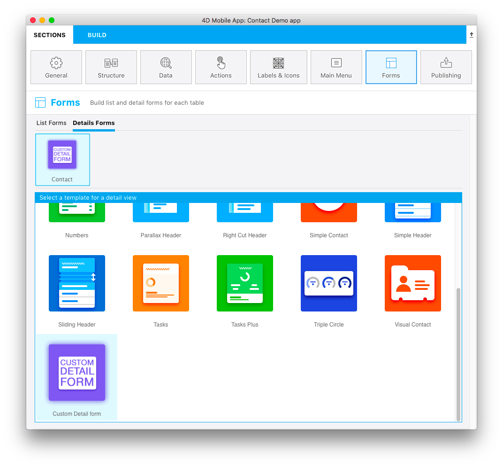

テンプレートのアイコンはカスタマイズすることができます。

It must be 160x160px and must be named **layoutIconx2.png**

カスタムテンプレートアイコンは下記の場面で使用されます。

* テーブル名の上部に表示される選択テンプレートのアイコン
* in the template selector window in the **Forms section**

If this icon is missing from your detail form template folder, the **template.svg file** will be displayed in the template selector window and a question mark icon will be displayed above each table that's missing an icon.

You can use any image software to create the detail form template icon.

