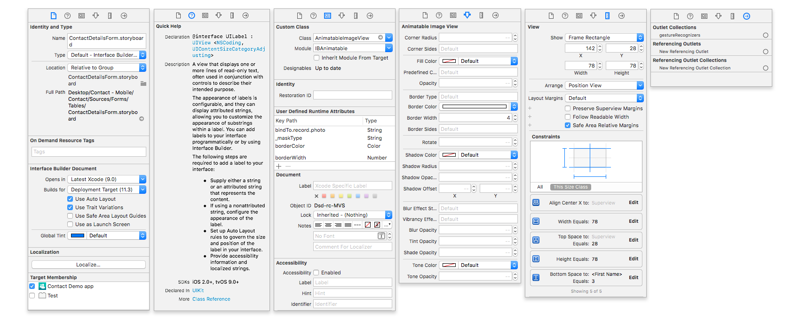
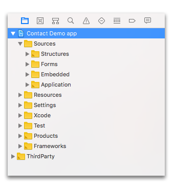

> **OBJECTIVES**
> 
> Ensure a basic understanding of working with Xcode.

Xcode displays various areas that we're going to review:

## ツールバー

* **Run** and **Stop** buttons are located on the left side of the toolbar. Pressing the **Run** button will build, run, and launch your application in the selected iOS Simulator.

* The dropdown menu next to the **Stop** button indicates which build target you want to run and which Simulator is being used.

* ツールバーの右側には，表示形式を切り替えるためのボタンがあります。

## エディターエリア

This is where the coding happens when a Swift file is selected. When a Storyboard file is selected, the view changes and the Interface Builder appears.

## インターフェースビルダー

This is a graphical interface which allows you to build a Storyboard or XIB file. All of your scenes are accessible on the left side.

## ユーティリティーエリア

The Utility area of Xcode has two panes: the Inspector pane and the Library pane.

### インスペクターペイン

Within the Properties section, there are six different Inspector Tabs, as shown in the following illustration:

From left-to-right, these tabs are:

* **File inspector**: For viewing and managing file metadata, such as a filename, type, and path.

* **Quick Help**: For viewing details about what has been selected in an editor.

* **Identity inspector**: For viewing object metadata such as an object’s class, runtime attributes, label.

* **Attributes inspector**: For configuring the attributes specific to the selected interface object. たとえば，テキストフィールドには，文字の整列・フォントカラー・ボーダータイプ・入力の可否といった属性があります。

* **Size inspector**: For specifying characteristics such as the size and position of an interface object.

* **Connections inspector**: View the outlets and actions for an interface object, make new connections, and delete existing connections.

### ライブラリペイン

Within the Properties section, there are four different Library Tabs, as shown in the following illustration:

From left-to-right, these tabs are:

* **File templates**: These templates are for the common types of files listed as choices in the New File menu.

* **Code snippets**: These are short pieces of source code for use in your application. 直接，ソースコードにドラッグ＆ドロップすることができます。

* **Objects**: This library contains the kinds of interface objects you’d use to make up your user interface. 直接，インターフェースビルダーに表示されているストーリーボードにドラッグ＆ドロップすることができます。

* **Media files**: This library contains all your graphics, icons, and sound files. 直接，インターフェースビルダーに表示されているストーリーボードにドラッグ＆ドロップすることができます。

## デバッグエリア

This area displays the output and the state of various variables when running your app.

## ナビゲーションエリア

Several tabs are included here, the most important of which are:

* **Navigation tab**: Lists and provides access to all files necessary for your application to work properly.

* **Search navigator tab**: Allows searching all files in the project.

* **Issue navigator tab**: Displays all errors in an iOS project.

    - 赤のメッセージは，無視できない問題であり，アプリをビルドするためには，解消する必要があることを示しています。
    - 黄のメッセージは，警告であり，不具合を引き起こす可能性があるものの，アプリのビルドを阻止するものではない問題を示しています。

You can click on errors and warnings to visualize them in the project.

Next, we're going to focus on the files included in your 4D for iOS app from the Project navigation tab.
