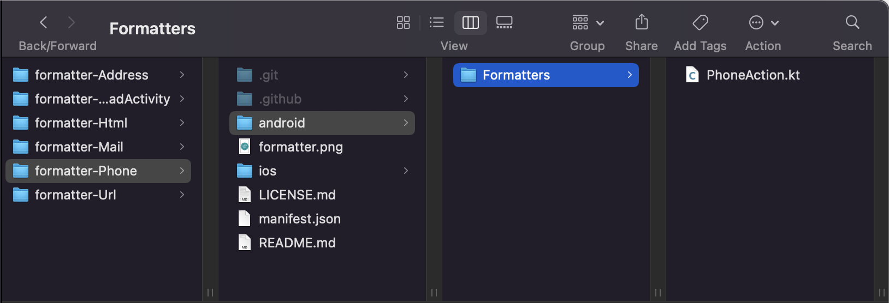
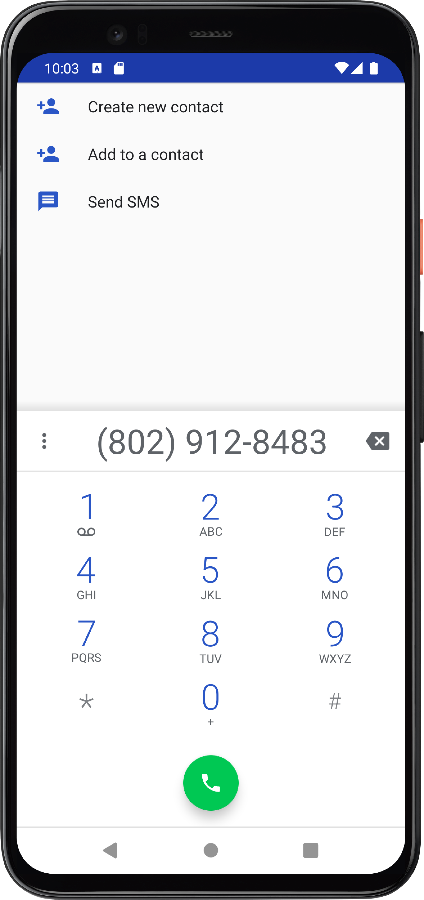
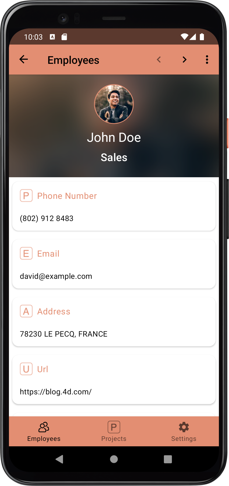

> **OBJECTIVES**
> 
> Create your first data formatters.


## Object attribute Kotlin formatter

In the following example, we want to display an address getting only relevant values that are available in the following object using a Kotlin formatter

```4d 
$Obj:=New object 
$Obj.name:="4D SAS" 
$Obj.address1:="66 rue de Sartrouville" 
$Obj.address2:="Parc les Erables, bâtiment 4" 
$Obj.zipCode:="78230" 
$Obj.city:="Le Pecq" 
$Obj.country:="France" 
$Obj.phoneNumber:="+33 1 30 53 92 00" 
$Obj.website:="fr.4d.com"

$Ent:=ds.Employees.get(4)
$Ent.Object_Attribute:=$Obj
$Ent.save()

```
### On iOS:

Here is an example of a **manifest.json file**:

```4d
{
    "name": "objectFormatter",
    "binding": "objectAddress",
    "type": "object" 
    "target" : ["ios", "android"]
}

```

To get the number, the street, and the city, let’s build a custom **Kotlin formatter**:

```4d 
import UIKit
import QMobileUI

extension UILabel {
    @objc dynamic var objectAddress: [String: Any]? {
        get {
            return nil
        }
        set {
            if let newValue = newValue {
                guard let value1 = newValue["name"] as? String,
                      let value2 = newValue["address1"] as? String,
                      let value3 = newValue["zipCode"] as? String,
                      let value4 = newValue["city"] as? String else {
                          return
                      }
                self.text = "\(value1) - \(value2) - \(value3) \(value4)"
            } else {
                self.text = ""
            }
        }
    }
}
```

Putting all that together, you can save this formatter as a **.kt** file in the formatter folder and use it in your mobile project.


Check out the final result:


### On Android

If you want a formatter that will dial a phone number value on click, we will have the following **manifest file** containing a `name`, a `binding`,a `type` and a `target`:

```4d
{
    "name": "phone",
    "binding": "phoneAction",
    "type" : "text",
    "target" : ["ios", "android"]
}
```

Note that the binding value "phoneAction" will be used in the Kotlin file and that the `BindingAdapter` will interact with a specific field in an Android XML layout.

:::note

You can add several Android/iOS specifications to your app and specify them in your *manifest.json* file. For instance, to add a specific permission to your app, you can add a `capabilities` block as follows:

 ```4d
 "capabilities" : {
        "android" : [ "android.permission.WRITE_EXTERNAL_STORAGE" ]
```

:::

Here is the `PhoneAction.kt` file to dial a phone number value on click :

```4d
package ___PACKAGE___

import android.content.Intent
import android.net.Uri
import android.widget.TextView
import androidx.databinding.BindingAdapter

@BindingAdapter("phoneAction")
fun phoneAction(view: TextView, phoneAction: String?) {
    if (phoneAction.isNullOrEmpty()) return
    view.text = phoneAction
    view.setOnClickListener {
        val dialIntent = Intent(Intent.ACTION_DIAL)
        dialIntent.data = Uri.parse("tel:$phoneAction")
        view.context.startActivity(dialIntent)
    }
}
```
Putting all that together, you can save this formatter as a **.kt** file in the formatter folder and use it in your mobile project.



Check out the final result:

 

Don't hesitate to give us feedbck on the 4D Forum, and check out the documentation for more details!