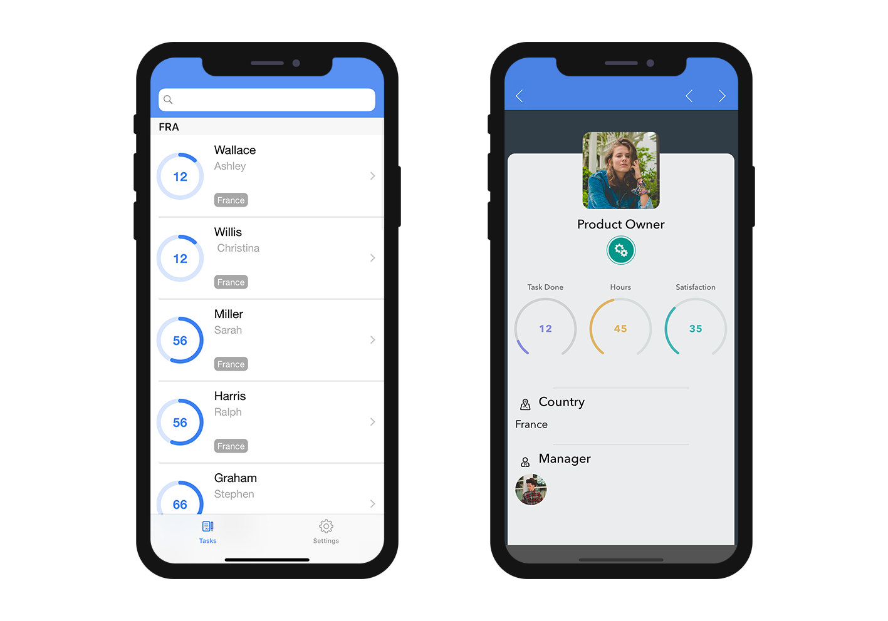

> **目標**
> 
> 最初のフォーマッターを作成します。

このチュートリアルでは、様々なフォーマッターの例を作成していくことを案内していきます。


## スタータープロジェクトをダウンロード

**スタータープロジェクト** をダウンロードします。これには、以下のものが収録されています:

* **integerToImage/Images** および **textToImage/Images** フォルダーと、そこに格納されているピクチャー (あとで画像を使うフォーマッターに使用します)
* **Task Management.4dbase** ファイル (およびすぐに使用できるモバイルアプリプロジェクト)

<div className="center-button">
<a className="button button--primary" href="https://github.com/4d-go-mobile/tutorial-CustomDataFormatter/archive/66d7eea49bc3353f73dbf784ee06283b3a332d0b.zip">スタータープロジェクト</a>
</div>

これでフォーマッターを作成する準備が整いました！

## formatters フォルダーを作成する

まず、*Task Management.4dbase/Resources/Mobile/formatters* フォルダーを作成します。


## 整数用フォーマッター

### 整数から文字列へ

* 作成した formatters フォルダー内に **integerToString** フォルダーを作成します。
* 次に、**integerToString** フォルダー内に **manifest.json** ファイルを作成します。


**manifest.json** ファイルの中身は次のとおりです:

```json
{
   "name": "integerToString",

   "type": ["integer"],

   "binding": "localizedText",

   "choiceList": {"0":"UX designer","1":"Developer","2":"QA","3":"Product Owner"}
}
```

1. **name**: フォーマッターの名前
2. **type**: 使用する 4Dフォーマット型
3. **binding**: 文字列なら **localized text**、あるいは画像なら **imageNamed**
4. **choiceList**: マップされた値

### 整数から画像へ

* 作成した **formatters** フォルダー内に **integerToImage** フォルダーを作成します。

* **integerToImage** フォルダー内に **manifest.json** ファイルを作成します。


* 次に、**integerToImage** フォルダー内に **Images** フォルダーを作成します。 スタータープロジェクト内の **integerToImage/Images** にある画像をここに追加します。


**manifest.json** ファイルの中身は次のとおりです:


```json
{
   "name": "integerToImage",

   "type": ["integer"],

   "binding": "imageNamed",

   "choiceList": {"0":"todo.png","1":"inprogress.png","2":"pending.png","3":"done.png"},

   "assets": {
      "size": {
         "width": 40, "height": 40
      }
   }
}
```
1. **name**: フォーマッターの名前
2. **type**: 使用する 4Dフォーマット型
3. **binding**: 文字列なら **localized text**、あるいは画像なら **imageNamed**
4. **choiceList**: マップされた値
5. **assets**: 表示サイズの調整 (幅と高さ)

## テキストフォーマッター

### テキストから文字列へ

* 作成した formatters フォルダー内に **textToString** フォルダーを作成します。

* 次に、**textToString** フォルダー内に **manifest.json** ファイルを作成します。


**manifest.json** ファイルの中身は次のとおりです:

```json
{
   "name": "textToString",

   "type": ["text"],

   "binding": "localizedText",

   "choiceList": {"FRA":"France","MAR":"Morocco","USA":"United States","AUS":"Australia"}
}
```

1. **name**: フォーマッターの名前
2. **type**: 使用する 4Dフォーマット型
3. **binding**: 文字列なら **localized text**、あるいは画像なら **imageNamed**
4. **choiceList**: マップされた値

### テキストから画像へ

* 作成した formatters フォルダー内に **textToImage** フォルダーを作成します。

* **textToImage** フォルダー内に **manifest.json** ファイルを作成します。


* 次に、**textToImage** フォルダー内に **Images** フォルダーを作成します。 スタータープロジェクト内の **textToImage/Images** にある画像をここに追加します。


**manifest.json** ファイルの中身は次のとおりです:

```json
{
   "name": "textToImage",

   "type": ["integer"],

   "binding": "imageNamed",

   "choiceList": ["image1.png","image2.png","image3.png"],

   "assets": {
  "size": {
   "width": 40, "height": 40
      }
   }
}

```

## ダークモード対応

デバイスがダークモードかライトモードか、あるいは iOS か Android かに関わらず、画像を使うカスタムフォーマッターは簡単に使用できます。 ピクチャーは、デバイスのカラーモードに適応されます。

### Tintable (彩色可能) カラー

アプリのカラーモード (ライト・ダーク) に応じて白黒画像のコントラストを最適化するには、 `"tintable": true` という行を追加します:

```json
{
   "name": "textToImage",
   "type": ["text"],
   "binding": "imageNamed",
   "choiceList": {"car":"car.png","plane":"plane.png","bus":"bus.png"},
   "assets": {
     "size": 54, 
     "tintable": true
     }
}
```
以下は、ライトモードとダークモードでの結果です:

| ライトモード                          |             ダークモード             |
| ------------------------------- |:------------------------------:|
|  |  |


### カラー画像の最適化

アプリに表示されるカラー画像を最適化してカラーモードに適応させるには、以下のように画像が 2枚ずつ必要です: ライトモード用と、`_dark` という接尾辞を持つダークモード用。


```json
{
   "name": "textToImage",
   "type": ["text"],
   "binding": "imageNamed",
   "choiceList": {"car":"car.png","plane":"plane.png","bus":"bus.png"},
   "assets": {
     "size": 54
   }
}
```
ライトモードとダークモードでの結果は以下の通りです:

| ライトモード                             |              ダークモード               |
| ---------------------------------- |:---------------------------------:|
|  |  |

## モバイルプロジェクトを開く

Task Management.4dbase を 4D で開き、ファイルメニューの **開く ＞ モバイルプロジェクト…** を選択し、**Tasks** プロジェクトを開きます。

次に、プロジェクトエディターの **ラベル & アイコン** セクションを開きます。 manifest.json ファイルに記述したとおりに、各フィールドタイプに応じたフォーマッターが利用できるようになっています:

* **Job field** に対して **integerToString** フォーマッターを選択します。
* **Country field** に対して **textToString** フォーマッターを選択します。
* **Task Status** に対して **integerToImage** フォーマッターを選択します。
* **Manager** に対して **textToImage** フォーマッターを選択します。


## 4D for iOS アプリをビルドする

4D for iOS アプリをビルドすると、フォーマッターが適切に適用されているのが確認できます。



完成したフォーマッターテンプレート入りプロジェクト:

<div className="center-button">
<a className="button button--primary" href="https://github.com/4d-go-mobile/tutorial-CustomDataFormatter/releases/latest/download/tutorial-CustomDataFormatter.zip">ダウンロード</a>
</div>

以上です！ 
