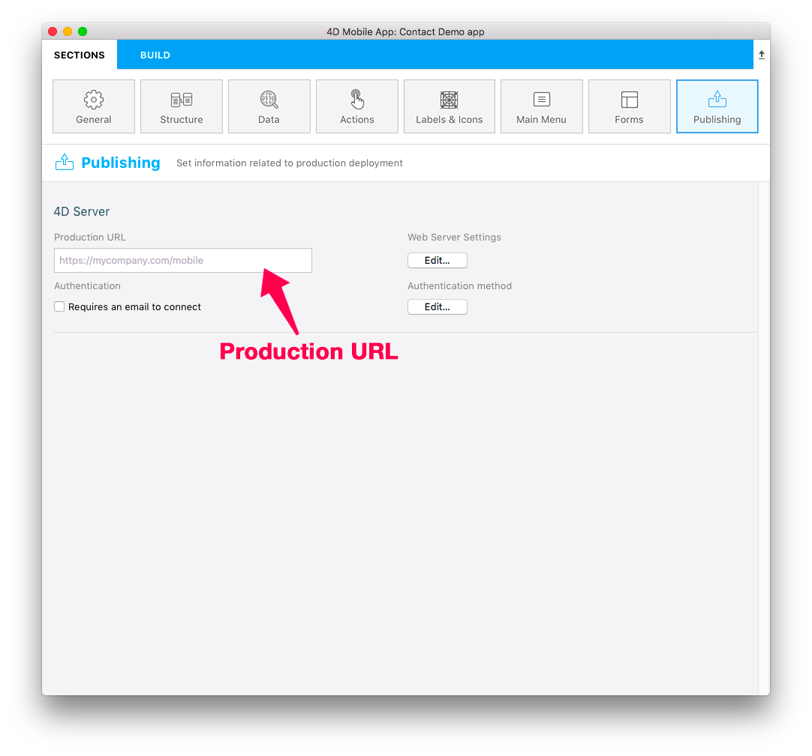
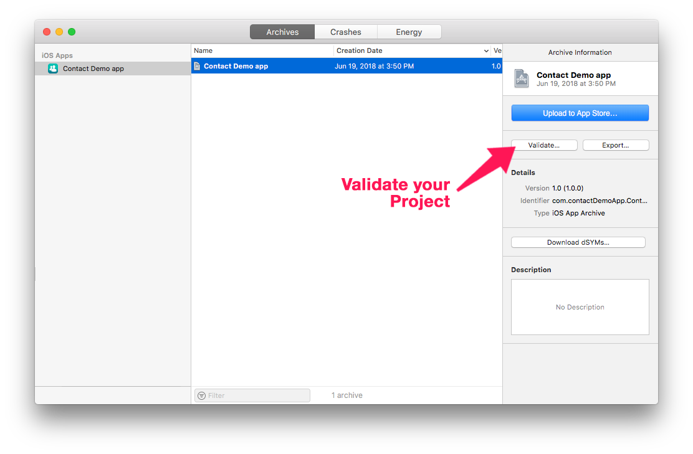
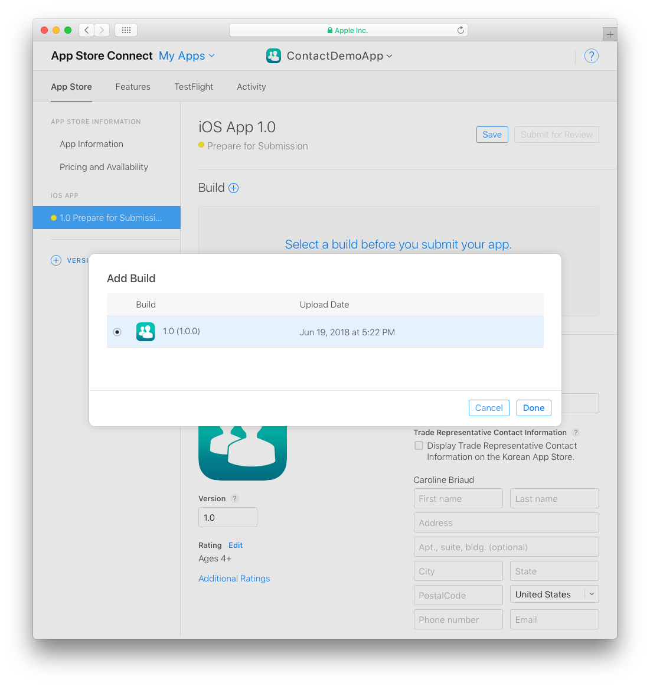
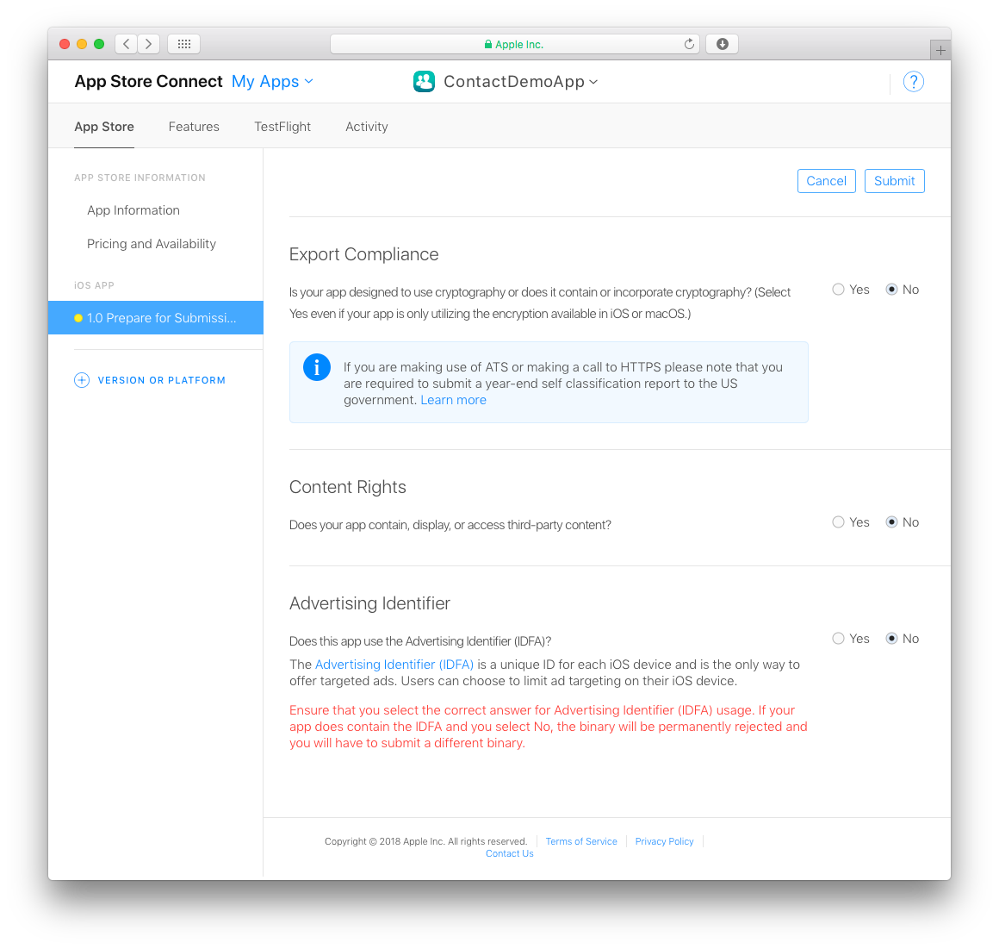

> **目標**
> 
> プロジェクトをアーカイブし、App Store Connect にアップロードします。

## ⒈ ⒈ Xcode の設定
* 個人向けの Apple Developer アカウントを選択した場合、アカウントはすぐに利用できます。
* 組織向けの Apple Developer アカウントを選択した場合、Apple の承認を待つ必要があります。
* アカウントにアクセスできるようになったら、Xcode で Preferences > Accounts に追加します。
* Xcode は、必要な Provisioning Profile と証明書を自動的にインストールします。

## ⒉ ⒉ Team ID を取得する

* Apple Developer アカウントにログインします。 Team ID は Membership にて確認できます。

## ⒊ ⒊ 4D for iOS の設定

* 4D for iOS を起動します。
* セクションタブにて:

**一般: Team ID を入力します**

**公開: プロダクションURL を入力します**

(運用環境では HTTPS が必須です)

* ビルドタブにて:

**ビルドして実行: プロジェクトをビルドします**

## ⒋ 4D for iOS プロジェクトエディターのビルドタブで、プロジェクト > プロジェクトをXcodeで開く... をクリックします。

* ⒋ プロジェクトを Xcode で開く

## ⒌ ⒌ Xcode でプロジェクトをアーカイブする

* Xcode でツールバーのシミュレーター選択メニューを開き、**Generic iOS Device** を選択します。

* 次に、上部メニューから Product をクリックし、**Archive** を選択します。

## ⒍ ⒍ プロジェクトを検証する

* アーカイブ処理の最後に、作成したアーカイブを表示する Organizer ウィンドウが表示されます。

* **Validate** ボタンをクリックし、検証を開始します。

* App Store での配布オプションを選択します。

* 次に、アプリを再署名する必要があります。 **Automatically manage signing** オプションを選択して、Xcode に処理してもらいましょう。

* アプリの内容を確認します。

* 検証に成功すると、以下のメッセージが表示されます:

エラーが発生すると、そのメッセージが表示されます。 再検証の前に、これらのエラーを解決しなくてはなりません。

* **Done** をクリックします。 すると、Organizer ウィンドウに戻ります。

## ⒎ ⒎ App Store にアップロードする

検証が完了したら、いよいよ App Store にアプリを追加することができます。

* **Upload to App Store** ボタンをクリックします。

* アップロードに成功すると、次のウィンドウが表示されます:

## ⒏ ⒏ App Store 用のビルドを選択する

* App Store Connect で App Store > iOS App からアプリを選択し、ビルドセクションに表示される **+** ボタンをクリックします。

* 提出するビルドを選択し、**終了** をクリックします。

* 最後に **審査へ提出** ボタンをクリックします。

## ⒐ 審査へ提出する

* 審査へ提出するための最終ステップとして、アプリに関するいくつかの質問に回答します。

* 回答したら、**送信** をクリックします。

* App Store 審査の平均的な所要時間は 2日ほどです！
