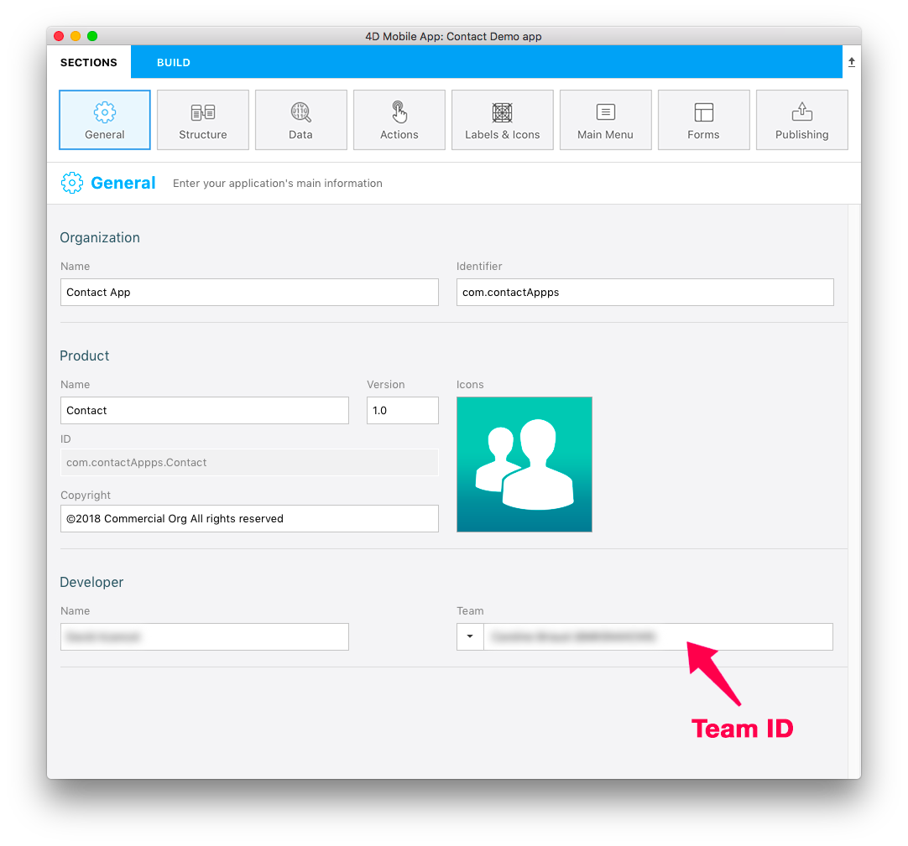
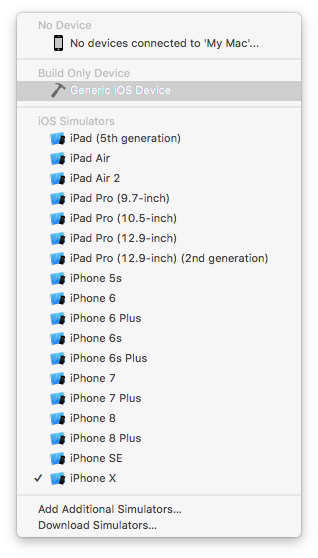
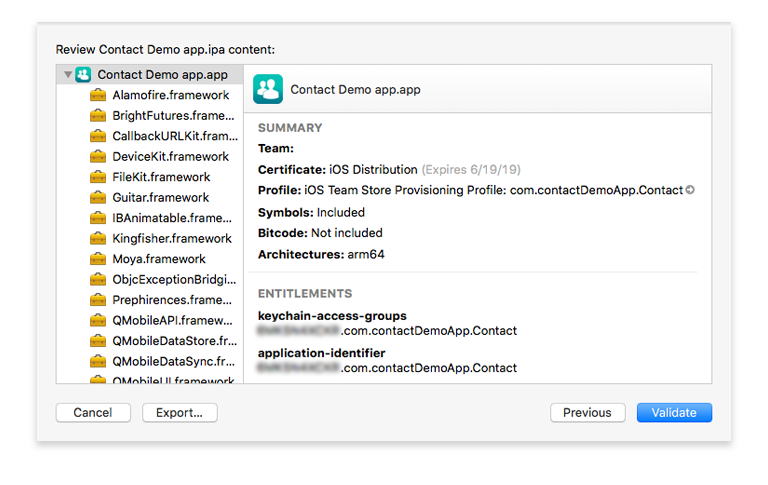
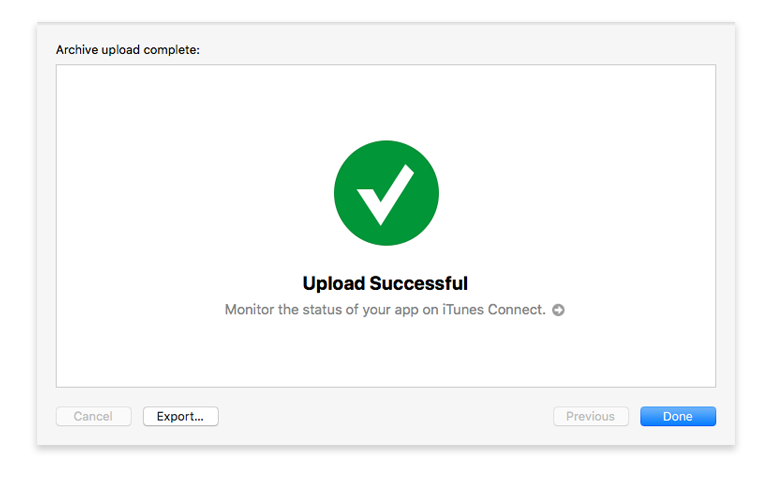
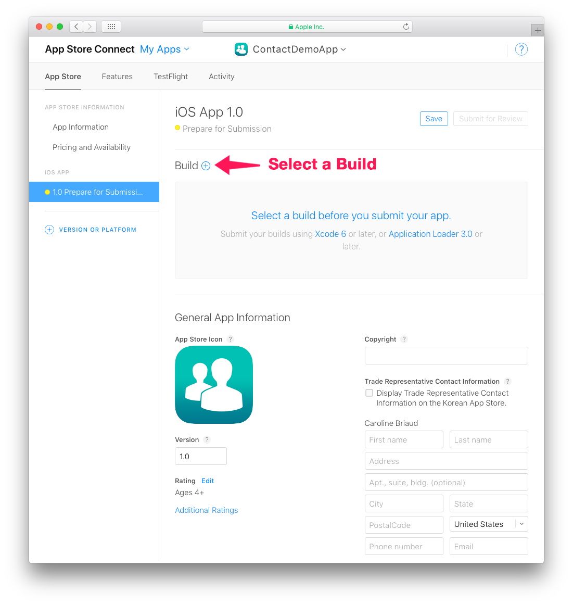

> **OBJECTIVES**
> 
> Archive and upload your project to App Store Connect.

## ⒈ ⒈ ⒈ ⒈ Xcode configuration
* If you have chosen an Apple Developer Account as an individual, your account is immediately available.
* If your have chosen an Apple Developer Account as an organization, you must wait for Apple validation.
* When your account is accessible, add it to Xcode in Preferences > Accounts.
* Xcode will automatically install the necessary provisioning and certificates.

## ⒉ ⒉ ⒉ ⒉ Get your Team ID

* Log into your Apple Developer Account. You can find your Team ID in Membership.

## ⒊ ⒊ ⒊ ⒊ 4D for iOS configuration

* Launch 4D for iOS
* On the SECTIONS tab:

**General: Enter your Team ID**

**Publishing: Enter your production URL**

(HTTPS is mandatory for deployment).

* On the BUILD tab:

**Build and Run: Build your Project**

## ⒋ ⒋ ⒋ ⒋ Open your project with Xcode

* From the 4D for iOS Project Editor's BUILD tab, click on Project > Open the project with Xcode

## ⒌ ⒌ ⒌ ⒌ Archive your project from Xcode

* From Xcode go to the simulator Menu and select **Generic iOS Device**.

* Then from the menu, click on Product and select **Archive**

## ⒍ ⒍ ⒍ ⒍ Validate your project

* At the end of the archive process, the Organizer window appears with the archive you have just created.

* Click on the **Validate** button to start the validation process.

* The first step is selecting the App Store distribution options.

* Then you need to re-sign your app. Let Xcode manage this by  checking the **Automatically manage signing** option.

* Review your app's content.

* If your project passes the validation process, you should see this message:

If an error occurs a message will be displayed. These errors must be resolved before attempting the validation process again.

* Click **Done**. This will return you to the Organizer window.

## ⒎ ⒎ ⒎ ⒎ Upload to App Store

Once the validation process has been completed, you're ready to add your app to the App Store.

* Click the **Upload to App Store** button.

* When your project has been successfully uploaded, you'll see this window:

## ⒏ ⒏ ⒏ ⒏ Select the build for the App Store

* From App Store Connect > App Store > iOS App, select your app and click the **+** button that appears in the Build section

* Select the build you want to submit and click **Done**.

* Finally, click on the **Submit for Review** button.

## ⒐ ⒐ Submit for Review

* The final step to submitting your app for review is answering a few quick questions about your app.

* When you've finished with the questions, click **Submit**.

* The average App Store review time is around two days!
