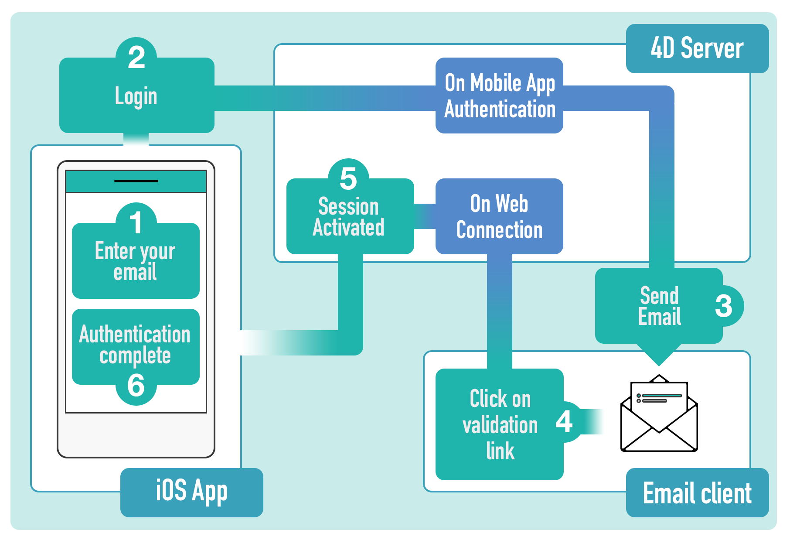

This authentication example provides a way to verify that an email comes from whom it claims to be from, and will allow to block harmful or fraudulent uses of email.

## Scenario

この方法は、次のように機能します:

#### 1. 認証を有効化する

ログインフォームをアプリで使用するため、公開ページの **認証** オプションを選択します。 You can select the **Default** login page or install a custom login page.


#### 2. メールアドレスを入力する

アプリ開始時にメールを要求されます。 When a user enters their email and clicks on the **Login** button, the [On Mobile App Authentication](../../4d/on-mobile-app-authentication) database method is called and the user's session status should be updated to a "pending" status. その後、ユーザーに認証メールが送信されます。

#### 3. メールボックスを確認して、4. リンクをクリックする

ユーザーは、受信した認証メールの認証リンクをクリックします。 This will call the [`On Web Connection`](https://doc.4d.com/4Dv19/4D/19/On-Web-Connection-database-method.301-5392847.en.html) database method and update the [user's session](../../special-features/session-management.md) status from "pending" to "accepted".

#### 5. および 6. アプリに戻る

認証完了後、ユーザーはアプリに戻って **Login** ボタンをクリックします。 `On Mobile App Authentication` メソッドが再度呼び出されますが、今回はユーザーのセッション状態が "accepted" なため、アクセスが許可されます。

一連の流れを図に表しました:



この手順には、特別なコンポーネントを使用するか、手動で処理することができます。


## 4D Mobile App Server コンポーネントの使用

[4D Mobile App Server](https://github.com/4d-for-ios/4D-Mobile-App-Server/tree/master) コンポーネントは、いくつかの一般的なモバイル機能を管理するために開発されたツールボックス・コンポーネントです。 このコンポーネントは、メール認証ログイン用のメソッドを提供します。


1. `On Mobile App Authentication` データベースメソッド内で、モバイルアプリから渡された情報とともに `Mobile App Email Checker` メソッドを呼び出します:

```4d
// On Mobile App Authentication database method

#DECLARE ($mobileInfo : Object) -> $result : Object
$result:= Mobile App Email Checker($mobileInfo)
```

2. `On Web Connection` データベースメソッド内で、URL より取得した `Session` IDパラメーターを指定して、`Mobile App Active Session` メソッドを呼び出します:

```4d
// On Web Connection database method

#DECLARE ($info : Text) 
Case of 
: (Mobile App Active Session($info).success)
    //add log if you want
End case 

```

このように、とても簡単です。

詳細については、[Email Checker メソッドのドキュメント](https://github.com/4d-for-ios/4D-Mobile-App-Server/blob/master/Documentation/Methods/Mobile%20App%20Email%20Checker.md) を参照ください。


## コンポーネントを使用しない場合

4D Mobile App Server コンポーネントを使用せずに、独自のメール認証を実装することができます。 基本的な例:

1. `On Mobile App Authentication` データベースメソッドに以下のコードを書きます:


```4d
// On Mobile App Authentication データベースメソッド

#DECLARE($request : Object)->$response : Object
var $mail;$status : Object

  // 認証用の URL を持つメールを作成します
$mail:=New object
$mail.from:="myapplication@gmail.com"
$mail.to:=$request.email  // ユーザーが入力したメールアドレス
$mail.subject:="ログイン確認"
$mail.htmlBody:="<a href=\"https://myserverapplication/activation/"+$request.session.id \
+"\">メールアドレスを確認するため、ここをクリックしてください。</a>\"<br>"

  // メールを送信します
$smtp:=New object("host";"smtp.gmail.com";"user";"myapplication@gmail.com";"password";"xxx")
$transporter:=SMTP New transporter($smtp)
$status:=$transporter.send($mail)

  // モバイルアプリのレスポンスオブジェクトを設定します
$response:=New object

  // カレントセッションが検証中であることを宣言します
$response.verify:=True

  // メール送信に成功したか確認します
If ($status.success)
      // 全プロセスからアクセス可能な共有オブジェクトを作成し、セッションを格納します
    If (Storage.pendingSessions=Null)
        Use (Storage)
            Storage.pendingSessions:=New shared object
        End use 
    End if 

    Use (Storage.pendingSessions)
          // セッションリストにこのセッションを追加します
        Storage.pendingSessions[$request.session.id]:=$request.team.id+"."+$request.application.id
    End use 

    $response.success:=True
    $response.statusText:="メールボックスを確認してください。"
Else 
      // スマートフォンにエラーメッセージを表示します
    $response.statusText:="メールを送信できませんでした。時間をおいて再送信してください。"
    $response.success:=False
End if 

```

2. `On Web Connection` データベースメソッドには、ユーザーが確認メールのリンクをクリックした後に、該当セッションを有効にするためのコードを記述します。

```4d
// On Web Connection database method

#DECLARE($url : Text; $header : Text; \
  $BrowserIP : Text; $ServerIP : Text; \
  $user : Text; $password : Text) 

var $token ; $session : Text
var $sessionFile ; $sessionObject : Object

If ($url="/activation/@")
    $token:=Substring($1;13)
End if 


  //get session from ID received from URL
If (Storage.pendingSessions#Null)
    $session:=Storage.pendingSessions[$token]
End if 

If ($session#"")
      //get session folder
    $sessionFile:=Folder(fk mobileApps folder).folder($session).file($token)
    $sessionObject:=JSON Parse($sessionFile.getText())
      //update status value
    $sessionObject.status:="accepted"
    $sessionFile.setText(JSON Stringify($sessionObject))
    Use (Storage.pendingSessions)
          //delete pending session
        OB REMOVE(Storage.pendingSessions;$token)
    End use 

    /*
        The MOBILE APP REFRESH SESSIONS command checks all mobile
        application session files located in the MobileApps folder of the server, 
        and updates existing session contents in memory for any edited files.
    */

    MOBILE APP REFRESH SESSIONS

    WEB SEND TEXT("You are successfully authenticated")
Else 
    WEB SEND TEXT("Invalid session")

End if 
```

## リモートURLの定義

デフォルトでは、リモートサーバーの URL は Android アプリに定義されています。 URL が正しくない場合、サーバーにアクセスできなくなります。 この URL を修正・更新したい場合には、ログイン画面のアイコンを長押しするか、設定タブからおこないます。 アイコンを長押しすると、リモートURL のアドレスとサーバーのアクセス状況のメッセージが表示されます。 URL を編集して、認証に成功すると、サーバーにアクセスできるようになります。

iOS の場合、iOSデバイスの設定画面からリモートサーバーの URL を編集することができます。 これには、"サーバーアドレスをリセット" にチェックを入れて、正しいサーバーアドレスを入力します。

