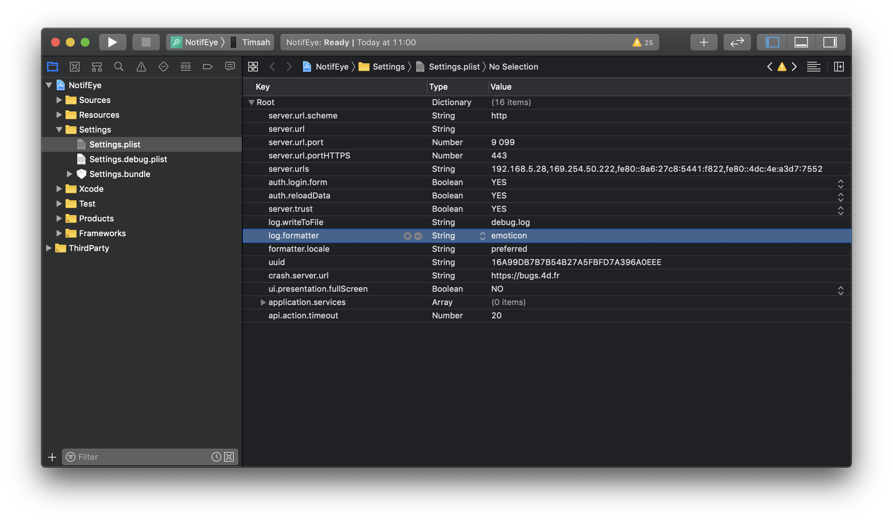

ビルド中に問題が発生した場合は、**プロジェクト** メニューから **プロジェクトをXcodeで開く** を選択すると、生成されたプロジェクトを Xcode で開くことができます。

ここで **ビルドボタン** をクリックして、シミュレーターで **アプリを起動** できます。その際のログはすべて、Xcodeワークスペースの下部から取得できます。

## Logger

Logger とは、ログやトレースをおこなうためのオブジェクトです。

これには、[XCGLogger](https://github.com/DaveWoodCom/XCGLogger) フレームワークを使用しています。

Logger 設定の定義は、Xcodeプロジェクトの /Settings/Settings.plist にあります。

## Levels

Settings.plist ファイルに log.level を追加すると、ログレベルをフィルターしてコンソールに表示することができます。

これには、Settings.plist ファイル内を右クリックして行を追加し、以下を入力します:
* Key 列に log.level
* Type 列に Number
* Value 列に (たとえば) 3

**利用可能な値** は以下の通りです:

* 0: verbose
* 1: debug
* 2: info (デフォルト値)
* 3: warning
* 4: error
* 5: severe

たとえば、log.level の Value を 3 に設定すると、**warning、error、severe** が Xcodeコンソールに表示されます。

## フォーマット

**異なるログタイプを強調** するために、異なるビジュアルインジケーターを Xcode コンソールに表示することができます。

これには、Xcodeプロジェクトの /Settings/Settings.plist を開きます。

### emoticon

 * prefixes[.verbose] = "🗯"
 * prefixes[.debug] = "🔹"
 * prefixes[.info] = "ℹ️"
 * prefixes[.warning] = "⚠️"
 * prefixes[.error] = "‼️"
 * prefixes[.severe] = "💣"

### circles

* prefixes[.verbose] = "🔘"
* prefixes[.debug] = "🔵"
* prefixes[.info] = "⚪"
* prefixes[.warning] = "☢️"
* prefixes[.error] = "🔴"
* prefixes[.severe] = "⚫"

