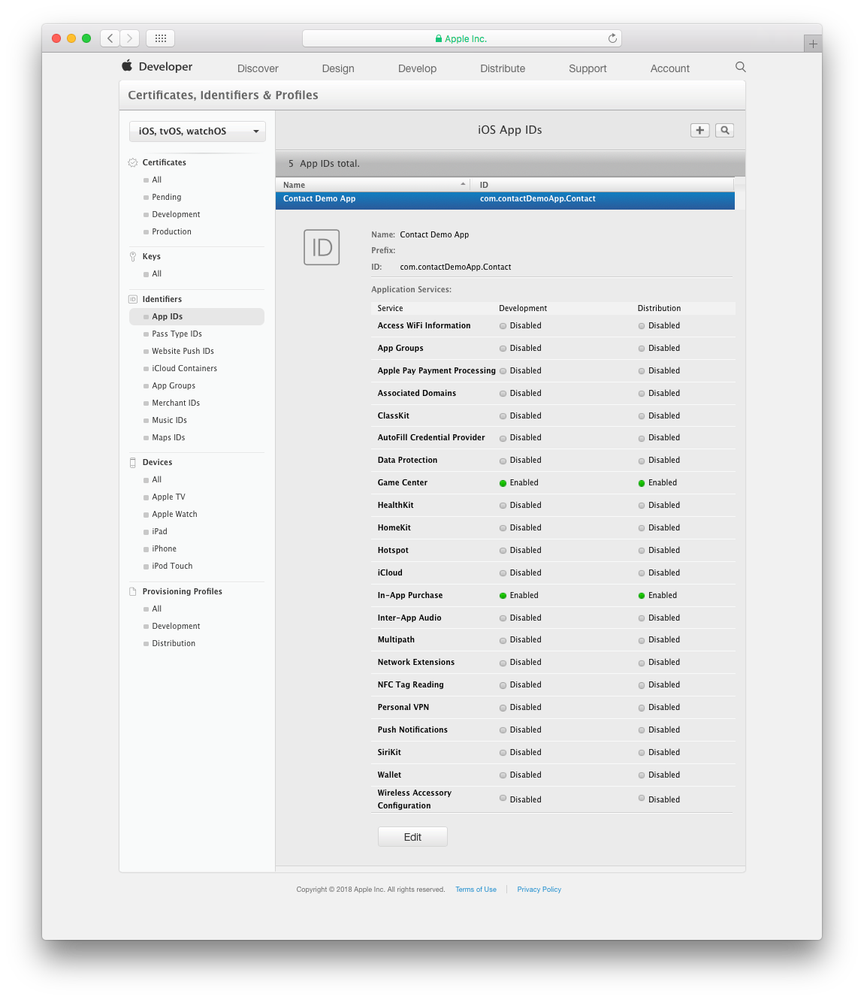
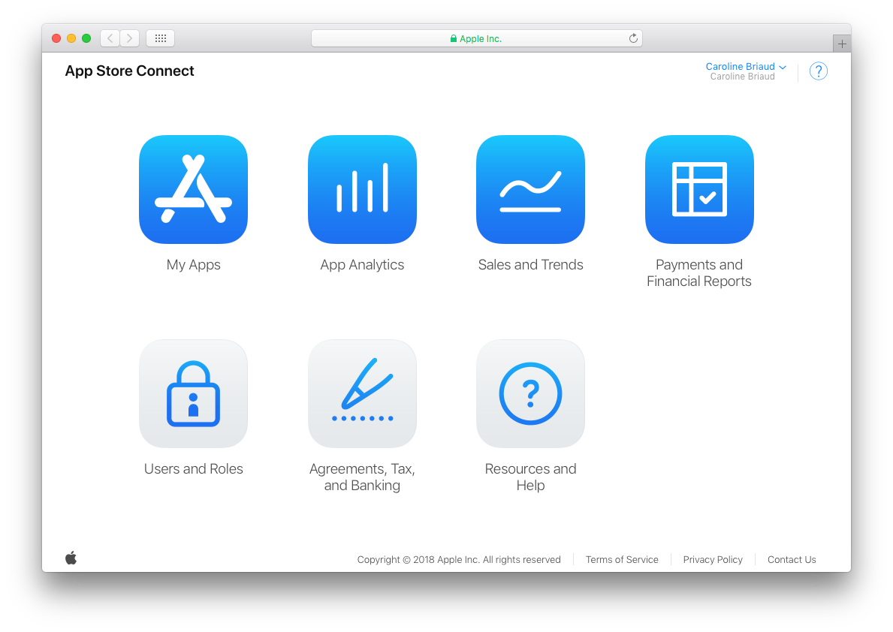
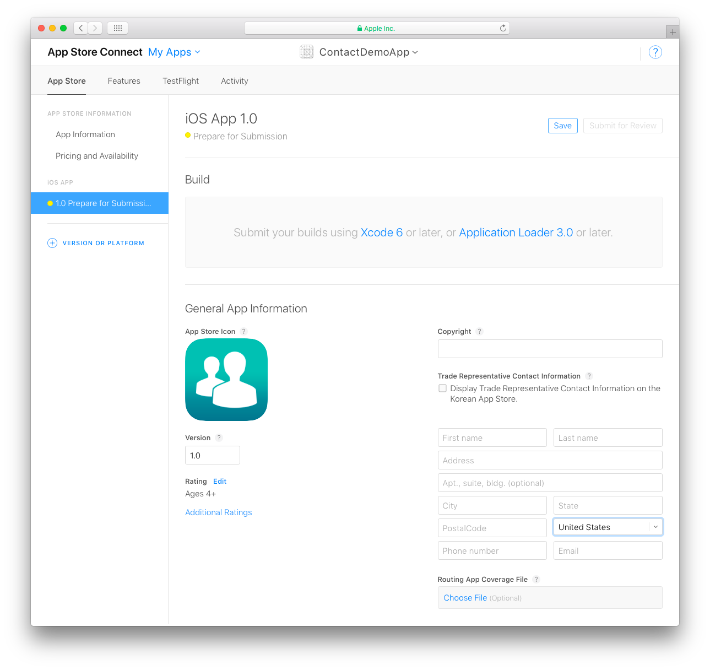
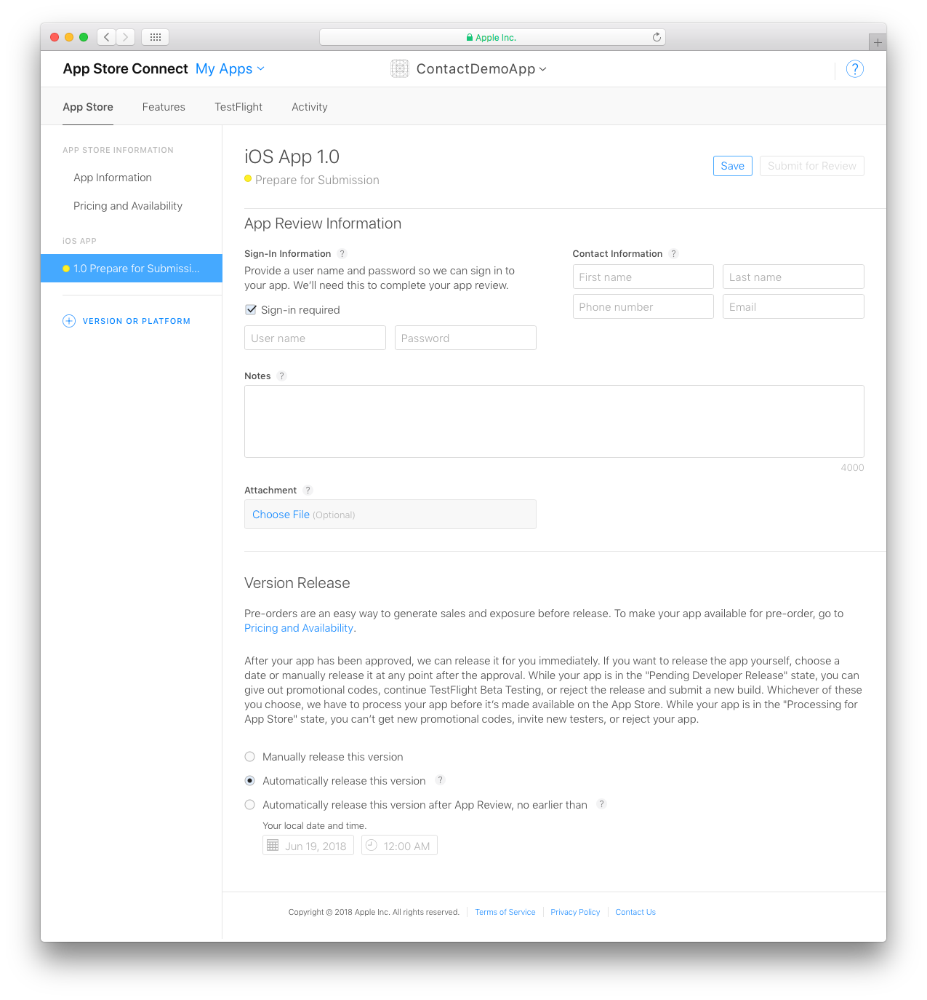

> **目標**
> 
> * デベロッパーアカウントで App ID を作成する
> * App Store Connect でアプリを作成する

> **用意するもの**
> 
> * [組織向けのApple Developer Program](../tutorials/developer-program/register-apple-developer-program-organization) または
> * [個人向けの Apple Developer Program](../tutorials/developer-program/register-apple-developer-program-individual)

## ⒈ App ID を作成する

#### App ID とは？

*App ID は、1つの開発チームによる 1つ以上のアプリの識別に使用される 2つの部分からなる文字列です。 文字列は Team ID とバンドルID で構成され、ピリオド (.) で区切られます (例: TeamID.BundleID)。*

> **注記**
> 
> * 個人向けの Apple Developer アカウントを選択した場合は、すぐにアカウントを利用でき、App ID を作成することができます。
> * 組織向けの Apple Developer アカウントを選択した場合には、Apple の承認を得てから、App ID を作成することができます。

App ID を作成するには、デベロッパーアカウントにアクセスし、[Certificates, IDs & Profile](https://developer.apple.com/account/ios/identifier/bundle) を選択します。

* *Register iOS App IDs* の横にある + 記号をクリックし、新しい App ID を追加します。

* アプリの名前とバンドルID を定義します。

* アプリに含める App Services を定義します。

* **Register** をクリックし、App ID を登録します。

## ⒉ App Store Connect にサインインする

* [App Store Connect アカウント](https://appstoreconnect.apple.com) にサインインします。
* **マイ App** をクリックします。

## ⒊ 新規の iOSアプリを作成する

左上の **+** をクリックして、新規の iOSアプリを作成します。

以下の情報を追加します:

* **プラットフォーム**: iOSを選択します。
* **名前**: アプリ名を入力します。
* **プライマリ言語**: アプリで使われる主要言語です。
* **バンドルID**: ドロップダウンリストからアプリのバンドルID を選択します。
* **SKU**: アプリのユニークな ID (これは非公開で、ユーザーには見えません)
* **ユーザーアクセス** (任意): アプリへのアクセスを App Manager、Developer、Marketer、Sales のロールを持つユーザーに制限することができます。

> **注記**
> 
> バンドルID が利用できない場合、App Store の他のアプリですでに使用されている可能性があります。 その場合、Xcode プロジェクトで自分のバンドルID を変更する必要があります。

## ⒋ App情報

App Store Connect で App情報 を開きます。

* アプリのプライバシーポリシーURL を定義します (任意)。
* アプリのサブタイトルを入力します。 このサブタイトルは、iOS 11では、App Store全体でアプリケーション名の下に表示されます。
* アプリを表示するプライマリカテゴリおよびセカンダリカテゴリ (任意) を選択します。

## ⒌ 価格および配信状況

ここで、アプリの価格を設定します。

> **TIPS**
> 
> 開始日と終了日を指定して、期間限定の割引を設定することができます。

## ⒍ 提出準備中

**バージョン情報** に、App Store で表示するアプリのアセットをすべて追加します。

> **TIPS**
> 
> スクリーンショットはすべてシミュレーターで生成できます (File > New Screen Shot)。

* アプリのスクリーンショットを追加します。 iPhone 5.5" Super Retina Display、iPad 12.9" Retina Display用のスクリーンショットは必須です。 詳しくは、[スクリーンショットの仕様](https://help.apple.com/app-store-connect/#/devd274dd925) を参照ください。

* 下にスクロールして、**キーワード** を設定し、**概要** を記入します (これは、ユーザーが App Store で見るものです)。
* You can share updates about your app, including new promotions or in-app purchases, upcoming features or content, limited- time sales, or other events within your app in also add a **Promotional Text** that will appear above your description on the App Store (for customers with devices running iOS 11 or later).
* Enter a **Support URL** that includes support information for your app. This URL will be visible on the App Store.
* **Marketing URL** is optional. This can direct users to a marketing website for your app.

In the **iOS App section**:

Locate your build versions in **Build**.

* In **General App Information** area, enter the Copyright, Version, and Trade Representative Contact Information for your app.
* Your app icon is included in the generated 4D for iOS project.
* Rating is a required property used by the App Store's parental controls. Click Edit and select the appropriate age category for your app.

The **App Review Information** and **Version Release** sections include information required by the App Store. The information provided here will not be seen by users.

* **App Review Information**: Confidential contact and security information.
* **Version Release**: Specifies an automatic or manual publication.
* Finally, click **Save**.
