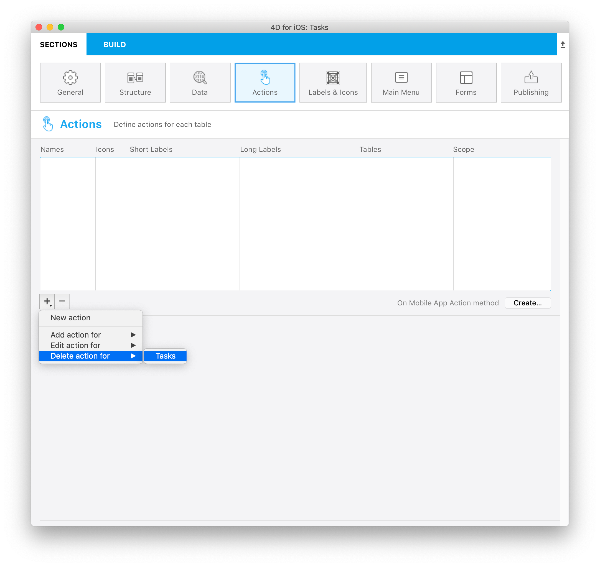
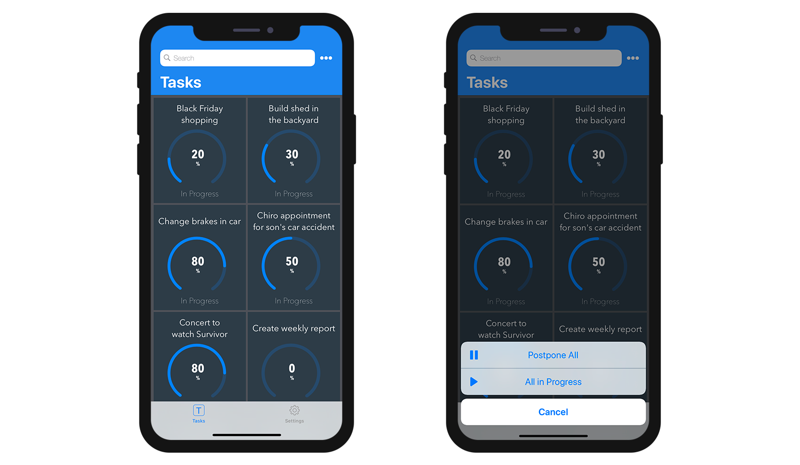

このセクションでは以下のような内容を取り扱います:

* iOSアプリから 4Dコードを実行するアクションの作成
* アクションに渡す引数の定義と追加

:::4D for Androidにおける注意

このセクションで触れている内容は4D for Android では現在ご利用いただけません。

:::

## プロジェクトエディター側の設定

### アクションを作成する

新しいアクションを作成するには、アクションテーブルの下部にある + ボタンをクリックします。 すると、アクションテーブルに新しい行が追加されます。

次に、以下のものを定義する必要があります:

* **名前:** [On Mobile App Action](#on-mobile-app-action) データベースメソッド内で 4Dコードをトリガーするのに使用するアクションの名前
* **アイコン:** アイコンライブラリーから選択するアイコン。 またこちらの [チュートリアル]`(using-icons.html)` を参考に、独自のアイコンを追加することもできます。
* **短いラベルとラベル:** アプリに表示するアクションのラベル
* **テーブル:** アクションを適用するテーブル
* **スコープ:** アクションの定期用対象: **カレントエンティティ** または **テーブル**


### アクションに引数を追加

**アクション引数** を追加することで、アプリからデータを直接 **編集** することができます。

それぞれの引数について、以下のプロパティを設定することができます:

* 名前
* (長い) ラベル
* 短いラベル
* フォーマット
* 入力制限 (最小値または最大値の定義)
* プレースホルダー
* 必須フィールド定義
* デフォルト値


引数の順番はドラッグ＆ドロップで自由に変えられます。

引数に対して選択できる **フォーマット** の種類は以下の通りです:

<table>

<tr>
<th colspan="2"  style={{textAlign: 'center'}}>テキスト</th>
</tr><tr style={{textAlign: 'center'}}>
<th>フォーマット</th><th>詳細</th>
</tr><tr>
<td>テキスト</td><td>文字列の頭文字を大文字にします。</td>
</tr><tr>
<td>メールアドレス</td><td>メールアドレス入力用に最適化された iOSキーボード</td>
</tr><tr>
<td>電話番号</td><td>電話番号入力用の iOSキーパッド</td>
</tr><tr>
<td>アカウント</td><td>ユーザー名入力用に最適化された iOSキーボード</td>
</tr><tr>
<td>パスワード</td><td>パスワードの管理に最適化されています。</td>
</tr><tr>
<td>URL</td><td>URL入力に最適化された iOSキーボード</td>
</tr><tr>
<td>郵便番号</td><td>郵便番号入力に最適化された iOSキーボード</td>
</tr><tr>
<td>テキストエリア</td><td>単一フィールド内に複数行のテキストを格納できます。</td>
</tr><tr>
<td>バーコード</td><td>バーコードに割り当てられた値を取り出します。 サポートされてるフォーマット: EAN8、EAN13、Code 39、Code 93、Code 128、QRコード、UPC、PDF417</td>
</tr>
<tr>
<td colspan="2"></td>
</tr>

<tr>
<th colspan="2" style={{textAlign: 'center'}}>数値</th>
</tr><tr style={{textAlign: 'center'}}>
<th>フォーマット</th><th>詳細</th>
</tr><tr>
<td>数値</td><td>小数点付き数値</td>
</tr><tr>
<td>整数</td><td>小数点のつかない数値</td>
</tr><tr>
<td>指数</td><td>指数表記</td>
</tr><tr>
<td>パーセント</td><td>パーセント表記</td>
</tr><tr>
<td>読み方</td><td>数値を文字列へと変換</td>
</tr>
<tr>
<td colspan="2"></td>
</tr>

<tr>
<th colspan="2" style={{textAlign: 'center'}}>日付</th>
</tr><tr style={{textAlign: 'center'}}>
<th>フォーマット</th><th>詳細</th>
</tr><tr>
<td>日付</td><td>Nov 23, 1937</td>
</tr><tr>
<td>短い日付</td><td> 11/23/37</td>
</tr><tr>
<td>長い日付</td><td>November 23, 1937</td>
</tr><tr>
<td>完全な日付</td><td>Tuesday, November 23, 1937</td>
</tr><tr>
<td colspan="2"></td>
</tr>

<tr>
<th colspan="2" style={{textAlign: 'center'}}>時間</th>
</tr><tr style={{textAlign: 'center'}}>
<th>フォーマット</th><th>詳細</th>
</tr><tr>
<td>時間</td><td>3:30 PM</td>
</tr><tr>
<td>経過時間</td><td>2 hours 30 minutes</td>
</tr>
<tr>
<td colspan="2"></td>
</tr>

<tr>
<th colspan="2" style={{textAlign: 'center'}}>ブール</th>
</tr><tr style={{textAlign: 'center'}}>
<th>フォーマット</th><th>詳細</th>
</tr><tr>
<td>ブール</td><td></td>
</tr><tr>
<td>チェックマーク</td><td></td>
</tr>

<tr>
<td colspan="2"></td>
</tr>
<tr>
<th colspan="2" style={{textAlign: 'center'}}>画像</th>
</tr>
<tr>
<td>署名</td><td>手書き文字での署名が可能に</td>
</tr>

</table>

## プリセットアクション

4Dモバイルプロジェクトには、アプリのコンテンツを管理するための、以下のプリセット (定義済み) アクションが含まれています:

* 編集
* 追加
* 削除
* 共有
* ソート

### 追加アクション

4Dモバイルプロジェクトで **追加アクション** を作成するのは簡単です。

まず、アクションテーブルの下にある **+ ボタン** をクリックすると表示される **追加アクション** オプションを選択します。


次に、その追加アクションをリンクする **テーブルを選択** するだけです。

これによって、プロジェクトエディター内に必要な引数がすべて **自動的に作成** されます。 生成されたアプリ内では、各フィールド値の編集ができるようになります。

この種のアクションの場合、引数リストの右側にある **プロパティ** は自動で設定済みです。


### 編集アクション

**編集アクション** の作成手順は追加アクションと同じですが、引数のデフォルト値が定義できない点が異なります。


### 削除アクション

**削除アクション** の作成手順は編集アクションと同じです。 唯一の違いは、このアクションを使用するとエンティティを削除できるという点です。

削除アクションを作成するには、アクションテーブルの下にある **+ ボタン** をクリックすると表示される **削除アクション** オプションを選択します。

この種のアクションは使用の際に注意が必要です。



### 共有アクション

**共有アクション** を選択すると、モバイルアプリのユーザーが他のユーザーとコンテンツを共有できるようになります。 これには、スコープを選択する必要があります:

- **エンティティ**: 詳細フォームのコンテンツを共有する
- **テーブル**: リストフォームを共有する

詳細については [ディープリンク](../special-features/deep-linking.md) を参照ください。

### ソートアクション

**ソートアクション** は以下のような目的に使います:

- テーブルのリストフォームのデフォルトのソート順を定義する
- モバイルアプリのユーザーがリストのソート順を選択できるようにする

テーブルに対してソートアクションを作成した場合、並べ替え基準となる最初のフィールドを選択する必要があります:


このフィールドはソート条件リストに追加されます。 デフォルトでは昇順ソートが適用されますが、これは **ソート順** メニューで変更できます。

エンティティの並べ替えは、複数フィールドを基準におこなえます。 ソートの基準となる各フィールドはソートレベルと呼ばれます。 たとえば、`lastName` および `firstName` フィールドに対して 2レベルの昇順ソートをおこなった場合、結果は以下のようになります:

```4d
Aardvark, Anthony
Aardvark, Artemis
Aardvark, Arthur
...
Zygote, Elena
Zymosian, Elmer
```

ソート条件リストにソートレベルを追加するには、リスト下部の **+** ボタンをクリックし、各レベルを設定します:


#### モバイルアプリ上でのソート順メニュー

テーブルに対して 2つ以上のソートアクションを定義していた場合、モバイルアプリのユーザーは **ソート** メニューを自動的に使用できるようになります。 ここには定義済みのソートアクションがすべて格納されています:


> テーブルに対するソートアクションが 1つしか定義されていない場合、モバイルアプリ側では **ソート** メニューは表示されません。

### On Mobile App Action

[`On Mobile App Action`](../4d/on-mobile-app-action.md) データベースメソッドは、4Dメソッドを呼び出すのに利用します。

すべてのアクションを作成したあと、アクションテーブル右下の **作成...** ボタンをクリックすると、作成した全アクション名を含んだ *Case of* コードブロックが *On Mobile App Action* メソッド内に自動生成されます。

:::note notes

- `$out.dataSynchro:=True` というコードをアクション実行後に使用することで、セレクションを更新することができます。
- `$out.statusText:="表示したいメッセージ"` というコードを使用することで、アクション実行時にアプリユーザーに対して通知をすることができます。
- `$out.close:=True` というコードを使用することで、編集フォームを強制的に閉じることもできます。

:::

## オフラインモードアクション

アプリのユーザーはオフライン中でも、アクションリクエストを作成・保存・キューすることが可能です (たとえば、顧客電話番号の追加、写真のアップロード、請求書や見積書の印刷、アドレスの削除など)。  これらのタスクはすべて、ネットワークにアクセスできるようになるまで、保留中アクションのリストに置かれます。 ユーザーがオンラインになると、保留中のアクションはすべて同期され、実行された後、完了したアクションのリストに表示されます。

保留中のタスクは以下にて確認し、開くことができます:

•   *設定画面*

保留中のタスクや完了したタスクの概要と履歴が表示されます。


•   *リスト & 詳細フォーム*

現在閲覧しているテーブルやエンティティに関連するすべてのタスクが表示されます。


:::note notes

- プリセットの "共有" アクションは、オンラインでのみ実行可能です。
- アクションは保留中の間は編集可能ですが、"完了" モードに切り替わると、修正できなくなります。

:::

### 失敗した保留タスクの更新

サーバーのビジネスロジックにより、一部のタスクが拒否されることがあります。 それらの保留タスクを編集後、モバイルユーザーは送信を再試行できます。 そのために、"完了" アクションの履歴にて、失敗の理由を説明するステータステキストを確認できます。 たとえば、モバイルユーザーがサーバーに送信したアクションを拒否し、操作に失敗したことを通知することができます。 その場合、以下のように `success` の値を `False` に設定し、 `statusText` にメッセージを設定することができます:

 ```4d
 $response:=New object("success"; False; "statusText"; "操作に失敗しました"))
 ```
 アクション引数ごとのエラーを追加することもできます。たとえば、`alphaField` 引数について:

  ```4d
$response.errors:=New collection(New object("parameter"; "alphaField"; "message"; "Alpha フィールドの値が無効です")
  ```


## iOSアプリ側

iOSアプリでは、フォームセクションで選択したテンプレートに応じて、リストおよび詳細フォームで様々にアクションを利用できます。

### テーブルリストフォーム

* **エンティティアクション:** セルを左にスワイプすると、利用可能なアクションがリスト形式で表示されます。 3つより多い数のアクションがエンティティに定義されている場合、"..." ボタンが表示されます。


* **テーブルアクション:** 利用可能なテーブルアクションのリストを表示するために、ナビゲーションバーに汎用的なアクションボタンが用意されています。


:::ヒント

アクションは、アクションセクションで定義された順序で表示されます。

:::

### コレクションリストフォーム

* **エンティティアクション:** テンプレートによって、汎用ボタンをクリックするか、セル上で長押しすることでアクションが表示されます。


* **テーブルアクション:** テーブルリストフォームと同様に、利用可能なテーブルアクションのリストを表示するため、ナビゲーションバーに汎用的なアクションボタンが用意されています。



### 詳細フォーム

リストフォームのテーブルアクションと同様に、ナビゲーションバーに汎用的なアクションボタンがあり、すべてのエンティティアクションをリスト表示することができます。


### 編集フォーム

編集または追加アクションを作成した場合、アクションリストからそれらを選択すると、**編集フォーム** が表示されます。


ここでは:

* すべてのフィールドを選択して編集できます。
* **Done** または **Cancel** ボタン (ナビゲーションバーで利用可能) を使用して、変更内容を確定またはキャンセルします。

利便性のため、編集フォームにはいくつかの **特別な機能** が含まれています:

* キーボードのタイプは、アクションセクションで選択されたパラメーターに依存します。
* キーボード上部の矢印で、次のフィールドや前のフィールドに移動することができます。
* iOSキーボードは、フィールドの外をタッチすることで、閉じることができます。
* 値が有効でない場合、ユーザーに表示されます。
* ユーザーが Done ボタンをクリックしたときに空の必須フィールドがあれば、それに焦点が当たります。

## これからどうする？

* **アクション定義の仕方** について説明した
チュートリアル</code> があります。</p></li> 
  
  * カスタムテンプレートを作成するための **アクションタグの統合** について説明した チュートリアル</code> もあります。</p></li> 
  
  * こちらの チュートリアル</code> では **アクション引数の定義** について説明しています。</p></li> </ul>
