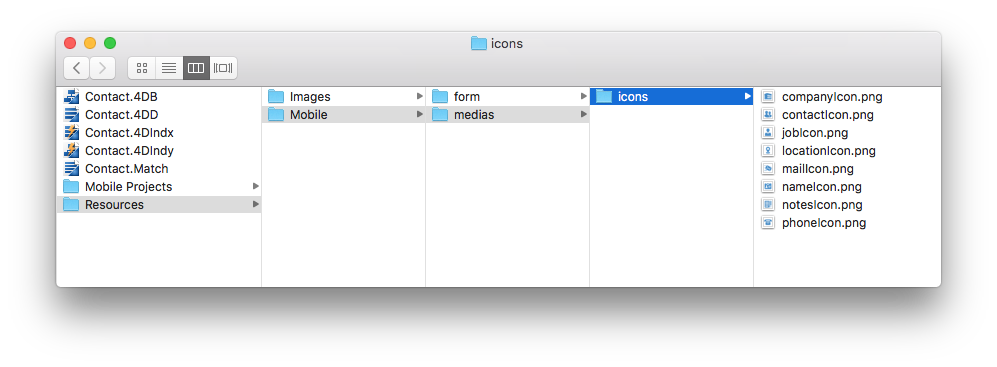

このページではモバイルアプリ内でのテーブル、フィールドおよびリレーションの表示プロパティを定義することができます。


初期状態ではデフォルトのプロパティが設定されています。 プロパティを変更するためには、変更する要素を選択し、適切なカラム内に新しい値を入力してください。

テーブル、フィールド、リレーションに対して同じプロパティを設定することができます。 また、それに加えて、フィールド/リレーションに対してフォーマットを定義することもできます。

これらの要素は生成されたアプリ内のテンプレートによって、詳細フォームおよびリストフォーム内で表示されます。


## アイコン

テンプレートにアイコンが必要になった時にモバイルアプリでフィールド/要素に対して適用されるアイコンを設定します。

:::info

リレーションフィールドに対しては、アイコンは**リレーション** ボタンの左に表示され、このボタンを押すとリレートされたテーブルを開くことができます。

:::

4Dモバイルエディターでは、あらゆる用途に応えるため、大量のアイコンのライブラリーを提供しています。 このライブラリーには、ビジネス、金融、教育、健康、産業、不動産、サービスなどの用途のアイコンが用意されています。 アイコンを選択するためには、**icon** ボタンをクリックし、表示されたリストからアイコンを選んでください:


:::info

統一性を持たせるため、フィールドに対して少なくとも1つのアイコンが定義されている場合、空のフィールドに対して**デフォルトアイコン** が生成されます。

:::

アプリケーション内でアイコンを表示したくない場合には、アイコンエリアを空にしたままにして下さい。


### カスタムのアイコンを追加する

独自のアイコンをライブラリーに追加し、プロジェクト内で選択できるようにすることができます。 使用するアイコンフォーマットおよびサイズに制約はありません(ただしフォーマットは透明部を保持するためにSVGまたはPNGが推奨されます)。 プロジェクトエディターでの見栄えのために、カスタムのアイコンは色付きのバージョンを用意しておくことが強く推奨されます。

例えば、カスタムのアイコンとして使用できるものは以下のようなものがあります:

<div className="center-button">
<a
  className="button button--primary"
  href="https://github.com/4d-go-mobile/tutorial-CustomIcons/releases/latest/download/tutorial-CustomIcons.zip">
  カスタムアイコンをダウンロードする
</a>
</div>

プロジェクトにカスタムのアイコンを含めるためには、以下のようにします:

1. 以下の場所に`icons` フォルダを作成します。

```
<my4DProjetFolder>/Resources/Mobile/medias
```

:::note

`medias` フォルダを作成する必要もあるかもしれません。

:::

2. `icons` フォルダ内にカスタマイズしたアイコンをドラッグドロップします。



これで追加したアイコンがプロジェクトにおいて選択できるようになりました。標準のアイコンのあとに表示されます。


## 短いラベル/長いラベル

公開されているテーブル、フィールド、リレーションに対しては、カスタムのラベルの定義することができます。 これらのラベルは、テンプレート内の利用可能な場所に応じて、場所を最適化してタブバーが混雑するのを避けるために自動的に使用されます。

:::info

リレーションフィールドに対しては、ラベルは**リレーション** ボタンの左に表示され、このボタンを押すとリレートされたテーブルを開くことができます。

:::

- 短いラベルには10文字以下のラベルをつけることができます。
- 長いラベルには25文字までのラベルをつけることができます。
- ここでは、ストラクチャー名では使用できない、"/" や "@"、半角スペースなどの特殊文字も使用することができます。

デフォルトでは、モバイルエディターはストラクチャー内で定義されているテーブルメイトフィールド名をアプリ内で使用し、短いラベルと長いラベルの両方において同じ文字列が使用されます。


## フォーマット

このプロパティではアプリ内でのデータ表示のフォーマットを設定することができます。 フィールドの行をクリックすると、フォーマットメニューが表示されます。


選択可能なビルトインフォーマットは、フィールドタイプによって決まります:

| フィールドの型  | フォーマット                                |
| -------- | ------------------------------------- |
| **テキスト** | テキスト                                  |
| **日付**   | 日付、短い日付、長い日付、完全な日付                    |
| **時間**   | 時間、短い時間、経過時間、整数                       |
| **画像**   | 画像                                    |
| **ブール**  | "いいえ" または "はい"、 "False" または "True"    |
| **整数**   | 整数、小数、実数、パーセント、助数詞、通過 $、通過 €、通過 ¥、漢数字 |


### カスタムのフォーマットを追加する

モバイルエディターではカスタマイズされたフォーマット("フォーマッター") をプロジェクトに追加することができます。 例えば、Eメール用、請求書番号用などのカスタムフォーマットを定義することが可能です。

カスタムのフォーマットをモバイルプロジェクトに追加するためには、以下の方法があります:

- Download and install customized formats from the [**go-mobile formatters github repository**](https://4d-for-ios.github.io/gallery/#/type/formatter/picker/0).

- 独自のフォーマットを作成する

:::Tipsチュートリアル

カスタムフォーマットの定義の仕方については、[**こちらのチュートリアル**](../tutorials/data-formatter/create-data-formatter) を参照して下さい。

:::

カスタムのフォーマッターをインストールするためには、フォーマッターのフォルダを4D プロジェクトフォルダの`/Resources/Mobile/formatters` フォルダにドロップするだけです。 インストールした後は、カスタムフォーマットはビルトインフォーマットと同じように、フォーマットメニューから選択することが可能です。


## タイトル

このプロパティはリレーションフィールドにおいてのみ利用可能です。 ここで定義されたタイトルは、リレーションを使用したときに遷移先のビューのトップに表示されます。

リレートされたフィールドの値をタイトル内に含めたい場合には、`%` 文字を使用して指定します。 例えば、`Employee.employer` リレートフィールドのタイトルに、リレートされている`employee` フィールドの名前を表示したい場合には、以下のように書くことができます:

```
%Name%の雇用主
```

:::Tipsチュートリアル

タイトル定義プロセスの仕方については、それを説明した[**チュートリアル**](../tutorials/relations/one-to-many-title-definition) があります。

:::
