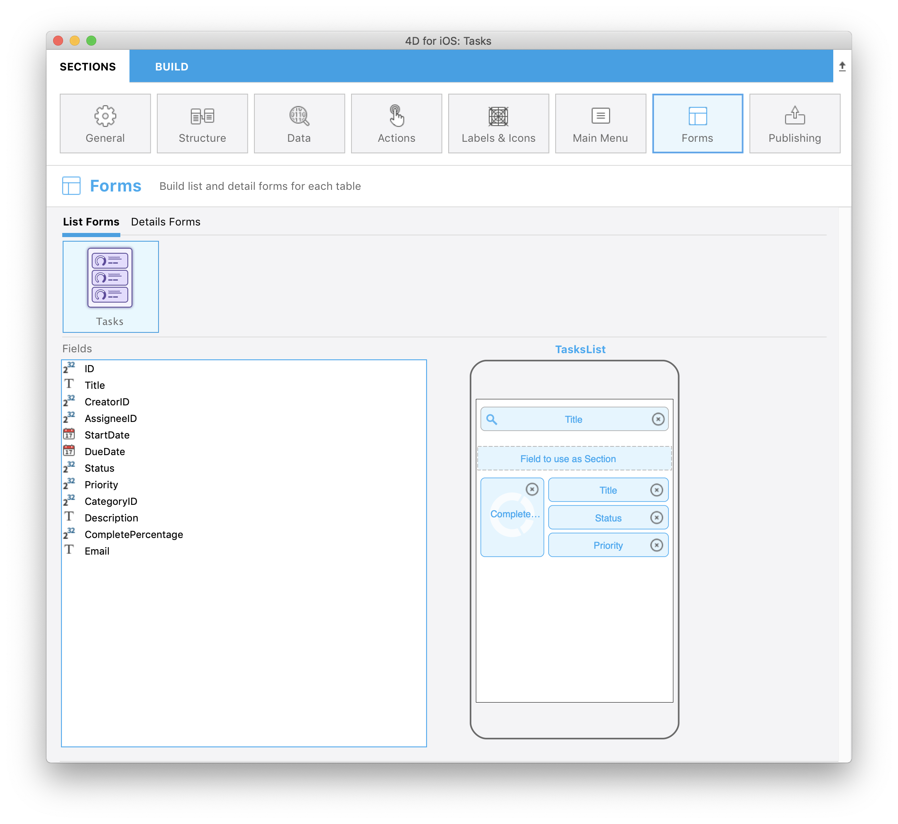
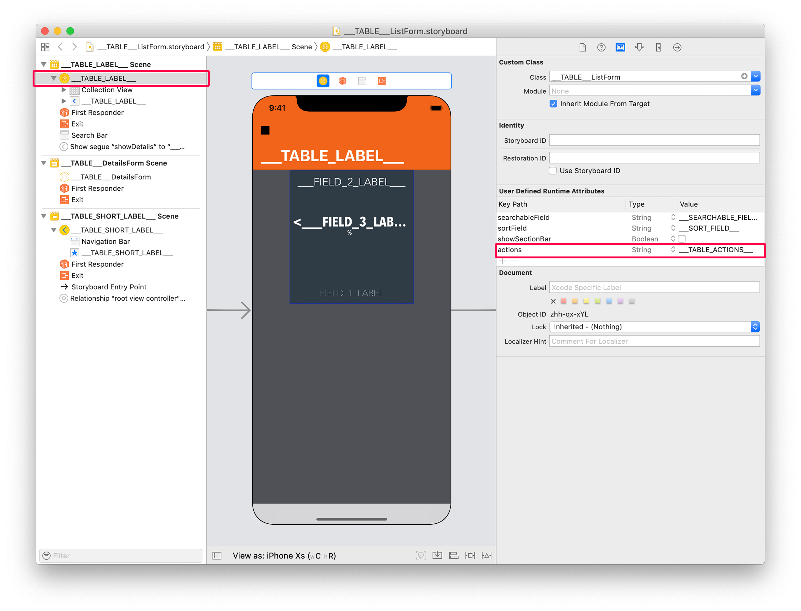
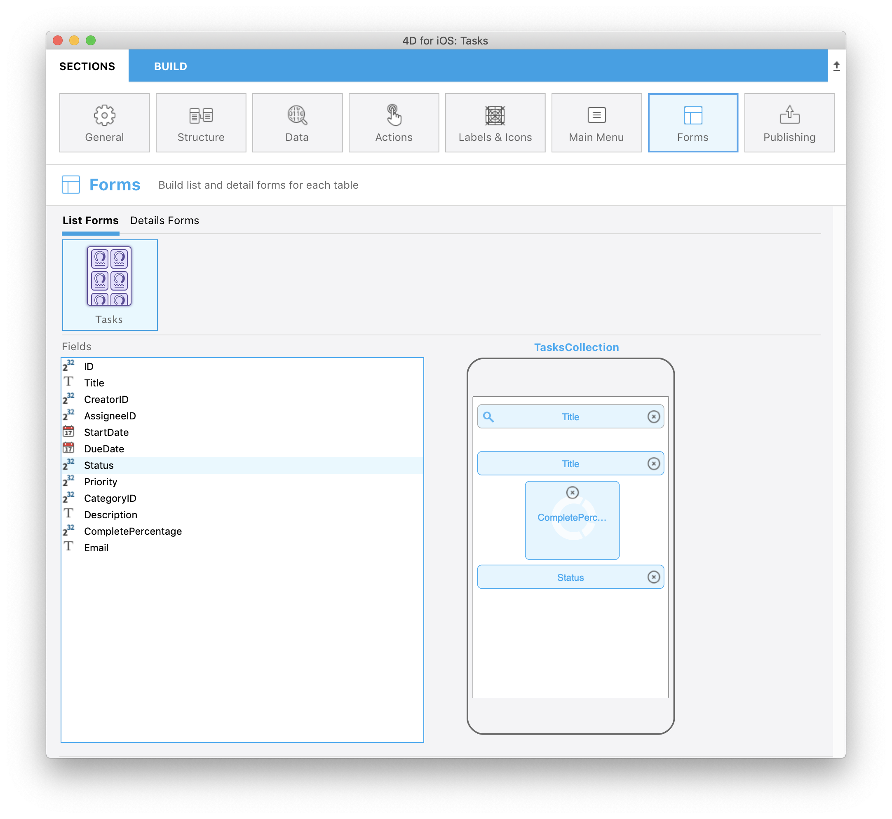

> **OBJECTIVES**
> 
> アクションを追加してリストフォーム/詳細フォームのテンプレートをカスタムします。

> **PREREQUISITES**
> 
> 始めるために必要なものについては`[here](prerequisites.html)`をクリックして下さい!

このチュートリアルでは、どうやって簡単に**カスタムテンプレートにアクションを追加する**かを見ていきます。

## ⒈ ⒈ ⒈ ⒈ スタータープロジェクトをダウンロードする

To begin, download the **Starter project**, which includes:

* リストフォームのカスタムテンプレートが2つ(TasksList および TasksCollection)
* 詳細フォームのカスタムテンプレートが1つ(TasksDetail)
* データベース(Tasks.4dbase)

<a class="button button--primary"
href="https://github.com/4d-go-mobile/tutorial-AddingActionToTemplates/archive/1dc5aecfbea62a9999d571cb1a956f1ef6983111.zip">Download</a>

## ⒉ ⒉ ⒉ ⒉ 4D for iOS プロジェクトにカスタムテンプレートを追加する

以下のドロップを実行してテンプレートをインストールします。

* **TasksList** および **TasksCollection** template フォルダを*Tasks.4dbase/Resources/Mobile/form/list* フォルダにドロップ

* **TasksDetail** template フォルダを *Tasks.4dbase/Resources/Mobile/form/detail folder* にドロップ

## ⒊ ⒊ ⒊ リスト画面にアクションを追加する

2種類のアクションが利用可能です:
* テーブルアクション
* エンティティアクション

まずは最初に `list/TasksList/Sources/Forms/Tables/___TABLE___/___TABLE___ListForm.Storyboard` ファイルを開いてみましょう。

### TasksList カスタムテンプレートにアクションを追加する

#### Ａ Ａ Ａ Ａ テーブルアクションタグを追加する

**List form Controller** を選択し、**User Defined Runtime Attributes** (Identity inspector) に以下の記述を追加します:

* Key Path: `actions`
* Type: `String`
* Value: `___TABLE_ACTIONS___`

#### Ｂ Ｂ Ｂ Ｂ エンティティアクションタグを追加する

Table View を選択し、**User Defined Runtime Attributes** (Identity inspector) に以下の記述を追加します:

* Key Path: `actions`
* Type: `String`
* Value: `___ENTITY_ACTIONS___`

これでカスタムテンプレートがアクション対応になりました！

You can select the TaskList カスタムテンプレートを**フォームセクション** から選択し、以下のフィールドを追加することができます:

続けて TasksCollection カスタムテンプレートにもアクションを追加しましょう。

### TasksCollection カスタムテンプレートにアクションを追加する

まずは`list/TasksCollection/Sources/Forms/Tables/___TABLE___/___TABLE___ListForm.Storyboard` ファイルを開きます。

#### Ａ Ａ Ａ Ａ テーブルアクションタグを追加する

作業は TasksList カスタムテンプレートの場合によく似ています。

**List form Controller** を選択し、**User Defined Runtime Attributes** (Identity inspector) に以下の記述を追加します:

* Key Path: `actions`
* Type: `String`
* Value: `___TABLE_ACTIONS___`

#### Ｂ Ｂ Ｂ Ｂ エンティティアクションタグを追加する

エンティティアクションを表示する方法はリスト形式の TableView とグリッド形式の CollectionViews では異なります。 後者はスワイプ操作に不向きです。

コレクションビューにおいては、扱いたいセルに対して**長押し** ジェスチャーに反応してアクションを表示させるのが良い方法です。

For that, select the collectionView cell and add this line in the **User Defined Runtime Attributes** (Identity inspector):

* Key Path: `actions`
* Type: `String`
* Value: `___ENTITY_ACTIONS___`

To optimize the interaction rendering, you can add a scale effect with a haptic feedback adding the following line in the **User Defined Runtime Attributes** (Identity inspector):

* Key Path: `touch.zoomScale`
* Type: `Number`
* Value: `0,96` (adapt the scale ratio depending on the result you want to get)

You can select the TasksCollection custom template from the **Forms section** and add the following fields:

## ⒋ ⒋ 詳細画面にアクションを追加する

In Detail forms, you can use the **generic button** in the navigation bar or **create easily your own custom action button**. どちらもタグを挿入するだけで追加できます。

For generic button embedded in the navigation bar, select the Controller and add this line in the **User Defined Runtime Attributes** (Identity inspector):

* Key Path: `actions`
* Type: `String`
* Value: `___ENTITY_ACTIONS___`

In our tutorial, we want to build our own generic button. For that, open the `detail/TasksDetail/Sources/Forms/Tables/___TABLE___/___TABLE___DetailsForm.storyboard` file.

Open it, select the button at bottom right and add this line in the **User Defined Runtime Attributes** (Identity inspector):

* Key Path: `actions`
* Type: `String`
* Value: `___ENTITY_ACTIONS___`

画面に「はてなマーク」が表示されていることから明らかなように，このストーリーボードにはボタンの画像が不足しています。 You can actually find those visuals in the  **Resources folder** template. これらのファイルは，ビルドを実行すれば，プロジェクトにコピーされます。

For example for the **moreButton.imageset**:

You can select the TasksDetail custom template from the **Forms section** and add the following fields:

完成したiOSアプリは，リスト画面と詳細画面が両方ともアクション対応になりました！

Download the completed project:

<a className="button button--primary"
href="https://github.com/4d-go-mobile/tutorial-AddingActionToTemplates/releases/latest/download/tutorial-AddingActionToTemplates.zip">Download</a>

