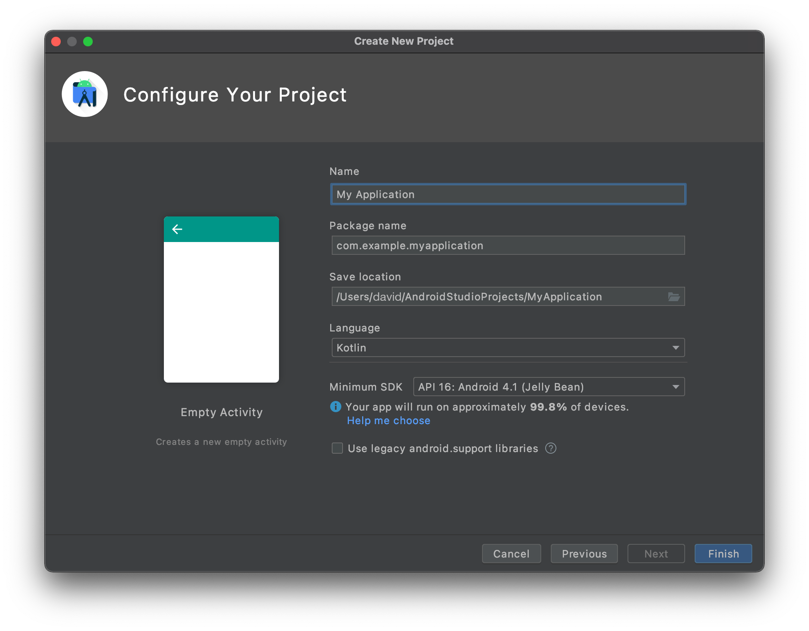

ここでは、Android Studio を使用してカスタム詳細フォームのインターフェースを作成する方法を説明します。

完成イメージ


テンプレートに表示する次のフィールドのレイアウトをデザインします:

* プロフィールのヘッダー画像
* 繰り返されるフィールド

## レイアウトファイルを Android Studio で開く

テンプレートの編集・作成にあたって最適な方法は次のとおりです:

* Android Studio を開き、File > New > New Project... をクリックして、空のモバイルプロジェクトを新規に作成します。

* Empty Activity テンプレートを選択します。


* プロジェクトの設定をおこない、**Finish** をクリックします。



* app > res > layout にある layout.xml ファイルを、Android Studio の新規プロジェクトの layout フォルダーに、altキーを押しながら直接ドロップすることでコピーします。


* 下図のようになっていることを確認してください:


* 右上の **Split** オプションをクリックすると、テンプレートのプレビューと同時に xml コードも表示されます。

ほとんど白紙の状態です。早速、中身を追加しましょう！


## スタータープロジェクトで提供されているもの

ビューをスクロール可能にするため、レイアウトには ScrollView がすでに含まれています:

```xml
    <androidx.core.widget.NestedScrollView
        android:layout_width="match_parent"
        android:layout_height="match_parent"
        android:fillViewport="true">

```

複製される部分:

```xml
 <androidx.cardview.widget.CardView
                android:layout_width="match_parent"
                android:layout_height="wrap_content"
                android:layout_gravity="center"
                android:layout_marginHorizontal="4dp"
                android:layout_marginVertical="2dp"
                card_view:cardCornerRadius="4dp">

                <androidx.constraintlayout.widget.ConstraintLayout
                    android:layout_width="match_parent"
                    android:layout_height="wrap_content">

                    <TextView
                        android:id="@+id/__LABEL_ID__"
                        android:layout_width="0dp"
                        android:layout_height="wrap_content"
                        android:layout_marginStart="8dp"
                        android:layout_marginTop="8dp"
                        android:layout_marginEnd="8dp"
                        android:scrollbars="none"
                        android:text="__LABEL__"
                        android:textAppearance="@style/TextAppearance.MaterialComponents.Body1"
                        android:textColor="?colorPrimary"
                        app:layout_constraintBottom_toTopOf="@+id/__VALUE_ID__"
                        app:layout_constraintEnd_toEndOf="parent"
                        app:layout_constraintStart_toStartOf="parent"
                        app:layout_constraintTop_toTopOf="parent"
                        tools:text="My label" />

                    <!--IF_IS_IMAGE-->
                    <!-- IF THE DROPPED FIELD IS AN IMAGE -->
                    <ImageView
                        android:id="@+id/__VALUE_ID__"
                        android:layout_width="0dp"
                        android:layout_height="wrap_content"
                        android:layout_marginStart="8dp"
                        android:layout_marginTop="8dp"
                        android:layout_marginEnd="8dp"
                        android:layout_marginBottom="8dp"
                        android:contentDescription="Image"
                        app:imageUrl="__IMAGE__"
                        app:layout_constraintBottom_toBottomOf="parent"
                        app:layout_constraintEnd_toEndOf="parent"
                        app:layout_constraintStart_toStartOf="parent"
                        app:layout_constraintTop_toBottomOf="@+id/__LABEL_ID__" />

                    <!--END_IF_IS_IMAGE-->
                    <!--IF_IS_NOT_IMAGE-->
                    <!-- IF THE DROPPED FIELD IS NOT AN IMAGE, THEN IT WILL BE A TEXT VIEW -->

                    <TextView
                        android:id="@+id/__VALUE_ID__"
                        android:layout_width="0dp"
                        android:layout_height="wrap_content"
                        android:layout_marginStart="8dp"
                        android:layout_marginEnd="8dp"
                        android:layout_marginBottom="8dp"
                        android:scrollbars="none"
                        android:text="__TEXT__"
                        android:textAlignment="textStart"
                        android:textAllCaps="false"
                        android:textAppearance="@style/TextAppearance.MaterialComponents.Body2"
                        android:textColor="?colorOnSurface"
                        app:layout_constraintBottom_toBottomOf="parent"
                        app:layout_constraintEnd_toEndOf="parent"
                        app:layout_constraintStart_toStartOf="parent"
                        app:layout_constraintTop_toBottomOf="@+id/__LABEL_ID__"
                        tools:text="My field" />
                    <!--END_IF_IS_NOT_IMAGE-->

                </androidx.constraintlayout.widget.ConstraintLayout>

            </androidx.cardview.widget.CardView>
```


## Image View を追加する

ImageView を見栄えよく表示するため、CardView コンテナを再度使用します。 ImageView の角の丸みをカスタマイズして、デザインに個性を持たせましょう。

```xml
    <androidx.cardview.widget.CardView
                    android:id="@+id/cardview"
                    android:layout_width="match_parent"
                    android:layout_height="300dp"
                    android:layout_gravity="center"
                    android:layout_marginHorizontal="4dp"
                    android:layout_marginVertical="6dp"
                    card_view:cardCornerRadius="12dp"
                    app:layout_constraintEnd_toEndOf="parent"
                    app:layout_constraintStart_toStartOf="parent"
                    app:layout_constraintTop_toTopOf="parent">
                    <ImageView
                        android:id="@+id/__SPECIFIC_ID_1__"
                        android:layout_width="match_parent"
                        android:layout_height="match_parent"
                        android:contentDescription="Image"
                        android:scaleType="centerCrop"
                        app:imageUrl="__IMAGE_1__"
                        app:layout_constraintEnd_toEndOf="parent"
                        app:layout_constraintStart_toStartOf="parent"
                        app:layout_constraintTop_toTopOf="parent"
                        tools:background="@tools:sample/avatars"/>
                </androidx.cardview.widget.CardView>

```

上のとおり、ImageView は CardView に埋め込まれています。 これにより、角の丸みを追加することができます。

`app:imageUrl="__IMAGE_1__"` の行は、先に定義した svgファイルの 1番目の位置にあるピクチャー値をバインドするためのものです。


`tools:background="@tools:sample/avatars"` の行は、単に ImageView のプレースホルダーを表示します。

現時点でのレイアウトのコードの全容は以下の通りです:

```xml
<?xml version="1.0" encoding="utf-8"?>

<layout xmlns:android="http://schemas.android.com/apk/res/android"
    xmlns:app="http://schemas.android.com/apk/res-auto"
    xmlns:card_view="http://schemas.android.com/apk/res-auto"
    xmlns:tools="http://schemas.android.com/tools"
    tools:ignore="DuplicateIds,HardcodedText">

    <data>

        <!--ENTITY_VARIABLE-->
    </data>

    <!-- Generated with detail form template named "Visual Contact" -->

    <androidx.core.widget.NestedScrollView
        android:layout_width="match_parent"
        android:layout_height="match_parent"
        android:fillViewport="true">

        <LinearLayout
            android:layout_width="match_parent"
            android:layout_height="match_parent"
            android:orientation="vertical">

            <!-- START EDITING HERE -->

            <androidx.constraintlayout.widget.ConstraintLayout
                android:layout_width="match_parent"
                android:layout_height="wrap_content">

                <androidx.cardview.widget.CardView
                    android:id="@+id/cardview"
                    android:layout_width="match_parent"
                    android:layout_height="300dp"
                    android:layout_gravity="center"
                    android:layout_marginHorizontal="4dp"
                    android:layout_marginVertical="6dp"
                    card_view:cardCornerRadius="12dp"
                    app:layout_constraintEnd_toEndOf="parent"
                    app:layout_constraintStart_toStartOf="parent"
                    app:layout_constraintTop_toTopOf="parent">

                    <ImageView
                        android:id="@+id/__SPECIFIC_ID_1__"
                        android:layout_width="match_parent"
                        android:layout_height="match_parent"
                        android:contentDescription="Image"
                        android:scaleType="centerCrop"
                        app:imageUrl="__IMAGE_1__"
                        app:layout_constraintEnd_toEndOf="parent"
                        app:layout_constraintStart_toStartOf="parent"
                        app:layout_constraintTop_toTopOf="parent"
                        tools:background="@tools:sample/avatars"/>
                </androidx.cardview.widget.CardView>


            </androidx.constraintlayout.widget.ConstraintLayout>

            <!--
            THE FOLLOWING PART WILL BE DUPLICATED CARD VIEWS FOR EVERY FIELD
            YOU DROP AT THE BOTTOM OF THE TEMPLATE
            -->

            <!--FOR_EACH_FIELD-->
            <!-- EVERYTHING BELOW WILL BE DUPLICATED FOR EACH FIELD YOU DROP AT THE BOTTOM OF THE
                 TEMPLATE IN THE PROJECT EDITOR -->
            <androidx.cardview.widget.CardView
                android:layout_width="match_parent"
                android:layout_height="wrap_content"
                android:layout_gravity="center"
                android:layout_marginHorizontal="4dp"
                android:layout_marginVertical="2dp"
                card_view:cardCornerRadius="4dp">

                <androidx.constraintlayout.widget.ConstraintLayout
                    android:layout_width="match_parent"
                    android:layout_height="wrap_content">

                    <TextView
                        android:id="@+id/__LABEL_ID__"
                        android:layout_width="0dp"
                        android:layout_height="wrap_content"
                        android:layout_marginStart="8dp"
                        android:layout_marginTop="8dp"
                        android:layout_marginEnd="8dp"
                        android:scrollbars="none"
                        android:text="__LABEL__"
                        android:textAppearance="@style/TextAppearance.MaterialComponents.Body1"
                        android:textColor="?colorPrimary"
                        app:layout_constraintBottom_toTopOf="@+id/__VALUE_ID__"
                        app:layout_constraintEnd_toEndOf="parent"
                        app:layout_constraintStart_toStartOf="parent"
                        app:layout_constraintTop_toTopOf="parent"
                        tools:text="My label" />

                    <!--IF_IS_IMAGE-->
                    <!-- IF THE DROPPED FIELD IS AN IMAGE -->
                    <ImageView
                        android:id="@+id/__VALUE_ID__"
                        android:layout_width="0dp"
                        android:layout_height="wrap_content"
                        android:layout_marginStart="8dp"
                        android:layout_marginTop="8dp"
                        android:layout_marginEnd="8dp"
                        android:layout_marginBottom="8dp"
                        android:contentDescription="Image"
                        app:imageUrl="__IMAGE__"
                        app:layout_constraintBottom_toBottomOf="parent"
                        app:layout_constraintEnd_toEndOf="parent"
                        app:layout_constraintStart_toStartOf="parent"
                        app:layout_constraintTop_toBottomOf="@+id/__LABEL_ID__" />
                    <!--END_IF_IS_IMAGE-->
                    <!--IF_IS_NOT_IMAGE-->
                    <!-- IF THE DROPPED FIELD IS NOT AN IMAGE, THEN IT WILL BE A TEXT VIEW -->

                    <TextView
                        android:id="@+id/__VALUE_ID__"
                        android:layout_width="0dp"
                        android:layout_height="wrap_content"
                        android:layout_marginStart="8dp"
                        android:layout_marginEnd="8dp"
                        android:layout_marginBottom="8dp"
                        android:scrollbars="none"
                        android:text="__TEXT__"
                        android:textAlignment="textStart"
                        android:textAllCaps="false"
                        android:textAppearance="@style/TextAppearance.MaterialComponents.Body2"
                        android:textColor="?colorOnSurface"
                        app:layout_constraintBottom_toBottomOf="parent"
                        app:layout_constraintEnd_toEndOf="parent"
                        app:layout_constraintStart_toStartOf="parent"
                        app:layout_constraintTop_toBottomOf="@+id/__LABEL_ID__"
                        tools:text="My field" />
                    <!--END_IF_IS_NOT_IMAGE-->

                </androidx.constraintlayout.widget.ConstraintLayout>

            </androidx.cardview.widget.CardView>

            <!--END_FOR_EACH_FIELD-->

        </LinearLayout>

    </androidx.core.widget.NestedScrollView>

</layout>

```

## セルとフィールドを関連付ける

### Image View

詳細フォームのテンプレートでは、`app:imageUrl="__IMAGE_1__"` を使用しました。

ここでは、ImageView が svg の最初のビューであり、そのビューID が `__SPECIFIC_ID_1__` であると仮定しています。 3番目のビューであれば、`__IMAGE_3__` 、対応するビューID は `__SPECIFIC_ID_3__` となります。


## これからどうする？

このチュートリアルでは、詳細フォームのカスタムテンプレートを作成する方法を紹介しました。 スタータープロジェクトを参考に、シンプルなカスタムテンプレートが簡単に自作できる、という手応えが得られたのではないでしょうか。 完成したテンプレート入りプロジェクト:

<div className="center-button">
<a className="button button--primary"
href="https://github.com/4d-go-mobile/tutorial-CustomDetailForm/releases/latest/download/tutorial-CustomDetailForm.zip">ダウンロード</a>
</div>


