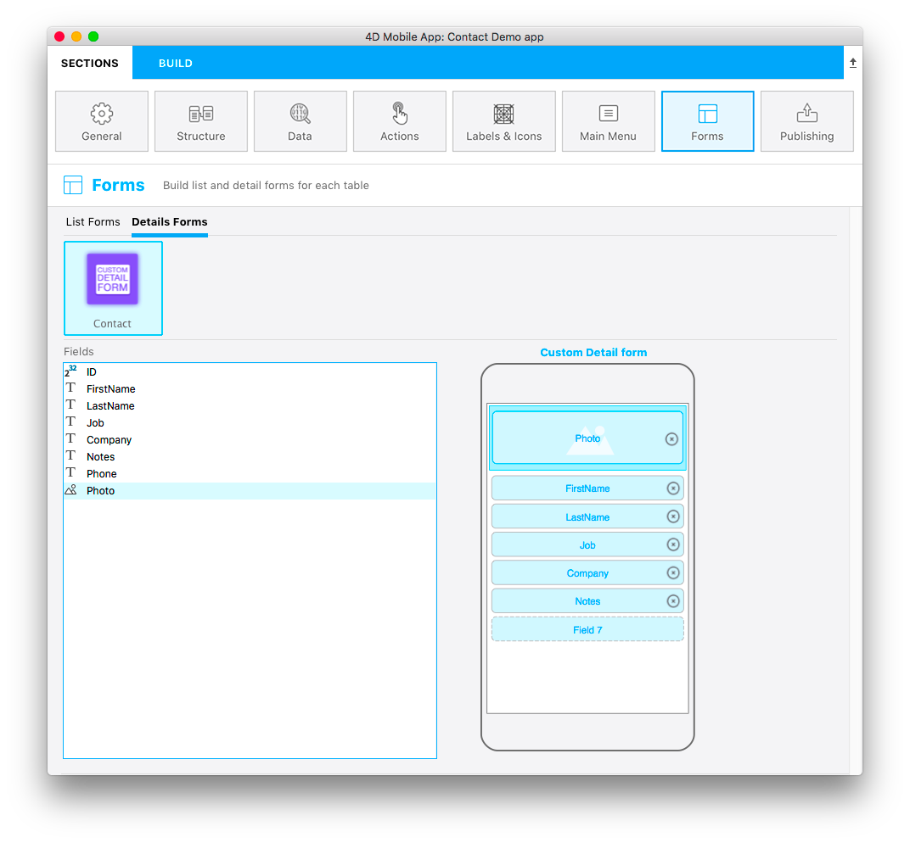

`template.svg` は、テンプレートのレイアウトを視覚的に表現するためのファイルです。 プロジェクトエディターで詳細フォームのテンプレートにフィールドが追加できるように、ドラッグ＆ドロップ用のエリアを定義しておきます。

図は完成したファイルのイメージです。


フィールド数は可変になっています。これはつまり、1つの **ピクチャー** と **無限のフィールド** が追加できるということです。 フォームセクションの詳細画面エディターでは、最後にドラッグ＆ドロップしたフィールドの下に空白のフィールドが現れるようになっているので、フィールドをさらに追加することができます:



```

```

この svgファイルの各部分の役割とカスタマイズできる箇所を見ていきましょう。

## タイトル

```xml
<title>Custom Detail form</title>
```

テンプレートの名称をここに指定します。

## エリアの位置・サイズ・タイプ
すべてのフィールドの位置とサイズが指定できます。 この手順は、[カスタムリストフォーム](../creating-list-forms/list-form-svg-file.md#エリアの位置-サイズ) と同じです。

### フィールドプロパティ

```xml
//1
<g id="f" visibility="hidden" ios:dy="35">

//2
<rect class="bg field" x="14" y="0" width="238" height="30"/>

//3
<textArea id="f.label" class="label" x="14" y="8" width="238">field[n]</textArea>

//4
<rect id="f" class="droppable field multivalued" x="14" y="0" width="238" height="30" stroke-dasharray="5,2" ios:type="0,1,2,4,8,9,11,25,35"/>

//5
<use id="f.cancel" x="224" y="1" xlink:href="#cancel" visibility="hidden"/>
</g>
```

1. エリア全体の垂直位置 (g 要素)
2. エリアの背景位置とサイズ (rect 要素)
3. 入力エリアの位置とサイズ (textArea 要素)
4. フィールドをドロップできるエリアの位置とサイズ、およびドロップ可能な [**フィールドタイプ**](../creating-list-forms/list-form-svg-file.md#iostypes) (rect 要素)。この例ではすべてのタイプがドロップ可能です)
5. 内容をクリアするためのキャンセルボタン (use 要素)

### ピクチャーフィールド

```xml
//1
<g transform="translate(0,60)">

//2
<rect class="bg field" x="15" y="0" width="236" height="65"/>

//3
<path class="picture" transform="translate(10 0) scale(6)"/>

//4
<textArea id="f1.label" class="label" x="15" y="25" width="236">$4DEVAL(:C991("picture"))</textArea>

//5
<rect id="f1" class="droppable field" x="15" y="0" width="236" height="65" stroke-dasharray="5,2" ios:type="3" ios:bind="fields[0]"/>

//6
<use id="f1.cancel" x="222" y="20" xlink:href="#cancel" visibility="hidden"/>
</g>
```

1. エリア全体の垂直位置 (g 要素)
2. エリアの背景位置とサイズ (rect 要素)
3. ピクチャーエリアに表示されるアイコン画像 (path 要素)
4. 入力エリアの位置とサイズ (textArea 要素)
5. フィールドをドロップできるエリアの位置とサイズ、およびドロップ可能な [**フィールドタイプ**](../creating-list-forms/list-form-svg-file.md#iostypes) (rect 要素)
6. 内容をクリアするためのキャンセルボタン (use 要素)

Now that you have an **icon**, a **basic template description** in the manifest.json file, and your **svg file**, let's move on to the fun part with Xcode!


:::tip

To make field type definition easier, 4D for iOS allows you to include field types with **positive values** and also exclude field types with **negative values**. For example, `ios:type="-3,-4"` will allow you to drag and drop every field except images and dates. To include all types, just type `ios:type="all"`.

:::
