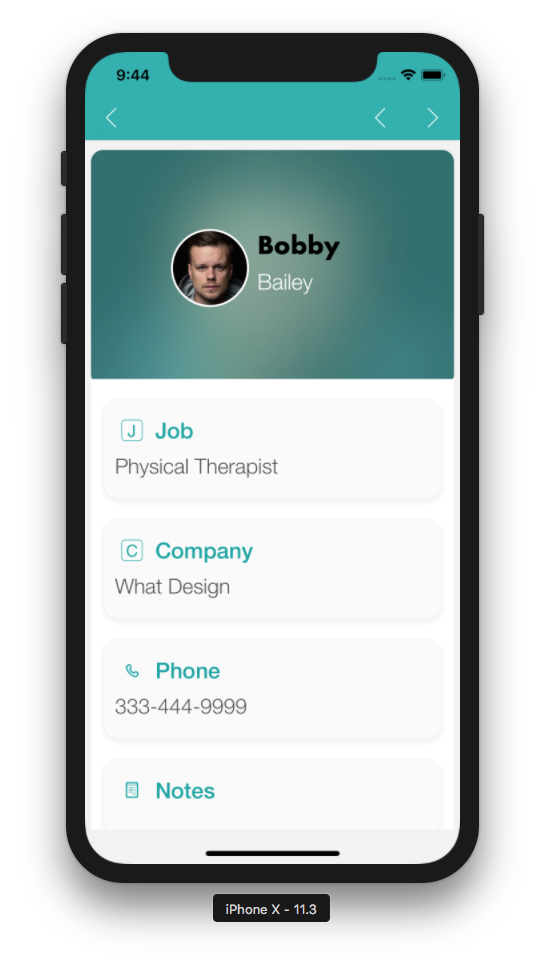
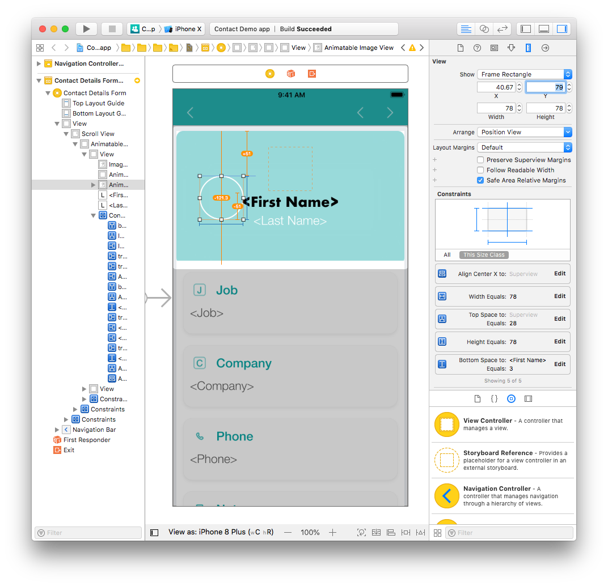
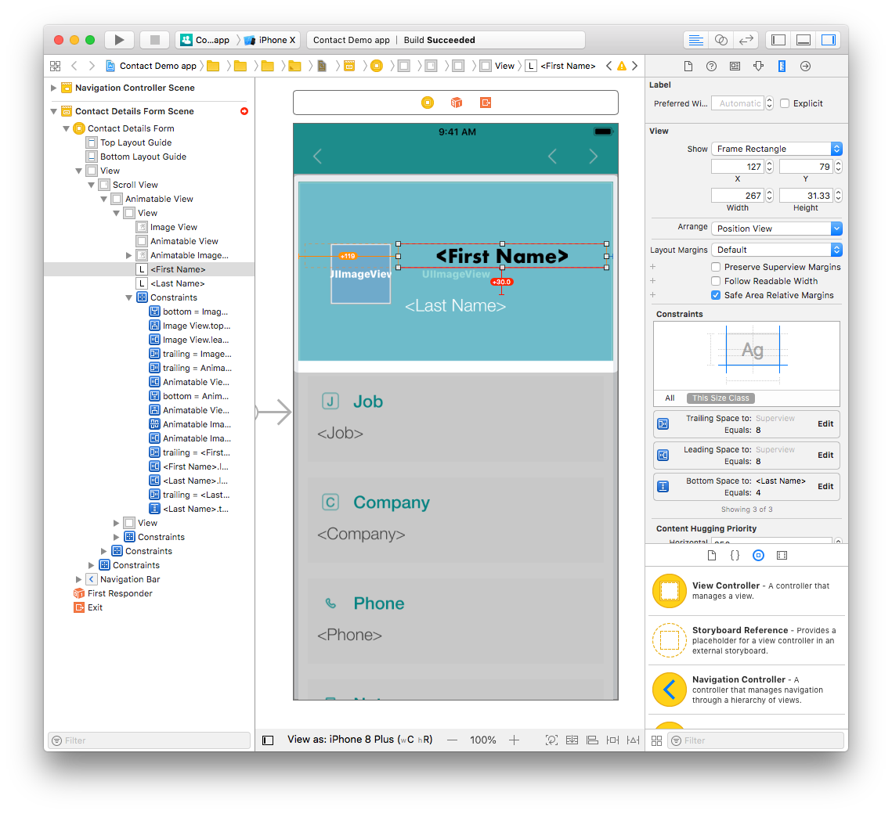
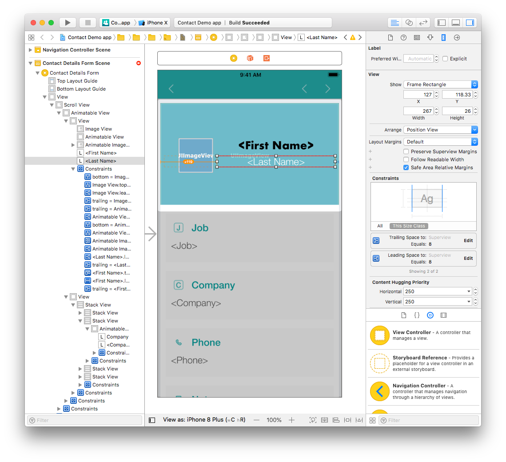
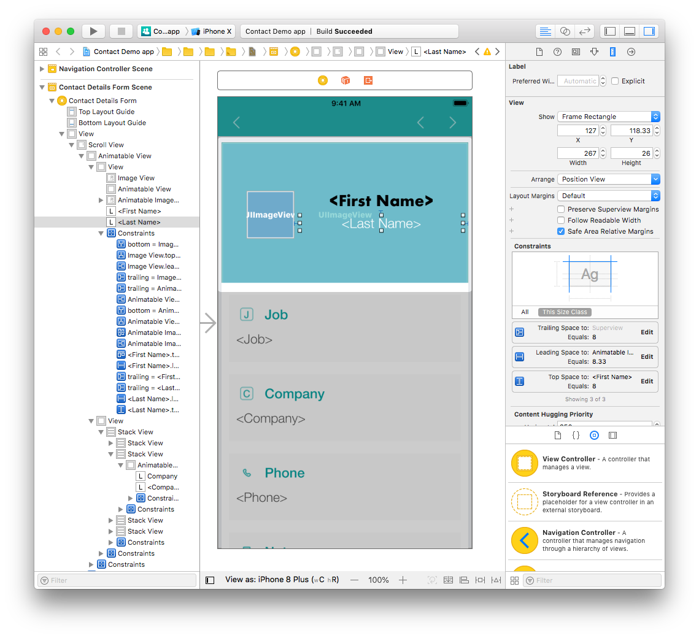
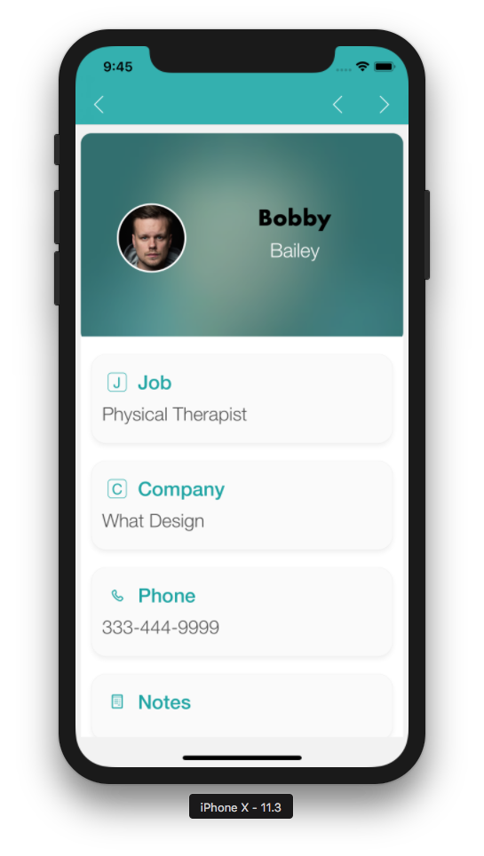

簡単なものから複雑なものまで、ストーリーボードにさまざまな変更を加えてみましょう。

## ⒈ 簡単なラベル変更

まず、ラベルのフォントとカラーを変更するところから始めます:

* Navigation tab から *ContactDetailsForm.storyboard* ファイルを開きます。
* First Name ラベルをクリックします (インターフェースビルダーまたは左ペインからも選択可能です)。
* ユーティリティーエリアで Attribute inspector ペインを選択します。

* フォントを Helvetica Neue Bold から Futura Bold に変更します。

* また、フォントカラーも同じペインで変更できます。

## ⒉ プロフィール画像の位置を変更する

4D for iOS テンプレートは、すべてのデバイスでアプリ要素がうまく表示されるように制約を使用しています。

*ContactDetailsForm.storyboard* ファイルでは、画像・ファーストネーム・ラストネームのラベルがすべて中央揃えになっています。

これが下のように表示されるよう、変更してみましょう:

まず、画像を縦に配置し、ファーストネームとラストネームのラベルを画像の右側にドラッグします。

次に画像を選択し、ユーティリティーエリアから Size inspector ペインを開きます。 X 座標を 161.67 から 40.67 に、Y 座標を 28 から 79 に変更します。

ご覧のように位置は変わりましたが、Xcode には黄色い線が表示されています...なぜでしょう？ この黄色い線は、もはや有効でない制約を表しています。

## ⒊ プロフィール画像の制約を修正する

To vertically align the picture in the center in the Superview (the view which contains it), we need to delete the existing constraints and add new ones.

The image currently has the following constraints:

* Width Equals: A width of 78 pixels.
* Height Equals: A height of 78 pixels.
* Align Center X: Centers the image on a previously defined horizontal axis.
* Top Space: An amount of space from the top of the image to the top of the view.
* Bottom space to `<First Name>`: The previously defined space between the First Name label and the image.

Delete all of the constraints except Width and Height (you'll modify these later from the Size inspector in the Constraints section). The picture outline should be now in red because the constraints are missing.

Click on the Align button (at the bottom of the Interface Builder window) and check the **Vertically in Container** checkbox.

Next, click on the **Add New Constraints** button and add a leading space constraint (the left constraint).

At this point, all the profile picture constraints should be blue.

おつかれさまでした！ Your profile picture is now well positioned with the correct constraints.

> **TIPS**
> 
> * To create a constraint between two views, press Ctrl and drag one of the views to the other. マウスボタンを離すと同時に、このコンテキストで設定可能な制約の選択肢が表示されます。
> 
> * You can delete constraints by either selecting them from the Size inspector or from the Interface Builder.

## ⒋ ラベルの位置と制約を修正する

#### Now, let's work on the First Name label.

We'll begin by changing the position and width:

* Select the First Name label from the Interface Builder.
* Next, change the Width from 386 to 267 pixels.
* Change the X value from 8 to 127 pixels and the Y value from 28 to 79 pixels.

Modify the remaining constraints:

* Delete the leading and the bottom space constraints from the Size inspector.
* Add a leading space constraint by clicking on the **Add New Constraints** button to position the First Name label to the right of the Profile picture.
* Press Ctrl and drag the First Name label to the Profile picture. Select the top constraint in the menu to top align both elements.

#### Finally, we'll work on the Last Name label.

Change the position and width:

* Select the Last Name label from the Interface Builder.
* Change the width from 386 to 267 pixels.
* Change the X value from 8 to 127 pixels and the Y value from 144.33 to 118.33 pixels.

Modify the remaining constraints:

* Delete the leading space constraints from the Size inspector.
* Add a leading space and top space constraints by clicking on the Add New Constraints button.

Both of your name labels are now repostioned.

Let's see the results in the Simulator !

Hmmmm. That's not exactly the result we wanted ...

* Select the First Name and Last Name labels and change the alignment from center to left in the Attributes inspector.

* Next, select the Profile picture and double click on the leading space constraint.
* Change the Constant value from 40.67 to 80 pixels.

Much better! Now all constraints are working and the labels aren't breaking other constraints.

As you can see, customizing your app is very simple!
