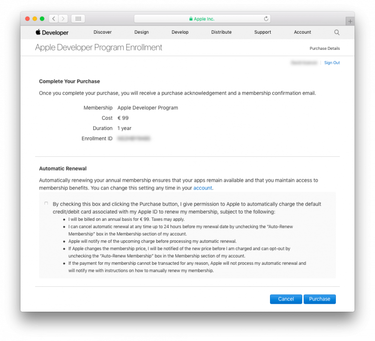

> **OBJECTIVES**
> 
> Register for the Apple Developer Program as an organization to publish your app to the **App Store**.

> **NOTE**
> 
> To enroll in the Apple Developer Program as an organization, your Apple ID must be associated with an email address using your organization’s domain name.

## ⒈ ⒈ Apple IDが作成できました。

If you don’t have an Apple ID go to [Step 2](#step-2-create-your-apple-id).

If you already have an Apple ID, go to [Step 3](#step-3-d-u-n-s-number).

## ⒉ ⒉ ⒉ Apple IDを作成する

[Apple ID作成ページ](https://appleid.apple.com/)にアクセスします。

* 必要な情報をフォームに入力し，セキュリティの質問に答えます。
* Appleから確認メールが送られます。
* メールに記載されている確認コードを入力して，アカウントの作成を完了します。

* ⒉ Apple IDを作成する

## ⒊ ⒊ ⒊ ⒊ D-U-N-S Number

* If you don’t have a D-U-N-S Number, go to [Step 4](#step-4-request-a-d-u-n-s-number).
* If you already have a D-U-N-S Number, go to [Step 5](#step-5-register-as-a-developer).

## ⒋ ⒋ ⒋ ⒋ Request a D-U-N-S Number

Request a D-U-N-S Number [here](https://developer.apple.com/enroll/duns-lookup/#/search)

* Complete the form.
* **続ける** をクリックします。
* Check your email for the D-U-N-S Number.

## ⒌ ⒌ ⒌ ⒌ Register as a developer

You can register as a developer [here](https://developer.apple.com/programs/enterprise/enroll/).

* Click on the **Start your Enrollment** button.
* Read and accept the Apple Developer Agreement.
* Click **Submit**.

## ⒍ ⒋ ⒋ ⒋ Join the Apple Developer Program

* You can sign up for the Apple Developer Program [here](https://developer.apple.com/enroll/enterprise/).

## ⒎ ⒎ ⒎ Enroll as an organization

* Click on the **Start your Enrollment** button.
* Select **Company / Organization** from the Entity Type dropdown list.
* **続ける** をクリックします。

* Complete the form.
* **続ける** をクリックします。

* Apple has an internal verification process that usually takes up to six working days. Once Apple receives the enrollment request, they verify that you have the authority to bind your organization to the Apple Developer Program's legal agreements.
* Apple generally calls to verify that the main contact exists and has requested the Apple Developer Enterprise Program registration.
* You'll then receive another email inviting you to complete the enrollment process.

## ⒏ ⒏ ⒏ ⒏ Complete your purchase

* Once your enrollment request has been accepted, you can then proceed to payment.

* When you have completed your purchase, you'll receive an email confirming your membership in the program.

おつかれさまでした！ You are now ready to publish applications to the App Store!