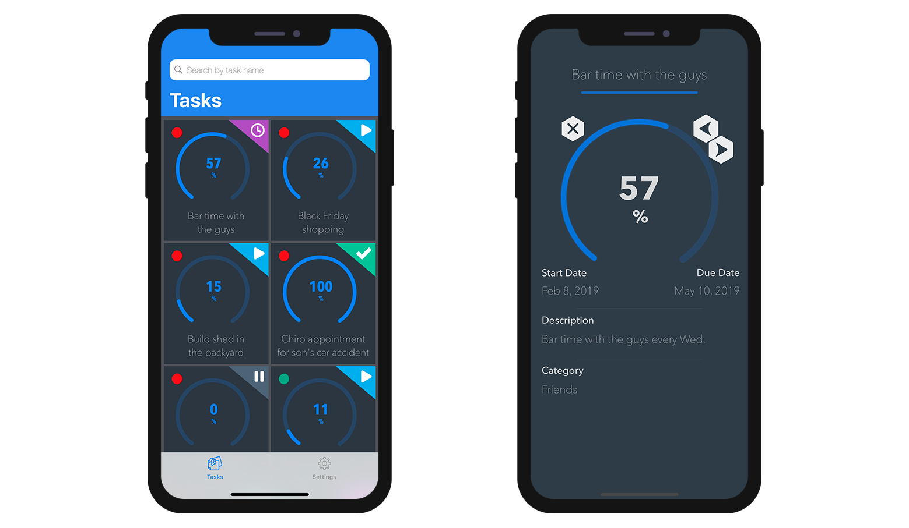

This tutorial will show you how easy it can be to include Many to one relations in your mobile projects.

:::note

In this tutorial, we will use the relation names between your tables. Giving descriptive relation names can make your project structure definition easier.

:::

Let's get started by downloading the Starter project:

<a className="button button--primary" href="https://github.com/4d-go-mobile/tutorial-ManyToOneRelations/releases/latest/download/tutorial-ManyToOneRelations.zip">スタータープロジェクト</a>

Here we want to display the category for each task in the detail form of your generated app. To do so, open the **StarteriOSProject** from **Open > Mobile Project...**

Then go right to your Structure section and select the **Task table**.

### ストラクチャセクション

* You can notice that the **TaskCategory relation** is underlined

* リレーション名をクリックすると，リンク先のフィールドが表示されます。

* Select the **Name field**

* 以降の画面では，リレートの１フィールドを他のフィールドと同じように扱うことができます。

* You can also filter your app content using related fields from the Data section. To do so enter `TaskCategory.Name != 'Personal'` in the Filter query field to exclude personal tasks.

 

* You can then select an **icon** as well as **formatters** and define **short and long labels** from the Labels and Icons section

* 「フォーム」セクションでは，詳細フォームに１フィールドをドラッグ＆ドロップします。

* ビルドして実行

You should see your related field in your app detail form !

