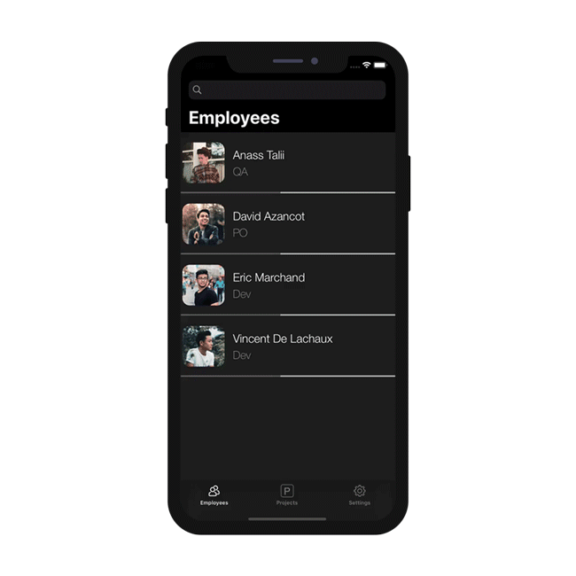
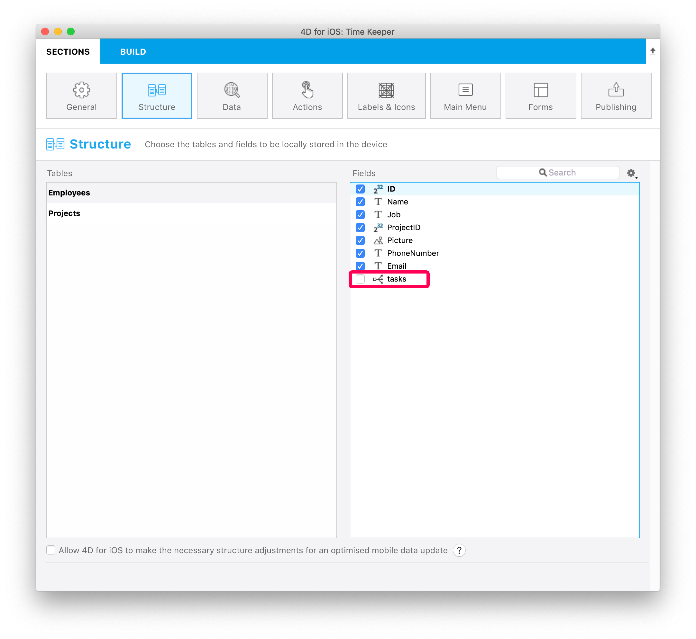
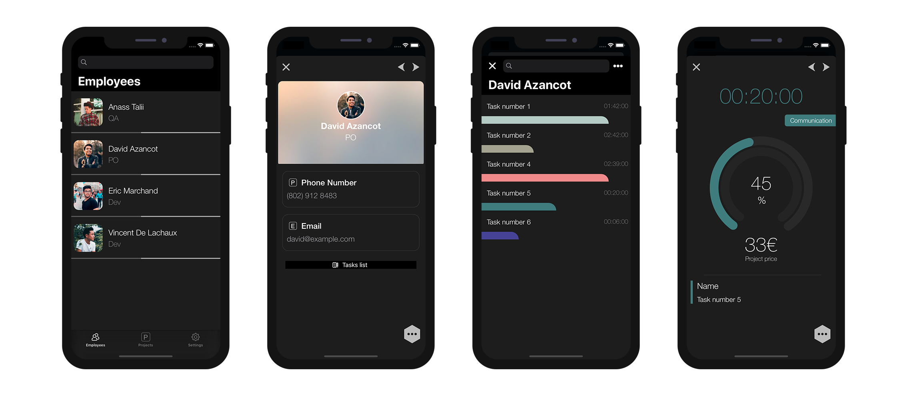

このチュートリアルでは、モバイルプロジェクトで 1対Nリレーションを使用する方法を見ていきます。

スタータープロジェクトをダウンロードしてください:

<a className="button button--primary"
href="https://github.com/4d-go-mobile/tutorial-OneToManyRelations/archive/c006015afeb0e134d872152f53b8cd5e4dcb59bb.zip">スタータープロジェクト</a>

このチュートリアルでは、カラフルな **Time Keeper アプリ** を 4D for iOS で作成します。

はじめに、データベースのストラクチャーを確認しましょう:

従業員 (**1** テーブル) からプロジェクト (**N** テーブル) に対し、**tasks** という名前のリレーションが張られていることに注目してください。

ファイルメニューの開く ＞ モバイルプロジェクト... を選択し、*Time Keeper* プロジェクトを開いて **ストラクチャー** セクションに移動します。

## ストラクチャーセクション

Employees テーブルのフィールドリストに **tasks** リレーションが表示されているはずです。 これにチェックを入れて、公開しましょう！

以後、このリレートフィールドは、通常のフィールドと同じように扱えるようになります。

:::tip

リレーション名にマウスポインターを重ねると、ヘルプTips にテーブル名が表示されます。

:::

## ラベル & アイコンセクション

**ラベル＆アイコン** セクションに 1対Nリレーションが表示されました。

1対Nリレーションを使用すると、作成される iOSアプリの画面にボタンが追加されることに留意してください。

ラベル＆アイコンセクションでは以下のものを設定します:

* ボタンタイトル
* ボタンアイコン
* 遷移先の画面に表示されるタイトル (たとえば、移動元を示すために使用します)。

## フォームセクション

* フォームセクションに移動して、Employee テーブルの詳細フォームに *tasks* リレーションをドラッグ＆ドロップします。

## ビルドして実行

1. Employee のリスト画面で適当な従業員をクリックします。
2. 従業員の情報が詳細画面に表示され、**1対Nリレーション** のボタンも表示されているはずです。
3. このボタンをクリックすると、選択されている従業員のタスクが表示されます。

以上です！ モバイルプロジェクトに 1対Nリレーションを組み込むことに成功しました。

完成したプロジェクトをダウンロード

<a className="button button--primary"
href="https://github.com/4d-go-mobile/tutorial-OneToManyRelations/releases/latest/download/tutorial-OneToManyRelations.zip">ダウンロード</a>

