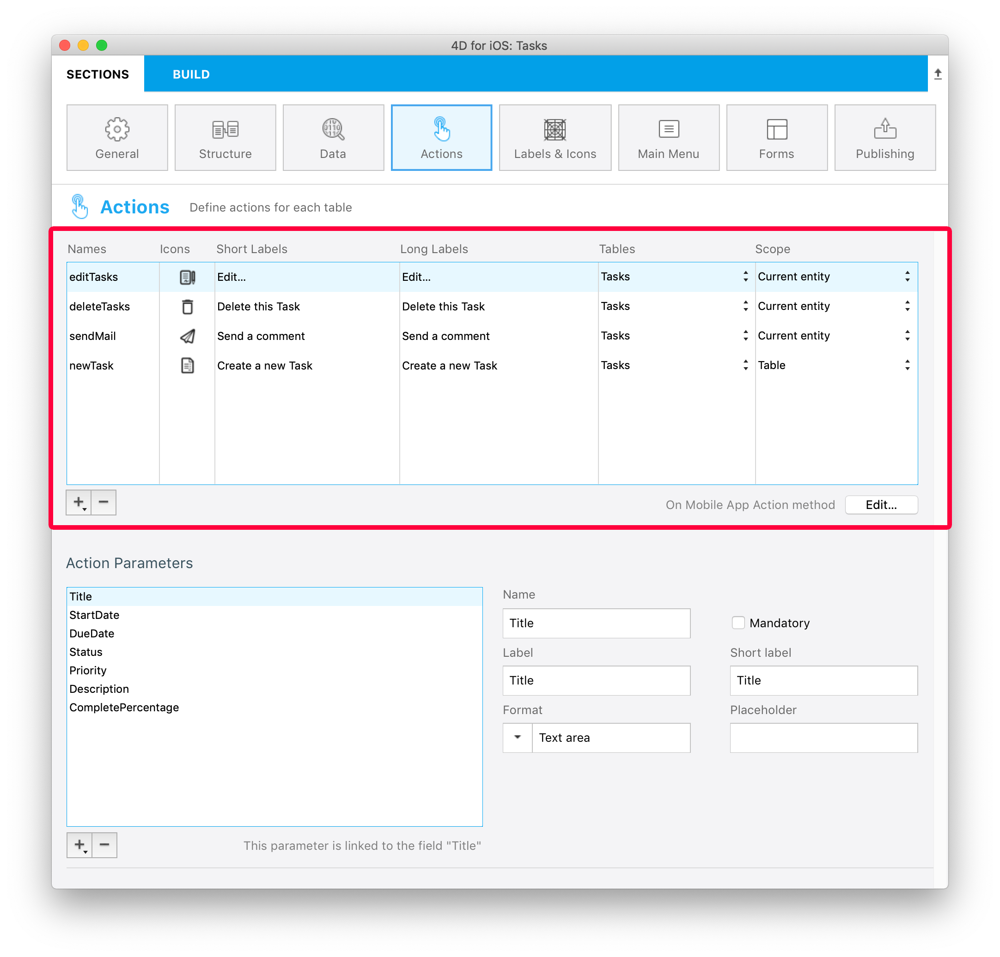
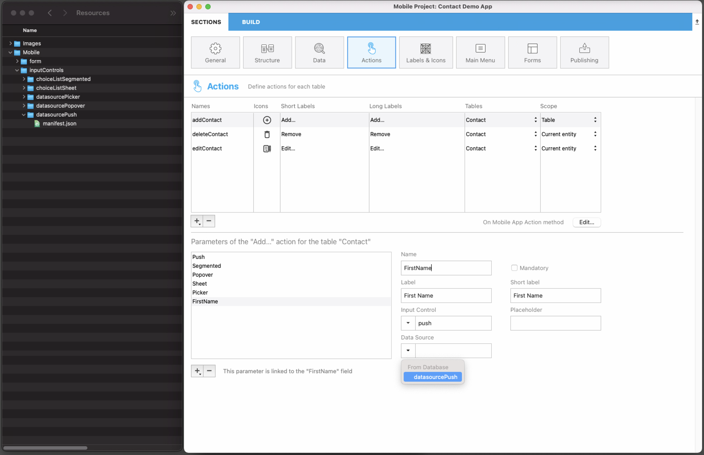

このセクションでは以下のような内容を取り扱います:

* iOSアプリから 4Dコードを実行するアクションの作成
* アクションに渡す引数の定義と追加

:::4D for Androidにおける注意

このセクションで触れている内容は4D for Android では現在ご利用いただけません。

:::

## プロジェクトエディター側の設定

### アクションを作成する

新しいアクションを作成するには、アクションテーブルの下部にある + ボタンをクリックします。 すると、アクションテーブルに新しい行が追加されます。

次に、以下のものを定義する必要があります:

* **名前:** [On Mobile App Action](#on-mobile-app-action) データベースメソッド内で 4Dコードをトリガーするのに使用するアクションの名前
* **アイコン:** アイコンライブラリーから選択するアイコン。 またこちらの [チュートリアル]`(using-icons.html)` を参考に、独自のアイコンを追加することもできます。
* **短いラベルとラベル:** アプリに表示するアクションのラベル
* **テーブル:** アクションを適用するテーブル
* **スコープ:** アクションの定期用対象: **カレントエンティティ** または **テーブル**



### アクションに引数を追加

**アクション引数** を追加することで、アプリからデータを直接 **編集** することができます。

それぞれの引数について、以下のプロパティを設定することができます:

* 名前
* (長い) ラベル
* 短いラベル
* フォーマット
* 入力制限 (最小値または最大値の定義)
* プレースホルダー
* 必須フィールド定義
* デフォルト値


引数の順番はドラッグ＆ドロップで自由に変えられます。

引数に対して選択できる **フォーマット** の種類は以下の通りです:

<table>

<tr>
<th colspan="2"  style={{textAlign: 'center'}}>テキスト</th>
</tr><tr style={{textAlign: 'center'}}>
<th>フォーマット</th><th>詳細</th>
</tr><tr>
<td>テキスト</td><td>文字列の頭文字を大文字にします。</td>
</tr><tr>
<td>メールアドレス</td><td>メールアドレス入力用に最適化された iOSキーボード</td>
</tr><tr>
<td>電話番号</td><td>電話番号入力用の iOSキーパッド</td>
</tr><tr>
<td>アカウント</td><td>ユーザー名入力用に最適化された iOSキーボード</td>
</tr><tr>
<td>パスワード</td><td>パスワードの管理に最適化されています。</td>
</tr><tr>
<td>URL</td><td>URL入力に最適化された iOSキーボード</td>
</tr><tr>
<td>郵便番号</td><td>郵便番号入力に最適化された iOSキーボード</td>
</tr><tr>
<td>テキストエリア</td><td>単一フィールド内に複数行のテキストを格納できます。</td>
</tr><tr>
<td>バーコード</td><td>バーコードに割り当てられた値を取り出します。 サポートされてるフォーマット: EAN8、EAN13、Code 39、Code 93、Code 128、QRコード、UPC、PDF417</td>
</tr>
<tr>
<td colspan="2"></td>
</tr>

<tr>
<th colspan="2" style={{textAlign: 'center'}}>数値</th>
</tr><tr style={{textAlign: 'center'}}>
<th>フォーマット</th><th>詳細</th>
</tr><tr>
<td>数値</td><td>小数点付き数値</td>
</tr><tr>
<td>整数</td><td>小数点のつかない数値</td>
</tr><tr>
<td>指数</td><td>指数表記</td>
</tr><tr>
<td>パーセント</td><td>パーセント表記</td>
</tr><tr>
<td>読み方</td><td>数値を文字列へと変換</td>
</tr>
<tr>
<td colspan="2"></td>
</tr>

<tr>
<th colspan="2" style={{textAlign: 'center'}}>日付</th>
</tr><tr style={{textAlign: 'center'}}>
<th>フォーマット</th><th>詳細</th>
</tr><tr>
<td>日付</td><td>Nov 23, 1937</td>
</tr><tr>
<td>短い日付</td><td> 11/23/37</td>
</tr><tr>
<td>長い日付</td><td>November 23, 1937</td>
</tr><tr>
<td>完全な日付</td><td>Tuesday, November 23, 1937</td>
</tr><tr>
<td colspan="2"></td>
</tr>

<tr>
<th colspan="2" style={{textAlign: 'center'}}>時間</th>
</tr><tr style={{textAlign: 'center'}}>
<th>フォーマット</th><th>詳細</th>
</tr><tr>
<td>時間</td><td>3:30 PM</td>
</tr><tr>
<td>経過時間</td><td>2 hours 30 minutes</td>
</tr>
<tr>
<td colspan="2"></td>
</tr>

<tr>
<th colspan="2" style={{textAlign: 'center'}}>ブール</th>
</tr><tr style={{textAlign: 'center'}}>
<th>フォーマット</th><th>詳細</th>
</tr><tr>
<td>ブール</td><td></td>
</tr><tr>
<td>チェックマーク</td><td></td>
</tr>

<tr>
<td colspan="2"></td>
</tr>
<tr>
<th colspan="2" style={{textAlign: 'center'}}>画像</th>
</tr>
<tr>
<td>署名</td><td>手書き文字での署名が可能に</td>
</tr>

</table>

## プリセットアクション

4Dモバイルプロジェクトには、アプリのコンテンツを管理するための、以下のプリセット (定義済み) アクションが含まれています:

* 編集
* 追加
* 削除
* 共有
* ソート

### 追加アクション

4Dモバイルプロジェクトで **追加アクション** を作成するのは簡単です。

まず、アクションテーブルの下にある **+ ボタン** をクリックすると表示される **追加アクション** オプションを選択します。


次に、その追加アクションをリンクする **テーブルを選択** するだけです。

これによって、プロジェクトエディター内に必要な引数がすべて **自動的に作成** されます。 生成されたアプリ内では、各フィールド値の編集ができるようになります。

この種のアクションの場合、引数リストの右側にある **プロパティ** は自動で設定済みです。


### 編集アクション

**編集アクション** の作成手順は追加アクションと同じですが、引数のデフォルト値が定義できない点が異なります。


### 削除アクション

**削除アクション** の作成手順は編集アクションと同じです。 唯一の違いは、このアクションを使用するとエンティティを削除できるという点です。

削除アクションを作成するには、アクションテーブルの下にある **+ ボタン** をクリックすると表示される **削除アクション** オプションを選択します。

この種のアクションは使用の際に注意が必要です。


### 共有アクション

**共有アクション** を選択すると、モバイルアプリのユーザーが他のユーザーとコンテンツを共有できるようになります。 これには、スコープを選択する必要があります:

- **エンティティ**: 詳細フォームのコンテンツを共有する
- **テーブル**: リストフォームを共有する

詳細については [ディープリンク](../special-features/deep-linking.md) を参照ください。

### ソートアクション

**ソートアクション** は以下のような目的に使います:

- テーブルのリストフォームのデフォルトのソート順を定義する
- モバイルアプリのユーザーがリストのソート順を選択できるようにする

テーブルに対してソートアクションを作成した場合、並べ替え基準となる最初のフィールドを選択する必要があります:


このフィールドはソート条件リストに追加されます。 デフォルトでは昇順ソートが適用されますが、これは **ソート順** メニューで変更できます。

エンティティの並べ替えは、複数フィールドを基準におこなえます。 ソートの基準となる各フィールドはソートレベルと呼ばれます。 たとえば、`lastName` および `firstName` フィールドに対して 2レベルの昇順ソートをおこなった場合、結果は以下のようになります:

```4d
Aardvark, Anthony
Aardvark, Artemis
Aardvark, Arthur
...
Zygote, Elena
Zymosian, Elmer
```

ソート条件リストにソートレベルを追加するには、リスト下部の **+** ボタンをクリックし、各レベルを設定します:


#### モバイルアプリ上でのソート順メニュー

テーブルに対して 2つ以上のソートアクションを定義していた場合、モバイルアプリのユーザーは **ソート** メニューを自動的に使用できるようになります。 ここには定義済みのソートアクションがすべて格納されています:


> テーブルに対するソートアクションが 1つしか定義されていない場合、モバイルアプリ側では **ソート** メニューは表示されません。

### On Mobile App Action

[`On Mobile App Action`](../4d/on-mobile-app-action.md) データベースメソッドは、4Dメソッドを呼び出すのに利用します。

すべてのアクションを作成したあと、アクションテーブル右下の **作成...** ボタンをクリックすると、作成した全アクション名を含んだ *Case of* コードブロックが *On Mobile App Action* メソッド内に自動生成されます。

:::note notes

- `$out.dataSynchro:=True` というコードをアクション実行後に使用することで、セレクションを更新することができます。
- `$out.statusText:="表示したいメッセージ"` というコードを使用することで、アクション実行時にアプリユーザーに対して通知をすることができます。

:::

## アクション入力コントロール

### ギャラリーのカスタム入力を使用する方法

カスタムの入力コントロールを使用することで、ネイティブのアプリと容易にやりとりをすることができます。これはネイティブコードを使用した[ラベル & アイコン カスタムフォーマッター](labels-and-icons.md) と同じやり方を踏襲しています。

これをやるためには、独自の入力コントロールをネイティブコードを使用して作成するか、または私たちの[ギャラリー](https://4d-go-mobile.github.io/gallery/#/type/input-control) から必要な入力コントロールをダウンロードすることもできます。アプリでの用途に応じて選択してください。 これらを特定の“inputControls” フォルダ(`mybase/Resources/mobile/inputControls`) へとドロップし、展開したのち新規に作成したフォルダへとドラッグします。 これによってこれらの入力コントロールはアクションの引数プロパティ内にあるプロジェクトエディターの入力コントロールメニューから利用・選択が可能になります。

例えば、モバイルの連絡先リストからクライアントの電話番号を取得したい場合、*phoneContact* 入力コントロールテンプレートを使用することでクライアントの電話番号フィールドを自動的に埋めることが可能になります。

 

キャラリー内の全ての入力コントロールはオープンソースであり、Github から取得可能です。 自分の入力コントロールを共有したい、あるいは入力コントロールに対するフィードバックをしたい場合、お気軽に[4D Forum](https://discuss.4d.com/) までご投稿ください。

### 入力コントロールセクション

アクション入力コントロールは、モバイルアプリ内でフォーマットされた要素(値、ピクチャーなど) を表示します。 これらの要素はアクションフォーム内に自動的に含まれます。具体的には選択リスト内に含まれ、そこから値を1つ選択し、引数として使用することができます。 これらの選択リストの動作は、静的または動的(ダイナミック) のどちらかを選ぶことができます:
- **静的** な選択リスト(json 内にハードコードされている定義済み選択肢)は'inputControls' フォルダ(`mybase/Resources/mobile/inputControls`)内に配置されているmanifest.json ファイル内で定義されています。 この選択リストは以下のような複数の要素から定義されています:

| プロパティ               | Type          | 詳細                                                                             |
| ------------------- | ------------- | ------------------------------------------------------------------------------ |
| **"name"**          | text          | アクション入力コントロール名                                                                 |
| オプション **"binding"** | text          | 画像をひもづけるための"imageNamed" (実際の画像はaction formatter フォルダ内の"images" サブフォルダに入れる必要あり) |
| **"choiceList"**    | オブジェクト        | キー(サーバーに送られるデータ) /値(ユーザーに表示される値) のリストを定義するためのオブジェクトまたはコレクション                   |
| **"type"**          | テキストまたはコレクション | 入力コントロールの型(text、integer、boolean) を定義するためのテキスト、またはテキストのコレクション                   |
| オプション **"format"**  | text          | インターフェースを選択: push(未定義の場合のデフォルト)/segmented/popover/sheet/picker                 |

以下は、静的な選択リストとして使用可能な、ある会社の支社の連絡先情報を格納したmanifest.json ファイルの一例です:
```4d
{
    "name": "choiceListSheet",
    "type": [
        "text"
     ],
    "format": "sheet",
    "choiceList": {
        "1":"Paris",
        "2":"Tokyo",
        "3":"Sydney",
        "4":"San Jose",
        "5":"Rabat",
        "6":"Eching"
     }
}
```

- **動的(ダイナミック)** 選択リストはデータソースに基づいた選択リストです(選択肢はデータベースのコンテンツに応じて変化します)。 このメソッドを使用すると、ヘルパーモジュールを使用してフォームフィールドに値を入力することで、データを素早く取得することができます。 作成されたリストはモバイルアプリから直接利用可能になるだけではなく、常に更新していくことが可能になります。 manifest.json ファイルには以下のような要素が格納されています:

| プロパティ              | Type          | 詳細                                                                       |
| ------------------ | ------------- | ------------------------------------------------------------------------ |
| **"name"**         | text          | 入力コントロール名                                                                |
| **"choiceList"**   | オブジェクト        | "dataSource" を格納するオブジェクト(以下の表参照)                                         |
| **"type"**         | テキストまたはコレクション | 入力コントロールの型(text、integer、boolean) を定義するためのテキスト、またはテキストのコレクション             |
| オプション **"format"** | text          | インターフェースを選択: "push"(未定義の場合のデフォルト)、"segmented"、"popover"、"sheet"、"picker" |

| プロパティ            |                          | Type                   | 詳細                                                                            |
| ---------------- | ------------------------ | ---------------------- | ----------------------------------------------------------------------------- |
| **"dataSource"** |                          | オブジェクト                 | "dataClass"、"field"、そしてオプションの"entityFormat" を格納するオブジェクト。                      |
|                  | **"dataClass"**          | text                   | テーブル名                                                                         |
|                  | **"field"**              | text                   | サーバーに送るデータの取得に使用                                                              |
|                  | オプション **"sort"**         | オブジェクト / コレクション / テキスト | **"field"**(ソート条件/fieldName)、そしてオプションの**"order"** (デフォルトでは昇順ソート順) を格納するオブジェクト |
|                  | オプション **"search"**       | ブール / 配列               | 検索に使用するフィールドを格納した配列                                                           |
|                  | オプション **"entityFormat"** | text                   | 表示する値(フォーマットが指定されていない場合、フィールドから取得したデータを使用)                                    |

**注意:** 選択リストが長くなった場合、オプションの"search" 要素が利用可能になります。

以下が動的な選択リストの一例です:

```4d
{
    "name": "datasourcePush"
    "type": [
        "text"
    ],
    "format":"push",
    "choiceList": {
        "dataSource": {
            "dataClass": "Contact",
            "field": "LastName",
            "entityFormat": "%FirstName% %LastName% - %Job%",
            "search": "LastName",
            "order": "descending" 
        }
    }
}
```

プロジェクトエディター側では、**入力コントロール** フォーマットを選択すると、**dataSource** は選択されたフォーマットに基づいてフィルターされたリストから選択可能になります。 これでアプリは更新されて使用する準備が整います。

以下は*push* フォーマットの一例です:

 

以下が生成されたアプリケーション上で利用可能なフォーマットの種類です:

 - Push フォーマット:


- Segmented & picker フォーマット:


 - Popover フォーマット:


 - Sheet フォーマット:


**注意:** 入力コントロールは"入力コントロール" フィールドの横にある矢印を使用してアクセスすることができます。

## オフラインモードアクション

The user of an app can draft, store and queue action requests, even if he’s working offline (adding a customer's phone number, uploading a picture, printing an invoice or a quote, deleting an address, etc.).  All these tasks are placed in the Pending actions list until the network is accessible. Once the user is online, all pending actions are consistently synchronized, executed and then visible in the Completed actions list.

Pending tasks can be visualized and opened from:

•   *The Settings screen*

It displays a summary and a history of all pending and completed tasks.


•   *The List & Detail forms*

They display all the tasks related to the table or to the entity that you are currently viewing.


:::note notes

- The "Share" predefined action is only executable online
- Actions are editable while pending, but they can no longer be modified once they switch to the "Completed" mode.

:::

### Update pending tasks that failed

Due to your server business logic, some tasks could be rejected. For mobile users, it is then possible to edit and to retry sending the relevant pending tasks. To do so, you can display a status text describing, in the "Complete" actions history, the reason of the failure. For example, you can reject an action sent by a mobile user to the server and inform him that the operation has failed. In that case, you can set the `success` value to `False` and provide a message in `statusText`, as follows:

 ```4d
 $response:=New object("success"; False; "statusText"; "Operation failed"))
 ```
 You can even add some errors by action parameters for the `alphaField` parameter, for example:

  ```4d
$response.errors:=New collection(New object("parameter"; "alphaField"; "message"; "Alpha field must contains a valide value")
  ```


## iOS app Side

In your iOS app, actions are available in different ways in your List and Detail forms, depending on the templates you select in the Forms section.

### Table List forms

* **Entity action:** Swipe left on a cell to display the available actions in a List form. A "More" button is displayed if you've defined more than three actions per entity.


* **Table actions:** A generic actions button is available in the navigation bar to display a list of available table actions.


:::ヒント

Actions will be displayed in the same order as defined in the Action section.

:::

### Collection List forms

* **Entity action:** Depending on the template, actions are displayed by clicking on a generic button or by maintaing the pressure on a cell.


* **Table actions:** Like the Table List forms, a generic Actions button is available in the navigation bar to display a list of availble table actions.


### 詳細フォーム

As with Table actions in List forms, a generic Actions button is available in the navigation bar to display all your entity actions in a list.


### Edition forms

If you have created an Edit or an Add action, as soon as you select it from the action list, an **Edition form** will appear.


From here, you can:

* edit all of your fields by selecting them, and
* validate or cancel your modifications using the **Done** or **Cancel** buttons (available in the navigation bar).

For your convenience, the Edition form includes a few **special features**:

* The keyboard type depends on the selected parameter type in the Action section.
* You can go to the next or previous field using the arrow on top of the keyboard.
* The iOS keyboard can be closed by touching anywhere outside of a field.
* Indication is given to the user when a value is not valid.
* The view focuses on empty mandatory fields when the user clicks the Done button.

## Where to go from here?

* **アクション定義プロセス** について説明した[チュートリアル](../getting-started/introduction.md) があります。

* カスタムテンプレートを作成するための**アクション TAG 統合** について説明した[チュートリアル](../tutorials/actions/adding-actions-template.md) もあります。

* こちらの[チュートリアル](../tutorials/actions/using-action-parameters.md) では**アクション引数の定義** について説明しています。