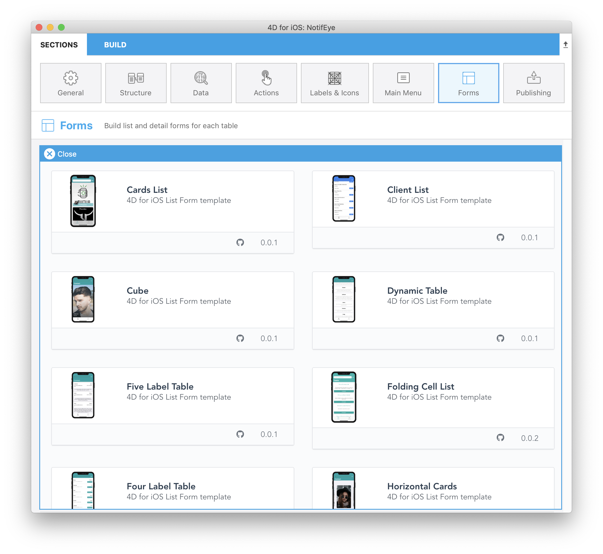

The Forms page allows you to select both list and detail forms for each published table. You can select one list form and one detail form per published table.

The 4D mobile editor provides various templates with custom transition effects to build fresh and modern mobile applications. Simple, empty templates are used by default for an app's list and detail forms.

Here's the breakdown of this screen, from top to bottom:

* **List Forms / Detail Forms:** Allows switching between list and detail form definitions for each table.
* **Published tables:** Displays all tables published in the [Structure](structure.md) section.
* **Forms:** List of available forms. Allows switching between template selection and content definition. In the content definition area, you can display tips that provide additional information on form fields.

## List forms

When you select a list form template for a table, the content definition screen appears. You can then drag and drop the fields from the Fields list directly onto the model displayed on the right.

:::note

In list forms, you cannot add more fields than those included in the template.

:::

Most of the list forms include optional **Search** and **Section** fields. You can also enable the **barcode scanner**.

### Search

A **search** field allows to filters dynamically the list contents depending on entered characters.

#### Multi-criteria search

You can drop more than one field to the search field, in which case the field displays "Multi-criteria Search":

In this case, the app will search for entered characters in all the fields using the "OR" operator. To remove a field from the list, click on the search field's delete button to select the field(s) to remove:

### Section

A section field will group and order entities in the list depending on their value for this field.

### Barcode Scanner

To activate the Barcode search, click on the magnifying glass next to the search field and select **Enable barcode scanner** option.

The Barcode search allows two features:

* Filtering the list form by scanning a barcode that contains a text value. It fills the Search Bar and opens the detail form if there is only one value left after filtering.
* Displaying specific list and detail forms just by scanning a barcode whose values are **URL Schemes** or **Universal Links** when the [**deep linking**](../special-features/deep-linking.md) feature is enabled.

:::info 4D for Android

This feature is currently not available in 4D for Android.

:::

## Detail forms

As with the List Form definition, select a template and configure the fields. In detail forms, you can add as many fields as you want onto your detail form.

You have several ways to add your fields in Detail forms:

* Drag and drop a field anywhere into the rightmost view to add it and display it just after the last field added or between any other fields that are already displayed.

* Double-click on a field. Your field will be added at the end of the list.

* Right-click on an available field in the Fields table at the left and select **Add missing fields** from the contextual menu.

You can reorder your fields at any moment using drag and drop in the detail form.

:::tip

If you want to try another template after dispatching your fields, just select it: previously selected fields are automatically moved for you to the new template in appropriate areas, according to the template and field types.

:::

## Gallery

When you select a template in the form section, a "More" icon is available for both list and detail forms.

Just click on that icon to display a list of additional templates from the 4D mobile Gallery:

Then, the only thing you have to do is selecting the template that suits your needs and the mobile editor will handle all the installation process. So you can directly start working on the template, as it is ready-to-use.

A github icon is displayed at the top left of a template icon in the Forms template picker to indicate that it comes from Github:

:::tip

The Gallery is also directly available on Github.
- [**gallery of list form templates**](https://4d-for-ios.github.io/gallery/#/type/list-detail/picker/0)
- [**gallery of detail form templates**](https://4d-for-ios.github.io/gallery/#/type/form-detail/picker/0)

:::

## Creating your own templates

If you want to customize a downloaded template or create your own templates, **several tutorials** can guide you through these tasks:

- [**Customizing a template form**](../tutorials/gallery/update-gallery-template.md)
- [**Creating list forms**](../tutorials/creating-list-forms/list-form-template.md)
- [**Creating details forms**](../tutorials/creating-detail-forms/detail-form-template.md)