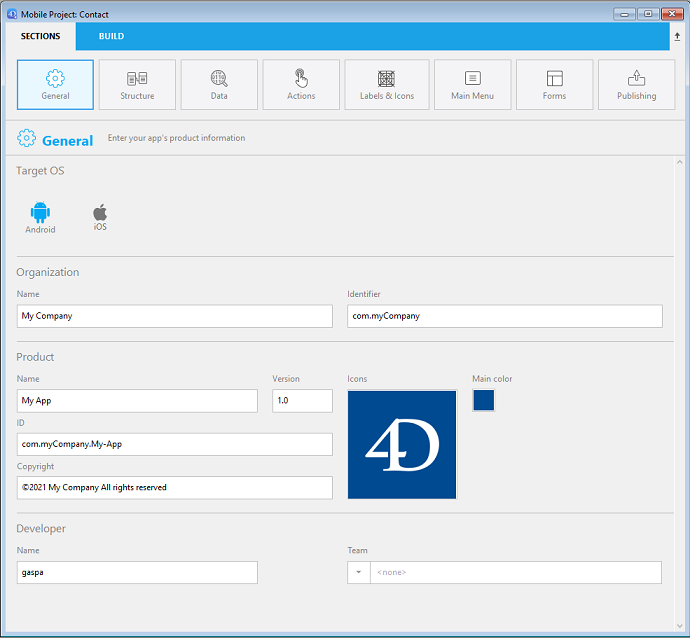

このページでは、アプリの主な情報を定義します。

## ターゲットOS

ビルドするアプリのモバイルOS を選択します。 この設定は、モバイルエディター内で利用可能なオプションを定義します。

- macOS では、**Android** 、**iOS** 、または **両方のOS** を選択できます。
- Windows では、**Android** のみをターゲットとして選択できます。

## 組織

**名前:** 会社名または、開発者の名前を入力します。

**識別子:** 組織のバンドル識別子を入力します。 これはこのアプリケーションを識別するのに使用されます。 これがプロダクト名と連結されて、リバースDNS形式の "バンドルID" となります (以下の **ID** 参照)。 バンドルID はアプリ固有のものでなければなりません。

たとえば、会社名が "MyCompany"、アプリ名が "MyApp" の場合、組織のバンドル識別子として "com.MyCompany" を選択することができ、その場合のアプリのバンドルID は "com.MyCompany.MyApp" となります。

:::note

バンドルID名には、スペースや "*,%,/" などの特殊文字を含めてはいけません。 これらは自動的に除去され、- で置き換えられます。

:::

## プロダクト

**名前:** アプリの名前です。 前述の通り、プロダクト名は "バンドルID" を作成するのに使用されます。 バンドルID は、Apple Developer アカウントで作成したバンドルID と同じものでなければなりません。

:::note

バンドルID名には、スペースや "*,%,/" などの特殊文字を含めてはいけません。 これらは自動的に除去され、- で置き換えられます。

:::

**バージョン:** アプリのバージョンです。 バージョン番号は 1.0 で開始し、増加するよう順番に追加します。

**ID** (バンドルID): 組織の識別子とプロダクト名を組み合わせる形で自動生成されます。 このエリアは編集できません。

**Copyright:** アプリの著作権表記です。 モバイルエディターにより著作権表記のフォーマットが提案されますが、独自の表記を作成することも可能です。

**アイコン:** アプリ内の様々な場所で使用されるマスターアイコンです。 モバイルエディターでアイコンを指定するだけで、標準のモバイルガイドラインに沿って必要なフォーマットがすべて生成されます。

アイコンを選択するには以下の方法があります:

- アイコンエリアにピクチャーを直接ドラッグ＆ドロップする
- アイコンのメニューを使って、ピクチャーを選択またはペーストする

またエリアをダブルクリックすることでもピクチャー選択ダイアログボックスを表示することができます。

:::note

Windows では、"画像ファイル" (*.public.image) を使用する必要があります。

:::

アイコンが選択されると、モバイルエディターはアプリに必要なアイコンをすべて自動的に作成します。 生成されたアイコンフォーマットは、アイコンメニューの **アイコンフォルダを表示** を選択することでアクセスできます。

### メインカラー

このメニューを使用すると、アプリのメインカラーをどのように定義するかを選択することができます。 メインカラーは、アプリのカスタムカラースキームを生成するのに使用されます。

- **システムのカラーセレクターを使用**: システムのカラーピッカーを表示し、そこからメインカラーを指定できます。
- **アイコンのメインカラーを使用**: アプリのアイコンに基づいてモバイルエディターにメインカラーを決定させます。

"アイコンのメインカラーを使用" をクリックすることで、いつでもメインカラーをリセットしてアイコンのプリセットのメインカラーへと戻すことができます。

## デベロッパー

**名前:** このフィールドは、ユーザーアカウント名で自動的に記入されています。 ここには任意の名前を記入できます。

**部署名:** Developer アカウントの Team ID。これは開発フェーズを通して使用されます。 This ID can be get from your Developer Account (see (https://idmsa.apple.com/IDMSWebAuth/signin?appIdKey=891bd3417a7776362562d2197f89480a8547b108fd934911bcbea0110d07f757&path=%2Faccount%2F&rv=1).
