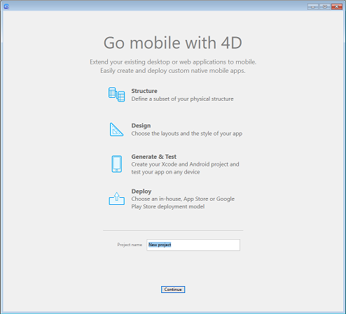

4D モバイルプロジェクトエディターを使用すると、グラフィカルなインターフェースを使用してiOS用/Android用のネイティブなモバイルプロジェクトをデザイン、テスト、ビルドすることができます。 ウィンドウには2つのタブがあります: **セクション** and **ビルド** です。

**セクション** タブの各セクションは，モバイルアプリが出来るまでの過程に対応しています。

* 一般
* ストラクチャ
* データ
* アクション
* ラベル & アイコン
* メインメニュー
* フォーム
* Publishing

**ビルド** タブには、モバイルアプリをビルド/テストするための埋め込みツールがあります。

* Build and Run
* シミュレーター
* プロジェクト
* インストール

4D モバイルプロジェクトエディターは**4D** アプリケーション開発環境から利用可能です(4D Developer Pro ライセンスが必要です)。

4D モバイルプロジェクトは、4D データモデルと強くリンクしています。 4D モバイルプロジェクトを作成または開くためには、それに関連した4D プロジェクトデータベースを先に開く必要があります。

## モバイルプロジェクトを作成

新しいモバイルプロジェクトを作成するには、以下のようにします:

1. 4D アプリケーションを開始し、モバイルプロジェクトを作成したい4D プロジェクトを開きます。
2. ツールバーの**ファイル** メニューから、**新規 > モバイルプロジェクト...** を選択します。

:::note

4D モバイルエディターを開くためには、4D Developer Pro ライセンスが必要になります。

:::

ウェルカムダイアログボックスが表示されます:

3. プロジェクトに名前をつけて、**続ける** をクリックします

モバイルプロジェクトエディターが表示され、4D プロジェクト内にモバイルファイルアーキテクチャーが自動的に作成されます。

## モバイルプロジェクトを開く

モバイルプロジェクトを開くには、以下のようにします:

1. 4D アプリケーションを起動し、開きたいモバイルプロジェクトの4Dプロジェクトを開きます。
2. ツールバーの**ファイル** メニューから、**開く > モバイルプロジェクト...** を選択します。

モバイルプロジェクト選択ダイアログボックスが表示されます。 ここにはカレントのデータベースに対して既に作成されているモバイルプロジェクトの一覧が表示されます。

左側のアイコンはそのプロジェクトがどのプラットフォーム向け(Andorid 用、iOS用、あるいは両方向け) に作成されたかを表します。

3. プロジェクトを開くにはプロジェクトをダブルクリックするか、プロジェクトを選択した状態で**開く** をクリックします。

### 他のプロジェクトを開く

**他のプロジェクトを開く...** リンクを使用すると、ダイアログボックスに表示されているものでなくても、有効なものであればどんな[`.4dmobileapp`](#mobile-project-architecture) ファイルでも開くことができます。

:::警告

選択されたモバイルプロジェクトは、カレントのデータモデルと合致している必要があります。そうでない場合、モバイルプロジェクトはアップデートされるため、想定とは異なる振る舞いをする可能性があります。

:::

## モバイルプロジェクトを削除

モバイルプロジェクトを削除するためには。4D project フォルダから削除したいモバイルプロジェクトのフォルダを削除するだけです。

## モバイルプロジェクトアーキテクチャー

モバイルプロジェクトはメインの4D project フォルダ内に作成されます。

- My4DProject (*メインの 4D project フォルダ*)
    + Mobile Projects
        * MyMobileProject
            - project.4dmobileapp
            - *その他のファイルやフォルダ*

