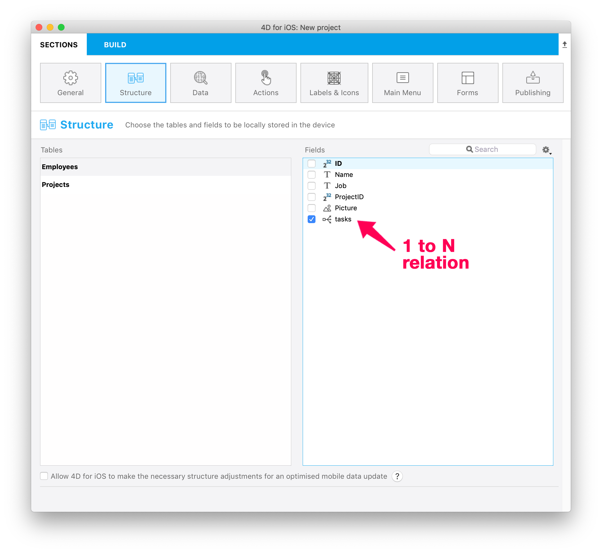

4Dデータベース内で RESTリソースとして公開されているすべてのテーブルとフィールドがこのページに表示されます。これには (N対1 および 1対N リレーションに基づいた) リレーション属性も含まれます。 実際の表示は、[ORDA のデータストア](https://developer.4d.com/docs/ja/ORDA/overview.html) にとても近いものが表示されます。


このページでは、公開するテーブルおよびフィールドを選択することにより、モバイルデバイス用に複製するストラクチャーのサブセットを定義することができます。

- 公開テーブルはアプリのタブとして自動的に追加されます。
- 公開されたスカラーフィールドは [リストフォームおよび詳細フォーム](https://developer.4d.com/go-mobile/docs/project-definition/forms/) を定義する際に利用できます。
- 公開されたリレーションフィールド (N対1 および 1対N リレーション) も、リストフォームおよび詳細フォームを定義する際に利用でき、リレーションボタンといった追加のナビゲーション機能もついてきます。


:::note

以下のテーブルとフィールドはこのページには表示されません:

- [ORDA ルール](https://developer.4d.com/docs/ja/ORDA/dsmapping.html#%E3%82%B9%E3%83%88%E3%83%A9%E3%82%AF%E3%83%81%E3%83%A3%E3%83%BC%E3%83%9E%E3%83%83%E3%83%94%E3%83%B3%E3%82%B0) に則っていないテーブルやフィールド。
- "`__`" (ダブルアンダースコア) で始まる名前を持つテーブルやフィールド。

:::

## 公開するテーブルとフィールドを選択する

テーブルに属するフィールドが 1つ以上公開されると、そのテーブルも公開されます。 公開されたテーブルは **太字** で表示されます。

公開するフィールドを選択するには、テーブル名をクリックし、右のリストでフィールドをクリックします。 または:

- **スペースバー** を押すと、フィールドを選択/選択解除できます。
- **Ctrl+クリック** でフィールドを全選択できます。
- フィールドリストの **公開** および **全て公開** ローカルメニューを使用できます。


### リストのフィルタリング

リストにフォーカスがある場合、検索エリアとローカルメニューを使用して、内容を絞り込むことができます。


- **検索** エリア: テーブル名またはフィールド名を検索する文字列を入力します。
- **テーブル名でソート**/**フィールド名でソート**: 名前順でリストをソートします。 デフォルトでは、リストは作成日順にソートされています。
- **公開テーブルのみ**/**公開フィールドのみ**: 選択されている (公開された) テーブルまたはフィールドのみを表示します。


## サポートされるフィールド型

モバイルエディターは、モバイルアプリに使用できるフィールドの一覧を、その種類に応じて自動的に表示します:


- すべての [スカラー型の 4Dフィールド](https://developer.4d.com/docs/ja/Concepts/data-types.html) がサポートされます (ただし [BLOB](https://developer.4d.com/docs/ja/Concepts/blob.html) 型および [オブジェクト](https://developer.4d.com/docs/ja/Concepts/object.html) 型を除く)
- リレーション属性 (N対1 および 1対N) はサポートされており、フィールドと同様に選択することができます。 リレーション属性は専用のアイコンを持ちます:

Ｎ対１リレーションアイコン:  

１対Ｎリレーションアイコン: 

:::info

リレーション属性の名前は 4Dストラクチャーエディターにおけるリレーション名に基づいています。[ORDA ストラクチャーマッピング](http://developer.4d.com/docs/ja/ORDA/dsmapping.html#%E3%82%B9%E3%83%88%E3%83%A9%E3%82%AF%E3%83%81%E3%83%A3%E3%83%BC%E3%83%9E%E3%83%83%E3%83%94%E3%83%B3%E3%82%B0) のページを参照ください。

:::


## リレーションの使用

:::4D for Androidにおける注意

4D for Android では、N対1リレーションのみ利用可能です。

:::

### 1対Nリレーション

**1対Nリレーション** をプロジェクトに含めると、アプリの新しいページにリレートフィールドのリストを表示できます。

そのためには:

* ターゲットテーブル (N側のテーブル) のフィールドを 1つ以上公開します
* ソーステーブル (1側のテーブル) のリレーション属性を公開します



公開されたリレートフィールドは、他のフィールドと同様に使用できます。 つまり、次のことが可能です:

* [ラベル＆アイコン](labels-and-icons.md) ページにおいてリレーションプロパティを定義できます。
* [フォーム](forms.md) ページで、詳細フォームに 1対Nリレーションをドロップし、詳細フォームとリレートテーブル間にリンクを作成できます。 すると、リレートビューに直接行くためのリレーションボタンが、詳細フォームに自動的に作成されます。

:::tip Tutorial

モバイルプロジェクトに 1対Nリレーションを統合する詳細な例については、[**1対Nリレーションのチュートリアル**](../tutorials/relations/one-to-many-relations) を参照ください。

:::


### N対1リレーション

**N対1リレーション** は、アプリ作成プロセスにおいて他のフィールドと同様に使用することができます。 フィールドリストで N対1リレーションを選択すると、アプリで公開するフィールドをリレートテーブルから選択できます:


リレーション名をクリックし、フィールドを選択するだけです:


デフォルトで、リレートテーブルのすべての利用可能フィールドが公開されます。

:::tip Tutorial

モバイルプロジェクトに N対1リレーションを統合する詳細な例については、[**N対1リレーションのチュートリアル**](../tutorials/relations/many-to-one-relations) を参照ください。

:::


### N対Nリレーション

ストラクチャーページを使用して、親の N対1リレーションを介して、子の N対1リレーションおよび 1対Nリレーションを公開することができます。 つまり、アプリ内で N対Nリレーションを表示したり、リストフォームから別のリストフォームに直接移動したりすることができます。


:::tip Tutorial

モバイルプロジェクトに N対Nリレーションを統合する詳細な例については、[**リレーション操作**](../tutorials/relations/relation-interactions) を参照ください。

:::

## Incremental reload

### Allow structure adjustments

For the best user experience, 4D for iOS and 4D for Android implement an automatic feature for the incremental reload of data. It means that only new, modified or deleted data from the database will be updated to the app. This optimization enhances drastically loading time.

To enable this optimization, 4D for iOS and 4D for Android need the following structure elements:

* A `__DeletedRecords` table to store deleted records
* and `__GlobalStamp` fields to store modification stamps for each published table in your mobile application

You can let the 4D mobile editor do all the work for you and add the necessary structure elements: just select **Allow 4D to make necessary structure adjustments for an optimized mobile data update** option.

:::note

These optimizations are required for both local and server databases.

:::

### Pull to refresh!

On the mobile app side, your data is updated each time you launch your app and each time your app goes foreground, to get constant updated data.

In normal use, simply swipe down from any listform to reload your data.

From iPhone settings, you can now reset your app data and find information about your app.

:::note

When an important maintenance operation is performed on the database side (Recover by tag / Restoration / Compacting) a Full reload is necessary on the mobile app. In this case, the admin shall notify mobile app users.

:::

## 計算属性

Android でも iOS でも、プロジェクトエディターから設定をすれば、生成されたアプリ内で計算属性を表示することができます。

[計算属性](http://developer.4d.com/docs/ja/ORDA/ordaClasses.html#%E8%A8%88%E7%AE%97%E5%B1%9E%E6%80%A7-1) とは、複数のフィールドを一つに複合した結果です。 この計算属性は、モバイルアプリ作成時に他のフィールドと同様に使用できます。つまり、ストラクチャーセクションで確認し、公開できるということです。 たとえば、住所における通りの番号と通りの名称、あるいは氏名における名字と名前のように 2つに分かれた属性を使う代わりに、これらを 1つの属性に纏めて "fullAddress" や "fullName" などと名づけることができます。

やり方は、とても簡単です。

### 4D側の準備

[*Class extends*](https://developer.4d.com/docs/ja/Concepts/classes.html#class-extends-classname) および [exposed Function](https://developer.4d.com/docs/ja/ORDA/ordaClasses.html#%E5%85%AC%E9%96%8Bvs%E9%9D%9E%E5%85%AC%E9%96%8B%E9%96%A2%E6%95%B0) のシンタックスを使って、使用する属性と取得する計算属性を以下のようにコード内で指定します:

```4d 
Class extends Entity

exposed Function get fullName->$fullName : Text
    $fullName:=This.FirstName+" "+This.LastName

exposed Function set fullName($fullName : Text)
$splitName:=Split string($fullName; "/")
If ($splitName.length=2)
    This.FirstName:=$splitName[0]
    This.LastName:=$splitName[1]
Else 
    // ERROR    
End if

exposed Function get fullAddress->$fullAddress : Text
    $fullAddress:=This.StreetNumber+" "+This.Street+" - "+This.Location

exposed Function set fullAddress($fullAddress : Text)
$splitAddress:=Split string($fullAddress; "/")
If ($splitAddress.length=3)
    This.StreetNumber:=$splitAddress[0]
    This.Street:=$splitAddress[1]
    This.Location:=$splitAddress[2]
Else 
    // ERROR    
End if
 ```

:::note

- 計算属性は、エンティティ属性が変更されたときのみ取得されます。
- たとえば、"StudentEntity" データクラスで、"currentTime" 計算属性が **Current Time** を返し、モバイルプロジェクトでは "Student" リストフォームまたは詳細フォームにおいて使用される場合を考えます。 生成されたモバイルアプリでは、ある "Student Entity" の "currentTime" フィールドは、同 "Student Entity" の属性のいずれかが変更されるまで更新されません。 :::

### プロジェクトエディター側の設定

4D側でコードが書かれると、プロジェクトエディターでは計算属性が利用可能になり、他のフィールドと同様に公開して使用できるようになります:


**ストラクチャー** セクションにおいて:

`exposed` の付いた計算属性は、データクラスの属性リストに表示されます。


**ラベル & アイコン** セクションにおいて (アイコン / 短いラベル / 長いラベル / フォーマット):


**フォーム** セクションにおいて:

The computed attributes present in the data model are, like the fields, available in the list of fields of the Forms panel (list and detail). They behave in the same way as the storage attributes of the datastore.


In the **Data** panel, computed attributes are displayed in the list linked to the "Fields" button of the query filter box.

:::note 4D for iOS

- Computed attributes can be used with Sort actions.
- A computed attribute without a setter (readOnly) is not available for an Add or Edit action.
- When Add or Edit presets actions are created (if the setter is available and if 4D allows it), computed attributes parameters shall be available when linked to a field.

:::note 4D for iOS

### Mobile app side

In the generated mobile application, on iOS or Android, both single attributes and computed attributes are displayed.

