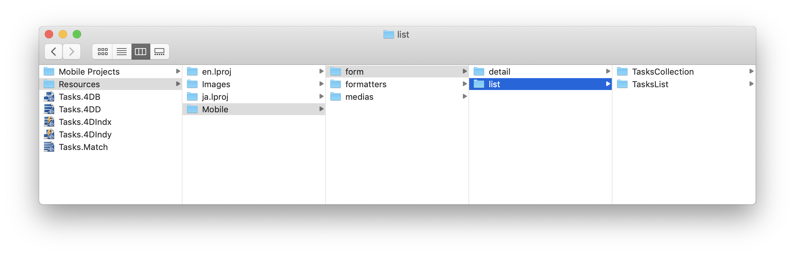
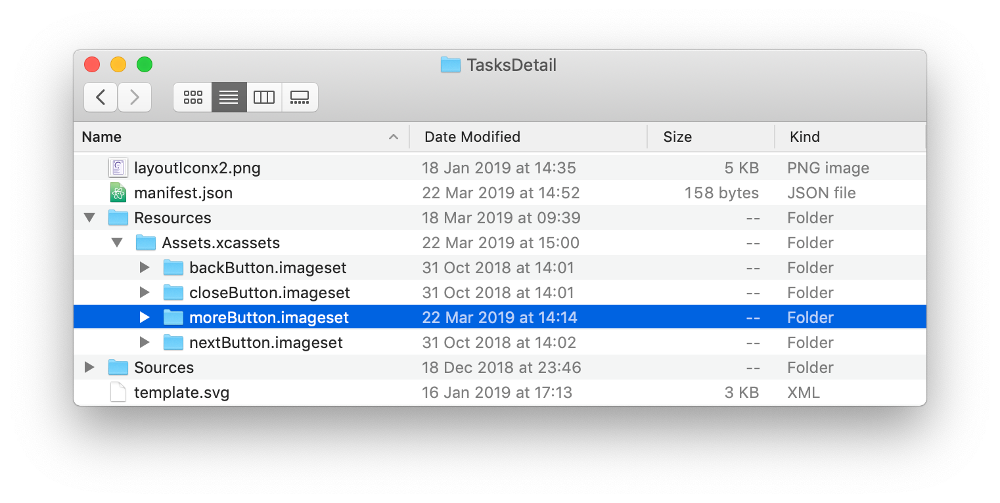

> **OBJECTIVES**
> 
> アクションを追加してリストフォーム/詳細フォームのテンプレートをカスタムします。

> **PREREQUISITES**
> 
> 始めるために必要なものについては`[here](prerequisites.html)`をクリックして下さい!

このチュートリアルでは、どうやって簡単に**カスタムテンプレートにアクションを追加する**かを見ていきます。

## ⒈ スタータープロジェクトをダウンロード

To begin, download the **Starter project**, which includes:

* リストフォームのカスタムテンプレートが2つ(TasksList および TasksCollection)
* 詳細フォームのカスタムテンプレートが1つ(TasksDetail)
* データベース(Tasks.4dbase)

<a class="button button--primary"
href="https://github.com/4d-go-mobile/tutorial-AddingActionToTemplates/archive/1dc5aecfbea62a9999d571cb1a956f1ef6983111.zip">Download</a>

## ⒉ 4D for iOS プロジェクトにカスタムテンプレートを追加

以下のドロップを実行してテンプレートをインストールします。

* **TasksList** および **TasksCollection** template フォルダを*Tasks.4dbase/Resources/Mobile/form/list* フォルダにドロップ

* **TasksDetail** template フォルダを *Tasks.4dbase/Resources/Mobile/form/detail folder* にドロップ

## ⒊ リストフォームにアクションを追加

2種類のアクションが利用可能です:
* テーブルアクション
* エンティティアクション

まずは最初に `list/TasksList/Sources/Forms/Tables/___TABLE___/___TABLE___ListForm.Storyboard` ファイルを開いてみましょう。

### TasksList カスタムテンプレートにアクションを追加する

#### Ａ テーブルアクションタグを追加

**List form Controller** を選択し、**User Defined Runtime Attributes** (Identity inspector) に以下の記述を追加します:

* Key Path: `actions`
* Type: `String`
* Value: `___TABLE_ACTIONS___`

#### Ｂ エンティティアクションタグを追加

Table View を選択し、**User Defined Runtime Attributes** (Identity inspector) に以下の記述を追加します:

* Key Path: `actions`
* Type: `String`
* Value: `___ENTITY_ACTIONS___`

これでカスタムテンプレートがアクション対応になりました！

TaskList カスタムテンプレートを**フォームセクション** から選択し、以下のフィールドを追加することができます:

続けて TasksCollection カスタムテンプレートにもアクションを追加しましょう。

### TasksCollection カスタムテンプレートにアクションを追加する

まずは`list/TasksCollection/Sources/Forms/Tables/___TABLE___/___TABLE___ListForm.Storyboard` ファイルを開きます。

#### Ａ テーブルアクションタグを追加

作業は TasksList カスタムテンプレートの場合によく似ています。

**List form Controller** を選択し、**User Defined Runtime Attributes** (Identity inspector) に以下の記述を追加します:

* Key Path: `actions`
* Type: `String`
* Value: `___TABLE_ACTIONS___`

#### Ｂ エンティティアクションタグを追加

エンティティアクションを表示する方法はリスト形式の TableView とグリッド形式の CollectionViews では異なります。 後者はスワイプ操作に不向きです。

コレクションビューにおいては、扱いたいセルに対して**長押し** ジェスチャーに反応してアクションを表示させるのが良い方法です。

そのためには、collectionView のセルを選択して、以下の記述を**User Defined Runtime Attributes** (Identity inspector) に追加します。

* Key Path: `actions`
* Type: `String`
* Value: `___ENTITY_ACTIONS___`

アクションのレンダリングを最適化するため、以下の記述を**User Defined Runtime Attributes** (Identity inspector) に追加することで、拡大エフェクトと触覚フィードバックを追加することができます:

* Key Path: `touch.zoomScale`
* Type: `Number`
* Value: `0.96` (ズーム倍率は好みに応じて調整することができます)

TasksCollection カスタムテンプレートを**フォームセクション** から選択し、以下のフィールドを追加することができます:

## ⒋ 詳細フォームにアクションを追加

詳細フォームではナビゲーションバーの**汎用ボタン** を使用するか、または **オリジナルのカスタムアクションボタンを容易に作成する**こともできます。 どちらの場合にも、タグを追加する必要があります。

ナビゲーションバーに埋め込まれている汎用ボタンの場合、コントローラーを選択し、**User Defined Runtime Attributes** (Identity inspector) に以下の記述を追加します:

* Key Path: `actions`
* Type: `String`
* Value: `___ENTITY_ACTIONS___`

このチュートリアルでは、独自の汎用ボタンを作成したいとします。 そのためにはまずは`detail/TasksDetail/Sources/Forms/Tables/___TABLE___/___TABLE___DetailsForm.storyboard` ファイルを開きます。

開いたら右下のボタンを選択し、**User Defined Runtime Attributes** (Identity inspector) に以下の記述を追加します:

* Key Path: `actions`
* Type: `String`
* Value: `___ENTITY_ACTIONS___`

見て分かるように、Storyboard ファイル内にはいくつかのボタンの画像が不足しています。 これらのファイルについては**Resources folder** テンプレート内にあります。 これらのファイルは、ビルドを実行すれば、プロジェクトにコピーされます。

例えば、**moreButton.imageset** の場合には、以下のようにします:

TasksDetail カスタムテンプレートを**フォームセクション** から選択し、以下のフィールドを追加することができます:

完成したiOSアプリは、リスト画面と詳細画面が両方ともアクション対応になりました！

完成したプロジェクトをダウンロード

<a className="button button--primary"
href="https://github.com/4d-go-mobile/tutorial-AddingActionToTemplates/releases/latest/download/tutorial-AddingActionToTemplates.zip">Download</a>

