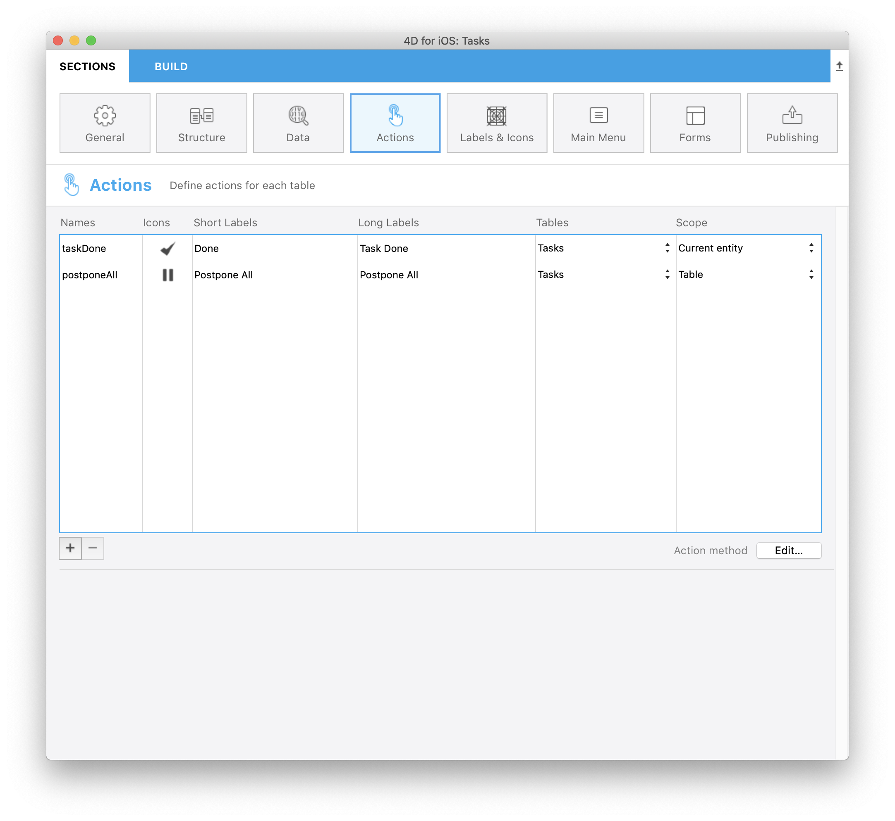
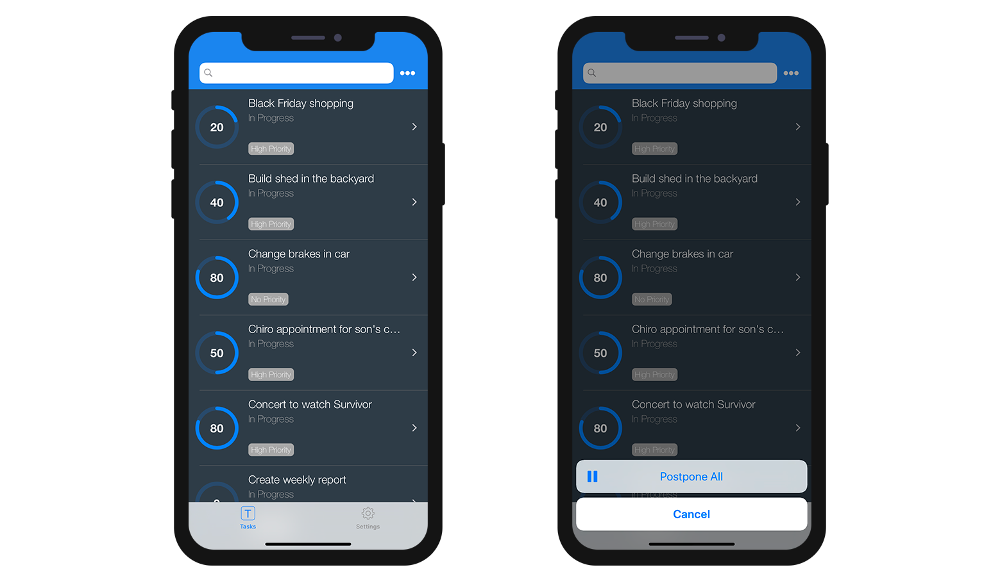

このチュートリアルでは、**Tasks iOS app** を使用して、このアプリ内でどのようにアクションを扱っていくかを見ていきます。

この**Task app** 内でやりたいこととは、それぞれのタスクの**ステータス**と**進捗のパーセンテージ** を個別に変更したいということです。

また、**すべてのタスクのステータスを変更** し、「延期」あるいは「進行中」などへと変更することも視野に入れます。

**スタータープロジェクト**をダウンロードし、**アクションセクション**に移動してください。

<div className="center-button">
<a className="button button--primary"
href="https://github.com/4d-go-mobile/tutorial-Actions/archive/cf16581214a8a6e4e4067bcff43ac1265ec43ff7.zip">Download</a>
</div>

アクションは2つのレベルに対して定義可能です:

* エンティティに対するアクション
* テーブルに対するアクション

まずはエンティティに対するアクションから始めましょう！


## エンティティに対するアクション

### ⒈ 1.「アクション」セクションで設定すること

このアクションセクションでは、アクションの**名前**、**アイコン**、**ラベル**、このアクションが利用できる**テーブル**、このアクションが適用される**scope**などを、全てのアクションに対して定義することが可能です。

アクションセクションは最初に開いた時は空なので、下部にある**追加ボタン**をクリックして、最初のアクションを追加してみましょう!


まずは**タスクのステータスを変更**して「完了」に設定するアクションと、**進捗のパーセンテージを変更** して100%に設定するアクションを定義してみましょう。

下記のステップで実現することができます。

* Enter **taskDone** in **Names field**
* Select the **Done icon** from the icon library
* Enter **Done** in **Short Labels**
* Enter **Task Done** in **Long Labels**
* Select the **Tasks** table from **Tables** list
* Select **Current record** from **Scope** list


### ⒉ ⒉ ⒉ ⒉ データベースメソッドの作成と編集

Now that your action is defined in the Project Editor, you have to create the **[On Mobile App Action](https://livedoc.4d.com/4D-Language-Reference-17-R5/Database-Methods/On-Mobile-App-Action-database-method.301-4286697.en.html)** database Method.

Do to so, click on **Create button** at the bottom right of the action table and enter the following code in the **On Mobile App Action** database method:

```4d
C_OBJECT($0)
C_OBJECT($1)

C_OBJECT($o;$context;$request;$result)

$request:=$1  // モバイルアプリから送られた情報

$context:=$request.context

Case of

    : ($request.action="taskDone")

        $o:=New object(\
        "dataClass";$context.dataClass;\
        "ID";$context.entity.primaryKey;\
        "CompletePercentage";100)

        $result:=modifyStatus ($o)

    Else

          // Unknown request
        $result:=New object("success";False)

End case

$0:=$result  // モバイルアプリに返される情報

```

### ⒊ ⒊ ⒊ ⒊ "modifyStatus" メソッドの作成

Once your database method has been edited, you have to create a **modifyStatus** Method that will make the job :

```4d
C_OBJECT($0)
C_OBJECT($1)

C_OBJECT($dataClass;$entity;$in;$out;$status;$selection)

$in:=$1

$selection:=ds[$in.dataClass].query("ID = :1";String($in.ID))

If ($selection.length=1)

    $entity:=$selection[0]

    $entity.CompletePercentage:=$in.CompletePercentage

    $entity.Status:=3

    $status:=$entity.save()

    $out:=New object

    If ($status.success)

        $out.success:=True  // アクションの成功を通知
        $out.dataSynchro:=True  // セレクションの更新を要求

    Else

        $out:=$status  // モバイルアプリに返される情報

    End if

Else

    $out.success:=False  // アクションの失敗を通知

End if

$0:=$out

```

アプリをビルドして実行しましょう！ Your **Done action** is available when you swipe left a cell in Listform, as well as when you click on the **generic action button** in the navigation bar of the Detail form.


## テーブルに対するアクション

### ⒈ 「アクション」セクションで設定すること

Now, imagine that you are going on holidays and you want to **change all your tasks status** to "Postponed".

下記のステップで実現することができます。

* Enter **postponeAll** in **Names field**
* Select the **Postponed icon** from the icon library
* Enter **Postpone All** in **Short Labels**
* Enter **Postpone All** in **Long Labels**
* Select the **Tasks** table from **Tables** list
* Select **Table** from **Scope** list



### ⒉ データベースメソッドの編集

Click on the **Edit button** at the bottom right of the action table to complete the **On Mobile App Action** database method :

```4d
C_OBJECT($0)
C_OBJECT($1)

C_OBJECT($o;$context;$request;$result)

$request:=$1  // モバイルアプリから送られた情報

$context:=$request.context

Case of

    : ($request.action="taskDone")

        $o:=New object(\
        "dataClass";$context.dataClass;\
        "ID";$context.entity.primaryKey;\
        "CompletePercentage";100)

        $result:=modifyStatus ($o)

    : ($request.action="postponeAll")

        $o:=New object(\
        "dataClass";$context.dataClass;\
        "Status";4)

        $result:= postponeAll ($o)
    Else

          // Unknown request
        $result:=New object("success";False)

End case

$0:=$result  // モバイルアプリに返される情報

```


### ⒊ ⒊ ⒊ ⒊ "postponeAll" メソッドの作成

As you create the **modifyStatus** Method, follow the same process and create a new **postponeAll** Method that will modify all record status:

```4d
C_OBJECT($0)
C_OBJECT($1)

C_OBJECT($entity;$in;$out)

$in:=$1

$out:=New object("success";False)

If ($in.dataClass#Null)

    For each ($entity;ds[$in.dataClass].all())

        $entity.Status:=$in.Status
        $entity.save()

    End for each

    $out.success:=True  // アクションの成功を通知
    $out.dataSynchro:=True  // セレクションの更新を要求

Else

    $out.errors:=New collection("No Selection")

End if

$0:=$out

```

アプリをビルドして実行しましょう！ You will find a new **generic button** in the navigation bar of your Lisform. Click on it to trigger the **Postpone All** action.



## これからどうする？

おつかれさまでした！ You've just added 2 actions to your iOS app. You are now able to add all actions you need to your Tasks app!


Download the completed project that includes various actions:

<div className="center-button">
<a className="button button--primary"
href="https://github.com/4d-go-mobile/tutorial-Actions/releases/latest/download/tutorial-Actions.zip">Download</a>
</div>
