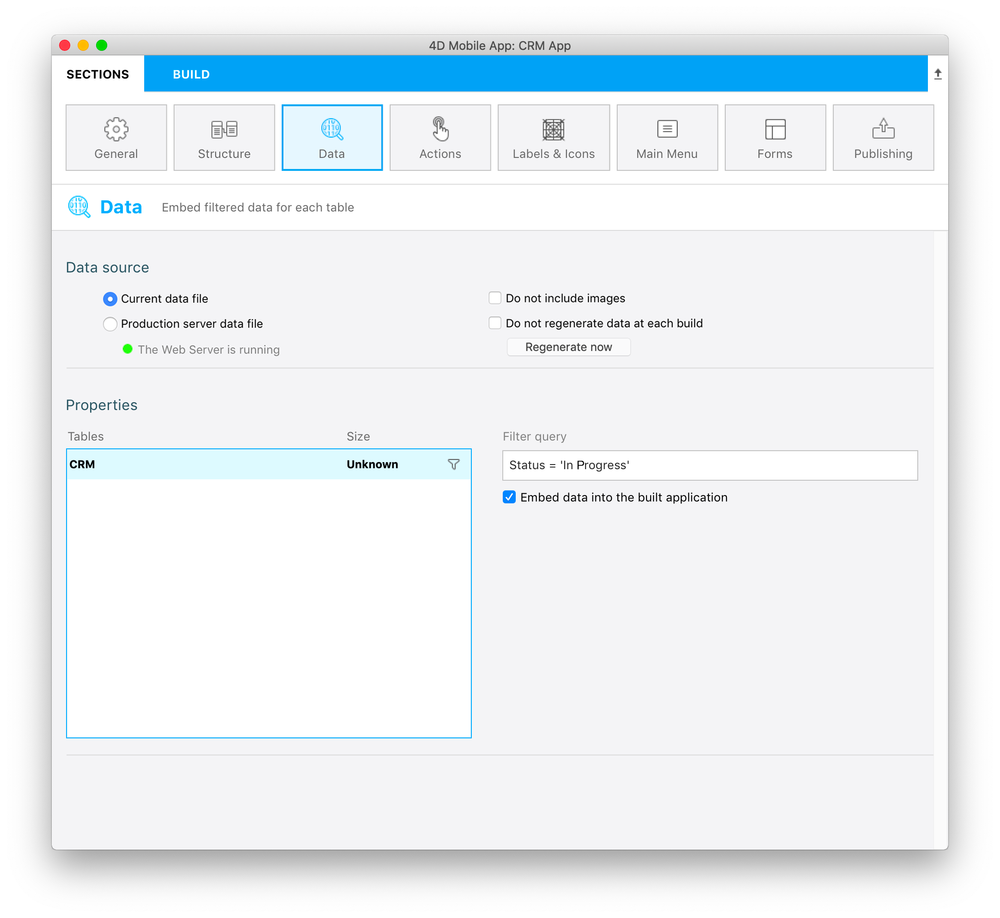

はじめに、スタータープロジェクトをそのままビルドして実行してみましょう。ログイン画面には営業担当者のメールアドレス "michelle.simpson@mail.com" を入力します。**営業担当者全員の商談がステータスに関係なく** (*済 (Closed)* と *進行中 (In Progress)* の両方が) 表示されることに注目してください。

前述のように、モバイルアプリにメールアドレスでログインすれば、自分が担当している商談でステータスが *進行中* のものだけを表示するよう、データをフィルターしたいと考えています。 下記の要領で実現することができます。

* **データ** セクションに移動します。
* **フィルタークエリ** 欄をクリックすると、**フィールド・比較演算子・演算子ボタン** が表示されます。
* **フィールド** ボタンをクリックし、**Status** フィールドを選択します。
* **比較演算子** ボタンをクリックし、**等しい** を選択します。
* *進行中* の商談を表示したいので、**&apos;In progress&apos;**と入力します。
* **検証** ボタンをクリックし、フィルターを確定します。これを忘れてしまうと、アプリがビルドできません。

下図のようになっていることを確認してください。

> **注記**
> 
> * フィルタークエリが設定されているテーブルの横には **フィルター (漏斗)** アイコンが表示されます。
> * 今回のような単純なフィルターの場合、**このテーブルのデータをアプリケーションに埋め込み** チェックボックスによって、データをアプリに埋め込むか、それともログイン後にロードさせるかを選ぶことができます。
> * ビルドを実行すると、計算された **データサイズ** が画面上で確認できるようになります。

アプリをビルドして実行しましょう。メールアドレス "michelle.simpson@mail.com" を入力してログインすると、今度は *進行中* の商談のみがシミュレーターに表示されます。

惜しいですね！ ここで実現したかったのは、ログインしたユーザーが担当している *進行中* の商談を表示することでした。これには、フィルタークエリにもう少し条件を加える必要があります。

