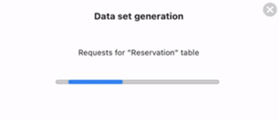
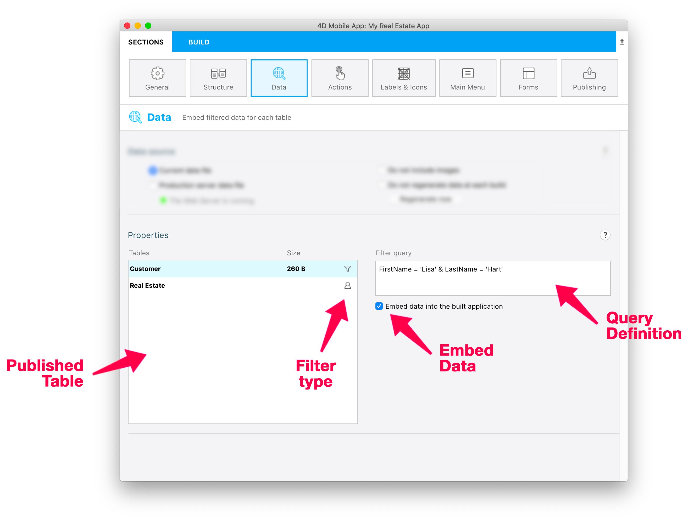

このページはモバイルアプリが扱うデータを設定するために使用します。 このページを使用すると以下のようなことができるようになります:

* アプリ内に格納するデータのソースを選択する(**カレントのデータファイル** あるいは **プロダクションサーバーのデータファイル**)
* どのデータセットをリロードし、どんなときにデータを再生成するかを定義する
* **フィルタークエリ** および **ユーザー情報** に応じてアプリ内に格納するデータをフィルタリングする


## データソース

このパネルを使用するとアプリで管理されるデータのソースを設定することができます。

### データファイル

アプリで扱われるデータを取得するデータファイルを選択します:

- **カレントデータファイル**: データはカレントの4D プロジェクトのデータファイルから取得されます。 このオプションは開発段階において有用です。 このオプションを使用するためにはWebサーバーが起動している必要があるため、サーバーが起動されていない場合には**Web サーバーを開始** ボタンが表示されます。

- **プロダクションサーバーデータファイル**: データは4Dプロジェクトを実行しているプロダクションサーバーからネットワーク越しに取得されます。 このオプションを選択した場合には、[**公開** ページ](publishing.md)において**プロダクションURL** を入力する必要があります。 定義されていない場合、**サーバーURLを設定** ボタンをクリックして公開ページを開くことができます。 このオプションでは`key.mobileapp` セキュリティファイルを明示的に選択する必要があります(以下参照)。

### `key.mobileapp` ファイルを選択する

埋め込むデータへのアクセスを確保するため、データファイルが選択されると4D mobile エディターによって**MobileApps** フォルダ内に`key.mobileapp` ファイルが自動的に生成されます。 データダンプをするためには、このキーが正常にインストールされていなければなりません。 このキーは以下のような場合に必要になります:

- アプリが[ビルド](build-panel)されている
- [**今すぐ再生成する**](#regenerate-now) ボタンをクリックする

:::info

**MobileApps** フォルダは4D プロジェクトの[データフォルダ](https://developer.4d.com/docs/en/Project/architecture.html#data-folder)内に自動的に作成されます。

:::

**カレントデータファイル** を使用する場合、`key.mobileapp` ファイルはローカルプロジェクトのデータフォルダ内で自動的に選択されます。

**プロダクションサーバーデータファイル** を使用する場合、サーバーからコピーしたリモートの`key.mobileapp` ファイルを選択する必要があります:

1. プロダクションサーバーマシン上で、サーバーアプリケーションプロジェクトの`/Data/MobileApps` フォルダから`key.mobileapp` ファイルをコピーします。

2. モバイルプロジェクトエディター内で、**キーの位置を指定...** ボタンをクリックします:


3. サーバーからコピーしてきた`key.mobileapp` ファイルを選択します。

ファイルは、ローカルプロジェクトの`/Data/MobileApps` フォルダ内にコピーすることが推奨されます。

:::info

このキーはアプリ内に埋め込むデータにアクセスする際にのみ必要になります。 以降のアプリからサーバーデータへのアクセスに関しては、`[リクエストレベルで認証されます](publishing.md/authentication)`。

:::

### 画像を含めない

データから画像をアプリに埋め込むことは、特に開発段階においてはかなり時間を無駄にすることになりかねません。 このオプションをチェックすることで、アプリのビルドにかかる時間を大幅に短縮することができます。

### ビルドごとにデータを再生成しない

デフォルトでは、アプリをビルドするたびに、プリロードされたデータ(あれば) がデータファイルから再生成されます。 開発段階においては、このオプションをチェックすることで時間を節約することができます。

### 今すぐ再生成する

このボタンは、プリロードするデータをデータファイルから再生成します。 これを使用すると、開発段階におけるデータ生成のコントロールを可能にします。特に**ビルドごとにデータを再生成しない** オプションと組み合わせることで有用になります。

データ生成プロセスの間、モーダルなウィンドウが表示され、プロジェクトエディターはロックされます。またそれぞれの生成ステップごと(テーブルへのhttpリクエスト、コアデータインジェクション、など) の進捗バーが表示されるとともに、「時間がかかりすぎるようなら、データの再フィルタリングを試してください」などのメッセージも表示されます。



またデータ生成はキャンセルボタン をクリックすることでキャンセルすることもできます。

:::info

This button requires a valid `key.mobileapp` file if you use the [production server data file](#data-file).

:::


## プロパティ



In this area, you can:

- 埋め込む(プリロードする) データを取得するテーブルを選択することができます。
- それぞれのテーブルに対して**フィルタークエリ** を定義することができます。 フィルタークエリは、アプリがデータにアクセスした際に自動的に適用されます。それによってレコードの一部のみを取得することができます。

By default, if you do not define a filter query for a table, all of its records are embedded.


### テーブル

You can define one filter query per table. This list allows you to:

- フィルタークエリを追加または編集したいテーブルを選択することができます。
- [埋め込みオプションが選択されていた](#embed-the-data-from-this-table) 場合、埋め込むデータのサイズを見ることができます。 この情報はユーザー情報に基づいたフィルタークエリを使用していた場合には利用できません。この場合データのサイズはユーザーによって変わるからです。
- テーブルにフィルタークエリ またはユーザー情報を使用したフィルタークエリ が適用されているかをチェックできます。

全ての選択されたテーブルはResources>Data フォルダ内に.json ファイルを生成し、このファイルは自動的に単一のSQLite ファイルへと変換され、アプリ内で使用されます。


### このテーブルからデータを埋め込む


このオプションがチェックされている場合(デフォルト) 、モバイルアプリがビルトされた時に、あるいは[データが再生成されたとき](#do-not-regenerate-data-at-each-build) エディターはデータをプリロードします。 This option accelerates data access from the mobile app since it only requires updates and not full downloads. It is particularly suited for stable data like cities or countries.

You can uncheck the option if preloading the table data is not accurate.

This option is not available if table data access uses a filter query based upon user information since it depends on the user. In this context, the button is replaced by the **Edit authentication method...** button that opens the [On Mobile App Authentication](https://doc.4d.com/4Dv19/4D/19/On-Mobile-App-Authentication-database-method.301-5392844.en.html) method in which you can process user information.

### フィルタークエリ

You can define one filter query per table. When a table is selected, click in the **Filter query** area, a set of menus is then displayed above the area:


To define a query:

1. クエリエリアに直接入力する、あるいは**フィールド** 、**比較演算子** および **演算子** メニューを使用してクエリを専用のフィールドに入力していきます。

A query uses the following syntax:

```
field comparator value {logicalOperator field comparator value}   
```


2. クエリの有効性をチェックするためには**Validate** ボタンをクリックします。クエリフィールドの下に以下のようなフィードバックが表示されます。

- エンティティの数がフィルタークエリと合致する場合: "アプリケーションに埋め込まれるエンティティ数 : EntityNumber/EntityTotal"
- フィルタークエリに合致するエンティティがない場合: "アプリケーションにはエンティティは埋め込まれません"
- サーバーにアクセスできない場合: "アプリケーションに埋め込まれるエンティティ数 : N/A サーバーに接続することができません"
- テーブルフィルタークエリが確定されていない場合、そのテーブルは左のテーブル一覧内において赤色で表示されます("validated" : false in project.4dmobileapp)
- サーバーがエラーを返す場合、その旨がクエリフィールドの下にずっと表示されます。

フィルタークエリを変更するたびに、Validate ボタンをクリックしてください(編集されているのに確定されていないクエリはクエリエディターないで赤色で表示されます)。

When a query filter is valid, an icon appears near the table name ( for static filters and  for filters with user information).

:::info

Refer to the [?filter REST documentation](https://developer.4d.com/docs/en/REST/filter.html) for a detailed description of query syntaxes. The string entered in the **Filter query** area is directly passed as parameter to the `$filter=` REST command.

:::


#### 例題

If you select a table that contains a `FirstName` field and a `LastName` field, you can write in the **Filter query**:

```4d
FirstName = 'Lisa' & LastName = 'Hart'
```

This query gets only the records that include "Lisa" as FirstName and "Hart" as LastName.


### ユーザー情報を使用したフィルタークエリ

You can define [filter queries](#filter-queries) where the *value* parameter depends on user information that is returned by the [`On Mobile App Authentication` database method](https://doc.4d.com/4Dv19/4D/19/On-Mobile-App-Authentication-database-method.301-5392844.en.html) of the 4D project.

To specify that the query depends on user information, just add **`:`** and a custom key value in the query.


For example, you can define filter queries such as:

```
Name = :name
employee.level > :level
cityName = :city
```
... where `:` preceeds variables that will be automatically filled by the mobile app depending on values returned by the `On Mobile App Authentication` database method in the `userInfo` object. The variables must exist as custom property names in the `userInfo` object.

Here is how it works:

1. モバイルアプリがデータリクエストを送信すると、`On Mobile App Authentication` データベースメソッドが自動的に呼び出され、アプリからの情報を*$1* オブジェクト型引数に受け取られます。具体的には`email` 情報に加え、`device` または`language` も返されます。
2. データベースメソッドは4Dデータストアをクエリしてビジネスルールに則った適切な情報を取得し、`userInfo` オブジェクト内のカスタムプロパティに任意の値を返すことができます。 例:

```4d
$id:=ds.Salesperson.query("email == :1";$1.email).first().id 
    //email の情報元に営業部の担当者のidの値を取得
If($id#null)
    $Obj_response.userInfo:=New object("id";$id) //返すuserInfo 内にidを保存
End if  
...
$0:=$Obj_response
```
3. モバイルアプリは、`userInfo` オブジェクトをユーザーごとに自動的に管理します。 この例では、返されたオブジェクト内にカスタムの"id"プロパティが格納されています。 そのため、"Customers"テーブルのフィルタークエリ同様、以下のように書くことができます。

```4d
salespersonid = :id
```

When the mobile app will access data from the "Customers" table, only customers belonging to the logged salesperson will be displayed.

:::tip tutorial

See the [**Define a filter query**](../tutorials/filter-queries/define-filter-query) tutorial for a complete example of filter query with user info in a mobile app.

:::


