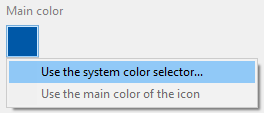

このページではアプリの主な情報を定義することができます。

## ターゲットOS

アプリをビルドしたい対象のモバイルOSを選択して下さい。 この設定はモバイルエディター内で利用可能なオプションを定義します。

- macOS では、**Android** 、 **iOS** 、または **両方のOS** を選択することができます。
- Windows では、**Android** ターゲットのみを選択することができます。

## 組織

**名前:** あなたの会社の名前か、あなたの名前を入力します。

**識別子:** あなたの組織のバンドルの識別子を入力して下さい。 これはあなたのアプリケーションを識別するのに使用されます。 入力された製品名は逆ドメインサービス表記を使用して連結され、"バンドルID"となります(以下の**ID** を参照して下さい)。 バンドルIDはアプリ固有のものでなければなりません。

例えば、あなたの会社の名前が"MyCompany"で、あなたのアプリの名前が"MyApp"だった場合、"com.MyCompany"を組織のバンドル識別子として選択することができ、その場合あなたのパル位のバンドルIDは"com.MyCompany.MyApp"となります。

:::note

バンドルID名には、スペースや"*,%,/" などの特殊文字を含めてはいけません。 これらは自動的に除去され - で置き換えられます。

:::

## プロダクト

**名前:** あなたのアプリの名前です。 上記にあるように、プロダクト名が"バンドルID"を作成するのに使用されます。 バンドルIDは、Apple 開発アカウントで作成したバンドルIDを同じものでなければなりません。

:::note

バンドルID名には、スペースや"*,%,/" などの特殊文字を含めてはいけません。 これらは自動的に除去され - で置き換えられます。

:::

**バージョン:** あなたのアプリのバージョンです。 バージョン番号は1.0から増やしていき、シーケンシャルな順番で追加して下さい。

**ID:** (バンドルID): このエリアは、組織識別子とプロダクト名が組み合わされて自動的に生成されます。 これは直接編集することはできません。

**Copyright:** あなたのアプリの著作権表記です。 モバイルエディターには著作権表記フォーマットが記入されていますが、独自の表記を作成することも可能です。

**アイコン:** アプリ内の様々な場所で使用されるマスターアイコンです。 必要なのはアイコンを指定することだけです。あとはモバイルエディターが標準のモバイルガイダンスに従って必要なフォーマットを全て生成してくれます。

アイコンを選択するには以下の方法があります:

- アイコンエリアにピクチャーを直接ドラッグドロップする
- 画像メニューを使用してピクチャーを選択またはコピーする

またエリアをダブルクリックすることでもピクチャー選択ダイアログボックスを表示することができます。

:::note

Windows では、"画像ファイル" (*.public.image) を使用する必要があります。

:::

アイコンが選択されると、モバイルエディターはアプリに必要なアイコンを全て自動的に作成します。 生成されたアイコンフォーマットは、画像メニューの**アイコンフォルダを表示** を選択することでアクセスできます。

### メインカラー

このメニューを使用すると、あなたのアプリのメインカラーをどのように定義するかを選択することができます。 メインカラーは、あなたのアプリのカスタムカラースキームを生成するのに使用されます。

- **システムのカラーセレクターを使用**: システムのカラーピッカーを表示し、そこからメインカラーを指定できます。
- **アイコンのメインカラーを使用**: 選択されたアプリのアイコンからモバイルエディターに自動的にメインカラーを決定させます。

"アイコンのメインカラーを使用"をクリックすることで、いつでもメインカラーをリセットしてアイコンのプリセットのメインカラーへと戻すことができます。

## デベロッパー

**名前:** このフィールドはあなたのユーザーアカウント名で自動的に記入されています。 ここの名前は自由に記入することができます。

**部署名:** あなたのデベロッパーアカウントチームID。これは開発フェーズを通して使用されます。 このIDはデベロッパーアカウントから取得することができます。
