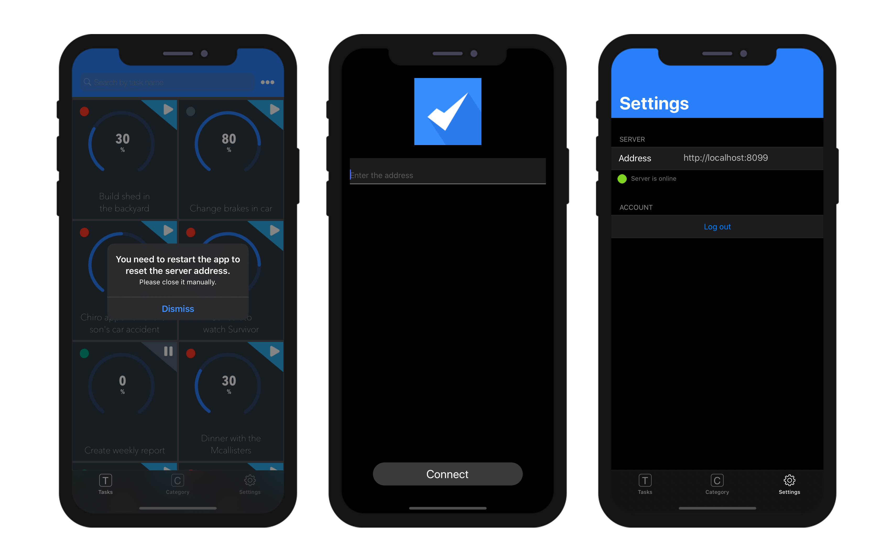

このページでは、アプリの公開設定および特殊なモバイル機能にアクセスすることができます:


## プロダクションURL

製品コンテキストにおいて、モバイルアプリがデータの読み書きを行うWebサーバーのURLです。 有効な任意のアドレスを入力することができます。例:

```
https://my.wesbsite.com
http://my.website.com:9200
www.website.com/mobile
```

開発フェーズにおいては、ここのエリアを空のままにし、[データソース](data.md) を**カレントデータファイル** に設定する事ができます。

:::ヒント

ユーザーはモバイルデバイスから[サーバーURL を変更する](#modify-remote-url) 事が可能です。

:::


## Webサーバー設定

**編集...** ボタンをクリックすると4D データベース設定の**Web** ページが開きます。 このページを使用して、モバイルアプリに埋め込む以下の設定を定義することができます:

- **HTTPを有効化** オプションおよび**HTTP ポート**
- **HTTPSを有効化** オプションおよび**HTTP ポート**

:::note

HTTP とHTTPS の両方が有効化されていた場合、HTTP が使用されます。

:::

HTTPS ポートを有効化するためには、有効な[TLS 証明書](https://developer.4d.com/docs/en/Admin/tls.html) をインストールする必要があります。 4D を使用してテスト用証明書を作成することもできます。

これらの設定は、[プロダクション URL](#production-url) が定義されている場合にのみ使用されます。 それ以外の場合には、ローカルID アドレスが使用されます。

:::note

シミュレーターは必ずローカルに動作します(127.0.0.1 または localhost)

:::

## デバイス上での見た目

### 設定画面

設定画面はタブバーから利用可能です。 また必要であれば(*例* アプリ内にテーブルが4つあるなど)、その他タブ内にもあります。

設定画面を使用すると、以下のようなことが可能になります:

* リモートのURLとその状態を確認する
* ログアウトする(認証されたユーザーとしてログインしていた場合)


### リモートURLを変更する

リモートURLはiPhoneの設定から容易に更新することができます:

* iPhoneの設定を開く
* リモートURLを更新したいアプリを選択
* "サーバーアドレスをリセット"オプションをタッチ


* その後アプリを再起動してサーバーアドレスをリセット
* 最後に新しいリモートURLを新たに定義




## 機能

このエリアを使用するとモバイルアプリの複数の特殊な機能を選択し設定することができます。 これらの機能はそれぞれの専用の章に詳細な説明があります:

- [認証](../special-features/authentication.md)
- [プッシュ通知](../special-features/push-notification.md)
- [ディープリンク](../special-features/deep-linking)


