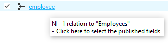
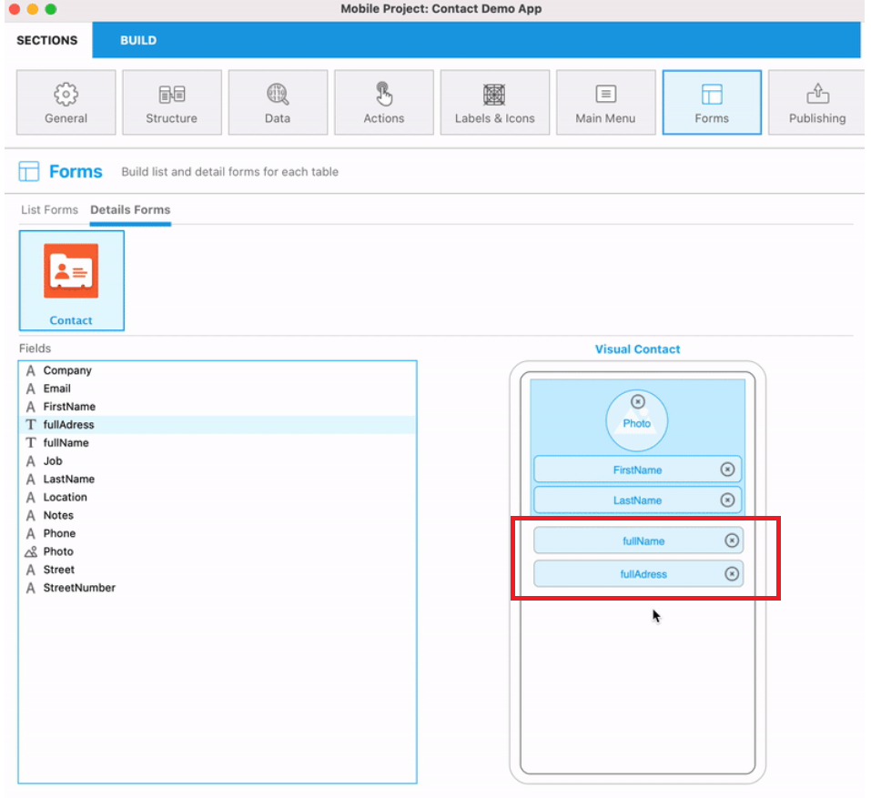
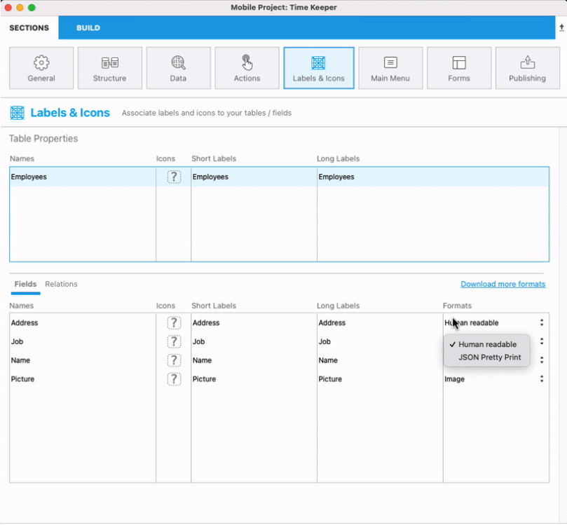

このページでは、4Dデータベース内でREST リソースとして公開されている全てのテーブルとフィールドが表示されます。これには(N対1および1対Nリレーションに基づいた) リレーション属性も含まれます。 実際の表示は、[ORDA のデータストア](https://developer.4d.com/docs/ja/ORDA/overview.html) にとても近いものが表示されます。


このページを使用すると、公開したい特定のテーブルおよびフィールドを選択することにより、実際のストラクチャーからモバイルデバイスに複製したいサブセットを定義することができます。

- 公開されているテーブルは自動的にアプリのタブとして追加されます。
- 公開されているスカラー値のフィールドは[リストフォームおよび詳細フォーム](https://developer.4d.com/go-mobile/docs/project-definition/forms/) を定義する際に利用できます。
- 公開されているリレーションフィールド(N対1および1対Nリレーション)も、[リストフォームおよび詳細フォーム](https://developer.4d.com/go-mobile/docs/project-definition/forms/) を定義する際に利用でき、リレーションボタンといった追加のナビゲーション機能もついてきます。


:::note

以下のテーブルとフィールドはこのページには表示されません。

- [ORDA ルール](https://developer.4d.com/docs/ja/ORDA/dsmapping.html#%E3%82%B9%E3%83%88%E3%83%A9%E3%82%AF%E3%83%81%E3%83%A3%E3%83%BC%E3%83%9E%E3%83%83%E3%83%94%E3%83%B3%E3%82%B0) に則っていないテーブルやフィールド。
- "`__`" (ダブルアンダースコア) で始まる名前を持つテーブルやフィールド。

:::

:::note

時間によって値が変化していく計算属性(同じデータクラスの他の属性にのみ依存している計算属性) のみがモバイルアプリ側で更新されます。

:::

## 公開するテーブルとフィールドを選択する

A table is published when at least one of its fields is published. When a table is published, it is displayed in **bold**.

To select a field to publish, click on a table name then click on the field in the rightmost list. You can also:

- **スペースバー** を押すことでフィールドを選択/選択解除することができます。
- **Ctrl+クリック** を使用することで全てのフィールドを選択することができます。
- フィールド一覧の**公開** および **全て公開** ローカルメニューを使用して公開することができます。


### リストのフィルタリング

When a list has the focus, you can filter its contents using the Search area and a local menu:


- **Search** area: enter the characters to search within table or field names
- **Sort by table name**/**Sort by field name**: sort the list by name. By default, lists are sorted by creation date
- **Only published tables**/**Only published fields**: show only tables or fields that have been selected (published)


## Supported field types

The mobile editor automatically displays the list of fields that are eligible to the mobile app, depending on their type:


- All [4D scalar field types](https://developer.4d.com/docs/en/Concepts/data-types.html) except [BLOB](https://developer.4d.com/docs/en/Concepts/blob.html).
- [Object fields](https://doc4d.github.io/go-mobile/docs/next/project-definition/structure/#object-attributes)
- [Computed attributes](https://developer.4d.com/go-mobile/fr/docs/project-definition/structure#computed-attributes)
- Relation attributes (Many-to-one and One-to-many) are supported and can be selected just as fields. They have specific icons:

Many to one relation icon:  

One to many relation icon: 

:::info

The names are based upon the relation names in the 4D Structure editor, see the [ORDA Structure mapping page](https://developer.4d.com/docs/en/ORDA/dsmapping.html#structure-mapping).

:::


## Using relations

### One to Many relations

You can include **One to Many relations** in your projects and display a list of related fields in a new page of your app.

All you have to do is:

* publishing at least one field of the target (Many) table
* publishing the relation from the source (One) table


Then, when your related fields are published, they can be used like any other field. So you will be able to:

* Define relations properties in the [Labels and Icons](labels-and-icons.md) page.
* Drop the One to Many relation in a Detail form from the [Forms](forms.md) page to create a link between a detail form and a related table. A Relation button will be automatically created in detail forms to go straight to the related view.

:::tip Tutorial

See the [**One to Many relations tutorial**](../tutorials/relations/one-to-many-relations) for a detailed example of One to Many relation integration in a mobile project.

:::


### Many to One relations

**Many to one relations** can be used like any other field in the app creation process. When you select a Many to One relation in the field list, you can to select which field(s) from the related table to publish in your app:



You just need to click on the relation name, then select the field(s):


By default, all eligible fields of the related table are published.

:::tip Tutorial

See the [**Many to One relations tutorial**](../tutorials/relations/many-to-one-relations) for a detailed example of Many to One relation integration in a mobile project.

:::


### Many to Many relations

Using the Structure page, you can publish Many to One and One to Many relations from your parent Many to One relations. It means that you can display Many to Many relations in your app and move directly from a List form to another List form.


:::tip Tutorial

See the [**Relation interactions**](../tutorials/relations/relation-interactions) for a detailed example of Many to One relation integration in a mobile project.

:::

## Computed attributes

Whether you're working on Android or iOS, you can display [computed attributes](https://doc4d.github.io/go-mobile/docs/next/project-definition/structure/#computed-attributes) in your app once it is generated, by configurating them from the project editor.

In 4D for iOS and 4D for Android, [computed attributes](https://developer.4d.com/docs/en/ORDA/ordaClasses.html#computed-attributes) are the result of several fields combined into one field. You will then be able to use this computed attribute as any other field in your mobile app creation process, which means that you will visualize and publish it from the Structure section. For instance, instead of having two splitted attributes such as the street number and the street name, or the first name and the last name, you can gather both of them in a single attribute that you can name "fullAddress" and "fullName".

The process is actually quite simple!

### 4D Side

In your code, specify the attributes you want to use and the computed attribute you want to get, using the [*Class extends*](https://developer.4d.com/docs/en/Concepts/classes.html#class-extends-classname) and [exposed Function](https://developer.4d.com/docs/en/ORDA/ordaClasses.html#exposed-vs-non-exposed-functions) syntax, as follows:

```4d 
Class extends Entity

exposed Function get fullName->$fullName : Text
    $fullName:=This.FirstName+" "+This.LastName

exposed Function set fullName($fullName : Text)
$splitName:=Split string($fullName; "/")
If ($splitName.length=2)
    This.FirstName:=$splitName[0]
    This.LastName:=$splitName[1]
Else 
    // ERROR    
End if

exposed Function get fullAddress->$fullAddress : Text
    $fullAddress:=This.StreetNumber+" "+This.Street+" - "+This.Location

exposed Function set fullAddress($fullAddress : Text)
$splitAddress:=Split string($fullAddress; "/")
If ($splitAddress.length=3)
    This.StreetNumber:=$splitAddress[0]
    This.Street:=$splitAddress[1]
    This.Location:=$splitAddress[2]
Else 
    // ERROR    
End if
 ```

### Project editor side

In the project editor, once the code is written, your computed attributes become available, ready to be published and used as any other field in the creation process:


In the **Structure** panel:

The `exposed` computed attributes are displayed in the list of attributes of a `dataclass`.


In the **Label & Icons** panel (Icons/short and long labels/formats):


In the **Forms** panel:

The computed attributes present in the data model are, like the fields, available in the list of fields of the Forms panel (list and detail). They behave in the same way as the storage attributes of the datastore.



In the **Data** panel, computed attributes are displayed in the list linked to the "Fields" button of the query filter box.

:::note 4D for iOS

- Computed attributes can be used with Sort actions.
- A computed attribute without a setter (readOnly) is not available for an Add or Edit action.
- When Add or Edit presets actions are created (if the setter is available and if 4D allows it), computed attributes parameters shall be available when linked to a field.

:::note 4D for iOS

### Mobile app side

In the generated mobile application, on iOS or Android, both single attributes and computed attributes are displayed.


## Object attributes

From the **Structure** section, you can select, use and display all [types](https://developer.4d.com/go-mobile/docs/project-definition/structure/#supported-field-types) of attributes in your mobile projects (text, dates, time, integers, etc), including **[object attributes](https://developer.4d.com/docs/en/Concepts/object.html)** (JSON format). In the field list, object attributes are distinguished by their **{}** icon.


You can use an object attribute as any other field in the other sections of the project editor (Data, labels & icons, Forms, etc. except for the Actions section).

From the **Labels&Icons** section, two formats are available to display your object attributes:

- **Human-readable** (YAML): the default format that displays a human-readable structured data in the mobile app
- **JSON Pretty Print**: the format that displays an indented JSON in the mobile app



Here's the result on the generated app:


### フィルタークエリ

You can use [filter queries](https://developer.4d.com/go-mobile/docs/project-definition/data#filter-queries) specific to object attributes in order to return and display filtered data. To do so, simply insert your attribute and property in the Filter query of the **[Data](https://developer.4d.com/go-mobile/docs/project-definition/data)** section.

For instance, consider a Clients table with an Address object-type attribute containing several objects with the following key/values:


```4d
{
    $Obj:=New object
    $Obj.name:="4D SAS"
    $Obj.address1:="66 rue de Sartrouville"
    $Obj.address2:="Parc les Erables, bâtiment 4"
    $Obj.zipCode:="78230"
    $Obj.city:="Le Pecq"
    $Obj.country:="France"
    $Obj.phoneNumber:={
        "OfficePhone":"+33 1 30 53 92 00"
        "HomePhone":"+33 1 30 53 92 00"
    }
    $Obj.email:=[
        "john@test.com"
        "john@4d.com"
    ]
    $Obj.website:="fr.4d.com"
}
```


#### Filter by a simple object's value

If you want to display data filtered by an object, such as a list of your clients only based in France, you need to filter your query by country to get only the records containing the `France` value. Therefore, insert the following syntax in the Filter query field:

```4d

Address.country = "France"

```
#### Filter by a collection's value

If you want to display data filtered by an element of a collection, such as a specific client's email contained in a collection, you need to filter your query by email to get only the records containing the `john@4d.com` value. Therefore, insert the following syntax in the Filter query field:

```4d

Address.email[] = "john@4d.com"

```


## Incremental reload

### Allow structure adjustments

For the best user experience, 4D for iOS and 4D for Android implement an automatic feature for the incremental reload of data. It means that only new, modified or deleted data from the database will be updated to the app. This optimization enhances drastically loading time.

To enable this optimization, 4D for iOS and 4D for Android need the following structure elements:

* A `__DeletedRecords` table to store deleted records
* and `__GlobalStamp` fields to store modification stamps for each published table in your mobile application

You can let the 4D mobile editor do all the work for you and add the necessary structure elements: just select **Allow 4D to make necessary structure adjustments for an optimized mobile data update** option.

:::note

These optimizations are required for both local and server databases.

:::

### Pull to refresh

On the mobile app side, your data is updated each time you launch your app and each time your app goes foreground, to get constant updated data.

In normal use, simply swipe down from any listform to reload your data.

From iPhone settings, you can reset your app data and find information about your app.

:::note

When an important maintenance operation is performed on the database side (Recover by tag / Restoration / Compacting) a Full reload is necessary on the mobile app. In this case, the admin shall notify mobile app users.

::: 


