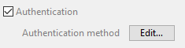

## 認証を有効化する

モバイルアプリは、ユーザー認証を要求できます。

- 認証が有効化されていない場合、モバイルユーザーはゲストモードでアプリを使用します。
- 認証が有効化されていると、モバイルユーザーはアプリ接続前にログインを求められます。

:::info

いずれの場合も、モバイルユーザーがサーバーに接続すると、[ユーザーセッション](session-management.md) が作成されます。

:::


認証を有効化するには、[公開](../project-definition/publishing.md) ページの **認証** オプションをチェックします:



このオプションが選択されている場合、モバイルアプリは開始時に[ログインフォーム] を表示します。 モバイルエディターにはデフォルトのログインフォームが用意されていますが、カスタムのログインフォームをデザインすることも可能です。

**作成...** / **編集...** ボタンをクリックすると、4Dメソッドエディターで `On Mobile App Authentication` データベースメソッドを開きます (以下参照)。


### On Mobile App Authentication データベースメソッド

特定のEメールアドレスやデバイスを認証するためには、たとえゲストモードでも[*On Mobile App Authentication*](https://doc.4d.com/4Dv19/4D/19/On-Mobile-App-Authentication-database-method.301-5392844.en.html) データベースメソッドの使用が必須となります。

必要なセッション情報およびユーザー情報 (メールアドレス、アプリ情報、デバイス、チームID、等) をすべて取得するのに使えるメソッドのテンプレートが提供されています。 自分の用途に合わせてこのメソッドをカスタマイズできます。

`On Mobile App Authentication` データベースメソッドのテンプレート:

```4d
// On Mobile App Authentication database method
// Default template

var $0 : Object
var $1 : Object

var $request; $response : Object

$request:=$1  // Information provided by mobile application
$response:=New object  // Information returned to mobile application

// Check user email
If ($request.email=Null)
    // No email means Guest mode - Allow connection
    $response.success:=True
Else 
    // Authenticated mode - Allow or not the connection according to email or other device property
    $response.success:=True //access allowed
    // to deny access :
    // $response.success:=False 
End if 

// Optional message to display on mobile App.
If ($response.success)
    $response.statusText:="認証に成功しました"
Else 
    $response.statusText:="このアプリを使用する権限がありません"
End if 

$0:=$response
```


## メール認証

モバイルユーザーを認証する最も一般的な方法は、メール認証を使用することです。

メールアドレスの所有者を確認し、不正なメールの使用を回避することができます。

### 概要

この方法は、次のように機能します:

#### 1. 認証を有効化する

ログインフォームをアプリで使用するため、公開ページの **認証** オプションを選択します。 デフォルトのログインページを使用するか、カスタムのログインページをインストールできます。


#### 2. メールアドレスを入力する

アプリ開始時にメールを要求されます。 When a user enters their email and clicks on the **Login** button, the `On Mobile App Authentication` is called and the user's session status should be updated to a "pending" status. その後、ユーザーに認証メールが送信されます。

#### 3. メールボックスを確認して、4. リンクをクリックする

ユーザーは、受信した認証メールの認証リンクをクリックします。 これにより、[`On Web Connection`](https://doc.4d.com/4Dv19/4D/19/On-Web-Connection-database-method.301-5392847.ja.html) データベースメソッドが呼び出され、[ユーザーセッション](session-management.md) のステータスが "pending" から "accepted" に更新されます。

#### 5. および 6. アプリに戻る

認証完了後、ユーザーはアプリに戻って **Login** ボタンをクリックします。 `On Mobile App Authentication` メソッドが再度呼び出されますが、今回はユーザーのセッション状態が "accepted" なため、アクセスが許可されます。

一連の流れを図に表しました:


この手順には、特別なコンポーネントを使用するか、手動で処理することができます。


### 4D Mobile App Server コンポーネントの使用

The [4D Mobile App Server](https://github.com/4d-for-ios/4D-Mobile-App-Server/tree/master) component is a toolbox component developed to help you manage several common mobile features. It provides methods for authenticate email logins.


1. Call the `Mobile App Email Checker` method from the `On Mobile App Authentication` database method with the information provided by the mobile application:

```4d
// On Mobile App Authentication database method

C_OBJECT($0)
C_OBJECT($1)
$0:= Mobile App Email Checker($1)
```

2. Call the `Mobile App Active Session` method from the `On Web Connection` database method with the `Session` ID parameter retrieved from the URL:

```4d
// On Web Connection database method

C_TEXT($1)
Case of 
: (Mobile App Active Session($1).success)
    //add log if you want
End case 

```

It's as simple as that!

You will find more information in the [Email Checker method documentation](https://github.com/4d-for-ios/4D-Mobile-App-Server/blob/master/Documentation/Methods/Mobile%20App%20Email%20Checker.md).


### Without the Component

You can implement your own email authentication without using the 4D Mobile App Server component. Here a basic example:

1. In the `On Mobile App Authentication` database method, write the following code:


```4d
// On Mobile App Authentication database method


C_OBJECT($0;$1;$response;$request;$email;$status)

  // parameters settings come from the mobile app
$request:=$1

  // Create an email with an activation URL
$mail:=New object
$mail.from:="myapplication@gmail.com"
$mail.to:=$request.email  // email entered by the user on their smartphone
$mail.subject:="Login confirmation"
$mail.htmlBody:="<a href=\"https://myserverapplication/activation/"+$request.session.id \
+"\">Click Here to confirm your email.</a>\"<br>"

  // Send mail
$smtp:=New object("host";"smtp.gmail.com";"user";"myapplication@gmail.com";"password";"xxx")
$transporter:=SMTP New transporter($smtp)
$status:=$transporter.send($mail)

  // Configure response for the mobile app
$response:=New object

  // Declare that the current session is being verified
$response.verify:=True

  // Check if the email was successsfully sent
If ($status.success)
      //create a share object to contain our sessions, accessible from all processes
    If (Storage.pendingSessions=Null)
        Use (Storage)
            Storage.pendingSessions:=New shared object
        End use 
    End if 

    Use (Storage.pendingSessions)
          //Add a session to our session lists
        Storage.pendingSessions[$request.session.id]:=$request.team.id+"."+$request.application.id
    End use 

    $response.success:=True
    $response.statusText:="Please check your mail box"
Else 
      // Display an error message on the smatphone
    $response.statusText:="The mail is not sent please try again later"
    $response.success:=False
End if 

$0:=$response

```

2. In the `On Web Connection` database method, write some code to activate the session after the user clicked on the link in the confirmation email.

```4d
// On Web Connection database method

C_TEXT($1;$2;$3;$4;$5;$6)

C_TEXT($token;$session)
C_OBJECT($sessionFile;$sessionObject)

If ($1="/activation/@")
    $token:=Substring($1;13)
End if 


  //get session from ID received from URL
If (Storage.pendingSessions#Null)
    $session:=Storage.pendingSessions[$token]
End if 

If ($session#"")
      //get session folder
    $sessionFile:=Folder(fk mobileApps folder).folder($session).file($token)
    $sessionObject:=JSON Parse($sessionFile.getText())
      //update status value
    $sessionObject.status:="accepted"
    $sessionFile.setText(JSON Stringify($sessionObject))
    Use (Storage.pendingSessions)
          //delete pending session
        OB REMOVE(Storage.pendingSessions;$token)
    End use 

    /*
        The MOBILE APP REFRESH SESSIONS command checks all mobile
        application session files located in the MobileApps folder of the server, 
        and updates existing session contents in memory for any edited files.
    */

    MOBILE APP REFRESH SESSIONS

    WEB SEND TEXT("You are successfully authenticated")
Else 
    WEB SEND TEXT("Invalid session")
End if 
```

### Remote url definition

By default, a remote server URL is defined in your Android app. In case the URL is not correct, the server will not be accessible. Therefore, to modify or update this URL, just make a long pressure on the icon in the login screen, or from the settings tab. Once you press the icon, a message is displayed with the remote url address and the server access status. You will then be able to edit the URL, authenticate successfully and access the server.

On iOS, you can edit the remote server URL from the iOS device Settings screen. You just need to check the "Reset server address" option to enter the correct server address.

