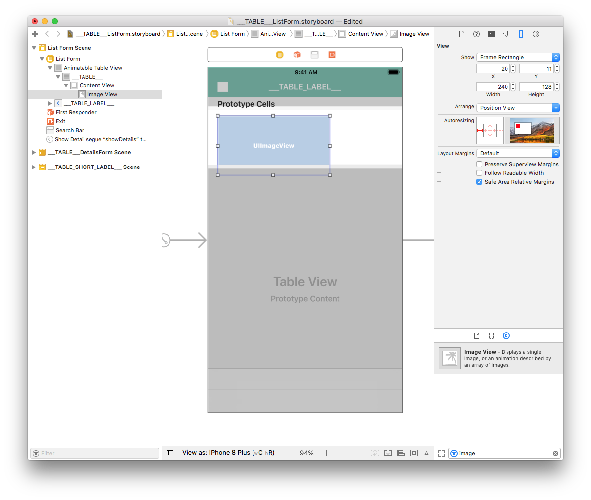
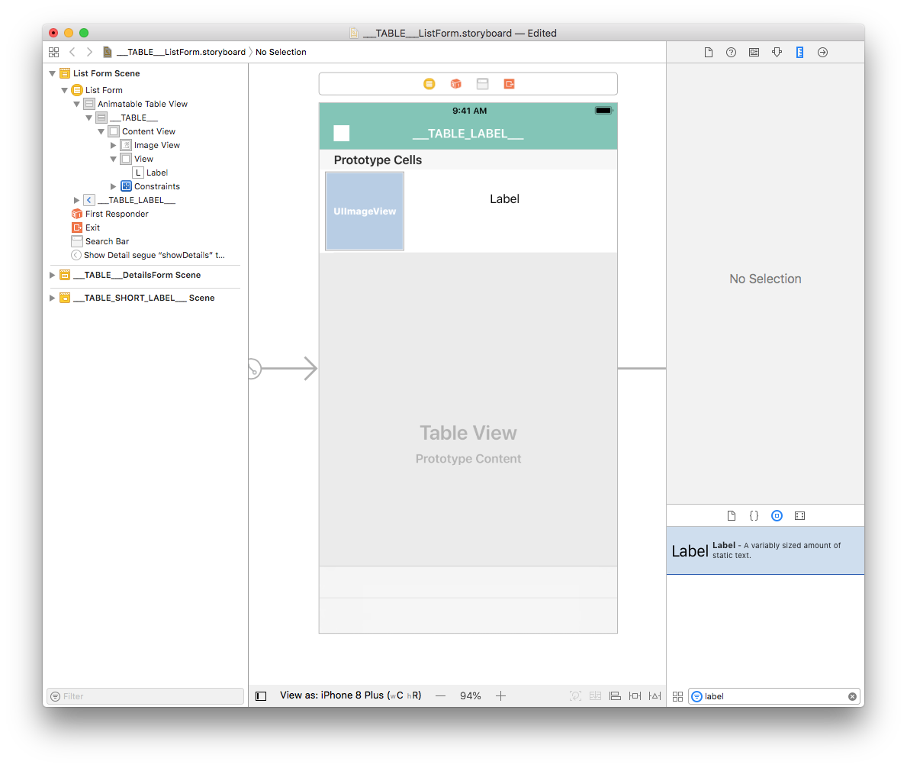
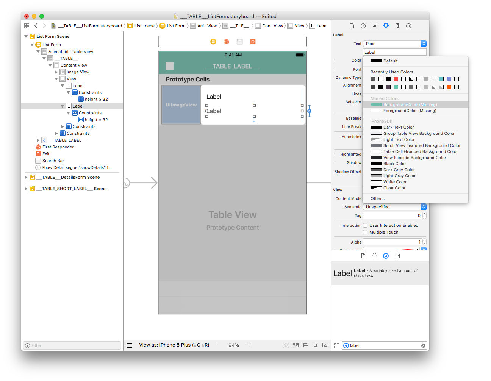
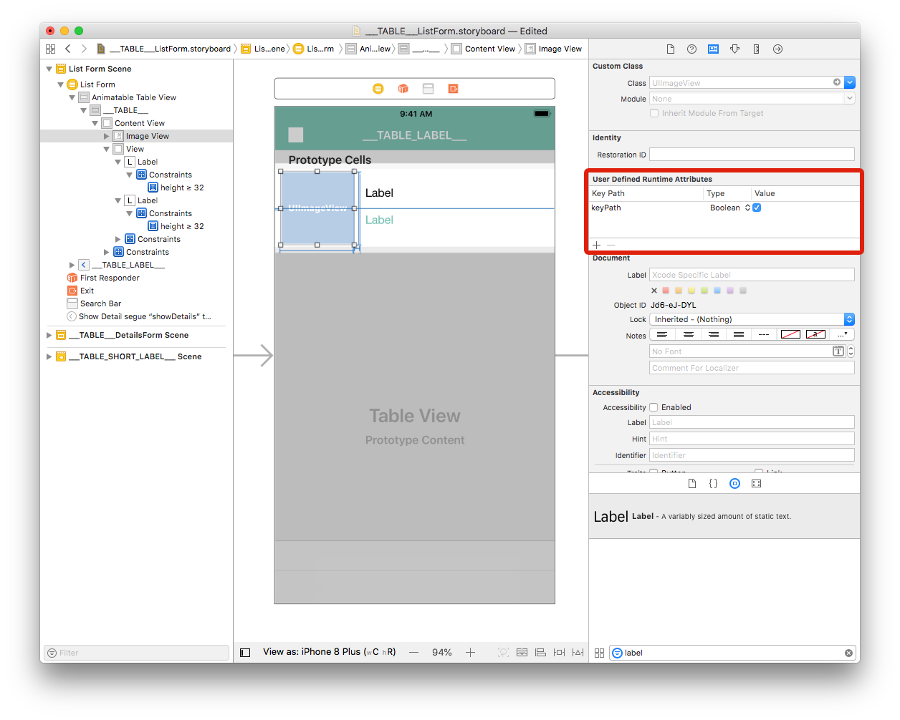
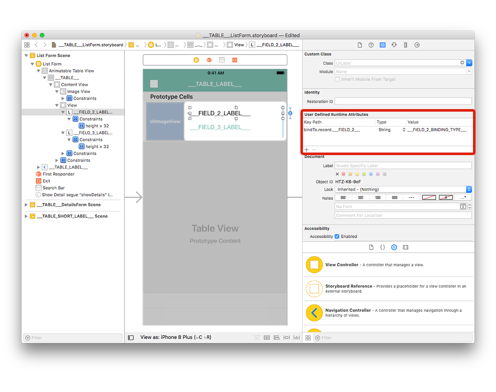

Now it's time to create your iOS list form interface with Xcode.

完成イメージ

セル内に表示されるフィールドのレイアウトをデザインしましょう。

* アイコン
* タイトル
* サブタイトル

## ストーリーボードをXcodeで開く

storyboardファイル（拡張子は非表示かもしれません）をXcodeで開きます。

It's quite empty, so let's add some content!

## Add an Image View

Let's begin by **adding a View**. Search for "View" in the **Object library** and drag it into the cell container.

From the **Size inspector panel** (on the right side of the Interface Builder window), set the Image View Width value to 110 and the Height value to 110. また，X座標を8に，Y座標を3に設定します。

Next, add a constraint (Leading: 8) by clicking on the **Add New Constraints button** (at the bottom of the Interface Builder window). WidthおよびHeightのチェックボックスをクリックし，幅と高さに固定値の制約を追加します。

Finally, click on the **Align button** (at the bottom of the Interface Builder window) and check the "Vertically in Container" checkbox.

Your Image View is now well positioned.

セル内に表示されるラベルのほうに目を向けましょう。

## タイトルおよびサブタイトルのラベル

Select your Image View and go to **Identity inspector** > User Defined Runtime Attributes. Click the **+ button** to add a row.

From the **Size inspector panel** (on the right side of the Interface Builder window), set the View Width value to 277 and the Height value to 94. また，X座標を126に，Y座標を10に設定します。

For the Image View, add four constraints by clicking on the **Add New Constraints button** (Trailing: 11, Leading: 8, Top: 11, and Bottom: 10.67) for the view to be well positioned, as shown:

Viewの上にObject LibraryからLabelをドラッグ＆ドロップします。

From the **Size inspector panel**, set the Label View Width value to 269 and the Height value to 32. Then set the X value to 8 and the Y value to 8.

**Duplicate the label** and in the **Size inspector panel**, set the X value to 8 and the Y value to 48.

Select both labels add four constraints by clicking on the **Add New Constraints button** (Trailing: 0, Leading: 8, Top: 8, and Bottom: Multiple) as shown:

With a label selected, double-click on the **Height constraint** to edit it.

Change the relation from Equal to **Greater Than or Equal** so it can have a variable height (to handle multiline labels).

他方のラベルに対しても同じことをします。

## Label customization

ラベルのフォントカラーは， Attribute inspector（ウィンドウ右側パネルのルーラーアイコンをクリック）でカスタマイズすることができます。 Let's make the second label **Dark Grey Color** :

表示される色見本の中からBackground Colorを選択すれば，アプリの支配的なカラーに設定することができます。

同じ要領で，フォントもカスタマイズすることができます。 Select both labels and select Font > Custom > **Helvetica Neue**:

To complete the customizations, select both labels and **enter 0 for Lines** in the inspector window. これでラベルに表示できる行数が無制限となります。

:::note

The provided storyboard is optimized to have a **variable cell height** depending on the contents of each cell.

:::

## セルにフィールドが表示されるようにセットアップする

### Image View

Select your Image View and go to **Identity inspector** > User Defined Runtime Attributes. Click the **+ button** to add a row.

* **Key Path**: Begin with bindTo to activate binding on the component. Enter `bindTo.record.___FIELD_1___`

* **Type**: Always `String`

* **Value**: The attribute name. Enter `___FIELD_1_BINDING_TYPE___`

### ラベル

Select the first label and add a row in the Defined Runtime Attributes:

* **Key Path**: `bindTo.record.___FIELD_2___`

* **Type**: `String`

* **Value**: `___FIELD_2_BINDING_TYPE___`

Select the second label and add a row in the Defined Runtime Attributes:

* **Key Path**: `bindTo.record.___FIELD_3___`

* **Type**: `String`

* **Value**: `___FIELD_3_BINDING_TYPE___`

You can change the **storyboard display labels** to have better visibility:

* Double-click the first label to edit it and enter `___FIELD_2_LABEL___`
* Double-click the second label to edit it and enter `___FIELD_3_LABEL___`

Go to your project editor, select your list form template from the Forms section, then select Build and Run.

Here is the simulator result :

## アプリをカスタマイズする

The last step is adding a corner radius to the Image View to have a better design.

Image Viewを選択し，User Defined Runtime Attributesにユーザー定義属性を入力します。

* **Key Path**: `cornerRadius`

* **Type**: `Number`

* **Value**: `12`

その他

* **Key Path**: `layer.masksToBounds`

* **Type**: `Boolean`

* **Value**: Check the box

これでカスタムテンプレートがプロジェクトエディターで使用できるようになりました！

## これからどうする？

In this tutorial, we've covered the basics for creating list form templates with iOS. You are now able to create simple templates on your own using the Starter project ressources. You can also see how to build [detail form templates](../creating-detail-forms/detail-form-template.md).

Download the completed template list folder:

<a className="button button--primary"
href="https://github.com/4d-go-mobile/tutorial-CustomListForm/archive/53ac1d5f506aa4ca2a8d78760ef799044c5c8bdc.zip">Download</a>

