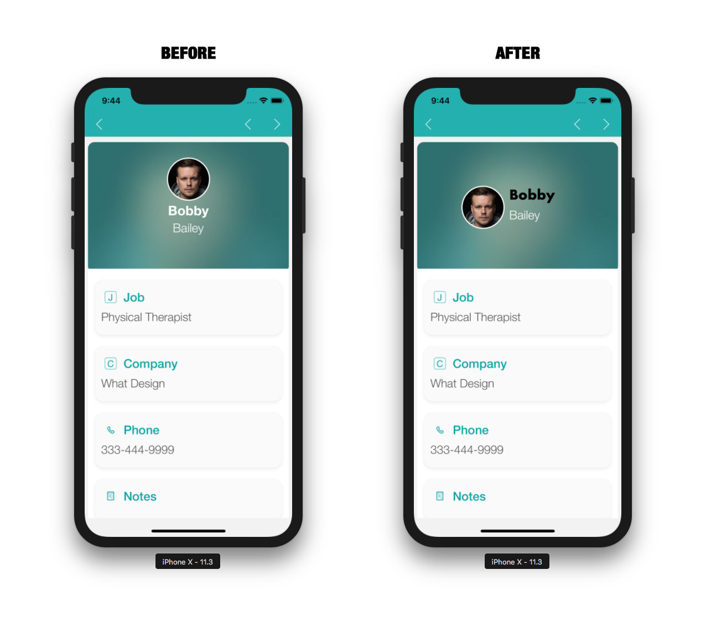
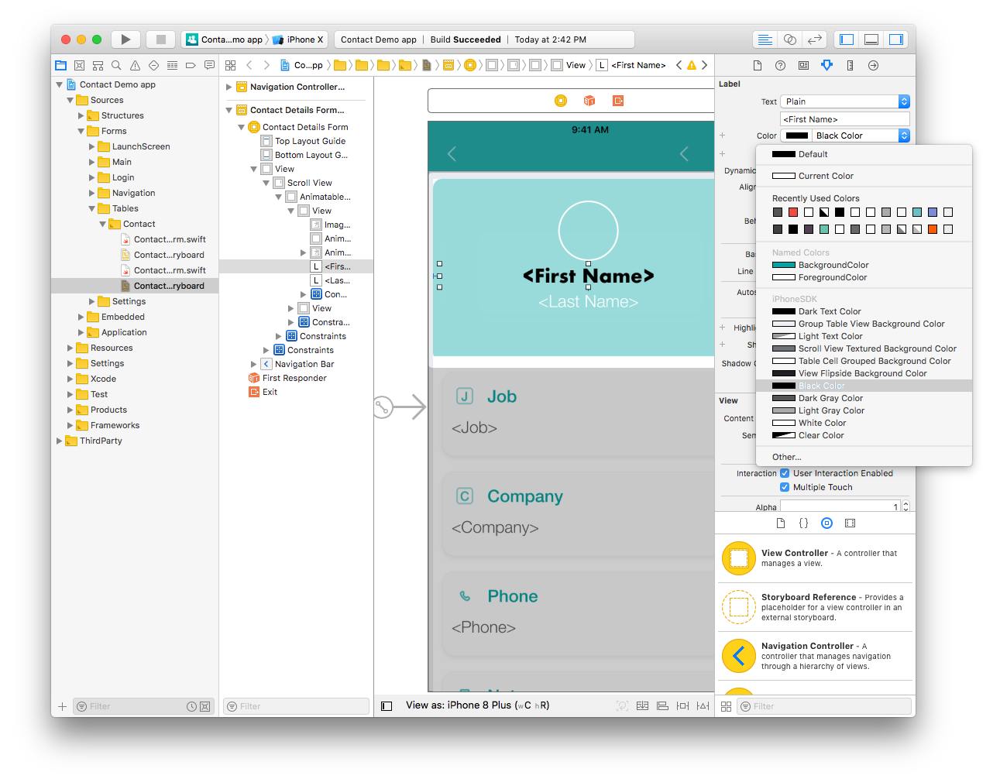
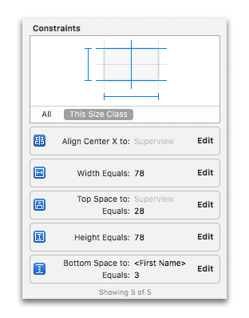
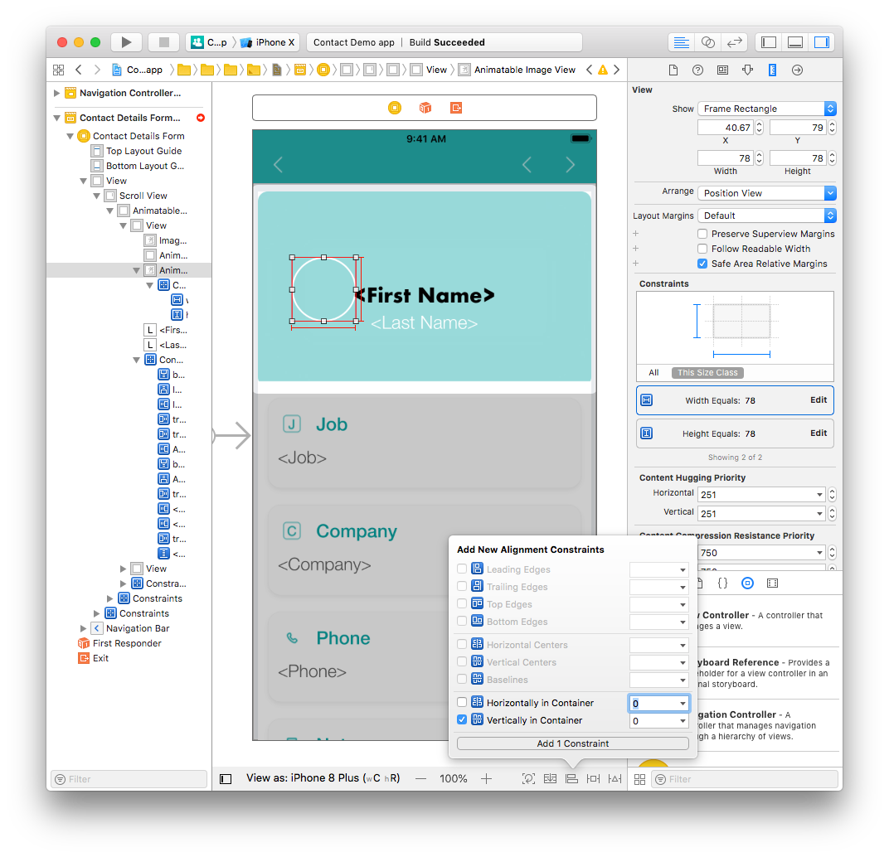
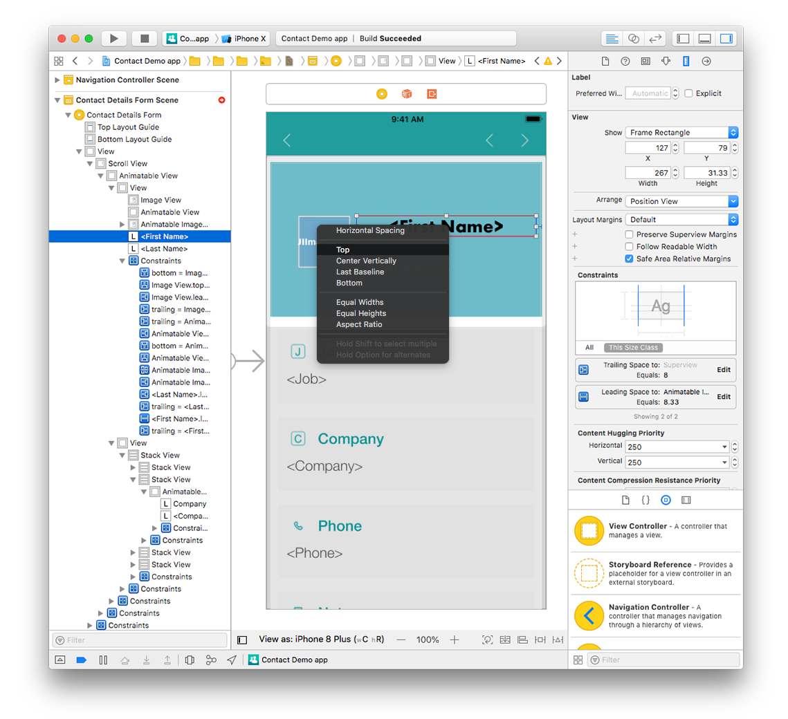
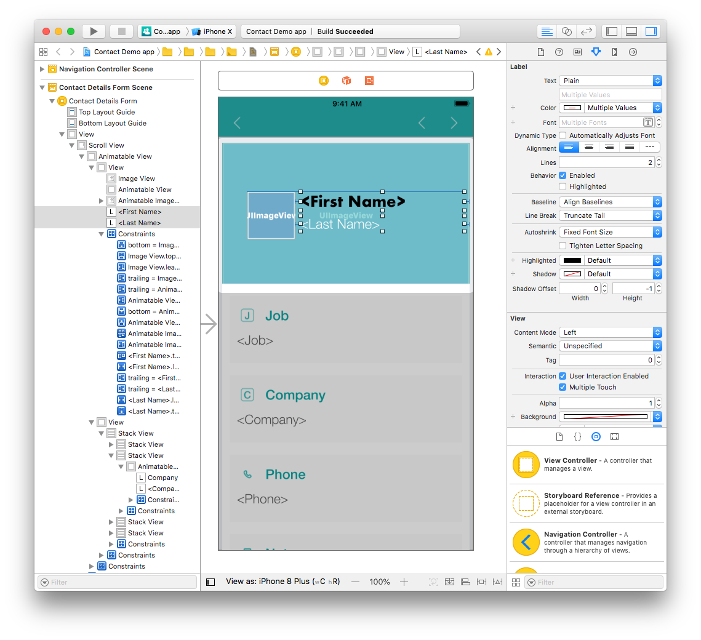
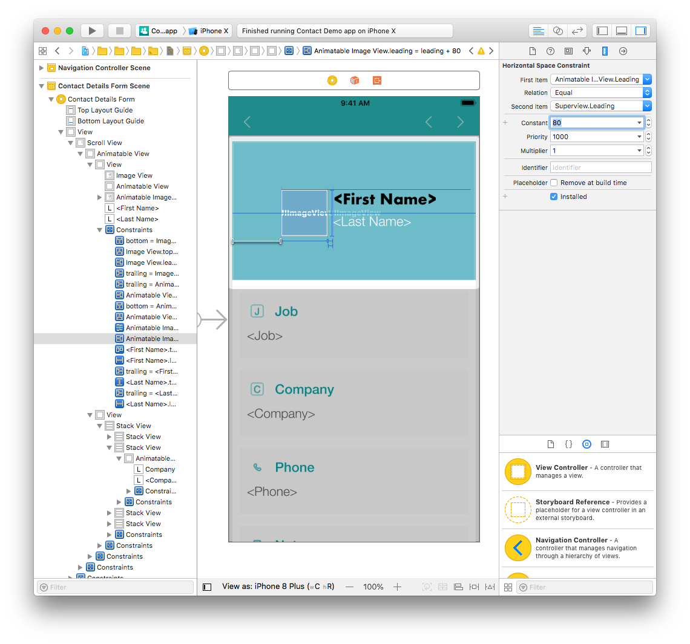

簡単なものから複雑なものまで、ストーリーボードにさまざまな変更を加えてみましょう。

## ⒈ 簡単なラベル変更

まず、ラベルのフォントとカラーを変更するところから始めます:

* Navigation tab から *ContactDetailsForm.storyboard* ファイルを開きます。
* First Name ラベルをクリックします (インターフェースビルダーまたは左ペインからも選択可能です)。
* ユーティリティーエリアで Attribute inspector ペインを選択します。

* フォントを Helvetica Neue Bold から Futura Bold に変更します。

* また、フォントカラーも同じペインで変更できます。

## ⒉ プロフィール画像の位置を変更する

4D for iOS テンプレートは、すべてのデバイスでアプリ要素がうまく表示されるように制約を使用しています。

*ContactDetailsForm.storyboard* ファイルでは、画像・ファーストネーム・ラストネームのラベルがすべて中央揃えになっています。

これが下のように表示されるよう、変更してみましょう:

まず、画像を縦に配置し、ファーストネームとラストネームのラベルを画像の右側にドラッグします。

次に画像を選択し、ユーティリティーエリアから Size inspector ペインを開きます。 X 座標を 161.67 から 40.67 に、Y 座標を 28 から 79 に変更します。

ご覧のように位置は変わりましたが、Xcode には黄色い線が表示されています...なぜでしょう？ この黄色い線は、もはや有効でない制約を表しています。

## ⒊ プロフィール画像の制約を修正する

スーパービュー (画像を含む親ビューのこと) 内で画像を縦中央に配置するには、既存の制約を削除し、新しい制約を追加する必要があります。

この画像には現在、以下の制約があります:

* Width Equals: 78 (横幅 78 ピクセル)
* Height Equals: 78 (高さ 78 ピクセル)
* Align Center X to: Superview (親ビューに対して横中央揃え)
* Top Space to: Superview (親ビューに対する上部スペース)
* Bottom space to: `<First Name>` (画像下辺から First Name ラベルまでの間隔)

Width と Height 以外のすべての制約を削除します (Width と Height は後で Size inspector の Constraints セクションで修正します)。 制約がなくなったため、画像の外枠が赤色に表示されているはずです。

Align ボタン (ウィンドウ下の四角が左揃えされているアイコン) をクリックして、**Vertically in Container** (縦中央揃え) のチェックボックスを有効にします。

次に、**Add New Constraints** ボタン (T に囲まれた四角のアイコン) をクリックし、左側の余白 (Leading Space) の赤い点線をクリックして (実線に変化します) 制約を追加します。

この時点で、プロフィール画像の制約がすべて青色で表示されているはずです。

おつかれさまでした！ プロフィール画像に位置制約が追加され、正しく配置されました。

> **TIPS**
> 
> * 2つのビューの間に制約を作成するには、Ctrlキーを押しながら片方のビューをもう片方のビューにドラッグします。 マウスボタンを離すと同時に、このコンテキストで設定可能な制約の選択肢が表示されます。
> 
> * 制約を削除するには、Interface Builder または Navigation エリア から制約を選択し、Deleteキーで削除します。

## ⒋ ラベルの位置と制約を修正する

#### 今度は、First Name ラベルを修正しましょう。

まずは、位置と幅を変更します:

* Interface Builder で First Name ラベルを選択します。
* 次に、Size inspector で Width を 386 ピクセルから 267 ピクセルに変更します。
* X 座標を 8 から 127 に、Y 座標を 28 から 79 に変更します。

制約も修正しましょう:

* 左と下の余白の制約を削除します。
* Add a leading space constraint by clicking on the **Add New Constraints** button to position the First Name label to the right of the Profile picture.
* Press Ctrl and drag the First Name label to the Profile picture. Select the top constraint in the menu to top align both elements.

#### Finally, we'll work on the Last Name label.

Change the position and width:

* Select the Last Name label from the Interface Builder.
* Change the width from 386 to 267 pixels.
* Change the X value from 8 to 127 pixels and the Y value from 144.33 to 118.33 pixels.

制約も修正しましょう:

* Delete the leading space constraints from the Size inspector.
* Add a leading space and top space constraints by clicking on the Add New Constraints button.

Both of your name labels are now repostioned.

Let's see the results in the Simulator !

Hmmmm. That's not exactly the result we wanted ...

* Select the First Name and Last Name labels and change the alignment from center to left in the Attributes inspector.

* Next, select the Profile picture and double click on the leading space constraint.
* Change the Constant value from 40.67 to 80 pixels.

Much better! Now all constraints are working and the labels aren't breaking other constraints.

As you can see, customizing your app is very simple!
