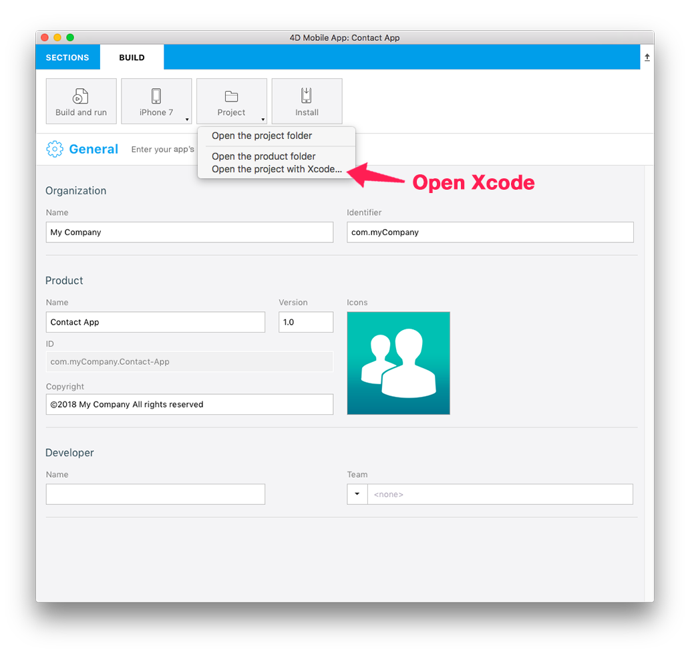

> **OBJECTIVES**
> 
> * Open a 4D for iOS project from the Project Editor.
> * Customize the generated 4D for iOS app.

4D for iOSは，ネイティブiOSアプリを開発するためのコードを出力するので，Xcodeで開いてカスタマイズすることができます。 具体的なプロセスは以下に示されています。

> **NOTE**
> 
> If you customize your project on Xcode and rebuild it from the Project Editor All of your modifications will be lost!

## Xcodeとは？

Xcodeは，macOS上で動く統合開発環境および付随する開発者ツールで構成されており，iPad，iPod，iPhone，Mac用のアプリを作成することができます。

## Download

最新版のXcodeは，App Storeからダウンロードすることができます。

<a className="button button--primary" href="macappstore://itunes.apple.com/app/id497799835?mt=12">View in Mac App Store </a>

デベロッパー登録をすれば，Apple DeveloperのサイトからXcodeのプレビュー版や以前のリリースをダウンロードすることができます。

We'll use the [contact application](../create-your-first-app) we created.

Download the Starter project:

<a
  className="button button--primary"
  href="#">
  Download
</a>

## ⒈ プロジェクトの作成

* まだプロジェクトをビルドしていないのであれば，⒉に進んでください。
* すでにプロジェクトをビルドしたのであれば，⒊に進んでください。

## ⒉ ⒈ プロジェクトの作成

From the Project Editor BUILD tab:

* シミュレーターで起動するiOSデバイスのモデルを選びます。
* Click the **Build and Run** button.

## ⒊ ⒊ ⒊ ⒊ プロジェクトをXcodeで開く

From the Project Editor BUILD tab:

* Click on Project > Open the project with Xcode

Now you're ready to start working on your 4D for iOS project in Xcode.