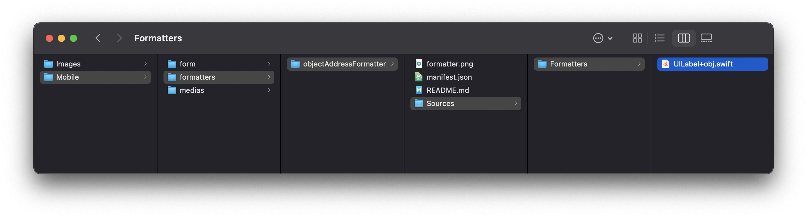
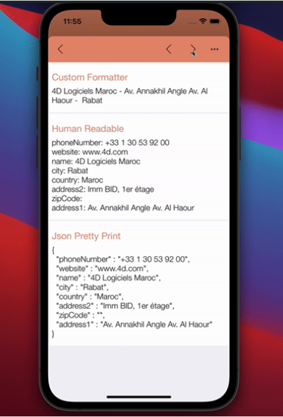

> **OBJECTIVES**
> 
> Create your first data formatters.


### Object attribute Swift formatter

In the following example, we want to display an address getting only relevant values that are available in the following object using a Swift formatter

```4d 
$Obj:=New object 
$Obj.name:="4D SAS" 
$Obj.address1:="66 rue de Sartrouville" 
$Obj.address2:="Parc les Erables, bâtiment 4" 
$Obj.zipCode:="78230" 
$Obj.city:="Le Pecq" 
$Obj.country:="France" 
$Obj.phoneNumber:="+33 1 30 53 92 00" 
$Obj.website:="fr.4d.com"

$Ent:=ds.Employees.get(4)
$Ent.Object_Attribute:=$Obj
$Ent.save()

```

Here is the **manifest.json file**:

```4d
{
    "name": "objectFormatter",
    "binding": "objectAddress",
    "type": "object" 
}

```

To get the number, the street, and the city, let’s build a custom **Swift formatter**:

```4d 
import UIKit
import QMobileUI

extension UILabel {
    @objc dynamic var objectAddress: [String: Any]? {
        get {
            return nil
        }
        set {
            if let newValue = newValue {
                guard let value1 = newValue["name"] as? String,
                      let value2 = newValue["address1"] as? String,
                      let value3 = newValue["zipCode"] as? String,
                      let value4 = newValue["city"] as? String else {
                          return
                      }
                self.text = "\(value1) - \(value2) - \(value3) \(value4)"
            } else {
                self.text = ""
            }
        }
    }
}
```

Putting all that together, you can save this formatter as a **.swift** file in the formatter folder and use it in your mobile project.



Check out the final result:



Since these formatters will soon be available for Android, the default human-readable format will be displayed on the Android app when a Swift formatter is in selection for a field.

Don't hesitate to give us feedbck on the 4D Forum, and check out the documentation for more details!