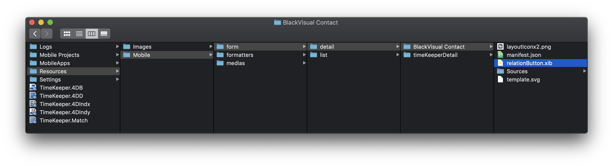
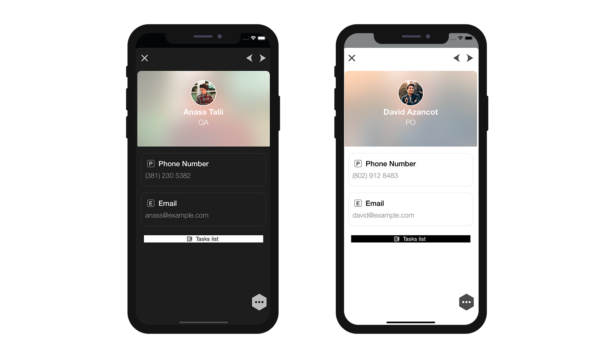
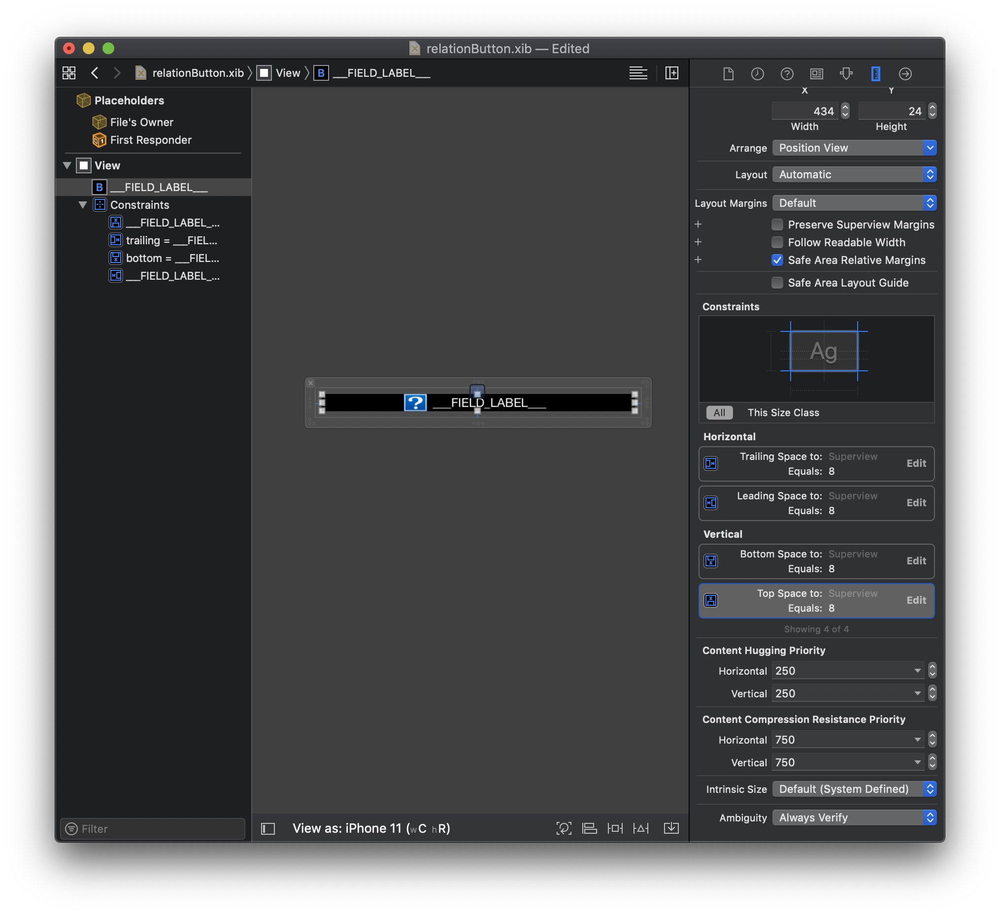
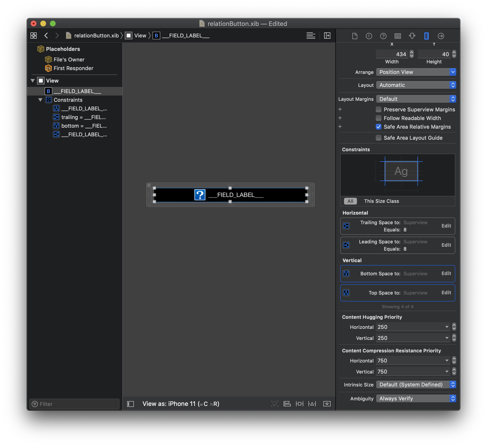
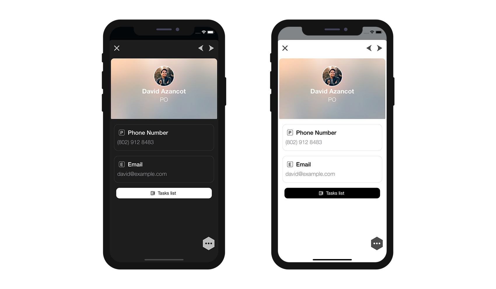
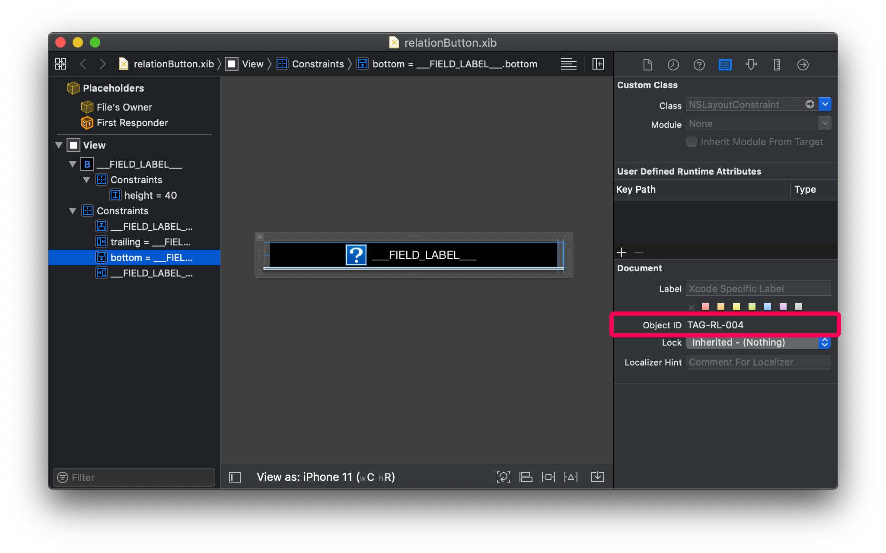
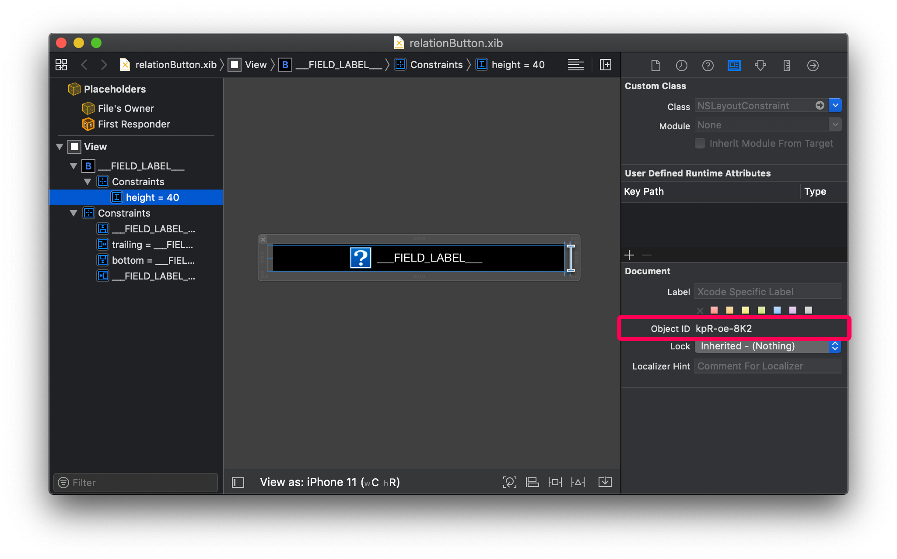

As we have seen with all previous tutorials, the 4D mobile editor give you the freedom to create lots of custom things.

テンプレートやフォーマッターだけでなく，リレーションボタンもカスタマイズできます。

しかも，その手順はとても簡単！ カスタムテンプレートにカスタムボタンをドラッグ＆ドロップするだけです。

Let's get started by downloading the Starter project that includes:

* データベースとモバイルプロジェクト
* 標準のリレーションボタン

<a className="button button--primary"
href="https://github.com/4d-go-mobile/tutorial-OneToManyCustomButton/archive/c507e764e97e006c6c785dfc468f71f5bd708845.zip">スタータープロジェクト</a>

## ボタンを追加する

まず，ボタン「button.xib」を4D for iOSで使用できるように，カスタムテンプレートに追加しましょう。

To use the button, you just need to drop it in the `YourDatabase.4dbase/Resources/Mobile/form/detail/BlackVisual Contact` folder.

簡単ですね！

## ボタンの設定

Xcodeで「.xib」ファイルを開きます。

このように表示されるはずです。

属性インスペクターでさまざまな項目の値を変更することができます。

* カラーとフォント
* ボタンのスタイル
* ボタンのサイズ

ボタンのカラーとラベルフォントを変えてみましょう！

### カラーとフォントのカスタマイズ

ボタンを選択し，属性インスペクターに新しいカラーとフォント名を入力します。

背景には，ライトモードとダークモードのそれぞれで最良のコントラストになるように「Label Color 」を選択しましょう。

フォントカラーは「System Background Color（システム背景色）」，フォント名は「Helvetica Neue Medium」に設定します。

ボタンのアイコンに「System Background Color Tint（色合い）」を適用することも忘れないようにしましょう。

シミュレーターでダークモードとライトモードそれぞれの結果を確かめます。

### ボタンの角の丸み

今度はrelationButtonの角に丸みをつけてみましょう！

アイデンティティーインスペクターを開きます。

ボタンを選択して「User Defined Runtime Attributes」に下記の２行を記述します。

* **Key Path**: `cornerRadius`

* **Type**: `Number`

* **Value**: `12`

その他

* **Key Path**: `layer.masksToBounds`

* **Type**: `Boolean`

* **Value**: Check the box

これでカスタムテンプレートがプロジェクトエディターで使用できるようになりました！

下図のように表示が変化していれば成功です。

### サイズと制約

Keep in mind that if you **add constraints** into your button, you will also have to modifiy the xib xml file to **add some TAGS** as for custom Detail form templates. タグを追加することにより，同一の詳細ビュー内で複数のリレーションを表示するためにこのボタンを使い回したとしても，ボタンが正しく機能するようになります。

そのことを踏まえ，ボタンに制約を設定してみましょう！

#### 制約を追加する

このチュートリアルでは，画面上でおおきく表示されるように，ボタンの高さに制約を追加する場合を考えます。

⒈ ⒈ ⒈ ⒈ ビューを選択し，高さを123から40に変更します。

⒉ ⒉ ⒉ ⒉ Double click on the **Top Space Constraint** and change it from 8 to 0

⒊ ⒊ ⒊ ⒊ Do the same thing with **Bottom Space Constraint** and change it from 8 to 0

下図のようになっていれば成功です。

⒋ ⒋ ⒋ ⒋ 高さの制約「40」を追加します。

下図のようになっていれば成功です。

プロジェクトエディターに対し，このビュー内の全要素が一緒に複製されるべきであることを示すため，それぞれの要素と制約にタグを追加します。

### タグを追加する

Each storyboard element has an Object ID. For example, if you select Field View 2 and go to the **Identity inspector**, you'll see its Object ID:

ひとつずつ変更するのは，なかなか面倒ですし，途中でミスをしてしまうかもしれません。 アイデンティティーインスペクターで操作するのは大変なので，ここはコードエディターでストーリーボードファイルを開き，効率的に作業を進めることにしましょう！

#### 高さの制約にタグを追加する

⒈ ⒈ ⒈ ⒈ ストーリーボード内で要素のオブジェクトIDを選択してコピーします。

⒉ ⒉ ⒉ ⒉ Search for this ID in the xml file and put **TAG-RL-007** instead (a Tag that is not already used).

⒊ ⒊ ⒊ ⒊ XMLファイルを保存します。

⒋ ⒋ ⒋ ⒋ ストーリーボードのウィンドウにフォーカスを移動し，制約が正しく更新されていることを確認します。

おつかれさまでした！ 表示したいリレーションが複数あったとしても，このボタンを複製して使用することができるようになりました。

## これからどうする？

このチュートリアルでは，カスタムリレーションボタンを作成する方法を習得しました。 カスタムボタンの完成プロジェクトは下記のリンクからダウンロードすることができます。

完成したプロジェクトをダウンロード

<a className="button button--primary"
href="https://github.com/4d-go-mobile/tutorial-OneToManyCustomButton/releases/latest/download/tutorial-OneToManyCustomButton.zip">Download</a>

