Now it's time to create your iOS detail form interface with Xcode.

完成イメージ

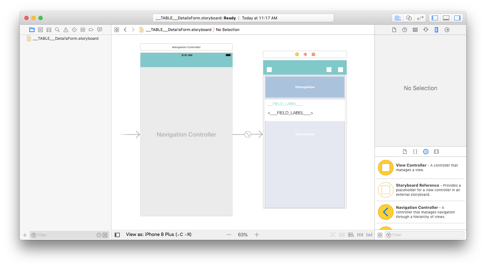

For this template, we're going to add a:

* プロフィールのヘッダー画像
* 繰り返されるフィールド

## ストーリーボードをXcodeで開く

storyboardファイル（拡張子は非表示かもしれません）をXcodeで開きます。

It's quite empty, so let's add some content!

## Scroll Viewを追加する

For our detail form to be scrollable, the first step is to drag and drop a "Scroll View" from the **Object library**.

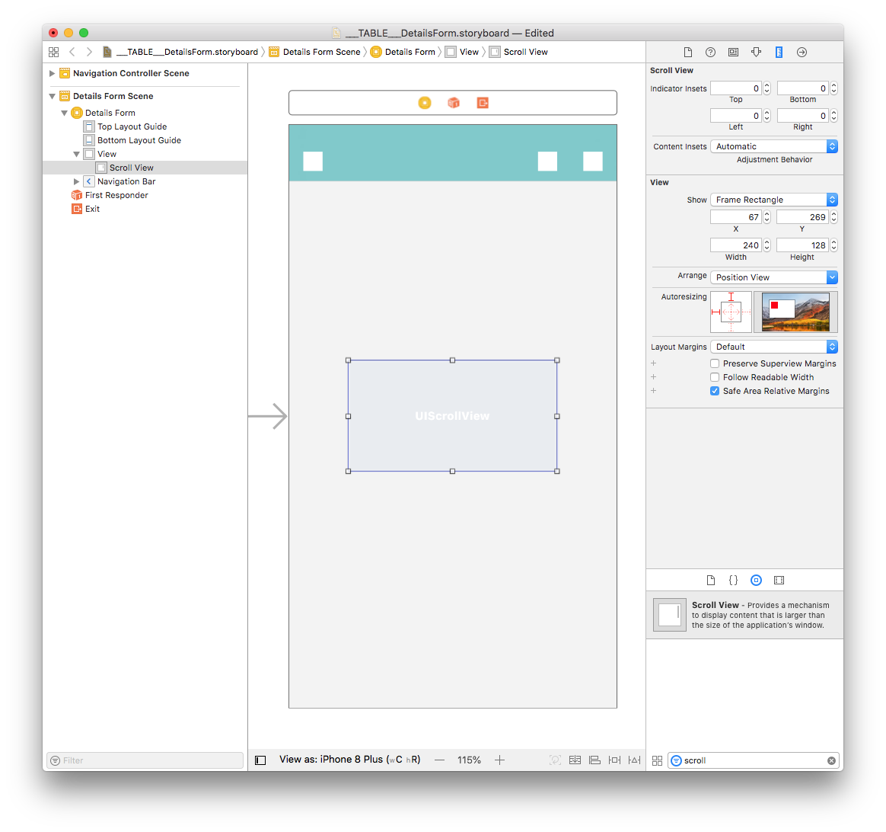

From the **Size inspector panel** (on the right side of the Interface Builder window), set the Scroll View Width value to 359 and the Height value to 667. X 座標を 8 に，Y 座標を 0 に設定しましょう。

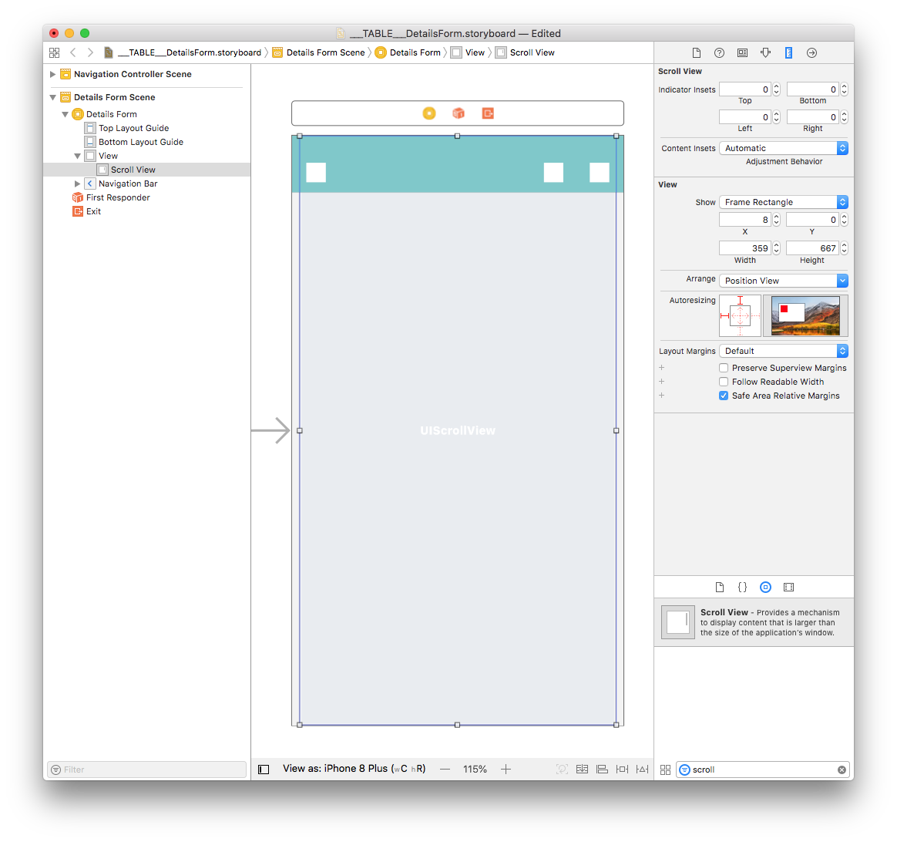

Next, add four constraints by clicking on the **Add New Constraints button** (Trailing: 8, Leading: 8, Top: 0, and Bottom: 0) as shown below:

## Vertical Stack Viewを追加する

Drag and drop a Vertical Stack View from the **Object library** in Scroll View. Then, from the **Size inspector panel** (on the right side of the Interface Builder window) set the Width value to 359 and the Height value to 202. X 座標を 0 に，Y 座標を 8 に設定しましょう。

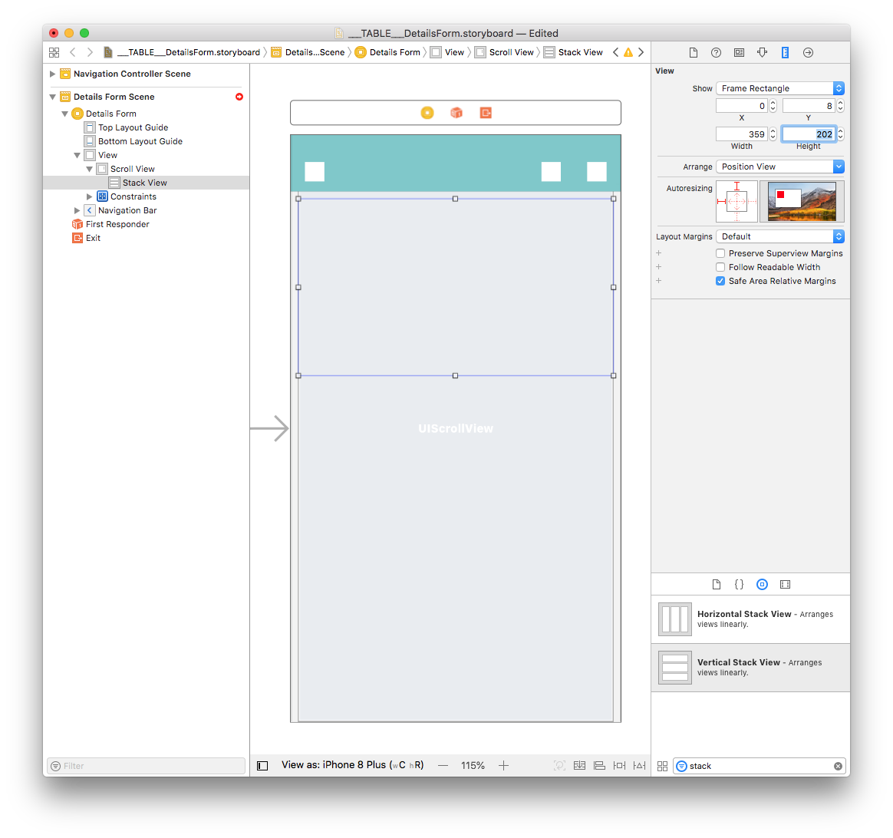

Stack Viewの幅と高さは，内包しているオブジェクトによって決まるため，サイズの制約はもう少し後に設定します。

## Stack Viewに他のViewを追加する

Drag and drop a view from the **Object library** to the Stack View you've just added to your storyboard. Let's name it **Field View 1**.

Then drag and drop another view from the **Object library** directly into the Document Outline at the same level as Field View 1 (to include it in the Stack View) and name it **Field View 2**.

ビュー同士の間隔を空けるために，属性インスペクターで「spacing」の値を 8 に変更します。

Select both **Field View 1** and **Field View 2** and in the **Size inspector panel** (on the right side of the Interface Builder window), set Width value to 359 and the Height value to 97.

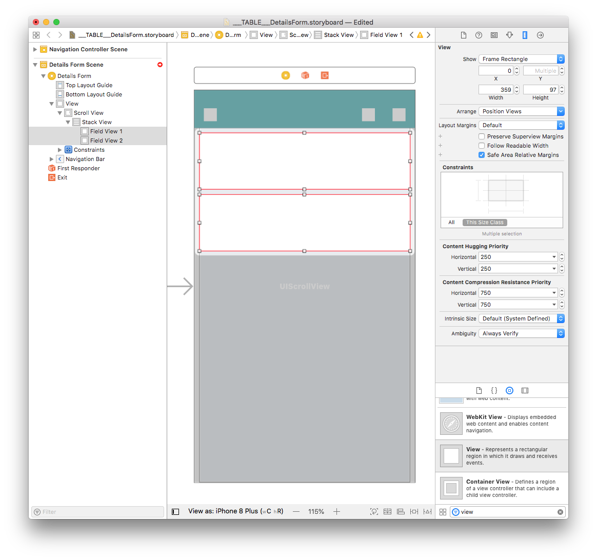

Select **Field View 1** add three constraints by clicking on the **Add New Constraints button** (Trailing: 0, Leading: 0, and Top: 0):

Stack ViewがScroll Viewと同じ幅になるよう，もう１個の制約を追加します。

Press **Ctrl** and drag the Stack View to the Scroll View. マウスボタンを離すと同時に，ここで設定できる制約の選択肢が表示されます。 「Equal Width」を選択してください。

Next, with the Stack View selected add four constraints by clicking on the **Add New Constraints button** (Trailing: 0, Leading: 0, Top: 8, and Bottom: 0) as shown below:

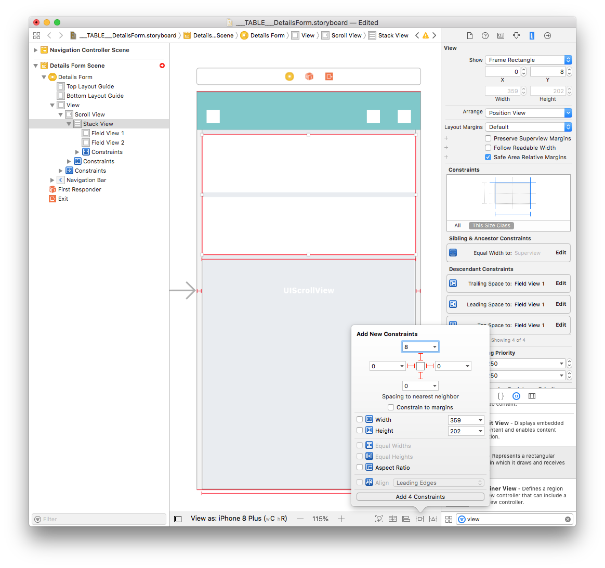

制約が設定されると，下図のように表示が変化するはずです。

Stack Viewに２個ビューを追加し，制約もきちんと設定できました。 Field View 1の作業に移りましょう。

## Field View 1にImage Viewを追加する

From the **Object library**, drag and drop an  **Image View** into Field View 1.

In the **Size inspector panel** (on the right side of the Interface Builder window), set the Image View Width value to 359 and the Height value to 97. X 座標を 0 に，Y 座標を 0 に設定しましょう。

Next, add four constraints by clicking on the **Add New Constraints button** (Trailing:0, Leading:0, Top:0, and Bottom:0) as shown below:

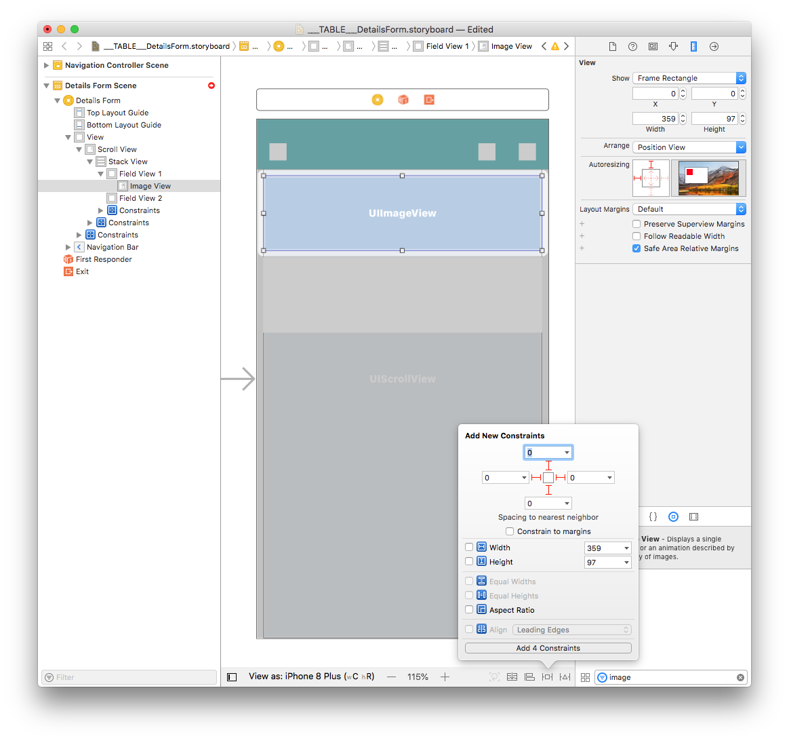

In the **Size inspector panel** change the Intrinsic Size from **Default** to **Placeholder**.

## Field View 2にラベルを追加する

### Title ラベル

In the **Object library**, drag and drop a  **Label** into Field View 2 and set the Width value to 343 and the Height value to 22. Then set the X value to 8 and the Y value to 8.

Double click on the label and name it "`___FIELD_LABEL___`". Then in the **attribute inspector** set the font to **Helvetica Neue Light 18.0** and the color to **BackgroundColor**:

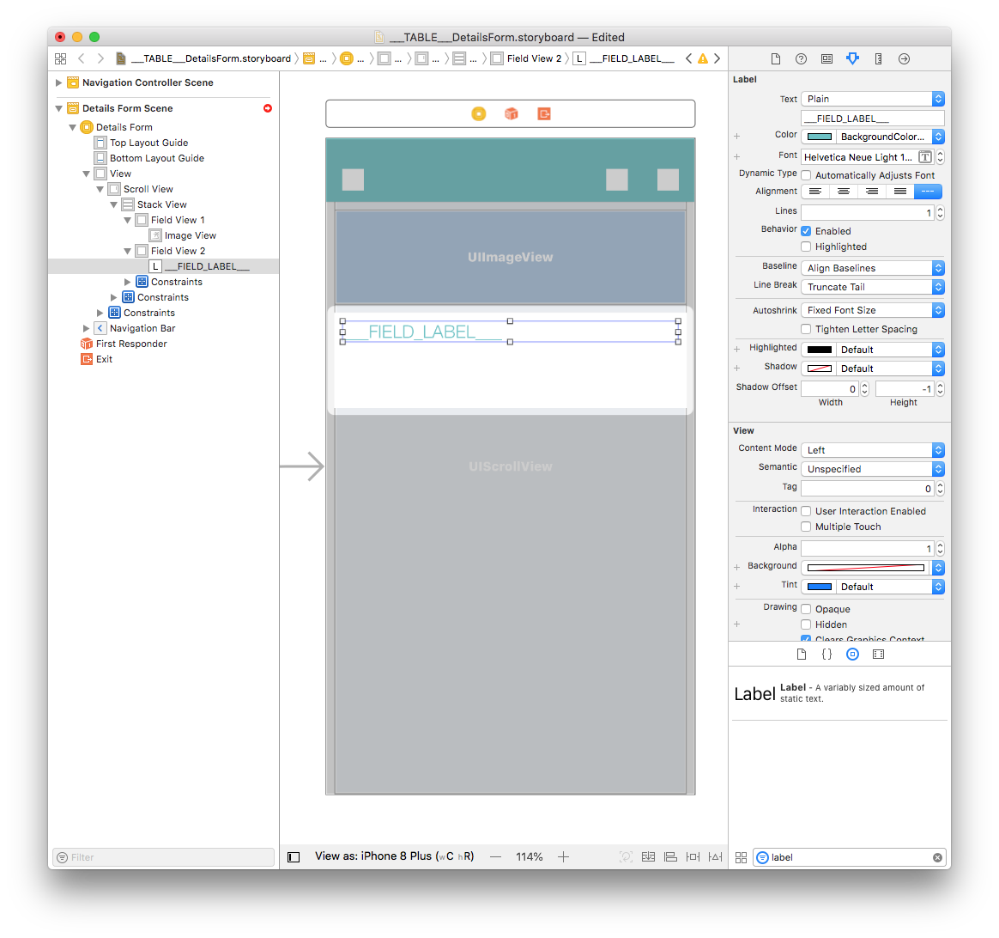

### Content ラベル

Title ラベルを複製し，幅を 339 に，高さを 44 に変更します。 X座標を 12 に，Y座標は 37 に設定します。

Double click on the label and name it "`<___FIELD_LABEL___>`". Then from the **attribute inspector** set the font to **Helvetica Neue Light 20.0** and the color to **Black Color**:

Select the Content and Title labels and add four constraints by clicking on the **Add New Constraints button** (Trailing: 8, Leading: Multiple, Top: Multiple, and Bottom: Multiple) as shown below:

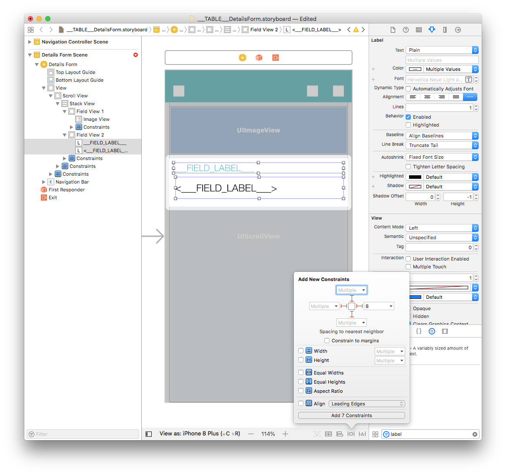

外観に関する設定がひと段落しました！ All of your constraints are well defined.

## セルにフィールドが表示されるようにセットアップする

### Image View
Select your Image View and go to **Identity inspector** > User Defined Runtime Attributes. Click the **+ button** to add a row.

* **Key Path**: Start with bindTo to activate binding on the component. Enter `bindTo.record.___FIELD_1___`

* **Type**: Always `String`

* **Value**: The attribute name. Enter `___FIELD_1_BINDING_TYPE___`

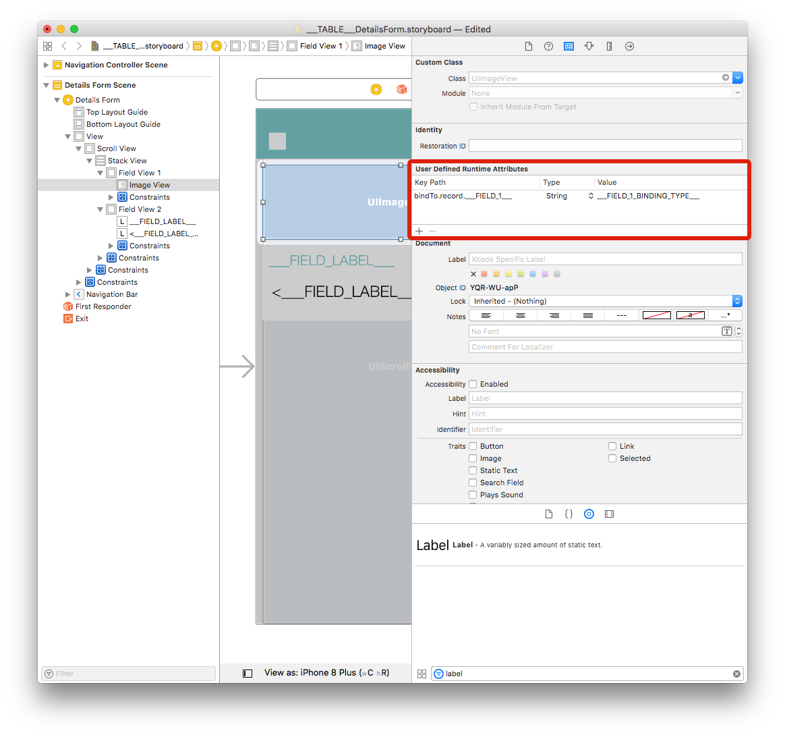

### ラベル

For the **first label** we are going to add several lines mainly to display icons:

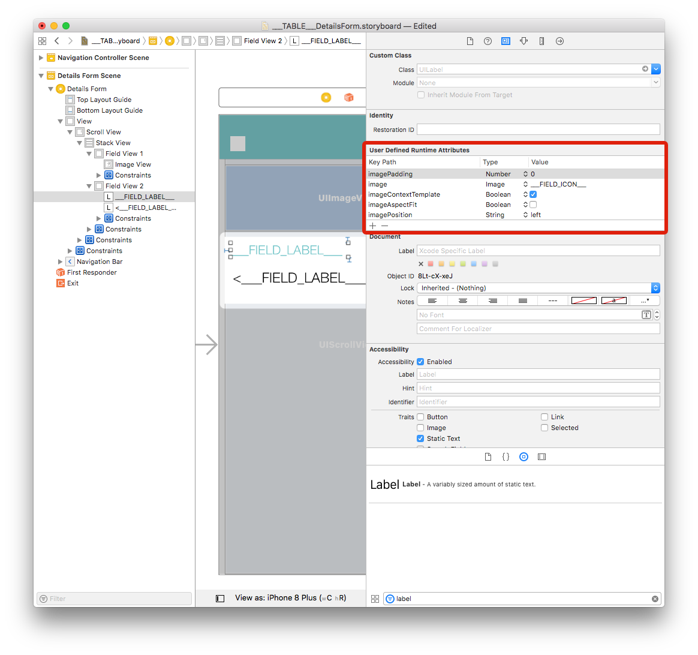

You also need to set the Class to `IconLabel` and check the **Inherit Module From Target** checkbox as we can see below:

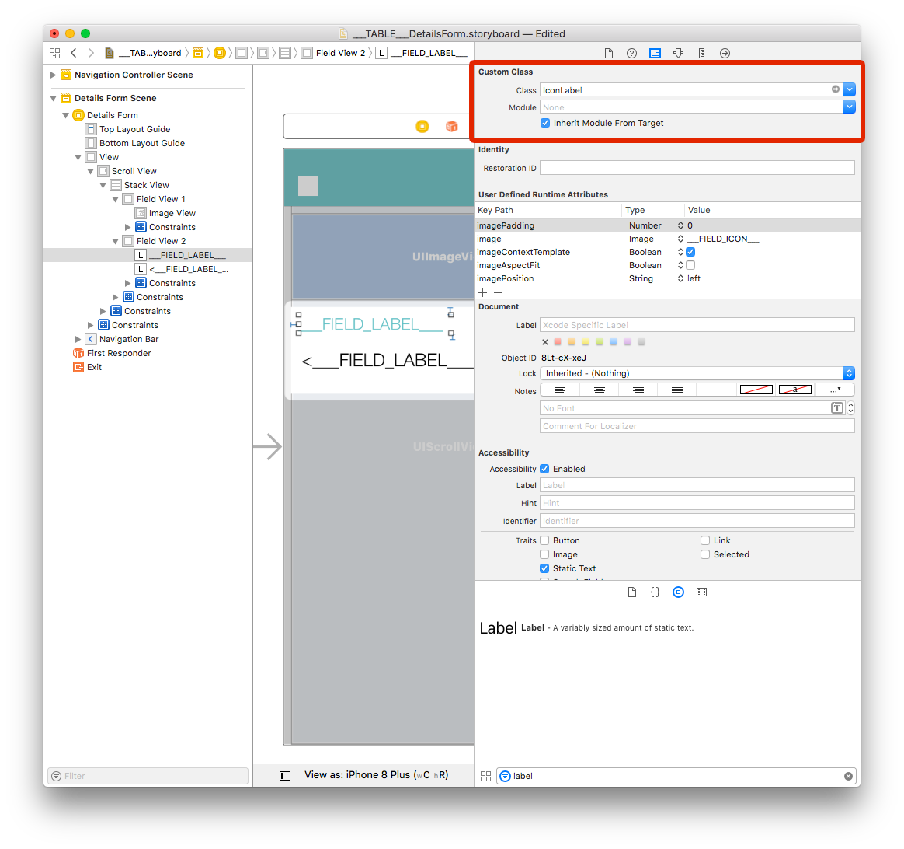

Select the **second label** and add a row in the Defined Runtime Attributes:

* **Key Path**: `bindTo.record.___FIELD___`

* **Type**: `String`

* **Value**: `___FIELD_BINDING_TYPE___`

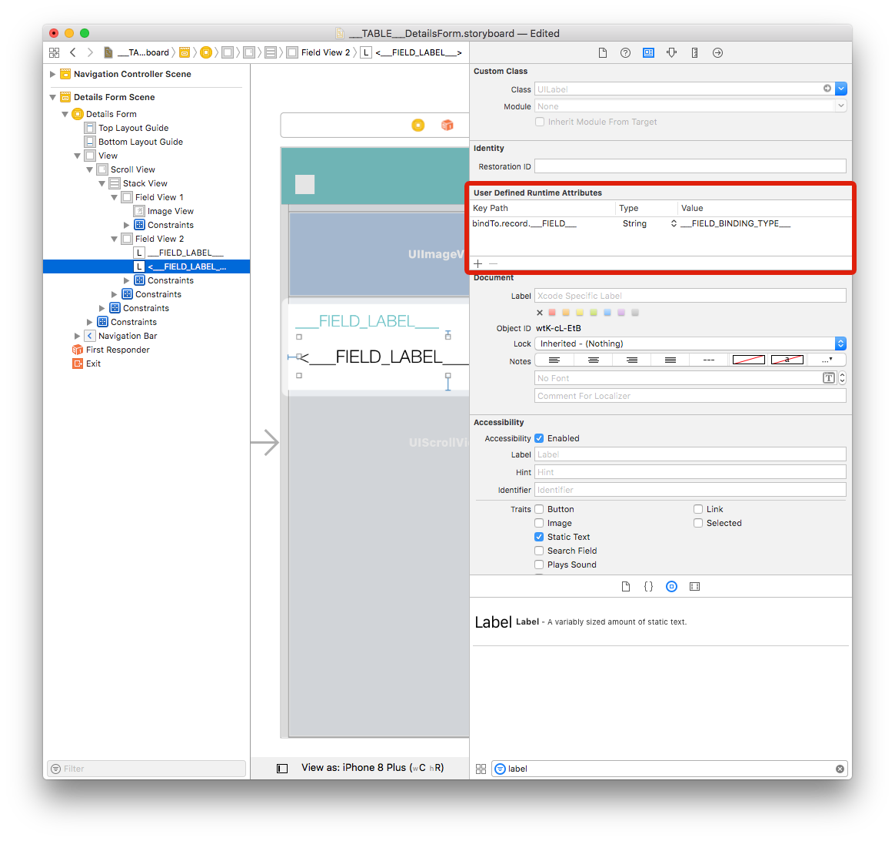

## 繰り返し使用されるセルにタグを設定する

プロジェクトエディターで複数のフィールドをフォームに追加した場合，Field View 2は何度も複製されることになります。

Each storyboard element has an Object ID. For example, if you select Field View 2 and go to the **Identity inspector**, you'll see its Object ID:

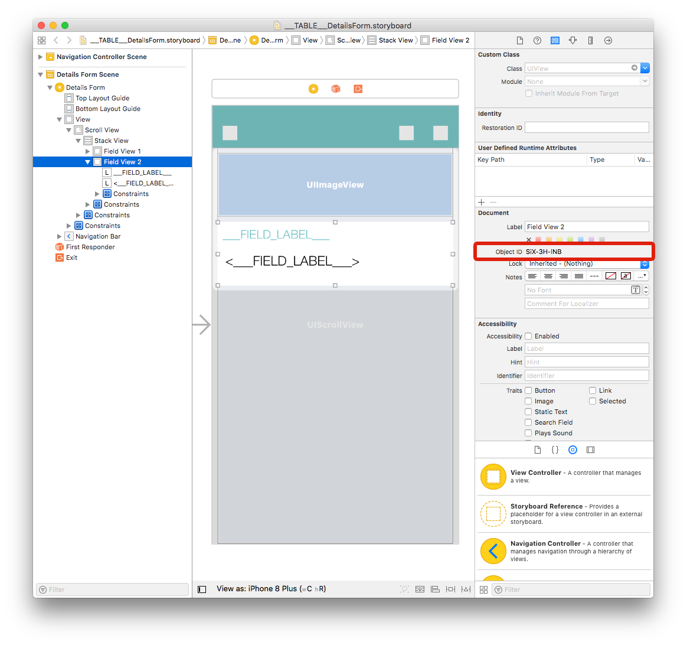

プロジェクトエディターに対し，このビューに含まれる要素はまとmて複製されるべきグループに属していることを知らせるため，要素とタグのそれぞれにタグを設定することが必要です。

ひとつずつ変更するのは，なかなか面倒ですし，途中でミスをしてしまうかもしれません。 ここはストーリーボードファイルを使い慣れたコードエディターで開いて作業を進めることにしましょう！

### Field View 2

* Select **Field View 2** and get its Object ID from the Identity Inspector (on the right side of the Interface Builder window). In our project, Field View 2 ID is: **SiX-3H-lNB**.

* Search for this ID in the storyboard xml code and replace it with **TAG-FD-001** each time it appears. オブジェクトIDは，何度か出現するので，見落とさないように気をつけましょう！

ストーリーボードXMLファイルを保存します。 Xcodeに表示されるField View 2のオブジェクトIDが変化していることに注目してください。

### First label

* Now, get the **first label** Object ID from the Identity Inspector and replace it with **TAG-FD-002** each time it appears in the storyboard xml code.

Done with the first label.

### Second label

* Next, get the **second label** Oject ID from the Identity Inspector and replace it with **TAG-FD-003** each time it appears in the storyboard xml code.

うまく置換できました！

### 制約にタグを設定する

どちらのラベルも制約があるので，タグを設定する必要があります。

Just like View Field 2 and label, get all **7 Constraints** Object IDs from the Identity Inspector and replace them with: **TAG-FD-004**, **TAG-FD-005**, **TAG-FD-006**, **TAG-FD-007**, **TAG-FD-008**, **TAG-FD-009** and **TAG-FD-010**.

プロジェクトエディターの「フォーム」セクションで自作の詳細フォームのテンプレートを選択し，「ビルド」をクリックします。

Not bad for a first attempt!

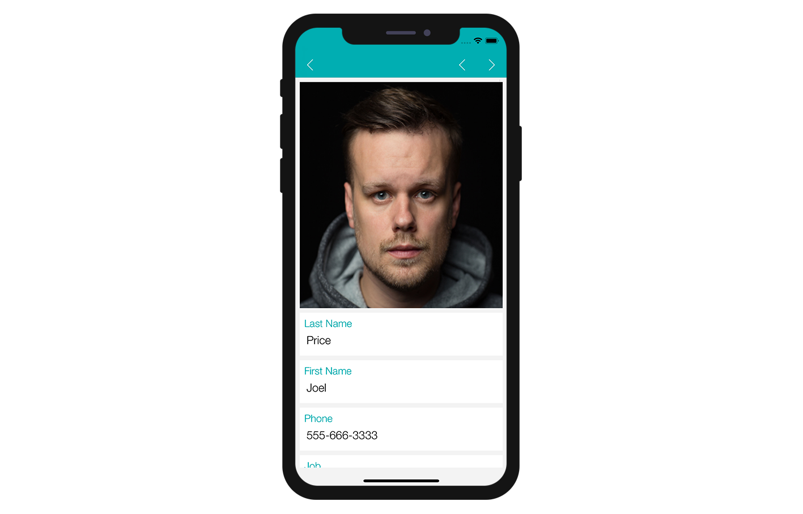

Field View 2をコピーすることができました。 しかし，アプリにもう少し彩りを添えることはできないでしょうか。

### アプリをカスタマイズする

Image ViewおよびField View 2に角の丸みを追加しましょう。

Image Viewを選択し，User Defined Runtime Attributesにユーザー定義属性を入力します。

* **Key Path**: `cornerRadius`

* **Type**: `Number`

* **Value**: `12`

その他

* **Key Path**: `layer.masksToBounds`

* **Type**: `Boolean`

* **Value**: Check the box

Field View 2を選択し，下記のように設定します。

* **Key Path**: `cornerRadius`

* **Type**: `Number`

* **Value**: `12`

これでカスタムテンプレートがプロジェクトエディターで使用できるようになりました！

## これからどうする？

In this tutorial, we've covered the basics for creating detail form templates. You can now create simple templates on your own using the Starter project resources.

Download the completed template folder:

<a className="button button--primary"
href="https://github.com/4d-for-mobile/tutorial-CustomDetailForm/releases/latest/download/tutorial-CustomDetailForm.zip">Download</a>

