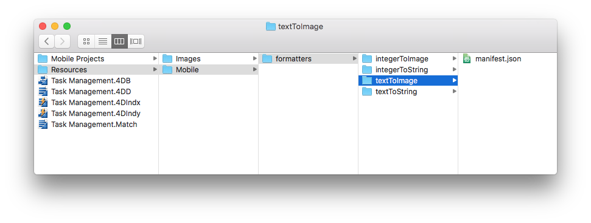
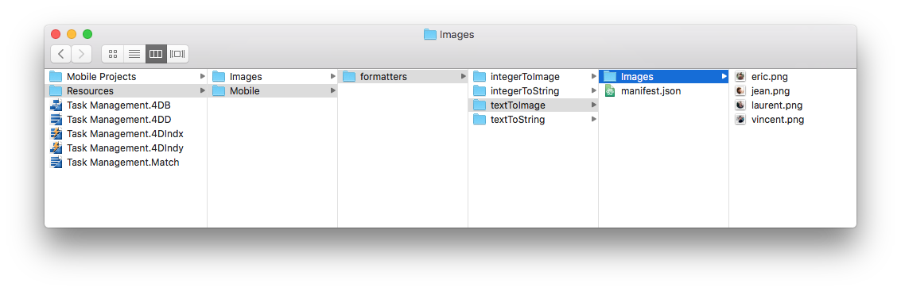
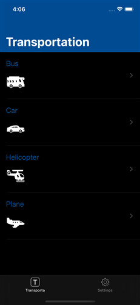
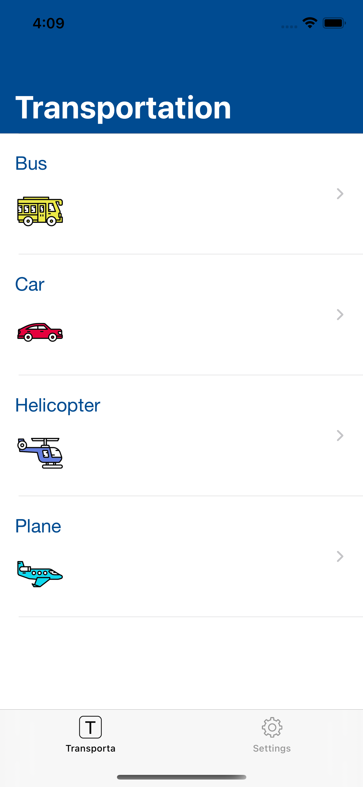
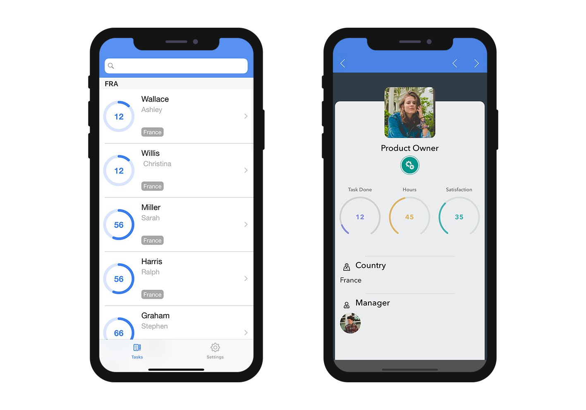

> **OBJECTIVES**
> 
> Create your first data formatters.

> **PREREQUISITES**
> 
> Click [here](requirements.html) to see what you'll need to get started!

このチュートリアルでは、様々なフォーマッターの例を作成していくことを案内していきます。


From the **Labels & Icons** section, you can choose pre-packaged formats.

> **Available formats:**
> 
> * **Text**: Text
> * **Date**: Date, Short date, Long date, Full date
> * **Time**: Time, Short time, Duration, Integer number
> * **Boolean**: "No" or "Yes", "False" or "True"
> * **Integer**: Integer number, Decimal number, Real number, Percentage, Ordinal number, Currency $, Currency €, Currency ¥, Spell Out

Let's get started by downloading the Starter project:

<div className="center-button">
<a className="button button--primary"
href="https://github.com/4d-go-mobile/tutorial-DataFormatter/releases/latest/download/tutorial-DataFormatter.zip">Download</a>
</div>

## スタータープロジェクトをダウンロード

To begin, download the **Starter project**, which includes:

* **integerToImage_Images** and **textToImage_Images** folders that contain images (to use later for formatters that include images)
* A **Task Management.4dbase** file (with a ready to use mobile app project)

<div className="center-button">
<a className="button button--primary" href="https://github.com/4d-go-mobile/tutorial-CustomDataFormatter/archive/66d7eea49bc3353f73dbf784ee06283b3a332d0b.zip">スタータープロジェクト</a>
</div>

これでフォーマッターを作成する準備が整いました！

## formatters フォルダを作成

First, create a *Task Management.4dbase/Resources/Mobile/formatters* folder.


## 整数用フォーマッター

### 整数から文字列へ

* Create an **integerToString** folder in the formatters folder you've just created.
* Then create a **manifest.json** file in the **integerToString** folder.


Let's look at the contents of the **manifest.json** file:

```json
{
   "name": "integerToString",

   "type": ["integer"],

   "binding": "localizedText",

   "choiceList": {"0":"UX designer","1":"Developer","2":"QA","3":"Product Owner"}
}
```

1. **name**: the name of the formatter
2. **type**: the 4D format type you want to use
3. **binding**: can be **localized text** for strings or **imageNamed** for images
4. **choiceList**: mapped values

### 整数から画像へ

* Create an **integerToImage** folder in the **formatters** folder you've created.

* Create a **manifest.json** file in the **integerToImage** folder.


* Then create an **Images** folder in the **integerToImage** folder. You can add the images from the **integerToImage_Images** in the StarterProject.zip to this new folder.


Let's look at the contents of the **manifest.json** file:


```json
{
   "name": "integerToImage",

   "type": ["integer"],

   "binding": "imageNamed",

   "choiceList": {"0":"todo.png","1":"inprogress.png","2":"pending.png","3":"done.png"},

   "assets": {
      "size": {
         "width": 40, "height": 40
      }
   }
}
```
1. **name**: the name of the formatter
2. **type** : the 4D format type you want to use
3. **binding**: can be **localized text** for strings or **imageNamed** for images
4. **choiceList**: mapped values
5. **assets**: adjust the display size (width and height)

## テキストフォーマッター

### テキストから文字列へ

* Create a **textToString** folder in the formatters folder you've just created.

* Create a **manifest.json** file in the **textToString** folder.


Let's look at the contents of the **manifest.json** file:

```json
{
   "name": "textToString",

   "type": ["text"],

   "binding": "localizedText",

   "choiceList": {"FRA":"France","MAR":"Morocco","USA":"United States","AUS":"Australia"}
}
```

1. **name**: the name of the formatter
2. **type**: the 4D format type you want to use
3. **binding**: can be **localized text** for strings or **imageNamed** for images
4. **choiceList**: mapped values

### テキストから画像へ

* Create a **textToImage** folder in the formatters folder you've just created.

* Create a **manifest.json** file in the **textToImage** folder.



* Then create an **Images** folder in the **textToImage** folder. You can add the images from the **textToImage_Images** in the StarterProject.zip to this new folder.



Let's look at the contents of the **manifest.json** file:

```json
{
   "name": "textToImage",

   "type": ["integer"],

   "binding": "imageNamed",

   "choiceList": ["image1.png","image2.png","image3.png"],

   "assets": {
  "size": {
   "width": 40, "height": 40
      }
   }
}

```

## Dark mode support

Whether your device is in dark or light mode, whether you're working on iOS or Android, you can easily use the custom data formatters containing images. The pictures will be adapted depending on the phone's color mode.

### Tintable color

To optimize the color contrast of your black and white images on your app depending on the color mode (light or dark), you can set the images as follows, with the `"tintable": true` code line:

```json
{
   "name": "textToImage",
   "type": ["text"],
   "binding": "imageNamed",
   "choiceList": {"car":"car.png","plane":"plane.png","bus":"bus.png"},
   "assets": {
     "size": 54, 
     "tintable": true
     }
}
```
Here is the result in light and dark modes:

| Light mode                      |           Dark mode            |
| ------------------------------- |:------------------------------:|
|  |  |


### Optimized color pictures

To optimize the color pictures displayed on your app and adapt them to your color mode, you need to have two pictures: one for the light mode, and one for the dark mode suffixed with `_dark`, as follows:


```json
{
   "name": "textToImage",
   "type": ["text"],
   "binding": "imageNamed",
   "choiceList": {"car":"car.png","plane":"plane.png","bus":"bus.png"},
   "assets": {
     "size": 54
   }
}
```
Here is the result in light mode and in dark mode:

| Light mode                         |             Dark mode             |
| ---------------------------------- |:---------------------------------:|
|  |  |

## モバイルプロジェクトを開く

Open the Task Management.4dbase with 4D and go to File > open > Mobile Project... to open the **Tasks**

Next, go to the **Labels & Icons section** in the project editor. All of your formatters are available for the different field types you  previously defined in the different formatter manifest.json files:

* Select the **integerToString** formatter for the **Job field**
* Select the **textToString** formatter for the **Country field**
* Select the **integerToImage** formatter for the **Task Status**
* Select the **textToImage** formatter for the **Manager**


## Build your 4D for iOS app

Build your 4D of iOS app and you'll see that your data formatter is well applied depending on the credit limit.



Download the completed formatter template folder:

<div className="center-button">
<a className="button button--primary" href="https://github.com/4d-go-mobile/tutorial-CustomDataFormatter/releases/latest/download/tutorial-CustomDataFormatter.zip">Download</a>
</div>

And you're done! 
