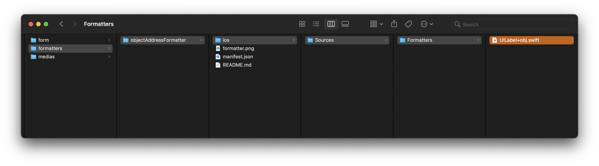

> **目標**
> 
> 最初の Swift データフォーマッターを作成します。

フォーマッターは、Swift と [Kotlin](create-kotlin-formatter.md) 両方のコードで構成することができます。

### オブジェクト属性用 Swift フォーマッター

次の例では Swift フォーマッターを使い、以下のオブジェクトの値から必要なものだけを取得してアドレスを表示します。

```4d 
$Obj:=New object 
$Obj.name:="4D SAS" 
$Obj.address1:="66 rue de Sartrouville" 
$Obj.address2:="Parc les Erables, bâtiment 4" 
$Obj.zipCode:="78230" 
$Obj.city:="Le Pecq" 
$Obj.country:="France" 
$Obj.phoneNumber:="+33 1 30 53 92 00" 
$Obj.website:="fr.4d.com"

$Ent:=ds.Employees.get(4)
$Ent.Object_Attribute:=$Obj
$Ent.save()

```

**manifest.json ファイル** は以下のとおりです:

```4d
{
    "name": "objectFormatter",
    "binding": "objectAddress",
    "type": "object",
    "target" : ["ios", "android"]

}

```

名称、通り、郵便番号、都市を取得するため、カスタムの **Swift フォーマッター** を作ってみましょう:

```4d 
import UIKit
import QMobileUI

extension UILabel {
    @objc dynamic var objectAddress: [String: Any]? {
        get {
            return nil
        }
        set {
            if let newValue = newValue {
                guard let value1 = newValue["name"] as? String,
                      let value2 = newValue["address1"] as? String,
                      let value3 = newValue["zipCode"] as? String,
                      let value4 = newValue["city"] as? String else {
                          return
                      }
                self.text = "\(value1) - \(value2) - \(value3) \(value4)"
            } else {
                self.text = ""
            }
        }
    }
}
```

これらをまとめて、このフォーマッターを **.swift** ファイルとしてフォーマッターフォルダーに保存すれば、モバイルプロジェクトで使用することができます。



このような結果になります:


