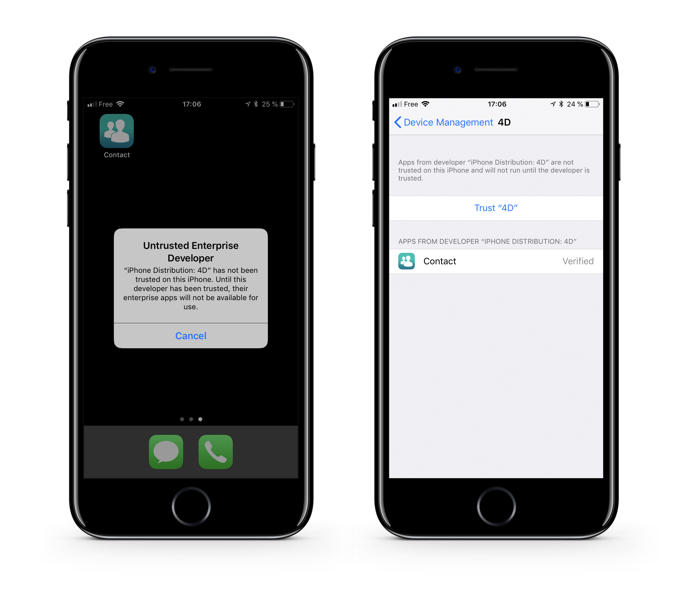
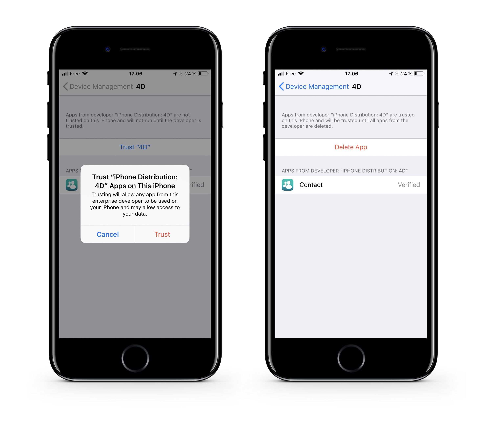

> **目標**
> 
> アプリをセキュアなサーバーにアップロードする。


## ⒈ アプリをアップロードする

アプリのファイルをセキュアなサーバーにアップロードします:

* アセット (display-image および full-size-image)
* `manifest.plist` ファイル
* `.ipa` ファイル

アプリの配布は、任意のセキュアなクラウドストレージサービス (Dropbox、Google Drive など) を使用しておこなうことができます。

:::note

アセットと ipa の URL は、`manifest.plist` ファイルで定義されている URL と一致する必要があります。

:::

## ⒉ インストール用のリンクを作成する

manifest ファイルの完全な Webアドレスをパラメーターとして、**ITMS Serices link** (iTunes Music Store) を作成します:

```html
itms-services://?action=download-manifest&url=https://mywebserver.com/manifest.plist

```

This link can be used when sending emails, embedded in an html page, or even within a QR code.

Here is a simple example:


*The QR Code used for this documentation is not active.*

## ⒊ ⒊ ⒊ ⒊ Install your enterprise app on iOS

* Install the app by clicking on the link or scanning a QR Code


* When you first open an enterprise app that you've manually installed, a notification will be displayed stating that the developer of the app isn't trusted on your device.

* Ignore this message and click **Cancel**.

* In Settings > General > Profiles or Profiles & Device Management, in the "Enterprise App" heading, the profile for the developer is listed.



* Tap the name of the developer profile to establish trust for this developer.



* You can then go to your app and open it.

Congratulations... you can now distribute your app in-house.
