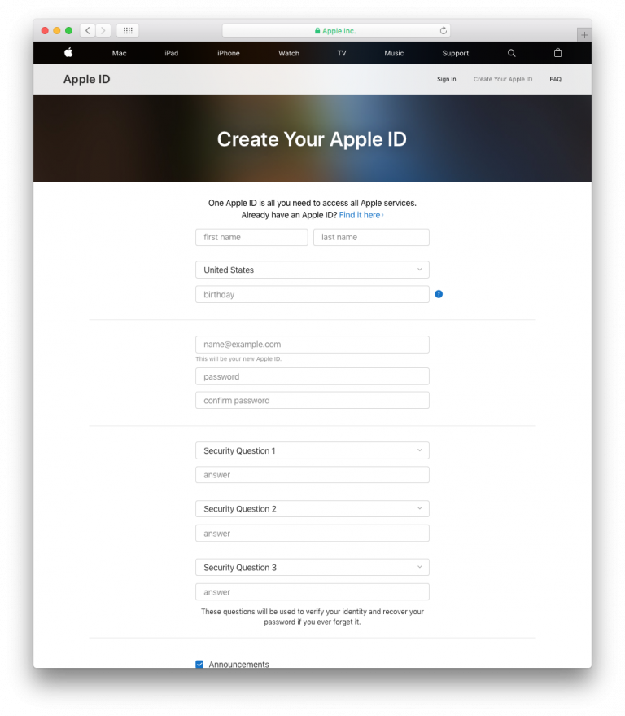
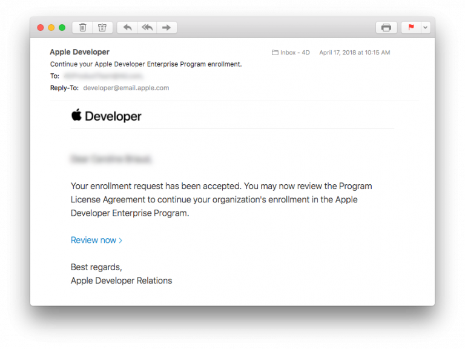

> **OBJECTIVES**
> 
> Choose the appropriate Apple Developer Program.

You must have a valid Apple Developer account to **distribute an iOS app**. Apple offers two developer programs:

* **[Apple Developer Program](https://developer.apple.com/programs/)** **for organization** or **for individual** ($99/year) - Allows you to distribute app(s) **on the App Store**.
* **[Apple Developer Enterprise Program](https://developer.apple.com/programs/enterprise/)** ($299/year) - Provides resources ONLY for developing and distributing **proprietary, in-house apps** to employees

For **test purposes** you can use a **Free Apple Developer Program** (*Sign in with Apple ID*, see below).

Here is a chart comparing the different levels of developer membership:

:::info

To enroll in any **Apple Developer Program**, your Apple ID must be associated with an email address using your organization’s domain name.

:::

:::info Free Apple Developer account

If you want to join the Apple Developer Program for free, you only need to create a free Apple ID and sign in with it. Therefore, follow only Steps 1 and 2, then launch Xcode > Preferences > Accounts, Add your Apple ID and sign in! :::

## ⒈ ⒉ ⒉ Apple IDを作成する

If you already have an Apple ID, go to [Step 2](#step-2-request-a-d-u-n-s-number).

[Apple ID作成ページ](https://appleid.apple.com/)にアクセスします。

* 必要な情報をフォームに入力し，セキュリティの質問に答えます。
* Appleから確認メールが送られます。
* メールに記載されている確認コードを入力して，アカウントの作成を完了します。

## ⒉ ⒋ ⒋ ⒋ Request a D-U-N-S Number

:::info

This step is not necessary for the **Apple Developer Program as an individual**.

:::

* If you already have a D-U-N-S Number, go to [Step 3](#step-3-register).

Request a D-U-N-S Number [here](https://developer.apple.com/enroll/duns-lookup/#/search)

* Complete the form.
* **続ける** をクリックします。
* Check your email for the D-U-N-S Number.

## ⒊ Register

For **Apple Developer Enterprise Program** and **Apple Developer as an organisation**, you can register as a developer [here](https://developer.apple.com/programs/enterprise/enroll/).

For **Apple Developer as an individual**, you can register as a developer [here](https://developer.apple.com/account/).

Then, read and accept the *Apple Developer Agreement* and **Submit**.

## ⒋ Join

:::info

This step is not necessary for the **Apple Developer Enterprise Program**.

:::

For **Apple Developer Program as an Organisation**, you can sign up for the Apple Developer Program [here](https://developer.apple.com/enroll/enterprise/).

For **Apple Developer Program as an Individual**, click on **Join the Apple Developer Program** at the bottom of the page.

## ⒌ Enroll

* Click on the **Start your Enrollment** button.
* From the Entity Type dropdown list, select:
    - **Company / Organization** (for Apple Developer Enterprise Program and Apple Developer Program as an Organisation).
    - **Individuals / Sole Proprietor / Single Person Business** (for Apple Developer Program as an individual).

* Complete the form and Click on **Continue**.

## ⒍ ⒎ ⒎ ⒎ Apple verification

:::info

This step is  only necessary for the **Apple Developer Enterprise Program**.

:::

* Apple has an internal verification process that usually takes up to six working days. Once Apple receives the enrollment request, they verify that you have the authority to bind your organization to the Apple Developer Program's legal agreements.
* Apple generally calls to verify that the main contact exists and has requested the Apple Developer Enterprise Program registration.
* You'll then receive another email inviting you to complete the enrollment process.

## ⒎ ⒏ ⒏ ⒏ Complete your purchase

* Once your enrollment request has been accepted, you can then proceed to payment.

* When you have completed your purchase, you'll receive an email confirming your membership in the program.

おつかれさまでした！ You are now ready to deploy and publish your applications!
