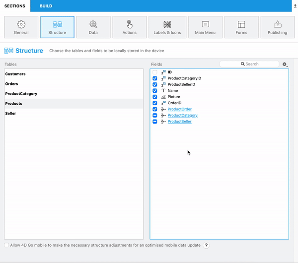
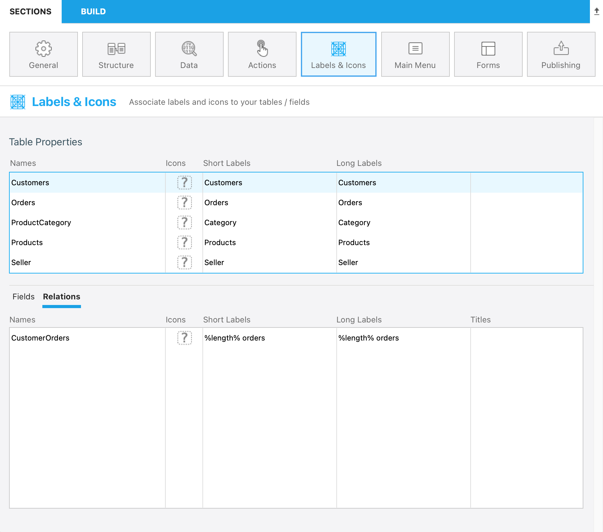
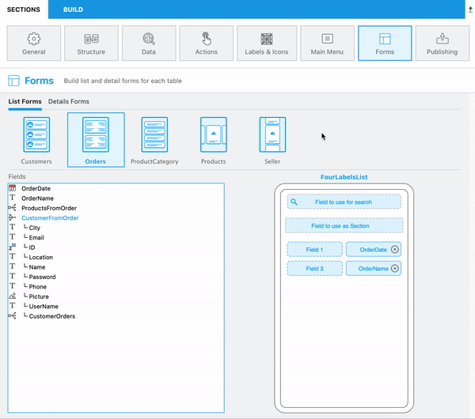
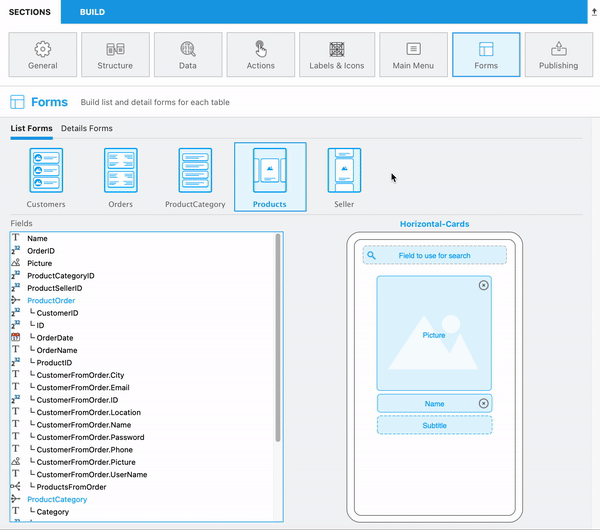
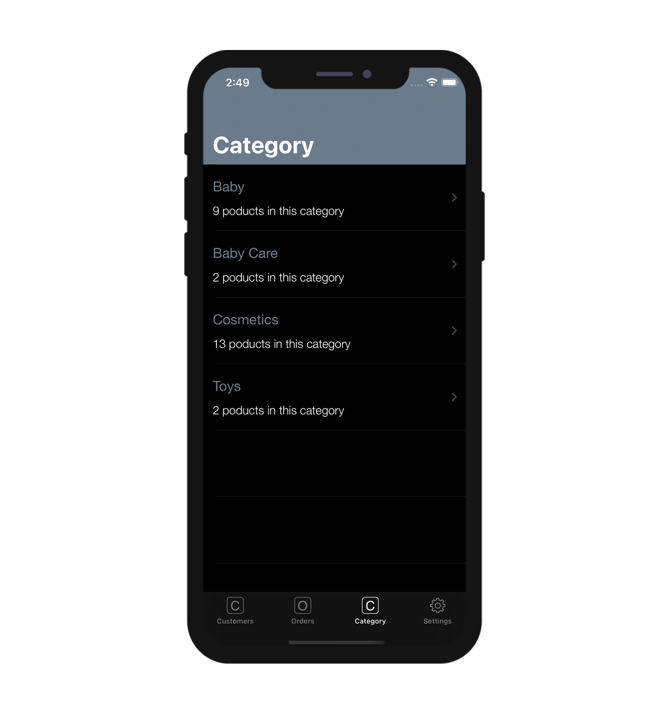

4Dモバイルプロジェクトでは、アプリに便利な操作性を追加することができます。 たとえば、1対N および N対1 リレーションを [N対1リレーション](many-to-one-relations.md) から公開できます。

# プロジェクトエディター

## ストラクチャーセクション

ストラクチャーセクションでは、N対1リレーションを簡単に公開できます。 これにより、たとえば N対Nリレーションを iOSアプリに表示することができます。

## ラベル & アイコンセクション

ラベル＆アイコンセクションでは、リレーションボタンのラベルをカスタマイズできます。

### レコード数を取得する

1対Nリレーションをクリックすると表示されるレコードの数を表示するための便利な機能もあります。

これには、1対Nリレーションのラベルに、%length% を追加するだけです。

## フォームセクション

### 任意の場所にリレーションを追加する

リストフォームや詳細フォームに任意のリレーションを追加し、これまで以上にダイナミックなアプリを作成することができます。

### フィールドをクリックできるようにする

フォームセクションでは、リストフォームと詳細フォームのフィールドにリレーションを設定することで、フィールドをクリック可能にできます。

# 生成されるアプリ

これらの改善により、アプリに操作性が追加されます:

* 詳細フォームを間に挟むことなく、リストフォームから他のリストフォームにアクセスできます。

この例では、Customers リストフォームで 1対Nリレーションをクリックし、Orders リストにアクセスしています。

* リストフォームにリレーションを表示し、関連する詳細フォームにアクセスできます。

この例では、Orders リストおよび、Orders 詳細フォームから Customer 詳細フォームアクセスできます。

* 1対Nリレーションを追加してフィールドをクリックできるようにし、%length% を使ってレコード数を表示できます。

この例では、Category リストフォームの 1対Nリレーションごとに商品の数が表示されます。

