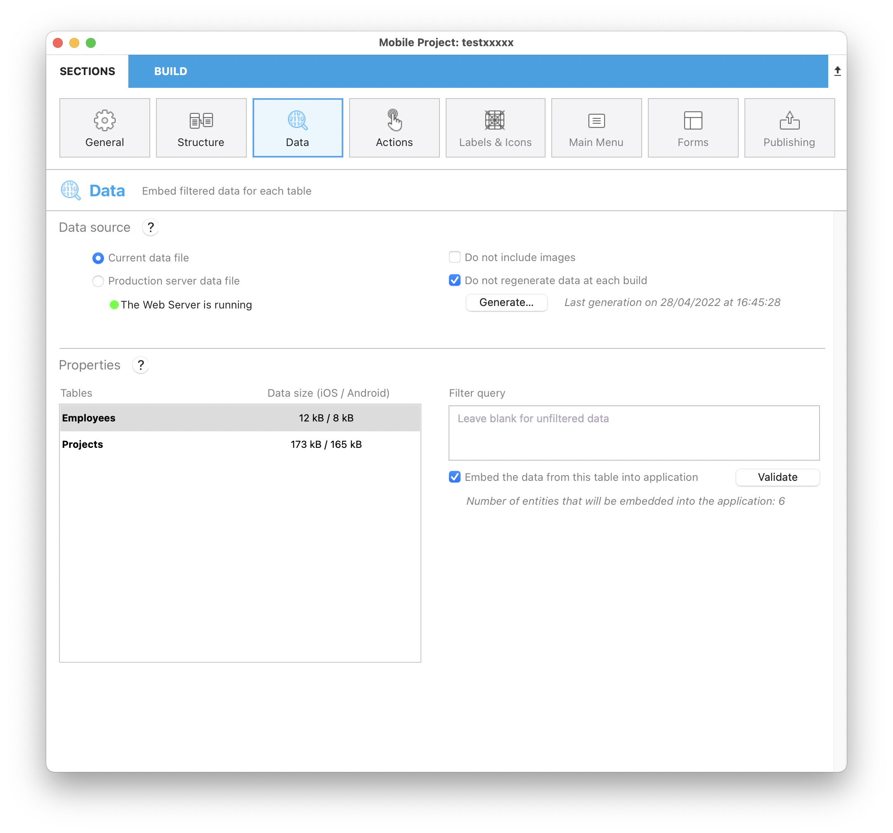
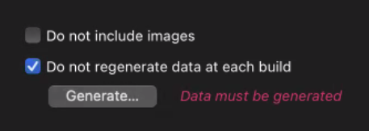
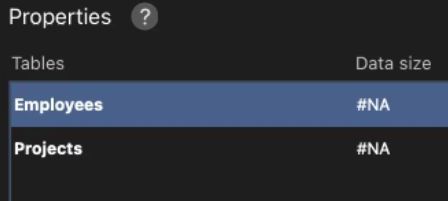

このページはモバイルアプリが扱うデータを設定するために使用します。 ここでは、以下のようなことができます:

* アプリに含めるデータのソースを選択する (**カレントデータファイル** あるいは **プロダクションサーバーデータファイル**)
* どのデータセットをプリロードし、どんなときにデータを再生成するかを定義する
* **フィルタークエリ** および **ユーザー情報** に応じてアプリに格納するデータをフィルタリングする



## データソース

このパネルで、アプリが管理するデータのソースを設定します。

### データファイル

アプリで扱うデータの取得元となるデータファイルを選択します:

- **カレントデータファイル**: 4Dプロジェクトのカレントのデータファイルから取得されます。 このオプションは開発段階において有用です。 このオプションを使用するには Webサーバーが実行中である必要があるため、起動されていない場合には**Webサーバーを開始** ボタンが表示されます。

- **プロダクションサーバーデータファイル**: 4Dプロジェクトを実行しているプロダクションサーバーからネットワーク越しに取得されます。 このオプションを選択した場合には、[**公開** ページ](publishing.md) において**プロダクションURL** を入力する必要があります。 未定義の場合、**サーバーURLを設定** ボタンをクリックして公開ページを開くことができます。 このオプションでは `key.mobileapp` セキュリティファイルを明示的に選択する必要があります (以下参照)。

### `key.mobileapp` ファイルを選択する

埋め込むデータへのアクセスを確保するため、データファイルが選択されると 4Dモバイルエディターによって **MobileApps** フォルダー内に `key.mobileapp` ファイルが自動的に生成されます。 データダンプをするためには、このキーが正常にインストールされていなければなりません。 このキーは以下のような場合に必要になります:

- アプリを [ビルド](build-panel.md) する際
- [**生成する...**](#生成する) ボタンをクリックしたとき

:::info

**MobileApps** フォルダーは、4Dプロジェクトの [データフォルダー](https://developer.4d.com/docs/ja/Project/architecture.html#data) 内に自動的に作成されます。

:::

**カレントデータファイル** を使用する場合、`key.mobileapp` ファイルはローカルプロジェクトのデータフォルダー内で自動的に選択されます。

**プロダクションサーバーデータファイル** を使用する場合、サーバーからコピーしたリモートの `key.mobileapp` ファイルを選択する必要があります:

1. プロダクションサーバーマシン上で、サーバーアプリケーションプロジェクトの `/Data/MobileApps` フォルダーから `key.mobileapp` ファイルをコピーします。

2. モバイルプロジェクトエディター内で、**キーを探す...** ボタンをクリックします:


3. サーバーからコピーしてきた `key.mobileapp` ファイルを選択します。

ファイルは、ローカルプロジェクトの `/Data/MobileApps` フォルダー内にコピーすることが推奨されます。

:::info

このキーは、アプリに埋め込むデータにアクセスする際にのみ必要になります。 アプリからサーバーデータへの以降のアクセスに関しては、`[リクエストレベルで認証されます](publishing.md/authentication)`。

:::

### 画像は含めない

画像データをアプリに埋め込むことは、特に開発段階においてはかなり時間を無駄にすることになりかねません。 このオプションをチェックすることで、アプリのビルドにかかる時間を大幅に短縮することができます。

### ビルドするごとにデータを再生成しない

デフォルトでは、アプリをビルドするたびに、プリロードするデータ (あれば) が、データファイルから再生成されます (iOS用の **.sqlite** フォーマット、または Android用の **.db** フォーマット)。 開発段階においては、このオプションをチェックすることで時間を節約することができます。

#### 生成する

このボタンは、プリロードするデータをデータファイルから再生成します。 これにより、開発段階におけるデータ生成のコントロールを可能にします。特に **ビルドするごとにデータを再生成しない** オプションと組み合わせることで有用になります。

データ生成プロセスの間、モーダルなウィンドウが表示され、プロジェクトエディターはロックされます。またそれぞれの生成ステップごと (テーブルへの httpリクエスト、コアデータの挿入、など) の進捗バーが表示されるとともに、「時間がかかりすぎる場合、データのフィルタリングを試してください」などのメッセージも表示されます。


またデータ生成はキャンセルボタン  をクリックすることでキャンセルすることもできます。

:::info

[プロダクションサーバーデータファイル](#データファイル)を使用する場合、このボタンは有効な `key.mobileapp` ファイルを必要とします。

:::

[ストラクチャー](structure.md) または [ターゲット](general.md) (Android または iOS) を変更するとアプリが同期されなくなるため、その度に再生成が必要になります。 その場合、注意を促すため **データを生成する必要があります** と赤字で表示されます:




## プロパティ

このエリアでは:

- 埋め込む (プリロードする) データを取得するテーブルを選択できます。
- それぞれのテーブルに対して **フィルタークエリ** を定義することができます。 フィルタークエリは、アプリがデータにアクセスする際に自動的に適用されます。それによってレコードの一部のみを取得することができます。

テーブルに対してフィルタクエリーを定義しない場合のデフォルトでは、そのテーブルの全レコードが埋め込まれます。


### テーブル

各テーブルに対して 1つのフィルタークエリを定義することができます。 このリストでは:

- フィルタークエリを追加・編集する対象テーブルを選択できます。
- [埋め込みオプションが選択されていた](#このテーブルのデータをアプリに埋め込む) 場合、埋め込まれるデータのサイズを見ることができます。 ユーザー情報に基づいたフィルタークエリを使用する場合には、ユーザーによってデータサイズが異なるため、この情報は利用できません。
- テーブルにフィルタークエリ  またはユーザー情報を使用したフィルタークエリ  が適用されているかをチェックできます。

すべての選択されたテーブルは Resources > Dataフォルダー内に .jsonファイルを生成し、このファイルは自動的に単一の SQLite ファイルへと変換され、アプリ内で使用されます。

### データサイズ

各テーブルのサイズがこの欄に表示されます。 なお、ファイルの総容量は、各OS のサイズ制限に準拠する必要があります。 詳細については [FAQ](https://developer.4d.com/go-mobile/docs/faq/faq#misc) を参照ください。

データがない場合や再生成が必要な場合は、**#NA** と表示されます:




### このテーブルのデータをアプリに埋め込む


このオプションがチェックされている場合 (デフォルト) 、モバイルアプリのビルト時、あるいは [データ再生成時](#ビルドするごとにデータを再生成しない) に、エディターは同アプリにデータをプリロードします。 このオプションにより、モバイルアプリはフルダウンロードの必要なく、更新のみで足りるようになるため、データアクセスが高速化されます。 特に、都市や国などの変化のないデータに適しています。

テーブルデータのプリロードが適切でない場合は、このオプションをオフにすることができます。

ユーザー情報に基づいたフィルタークエリを使用する場合には、ユーザーによって使用データが異なるため、このオプションは利用できません。 その場合には、ユーザー情報を処理する [On Mobile App Authentication](https://doc.4d.com/4Dv19/4D/19/On-Mobile-App-Authentication-database-method.301-5392844.ja.html) メソッドを表示するための **認証メソッドを編集...** ボタンに置き換えられます。

### フィルタークエリ

各テーブルに対して 1つのフィルタークエリを定義することができます。 テーブルを選択した状態で、**フィルタークエリ** エリアをクリックすると、その上にいくつかのメニューが表示されます:


クエリを定義するには:

1. クエリエリアに直接タイプして、あるいは **フィールド**・**比較演算子**・**演算子** メニューを使用して、この専用フィールドにクエリを入力していきます。

クエリのシンタックスは次の通りです:

```
field comparator value {logicalOperator field comparator value}   
```


2. クエリの有効性をチェックするために **Validate** ボタンをクリックsuruto, クエリフィールドの下にフィードバックが表示されます:

- フィルタークエリに合致するエンティティがある場合: "アプリケーションへと埋め込まれるエンティティ数 : EntityNumber/EntityTotal"
- フィルタークエリに合致するエンティティがない場合: "アプリケーションにはエンティティは埋め込まれません"
- サーバーにアクセスできない場合: "アプリケーションへと埋め込まれるエンティティ数: N/A Webサーバーに接続できませんでした"
- テーブルのフィルタークエリが検証されていない場合、そのテーブルは左のテーブル一覧内において赤色で表示されます (project.4dmobileapp 内で "validated" : false)。
- サーバーがエラーを返す場合には、クエリフィールドの下にその旨がずっと表示されます。

これは、クエリを変更する度におこなう必要があります (編集後に検証されていないクエリは、クエリエディターに赤色で表示されます)。

フィルタークエリが有効な場合、テーブル名の右にアイコンが表示されます (静的フィルターの場合は  、ユーザー情報付きフィルターの場合は )。

:::info

クエリシンタックスの詳細な情報については [$filter の RESTドキュメンテーション](https://developer.4d.com/docs/ja/REST/filter.html) を参照ください。 **フィルタークエリ** として入力された文字列は、そのまま `$filter=` RESTコマンドに引数として渡されます。

:::


#### 例題

`FirstName` フィールドと `LastName` フィールドを含むテーブルを選択した場合、**フィルタークエリ** には次のように記述できます:

```4d
FirstName = 'Lisa' & LastName = 'Hart'
```

このクエリは、FirstName に "Lisa"、LastName に "Hart" を含むレコードのみを取得します。


### ユーザー情報を使用したフィルタークエリ

4Dプロジェクトの [`On Mobile App Authentication` データベースメソッド](https://doc.4d.com/4Dv19/4D/19/On-Mobile-App-Authentication-database-method.301-5392844.ja.html) から返されるユーザー情報に依存する *value* 引数を使った [フィルタークエリ](#フィルタークエリ) を定義することができます。

ユーザー情報に依存するクエリを指定するには、クエリに **`:`** とカスタムキー値を追加します。


たとえば、次のようなフィルタークエリを定義できます:

```
Name = :name
employee.level > :level
cityName = :city
```
このようなクエリでは、変数の前に `:` を配置することで、`On Mobile App Authentication` データベースメソッドが `userInfo` オブジェクト内に返した値が、モバイルアプリによって自動代入される特別な変数であることを示します。 これらの変数は、`userInfo` オブジェクト内にカスタムプロパティ名として存在する必要があります。

この仕組みは次の通りです:

1. モバイルアプリがデータリクエストを送信すると、`On Mobile App Authentication` データベースメソッドが自動的に呼び出され、アプリの情報を *$1* オブジェクト型引数として受け取ります。具体的には `email` のほか、`device` や `language` が返されます。
2. データベースメソッドは 4Dデータストアをクエリしてビジネスルールに則った適切な情報を取得し、`userInfo` オブジェクト内のカスタムプロパティに任意の値を返すことができます。 例:

```4d
$id:=ds.Salesperson.query("email == :1";$1.email).first().id 
    // email の情報をもとに営業担当者の id の値を取得します
If($id#null)
    $Obj_response.userInfo:=New object("id";$id) // 戻り値の userInfo 内に id を保存します
End if  
...
$0:=$Obj_response
```
3. モバイルアプリは、`userInfo` オブジェクトをユーザーごとに自動的に管理します。 この例では、返されたオブジェクト内にカスタムの "id" プロパティが格納されています。 そのため、"Customers" テーブルのフィルタークエリとして以下のように書くことができます:

```4d
salespersonid = :id
```

"Customers" テーブルのデータにモバイルアプリがアクセスすると、ログイン中の営業担当者が受け持つ顧客のみが表示されます。

:::Tipsチュートリアル

モバイルアプリにおける、ユーザー情報を使ったフィルタークエリの例題については、[**フィルタークエリの定義**](../tutorials/filter-queries/define-filter-query) チュートリアルを参照ください。

:::


