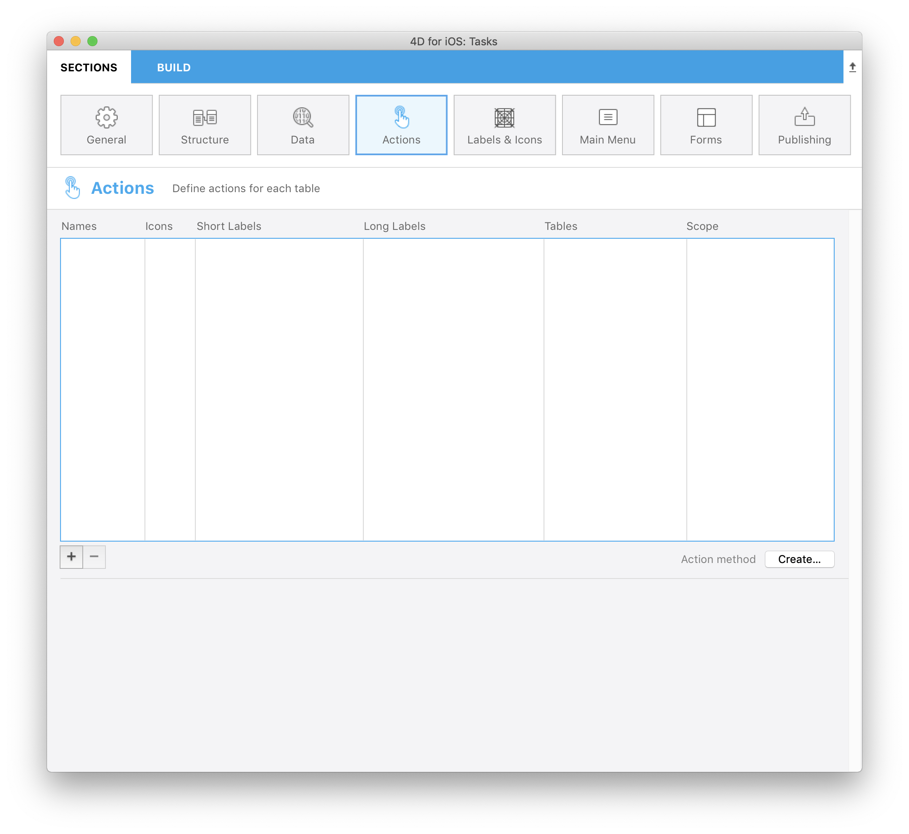
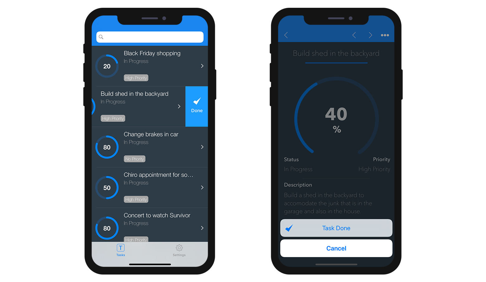

このチュートリアルでは、**Tasks iOS app** を使用して、アプリ内でどのようにアクションを扱うかを見ていきます。

この **Task app** 内でやりたいこととは、それぞれのタスクの **ステータス** と**進捗のパーセンテージ** を個別に変更したいということです。

また、**すべてのタスクのステータスを変更** し、"延期" あるいは "進行中" などへと変更することも視野に入れます。

**スタータープロジェクト** をダウンロードし、**アクションセクション** に移動します。

<div className="center-button">
<a className="button button--primary"
href="https://github.com/4d-go-mobile/tutorial-Actions/archive/cf16581214a8a6e4e4067bcff43ac1265ec43ff7.zip">ダウンロード</a>
</div>

アクションは 2つのスコープに対して定義可能です:

* エンティティに対するアクション
* テーブルに対するアクション

まずはエンティティに対するアクションから始めましょう！


## エンティティに対するアクション

### ⒈ アクションセクションの設定

アクションセクションでは、アクションの **名前**、**アイコン**、**ラベル**、このアクションと紐づく **テーブル**、このアクションが適用される **スコープ** などを、アクションに対して定義することが可能です。

アクションセクションは最初に開いた時は空なので、左下の **追加ボタン** をクリックして、最初のアクションを追加してみましょう！



まずは **タスクのステータスを変更** して "完了" に設定すると同時に、**進捗のパーセンテージを変更** して 100% に設定するアクションを定義します。

これは、以下のステップで実現することができます:

* **名前** 欄に **taskDone** と入力します。
* アイコンライブラリから **完了アイコン (チェックマーク)** を選択します。
* **短いラベル** に **完了** と入力します。
* **長いラベル** に **完了に設定する** と入力します。
* **テーブル** のリストから **Tasks** テーブルを選択します。
* **スコープ** のリストから **カレントエンティティ** を選択します。


### ⒉ データベースメソッドの作成と編集

プロジェクトエディターにて、アクションを定義しました。続けて **[On Mobile App Action](https://livedoc.4d.com/4D-Language-Reference-17-R5/Database-Methods/On-Mobile-App-Action-database-method.301-4286697.ja.html)** データベースメソッドを作成します。

アクションリスト右下の **作成...** ボタンをクリックします。**On Mobile App Action** データベースメソッドに以下のコードを記述します:

```4d
C_OBJECT($0)
C_OBJECT($1)

C_OBJECT($o;$context;$request;$result)

$request:=$1  // モバイルアプリから送られた情報

$context:=$request.context

Case of

    : ($request.action="taskDone")

        $o:=New object(\
        "dataClass";$context.dataClass;\
        "ID";$context.entity.primaryKey;\
        "CompletePercentage";100)

        $result:=modifyStatus ($o)

    Else

          // Unknown request
        $result:=New object("success";False)

End case

$0:=$result  // モバイルアプリに返される情報

```

### ⒊ "modifyStatus" メソッドの作成

データベースメソッドに必要なコードを記述することに加え、実際の処理をおこなう **modifyStatus** プロジェクトメソッドも作成しましょう:

```4d
C_OBJECT($0)
C_OBJECT($1)

C_OBJECT($dataClass;$entity;$in;$out;$status;$selection)

$in:=$1

$selection:=ds[$in.dataClass].query("ID = :1";String($in.ID))

If ($selection.length=1)

    $entity:=$selection[0]

    $entity.CompletePercentage:=$in.CompletePercentage

    $entity.Status:=3

    $status:=$entity.save()

    $out:=New object

    If ($status.success)

        $out.success:=True  // アクションの成功を通知
        $out.dataSynchro:=True  // セレクションの更新を要求

    Else

        $out:=$status  // モバイルアプリに返される情報

    End if

Else

    $out.success:=False  // アクションの失敗を通知

End if

$0:=$out

```

アプリをビルドして実行しましょう！ **完了アクション** は、リスト画面のセルを左にスワイプ、あるいは詳細画面のナビゲーションバーに表示されている **…** ボタンをタップすると表示されます。



## テーブルに対するアクション

### ⒈ アクションセクションの設定

次は、休暇に出かけるなど、**すべてのタスク** を一括で "延期" に設定するアクションを定義します。。

これは、以下のステップで実現することができます:

* **名前** 欄に **postponeAll** と入力します。
* アイコンライブラリから **延期アイコン (一時停止マーク)** を選択します。
* **短いラベル** に **すべて延期** と入力します。
* **長いラベル** に **すべてを延期に設定する** と入力します。
* **テーブル** のリストから **Tasks** テーブルを選択します。
* **スコープ** のリストから **テーブル** を選択します。


### ⒉ データベースメソッドの編集

アクション一覧の右下の **編集...** ボタンをクリックして **On Mobile App Action** データベースメソッドを開き、必要な処理を追加します:

```4d
C_OBJECT($0)
C_OBJECT($1)

C_OBJECT($o;$context;$request;$result)

$request:=$1  // モバイルアプリから送られた情報

$context:=$request.context

Case of

    : ($request.action="taskDone")

        $o:=New object(\
        "dataClass";$context.dataClass;\
        "ID";$context.entity.primaryKey;\
        "CompletePercentage";100)

        $result:=modifyStatus ($o)

    : ($request.action="postponeAll")

        $o:=New object(\
        "dataClass";$context.dataClass;\
        "Status";4)

        $result:= postponeAll ($o)
    Else

          // Unknown request
        $result:=New object("success";False)

End case

$0:=$result  // モバイルアプリに返される情報

```


### ⒊ "postponeAll" メソッドの作成

**modifyStatus** メソッドと同じ要領で、タスクを一括延期する **postponeAll** プロジェクトメソッドを作成します:

```4d
C_OBJECT($0)
C_OBJECT($1)

C_OBJECT($entity;$in;$out)

$in:=$1

$out:=New object("success";False)

If ($in.dataClass#Null)

    For each ($entity;ds[$in.dataClass].all())

        $entity.Status:=$in.Status
        $entity.save()

    End for each

    $out.success:=True  // アクションの成功を通知
    $out.dataSynchro:=True  // セレクションの更新を要求

Else

    $out.errors:=New collection("No Selection")

End if

$0:=$out

```

アプリをビルドして実行しましょう！ リスト画面のナビゲーションバーに新しい **…** ボタンが表示されていることに注目してください。 ボタンをタップして **すべて延期** アクションを実行しましょう。


## これからどうする？

おつかれさまでした！ これで、iOSアプリに２種類のアクションが追加できました。 この調子で必要なすべてのアクションを開発することができますね！


様々なアクションが設定された完成プロジェクト:

<div className="center-button">
<a className="button button--primary"
href="https://github.com/4d-go-mobile/tutorial-Actions/releases/latest/download/tutorial-Actions.zip">ダウンロード</a>
</div>
